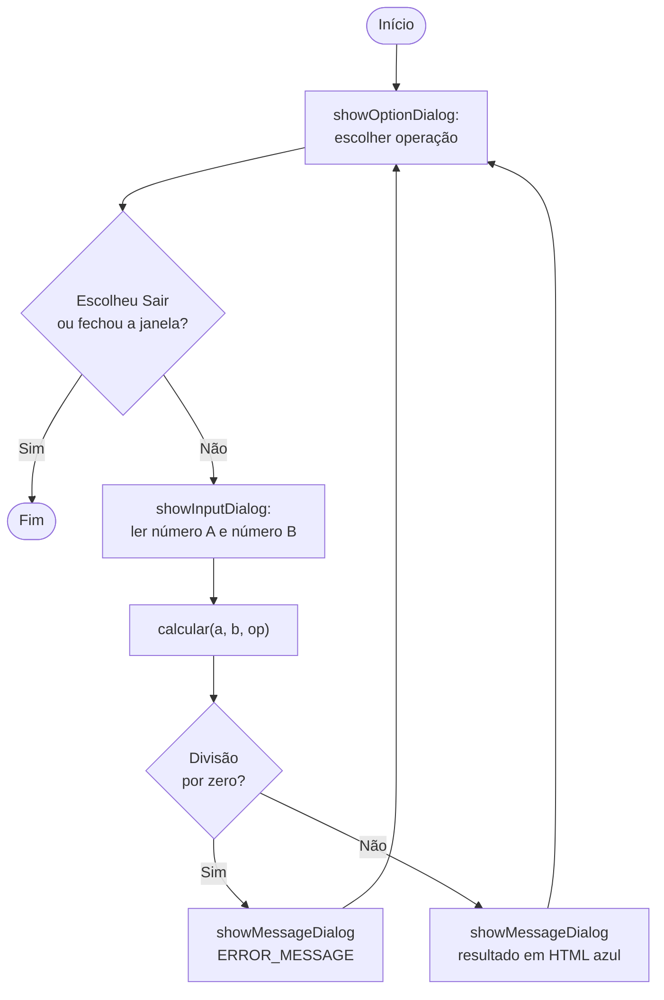

# ⚔️ Desafio do Módulo 1 — JOptionPane + Fundamentos

> **Desafio Gamificado · 120 XP · até 120 POO Coins**

Você concluiu o Módulo 1 de Fundamentos. Agora é hora de aplicar tudo usando **JOptionPane** para criar programas com interface gráfica real. Complete cada task para acumular POO Coins — quanto mais difícil a task, mais coins você ganha!

> **Dica:** Importe `javax.swing.JOptionPane;` no início de cada arquivo. Todos os programas devem usar JOptionPane para entrada e saída — sem `Scanner`, sem `System.out.println`.

---

## 📚 Antes de começar — Dominando o JOptionPane

O `JOptionPane` é uma classe do pacote `javax.swing` que cria **janelas de diálogo** prontas — aquelas caixinhas com ícone, mensagem e botões. Com ela você faz entrada e saída **gráfica**, sem precisar montar uma interface do zero.

Existem **4 métodos essenciais**. Todos são `static`, então você chama direto na classe: `JOptionPane.showMessageDialog(...)`.

| Método | Para que serve | O que retorna |
|---|---|---|
| `showMessageDialog` | Mostrar uma mensagem (info, aviso, erro) | `void` (nada) |
| `showInputDialog` | Pedir um texto digitado | `String` — ou `null` se cancelar |
| `showConfirmDialog` | Perguntar Sim / Não / Cancelar | `int` (`YES_OPTION`, `NO_OPTION`…) |
| `showOptionDialog` | Menu com botões personalizados | `int` — índice do botão (começa em `0`) |

### O ícone da janela: as constantes de tipo

O tipo da mensagem muda o **ícone** exibido. Passe uma destas constantes:

| Constante | Ícone | Quando usar |
|---|---|---|
| `INFORMATION_MESSAGE` | ℹ️ azul | Informação neutra / resultado |
| `QUESTION_MESSAGE` | ❓ | Perguntas ao usuário |
| `WARNING_MESSAGE` | ⚠️ amarelo | Avisos (valor suspeito) |
| `ERROR_MESSAGE` | ⛔ vermelho | Erros (divisão por zero, entrada inválida) |
| `PLAIN_MESSAGE` | *(sem ícone)* | Texto puro |

### Como cada janela aparece na tela

> **Nota:** As imagens abaixo ilustram como cada diálogo aparece na tela — o visual real muda um pouco conforme o sistema operacional (Windows, macOS, Linux).

**`showMessageDialog`** — só informa e espera o `OK`:


**`showInputDialog`** — mostra um campo de texto e devolve o que foi digitado:


**`showOptionDialog`** — cria um botão para cada texto do vetor. O retorno é o **índice** do botão clicado (começando em 0):


**`showConfirmDialog`** — pergunta e devolve `YES_OPTION` (0) ou `NO_OPTION` (1):


### Deixando bonito com HTML

O Swing renderiza **HTML básico** dentro das mensagens. Basta envolver o texto em `<html>...</html>`:

```java
String html = "<html>Resultado: <font color='#2563eb'><b>10</b></font></html>";
JOptionPane.showMessageDialog(null, html);
```

Você pode usar `<b>`, `<br>`, `<font color='#hex'>`, `<h2>` etc. — perfeito para destacar números e operações, como pedem as tasks.

> **Dica:** O primeiro argumento de todos esses métodos é o **componente pai** — como não temos uma janela principal, passamos `null` e o diálogo aparece centralizado na tela.

---

## Task 1 — Calculadora com 4 Operações · 20 Coins · Básico

Crie uma calculadora que usa `showOptionDialog` para selecionar a operação e `showInputDialog` para os dois números. Exiba o resultado com HTML colorido.

**Requisitos:**
- Operações: adição, subtração, multiplicação, divisão
- Divisão por zero deve abrir um `ERROR_MESSAGE`
- O resultado deve ser exibido com `showMessageDialog` usando HTML: número azul, operação em negrito
- Loop infinito com botão "Sair"

```java
import javax.swing.JOptionPane;

public class CalculadoraGUI {
    public static void main(String[] args) {
        // TODO: implementar loop com showOptionDialog
        // TODO: capturar dois números com showInputDialog
        // TODO: chamar método estático calcular(a, b, operacao)
        // TODO: exibir resultado com HTML
    }

    static double calcular(double a, double b, int op) {
        // TODO: switch com as 4 operações
        // Dica: use throw new ArithmeticException para divisão por zero
        return 0;
    }
}
```

> **Dica:** Os botões do `showOptionDialog` retornam o índice: 0=soma, 1=subtração, 2=multiplicação, 3=divisão, 4=sair. Verifique `JOptionPane.CLOSED_OPTION` para quando o usuário fecha a janela.

### Fluxo do programa



### ✅ Solução comentada (exemplo resolvido)

Esta primeira task já vem **resolvida como modelo** — estude o código comentado abaixo e use-o de referência. As próximas tasks (2, 3 e 4) você resolve por conta própria.

```java
import javax.swing.JOptionPane;

public class CalculadoraGUI {
    public static void main(String[] args) {
        // Cada texto vira um botão; o índice do botão é o retorno do diálogo.
        String[] operacoes = {"Somar", "Subtrair", "Multiplicar", "Dividir", "Sair"};

        while (true) {
            int op = JOptionPane.showOptionDialog(
                null,                          // sem janela pai
                "Escolha a operação:",         // mensagem
                "Calculadora",                 // título
                JOptionPane.DEFAULT_OPTION,
                JOptionPane.QUESTION_MESSAGE,  // ícone de pergunta
                null,
                operacoes,                     // os botões
                operacoes[0]                   // botão em foco
            );

            // Índice 4 = "Sair"; CLOSED_OPTION = usuário clicou no X.
            if (op == 4 || op == JOptionPane.CLOSED_OPTION) {
                JOptionPane.showMessageDialog(null, "Até a próxima! 👋");
                break;
            }

            try {
                // parseDouble converte o texto digitado em número.
                double a = Double.parseDouble(JOptionPane.showInputDialog(null, "Primeiro número:"));
                double b = Double.parseDouble(JOptionPane.showInputDialog(null, "Segundo número:"));

                double resultado = calcular(a, b, op);

                String simbolo;
                switch (op) {
                    case 0:  simbolo = "+"; break;
                    case 1:  simbolo = "-"; break;
                    case 2:  simbolo = "×"; break;
                    default: simbolo = "÷";
                }

                // HTML: número do resultado em azul e negrito.
                String html = String.format(
                    "<html>Resultado de <b>%.2f %s %.2f</b> = " +
                    "<font color='#2563eb'><b>%.2f</b></font></html>",
                    a, simbolo, b, resultado
                );
                JOptionPane.showMessageDialog(null, html, "Resultado", JOptionPane.INFORMATION_MESSAGE);

            } catch (ArithmeticException e) {
                // Divisão por zero → janela de erro (requisito da task).
                JOptionPane.showMessageDialog(null, "Não é possível dividir por zero!",
                    "Erro", JOptionPane.ERROR_MESSAGE);
            } catch (NumberFormatException e) {
                // Usuário digitou algo que não é número (ou cancelou o input).
                JOptionPane.showMessageDialog(null, "Digite apenas números válidos!",
                    "Erro", JOptionPane.ERROR_MESSAGE);
            }
        }
    }

    // Método estático que concentra a lógica das 4 operações.
    static double calcular(double a, double b, int op) {
        switch (op) {
            case 0: return a + b;
            case 1: return a - b;
            case 2: return a * b;
            case 3:
                // Com double, a/0 daria "Infinity" — então checamos na mão.
                if (b == 0) throw new ArithmeticException("divisão por zero");
                return a / b;
            default: throw new IllegalArgumentException("operação inválida");
        }
    }
}
```

---

## Task 2 — Calculadora de IMC com Categorias · 25 Coins · Intermediário

Crie um programa que calcula o IMC e exibe a categoria com cor correspondente usando HTML no JOptionPane.

**Requisitos:**
- Capturar nome, peso (double) e altura (double) via `showInputDialog`
- Calcular IMC = peso / (altura * altura)
- Exibir resultado com categoria e cor (verde=normal, vermelho=obeso, laranja=sobrepeso, azul=abaixo do peso)
- Usar `showMessageDialog` com HTML formatado
- Tratar `NumberFormatException` com mensagem de erro

**Tabela de categorias:**

| IMC | Categoria | Cor HTML |
|---|---|---|
| < 18.5 | Abaixo do peso | `#3b82f6` (azul) |
| 18.5 – 24.9 | Peso normal | `#16a34a` (verde) |
| 25.0 – 29.9 | Sobrepeso | `#f97316` (laranja) |
| ≥ 30.0 | Obesidade | `#dc2626` (vermelho) |

```java
import javax.swing.JOptionPane;

public class CalculadoraIMC {
    public static void main(String[] args) {
        // TODO: capturar nome, peso, altura
        // TODO: calcular IMC
        // TODO: determinar categoria e cor
        // TODO: exibir com showMessageDialog + HTML
    }

    static String[] getCategoria(double imc) {
        // Retorna [categoria, cor]
        // TODO: implementar lógica de categorias
        return new String[]{"", ""};
    }
}
```

> **Dica:** `String.format("<html><b>%s</b><br>IMC: <font color='%s'><b>%.1f</b></font><br>Categoria: %s</html>", nome, cor, imc, categoria)` — use cores hexadecimais no HTML.

---

## Task 3 — Conversor de Temperatura · 30 Coins · Intermediário

Crie um conversor que transforma entre °C, °F e Kelvin usando JOptionPane.

**Requisitos:**
- Menu de conversão com `showOptionDialog`: "°C → °F", "°C → K", "°F → °C", "°F → K", "K → °C", "K → °F"
- Validação: Kelvin não pode ser negativo (mostrar `WARNING_MESSAGE` se tentar converter um valor impossível)
- Exibir resultado formatado com 2 casas decimais
- Loop até usuário clicar "Sair"
- Tratar entradas inválidas

**Fórmulas:**
- °C → °F: `(c * 9/5) + 32`
- °C → K: `c + 273.15`
- °F → °C: `(f - 32) * 5/9`
- °F → K: `(f - 32) * 5/9 + 273.15`
- K → °C: `k - 273.15`
- K → °F: `(k - 273.15) * 9/5 + 32`

```java
import javax.swing.JOptionPane;

public class ConversorTemperatura {
    public static void main(String[] args) {
        String[] conversoes = {"°C → °F", "°C → K", "°F → °C", "°F → K", "K → °C", "K → °F", "Sair"};
        // TODO: loop com showOptionDialog
        // TODO: capturar valor e converter
        // TODO: validar Kelvin negativo
        // TODO: exibir resultado
    }

    static double converter(double valor, int tipo) {
        // TODO: switch com as 6 conversões
        return 0;
    }
}
```

> **Dica:** Para validar Kelvin antes de converter, verifique se o valor resultante ficaria abaixo de 0 K após a operação inversa. Ex.: se convertendo para K e o °C digitado for menor que -273.15, é fisicamente impossível.

---

## Task 4 — Jogo de Adivinhação com Contador · 45 Coins · Avançado

Crie um jogo onde o computador sorteia um número de 1 a 100 e o jogador deve adivinhar. Use JOptionPane para toda a interação.

**Requisitos:**
- Número aleatório entre 1 e 100 com `(int)(Math.random() * 100) + 1`
- A cada tentativa: `showInputDialog` para a guess + `showMessageDialog` dizendo "Muito alto!" / "Muito baixo!" / "Acertou!"
- Contar tentativas e exibir ao final: "Você acertou em X tentativas!"
- Usar `showConfirmDialog` no final para perguntar se quer jogar novamente
- Classificar performance no final:
  - 1-3 tentativas: "🏆 Incrível!"
  - 4-6 tentativas: "⭐ Muito bom!"
  - 7-10 tentativas: "👍 Bom!"
  - 11+ tentativas: "💪 Continue praticando!"

```java
import javax.swing.JOptionPane;

public class JogoAdivinhacao {
    public static void main(String[] args) {
        boolean jogarNovamente = true;

        while (jogarNovamente) {
            int numero = (int)(Math.random() * 100) + 1;
            int tentativas = 0;

            // TODO: loop de adivinhação
            // TODO: feedback de alto/baixo após cada tentativa
            // TODO: mensagem de conclusão com performance
            // TODO: perguntar se quer jogar de novo com showConfirmDialog

            jogarNovamente = false; // remover quando implementar
        }
    }

    static String classificar(int tentativas) {
        // TODO: retornar classificação baseada no número de tentativas
        return "";
    }
}
```

> **Dica:** Use uma variável `boolean acertou = false` e um `while (!acertou)`. Verifique se o input é `null` (cancelou o jogo) e encerre graciosamente.

> **Gabarito esperado:**
> ```java
> import javax.swing.JOptionPane;
>
> public class JogoAdivinhacao {
>     public static void main(String[] args) {
>         boolean jogarNovamente = true;
>         while (jogarNovamente) {
>             int numero = (int)(Math.random() * 100) + 1;
>             int tentativas = 0;
>             boolean acertou = false;
>
>             JOptionPane.showMessageDialog(null,
>                 "Pensei em um número de 1 a 100. Você consegue adivinhar?",
>                 "Jogo de Adivinhação", JOptionPane.INFORMATION_MESSAGE);
>
>             while (!acertou) {
>                 String input = JOptionPane.showInputDialog(null,
>                     "Tentativa " + (tentativas + 1) + ": qual é o número?",
>                     "Adivinhe!", JOptionPane.QUESTION_MESSAGE);
>                 if (input == null) { jogarNovamente = false; break; }
>
>                 try {
>                     int guess = Integer.parseInt(input);
>                     tentativas++;
>                     if      (guess < numero) JOptionPane.showMessageDialog(null, "📉 Muito baixo! Tente maior.", "Dica", JOptionPane.INFORMATION_MESSAGE);
>                     else if (guess > numero) JOptionPane.showMessageDialog(null, "📈 Muito alto! Tente menor.", "Dica", JOptionPane.INFORMATION_MESSAGE);
>                     else                     acertou = true;
>                 } catch (NumberFormatException e) {
>                     JOptionPane.showMessageDialog(null, "Digite apenas números inteiros!", "Erro", JOptionPane.ERROR_MESSAGE);
>                 }
>             }
>
>             if (acertou) {
>                 String perf = tentativas <= 3 ? "🏆 Incrível!" : tentativas <= 6 ? "⭐ Muito bom!" : tentativas <= 10 ? "👍 Bom!" : "💪 Continue praticando!";
>                 int novo = JOptionPane.showConfirmDialog(null,
>                     String.format("<html>Você acertou em <b>%d tentativas</b>!<br>%s<br><br>Jogar novamente?</html>", tentativas, perf),
>                     "Parabéns!", JOptionPane.YES_NO_OPTION);
>                 jogarNovamente = (novo == JOptionPane.YES_OPTION);
>             }
>         }
>     }
> }
> ```
