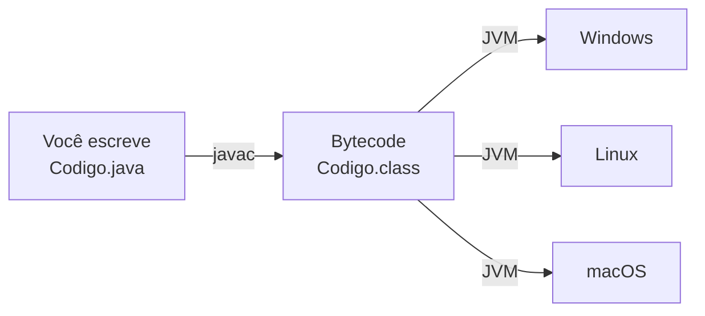
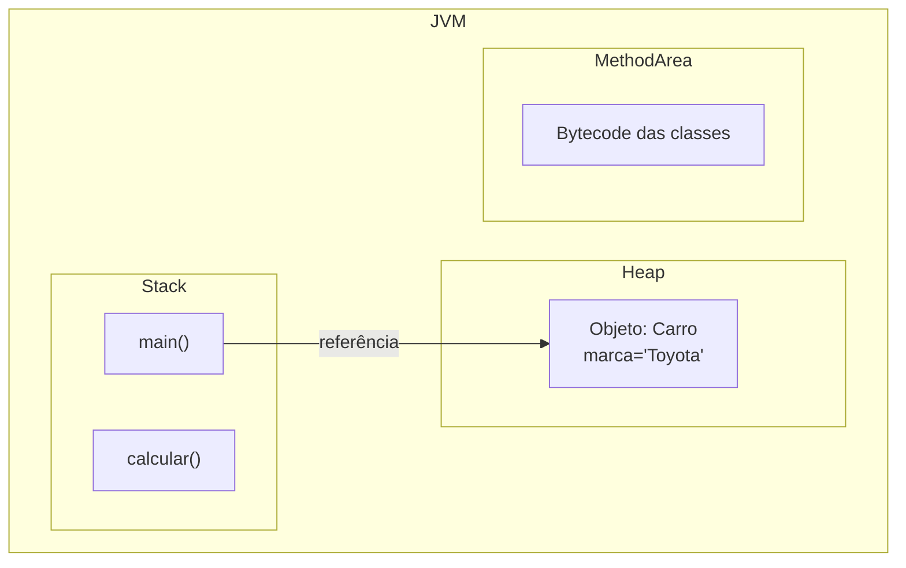
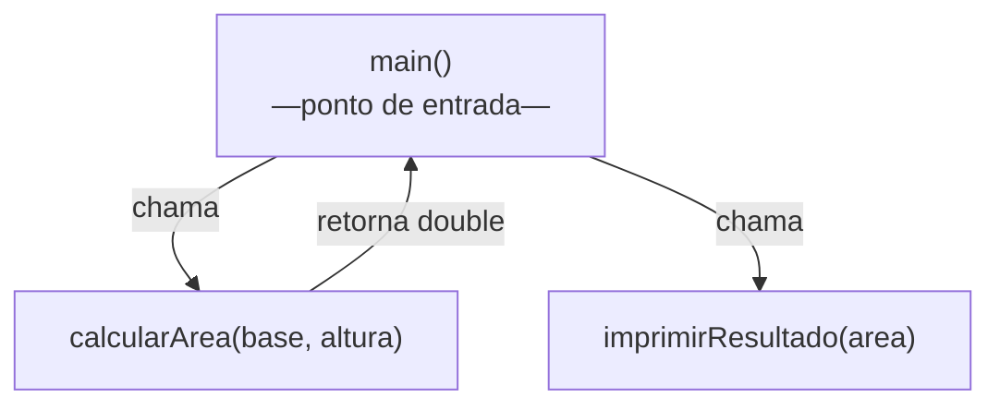
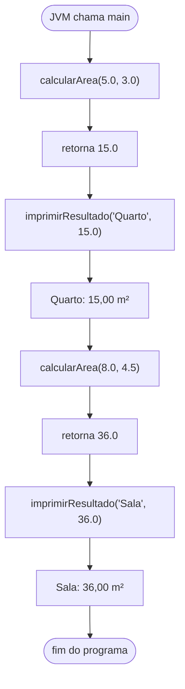
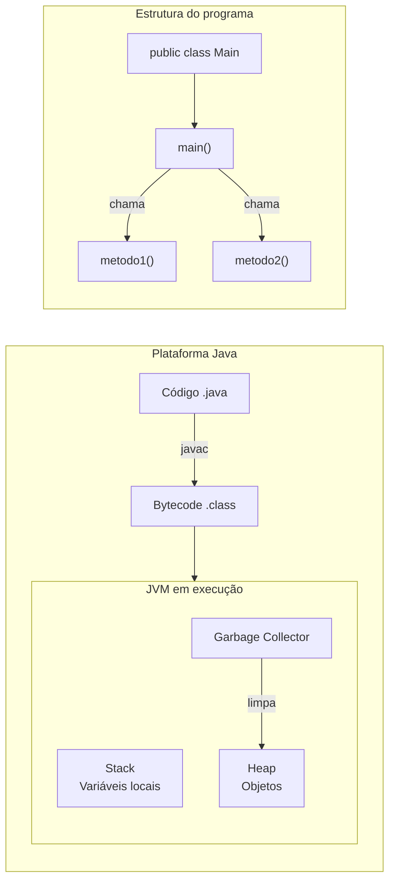

# Encontro 01 — Introdução à Plataforma Java e Lógica Procedural

> **Módulo 1 · 4 aulas · 50 XP**

---

## 1. A Plataforma Java: por que ela é diferente?

Quando você escreve um programa em C, o compilador gera um executável `.exe` específico para o seu sistema operacional. **Java funciona diferente**: o compilador gera um arquivo intermediário chamado **Bytecode** (`.class`), e quem executa esse bytecode é a **JVM (Java Virtual Machine)**.



Isso é o que permite o famoso slogan: **"Write Once, Run Anywhere"**.

---

## 2. O que acontece dentro da JVM?

A JVM tem três áreas de memória principais que você vai usar toda aula:

| Área | O que guarda | Exemplo |
|------|-------------|---------|
| **Stack** | Chamadas de método e variáveis locais | `int x = 10;` dentro de um método |
| **Heap** | Objetos criados com `new` | `new Carro()` |
| **Method Area** | Bytecode das classes | O código compilado de `Carro.class` |

O **Garbage Collector** cuida automaticamente de limpar objetos do Heap que não têm mais referências apontando para eles.



---

## 3. A estrutura mínima de um programa Java

Todo programa Java tem um **ponto de entrada** obrigatório: o método `main`.

```java
// O arquivo DEVE se chamar Main.java (igual ao nome da classe pública)
public class Main {

    // Ponto de entrada: a JVM chama este método primeiro
    public static void main(String[] args) {
        System.out.println("Olá, POO Academy!");
    }
}
```

**Anatomia linha a linha:**

| Trecho | Significado |
|--------|-------------|
| `public class Main` | Define uma classe chamada `Main`, visível para todos |
| `public static void main` | Método especial que a JVM chama ao iniciar |
| `String[] args` | Argumentos de linha de comando (pode ignorar por ora) |
| `System.out.println(...)` | Imprime uma linha no console |

---

## 4. Tipos Primitivos e Operadores

Java é **fortemente tipado**: toda variável precisa ter um tipo declarado.

```java
public class TiposPrimitivos {
    public static void main(String[] args) {
        // Inteiros
        int idade = 20;
        long populacaoBrasil = 215_000_000L; // 'L' indica long

        // Decimais
        double salario = 4500.50;
        float temperatura = 36.5f; // 'f' indica float

        // Texto (não é primitivo, mas essencial)
        String nome = "Alice";

        // Lógico
        boolean ativo = true;

        // Caractere único
        char inicial = 'A';

        System.out.println(nome + " tem " + idade + " anos.");
    }
}
```

---

## 5. Sub-rotinas: métodos estáticos

Antes de aprender POO, vamos ver como **organizar código** usando métodos. Em Java, não existem funções "soltas" — elas sempre ficam dentro de uma classe. Por ora, usamos `static` para não precisar criar objetos.

### O problema sem métodos

```java
// Código sem métodos: repetição, difícil de manter
public class SemMetodos {
    public static void main(String[] args) {
        // Calcular área do retângulo 1
        double base1 = 5.0, altura1 = 3.0;
        double area1 = base1 * altura1;
        System.out.println("Área 1: " + area1);

        // Calcular área do retângulo 2 (código duplicado!)
        double base2 = 8.0, altura2 = 2.0;
        double area2 = base2 * altura2;
        System.out.println("Área 2: " + area2);
    }
}
```

### A solução com métodos



```java
public class ComMetodos {

    // Método que RETORNA um valor (função)
    public static double calcularArea(double base, double altura) {
        return base * altura; // 'return' envia o resultado de volta ao chamador
    }

    // Método que SÓ EXECUTA ação (procedimento) — retorno void
    public static void imprimirResultado(String nome, double area) {
        System.out.printf("%s: %.2f m²%n", nome, area);
    }

    public static void main(String[] args) {
        // Agora reutilizamos o mesmo código para qualquer retângulo
        double areaQuarto   = calcularArea(5.0, 3.0);
        double areaSala     = calcularArea(8.0, 4.5);
        double areaCozinha  = calcularArea(3.0, 3.0);

        imprimirResultado("Quarto",   areaQuarto);
        imprimirResultado("Sala",     areaSala);
        imprimirResultado("Cozinha",  areaCozinha);
    }
}
```

**Saída:**
```
Quarto: 15,00 m²
Sala: 36,00 m²
Cozinha: 9,00 m²
```

---

## 6. Fluxo de execução com múltiplos métodos



---

## 7. Exemplo completo do laboratório

Código progressivo que será desenvolvido na aula prática:

```java
public class MatematicaUtil {

    // ── Área de figuras ────────────────────────────────────────────────────

    /** Retângulo: base × altura */
    public static double calcularAreaRetangulo(double base, double altura) {
        return base * altura;
    }

    /** Triângulo: (base × altura) / 2 */
    public static double calcularAreaTriangulo(double base, double altura) {
        return (base * altura) / 2.0;
    }

    /** Círculo: π × r² */
    public static double calcularAreaCirculo(double raio) {
        return Math.PI * raio * raio;
    }

    // ── Verificações ───────────────────────────────────────────────────────

    /** Retorna verdadeiro se o número é par */
    public static boolean ehPar(int numero) {
        return numero % 2 == 0;
    }

    /** Retorna o maior entre dois inteiros */
    public static int maior(int a, int b) {
        return (a > b) ? a : b;
    }

    // ── Ponto de entrada ───────────────────────────────────────────────────

    public static void main(String[] args) {
        System.out.println("=== Calculadora de Áreas ===");
        System.out.printf("Retângulo (5×3): %.2f%n",   calcularAreaRetangulo(5, 3));
        System.out.printf("Triângulo (6×4): %.2f%n",   calcularAreaTriangulo(6, 4));
        System.out.printf("Círculo (r=7):   %.2f%n",   calcularAreaCirculo(7));

        System.out.println();
        System.out.println("=== Verificações ===");
        System.out.println("8 é par? " + ehPar(8));
        System.out.println("7 é par? " + ehPar(7));
        System.out.println("Maior entre 15 e 22: " + maior(15, 22));
    }
}
```

---

## Resumo Visual do Encontro



---

## Exercícios Práticos

> **Como funciona:** cada exercício tem um enunciado e um esqueleto de código. Complete apenas as partes marcadas com `// SEU CÓDIGO AQUI`. Não altere a assinatura dos métodos.

---

### Exercício 1 — Fácil · 25 XP
**Conversor de Temperatura**

Complete os métodos de conversão de temperatura. A fórmula de Celsius para Fahrenheit é `(C × 9/5) + 32` e para Kelvin é `C + 273.15`.

```java
public class ConversorTemperatura {

    public static double celsiusParaFahrenheit(double celsius) {
        // SEU CÓDIGO AQUI
    }

    public static double celsiusParaKelvin(double celsius) {
        // SEU CÓDIGO AQUI
    }

    public static void main(String[] args) {
        System.out.println("0°C em Fahrenheit: " + celsiusParaFahrenheit(0));   // 32.0
        System.out.println("100°C em Fahrenheit: " + celsiusParaFahrenheit(100)); // 212.0
        System.out.println("0°C em Kelvin: " + celsiusParaKelvin(0));           // 273.15
    }
}
```

---

### Exercício 2 — Fácil · 25 XP
**Verificador de Número Primo**

Implemente o método `ehPrimo` que retorna `true` se o número for primo e `false` caso contrário. Um número primo só é divisível por 1 e por ele mesmo.

```java
public class VerificadorPrimo {

    public static boolean ehPrimo(int numero) {
        if (numero < 2) return false;
        // SEU CÓDIGO AQUI: verifique divisibilidade de 2 até Math.sqrt(numero)
    }

    public static void main(String[] args) {
        int[] numeros = {1, 2, 7, 10, 13, 15, 17, 100};
        for (int n : numeros) {
            System.out.println(n + " é primo? " + ehPrimo(n));
        }
    }
}
```

---

### Exercício 3 — Médio · 25 XP
**Calculadora de IMC**

Crie dois métodos: `calcularIMC(peso, altura)` e `classificarIMC(imc)` que retorna a classificação textual.

| IMC | Classificação |
|-----|--------------|
| < 18.5 | Abaixo do peso |
| 18.5 – 24.9 | Peso normal |
| 25.0 – 29.9 | Sobrepeso |
| ≥ 30.0 | Obesidade |

```java
public class CalculadoraIMC {

    public static double calcularIMC(double pesoKg, double alturaM) {
        // SEU CÓDIGO AQUI
    }

    public static String classificarIMC(double imc) {
        // SEU CÓDIGO AQUI: use if/else if
    }

    public static void main(String[] args) {
        double imc = calcularIMC(70, 1.75);
        System.out.printf("IMC: %.1f — %s%n", imc, classificarIMC(imc));
    }
}
```

---

### Exercício 4 — Médio · 25 XP
**Tabuada Formatada**

Crie o método `imprimirTabuada(numero)` que imprime a tabuada de 1 a 10 de qualquer número, com formatação alinhada. Em seguida, imprima as tabuadas de 2, 5 e 7.

```java
public class Tabuada {

    public static void imprimirTabuada(int numero) {
        System.out.println("=== Tabuada do " + numero + " ===");
        for (int i = 1; i <= 10; i++) {
            // SEU CÓDIGO AQUI: imprima "X × Y = Z" alinhado
        }
    }

    public static void main(String[] args) {
        imprimirTabuada(2);
        System.out.println();
        imprimirTabuada(5);
        System.out.println();
        imprimirTabuada(7);
    }
}
```

---

### Exercício 5 — Difícil · 25 XP
**Sequência de Fibonacci**

Crie o método `fibonacci(n)` que retorna o n-ésimo número da sequência. A sequência começa: 0, 1, 1, 2, 3, 5, 8, 13, 21...

Depois, crie `imprimirFibonacci(quantidade)` que usa `fibonacci` para imprimir os primeiros N termos.

```java
public class Fibonacci {

    public static long fibonacci(int n) {
        if (n == 0) return 0;
        if (n == 1) return 1;
        // SEU CÓDIGO AQUI: implemente iterativamente (não recursivo)
        // Use duas variáveis auxiliares para guardar os dois valores anteriores
    }

    public static void imprimirFibonacci(int quantidade) {
        System.out.print("Fibonacci: ");
        for (int i = 0; i < quantidade; i++) {
            System.out.print(fibonacci(i));
            if (i < quantidade - 1) System.out.print(", ");
        }
        System.out.println();
    }

    public static void main(String[] args) {
        imprimirFibonacci(10);
        // Esperado: Fibonacci: 0, 1, 1, 2, 3, 5, 8, 13, 21, 34
    }
}
```

---

### Exercício 6 — Troubleshooting · 25 XP
**Diagnóstico: Métodos com Erros de Compilação e Lógica**

O código abaixo contém **4 erros** — alguns impedem a compilação, outros causam resultado incorreto em tempo de execução. Identifique cada erro, explique o motivo e escreva a versão corrigida.

```java
public class Calculadora {

    // Erro 1: este método declara void mas tenta retornar um valor
    public static void somar(int a, int b) {
        return a + b;
    }

    // Erro 2: divisão inteira descartando a parte decimal
    public static double media(int a, int b) {
        return (a + b) / 2;
    }

    // Erro 3: parâmetros trocados — resultado será sempre negativo para a > b
    public static double subtrair(double maior, double menor) {
        return menor - maior;
    }

    // Erro 4: método de instância sendo chamado como estático no main
    public double dobro(double x) {
        return x * 2;
    }

    public static void main(String[] args) {
        System.out.println(somar(3, 4));        // deveria imprimir 7
        System.out.println(media(7, 8));        // deveria imprimir 7.5
        System.out.println(subtrair(10, 3));    // deveria imprimir 7.0
        System.out.println(dobro(5));           // deveria imprimir 10.0
    }
}
```

> **Dicas:** (1) Verifique o tipo de retorno declarado versus o que o `return` entrega. (2) Divisão entre inteiros em Java trunca o resultado — como forçar divisão com decimais? (3) Leia o nome dos parâmetros e a operação realizada. (4) Métodos de instância precisam de um objeto.
