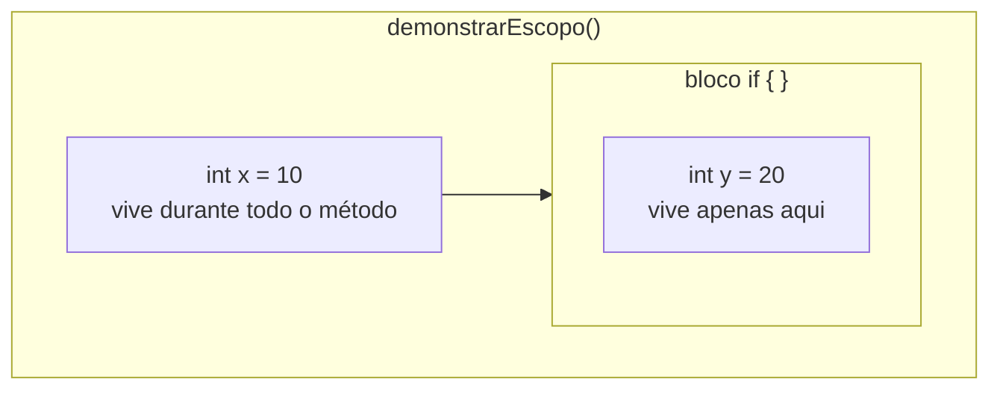
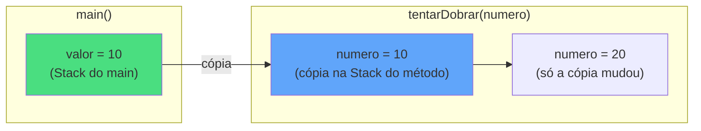
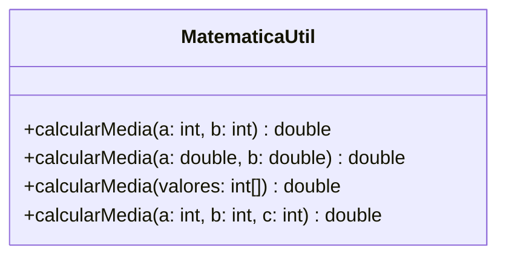
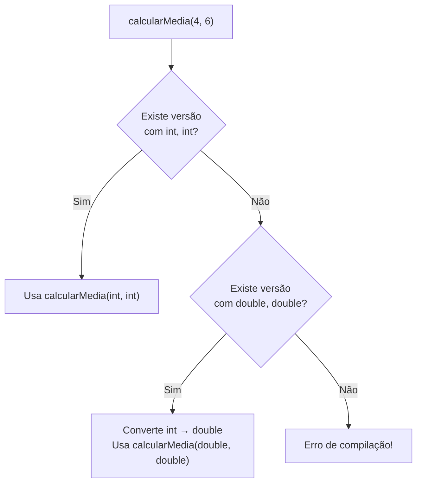
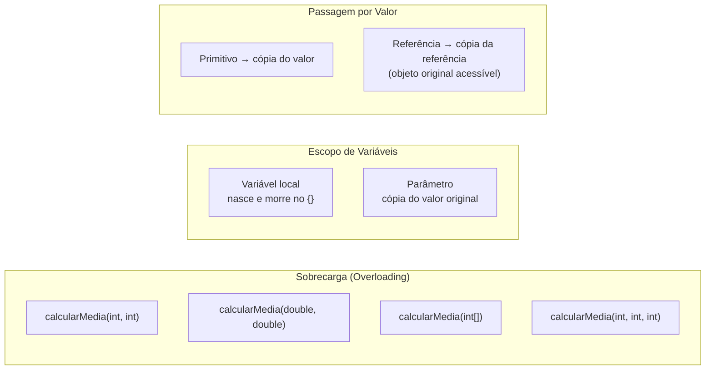

# Encontro 02 — Aprofundamento em Métodos

> **Módulo 1 · 4 aulas · 50 XP**

---

## 1. Assinatura de Método

A **assinatura** é a identidade do método — o que o distingue de todos os outros na mesma classe. É composta por:

```
[modificador] [tipo_retorno] nomeDoMetodo([lista_parametros])
```

Exemplos de assinaturas distintas:
```java
public static int somar(int a, int b)         // assinatura 1
public static double somar(double a, double b) // assinatura 2
public static int somar(int a, int b, int c)  // assinatura 3
```

> **Regra fundamental:** O Java identifica o método pelo **nome + tipos dos parâmetros**. O tipo de retorno sozinho não distingue dois métodos.

---

## 2. Escopo de Variáveis

O **escopo** define onde uma variável "existe" e pode ser acessada. Em Java há dois escopos principais dentro de um método:

```java
public class EscopoDemo {

    // Variável de CLASSE (static field) — existe enquanto a classe existir
    static int contadorGlobal = 0;

    public static void demonstrarEscopo() {
        // Variável LOCAL — nasce aqui, morre no fechamento do {}
        int x = 10;

        if (x > 5) {
            int y = 20; // 'y' existe APENAS dentro deste bloco if
            System.out.println("Dentro do if: x=" + x + ", y=" + y);
        }
        // System.out.println(y); // ERRO de compilação! 'y' não existe aqui
        System.out.println("Fora do if: x=" + x);

        // Parâmetros também são variáveis locais:
        // eles vivem do início até o fim do método
    }

    public static void main(String[] args) {
        demonstrarEscopo();
    }
}
```



---

## 3. Passagem de Parâmetros: Estritamente por Valor

Este é um dos conceitos mais importantes — e mais mal entendidos — de Java:

> **Em Java, parâmetros são SEMPRE passados por valor.**
> Isso significa que o método recebe uma CÓPIA do valor original.

### Testando com tipo primitivo

```java
public class PassagemPorValor {

    // Este método tenta "dobrar" o número, mas não consegue!
    public static void tentarDobrar(int numero) {
        numero = numero * 2; // Modifica apenas a CÓPIA local
        System.out.println("Dentro do método: " + numero); // 20
    }

    public static void main(String[] args) {
        int valor = 10;
        tentarDobrar(valor);
        // O original não mudou — era uma cópia!
        System.out.println("No main após chamar: " + valor); // ainda 10
    }
}
```



### Com objetos: a referência é copiada, não o objeto

```java
public class PassagemReferencia {

    static void alterarConteudo(int[] vetor) {
        vetor[0] = 999; // Altera o OBJETO original (o vetor no Heap)
    }

    static void trocarReferencia(int[] vetor) {
        vetor = new int[]{1, 2, 3}; // Só troca a cópia local da referência
    }

    public static void main(String[] args) {
        int[] meuVetor = {10, 20, 30};

        alterarConteudo(meuVetor);
        System.out.println(meuVetor[0]); // 999 — o objeto foi modificado!

        trocarReferencia(meuVetor);
        System.out.println(meuVetor[0]); // ainda 999 — a referência não trocou
    }
}
```

---

## 4. Sobrecarga de Métodos (Method Overloading)

Sobrecarga permite ter **múltiplos métodos com o mesmo nome**, desde que as **listas de parâmetros sejam diferentes** (tipo, quantidade ou ordem).



```java
public class MatematicaUtil {

    // Versão 1: dois inteiros
    public static double calcularMedia(int a, int b) {
        return (a + b) / 2.0;
    }

    // Versão 2: dois doubles
    public static double calcularMedia(double a, double b) {
        return (a + b) / 2.0;
    }

    // Versão 3: vetor de inteiros
    public static double calcularMedia(int[] valores) {
        int soma = 0;
        for (int v : valores) {
            soma += v;
        }
        return (double) soma / valores.length;
    }

    // Versão 4: três inteiros (parâmetros extras = sobrecarga válida)
    public static double calcularMedia(int a, int b, int c) {
        return (a + b + c) / 3.0;
    }

    public static void main(String[] args) {
        // Java escolhe automaticamente qual versão chamar
        System.out.println(calcularMedia(4, 6));            // versão 1 → 5.0
        System.out.println(calcularMedia(4.5, 6.5));        // versão 2 → 5.5
        System.out.println(calcularMedia(new int[]{2,4,6,8}));// versão 3 → 5.0
        System.out.println(calcularMedia(3, 6, 9));         // versão 4 → 6.0
    }
}
```

### Como o compilador escolhe a versão certa?



---

## 5. Biblioteca Utilitária Completa

O exemplo integrado do laboratório — construção de uma biblioteca reutilizável:

```java
public class BibliotecaUtil {

    // ── Strings ────────────────────────────────────────────────────────────

    /** Inverte uma string: "Java" → "avaJ" */
    public static String inverter(String texto) {
        return new StringBuilder(texto).reverse().toString();
    }

    /** Conta quantas vezes um caractere aparece no texto */
    public static int contarOcorrencias(String texto, char caractere) {
        int count = 0;
        for (char c : texto.toCharArray()) {
            if (c == caractere) count++;
        }
        return count;
    }

    /** Verifica se a string é palíndromo (ignora maiúsculas/espaços) */
    public static boolean ehPalindromo(String texto) {
        String limpo = texto.toLowerCase().replaceAll("\\s", "");
        String invertido = inverter(limpo);
        return limpo.equals(invertido);
    }

    // ── Números ────────────────────────────────────────────────────────────

    /** Fatorial de n (n!) */
    public static long fatorial(int n) {
        if (n <= 1) return 1;
        long resultado = 1;
        for (int i = 2; i <= n; i++) {
            resultado *= i;
        }
        return resultado;
    }

    /** Potência: base^expoente (sem Math.pow) */
    public static double potencia(double base, int expoente) {
        if (expoente == 0) return 1;
        double resultado = 1;
        for (int i = 0; i < Math.abs(expoente); i++) {
            resultado *= base;
        }
        return expoente < 0 ? 1.0 / resultado : resultado;
    }

    // ── Vetores ────────────────────────────────────────────────────────────

    /** Retorna o maior elemento do vetor */
    public static int maiorElemento(int[] vetor) {
        int maior = vetor[0];
        for (int i = 1; i < vetor.length; i++) {
            if (vetor[i] > maior) maior = vetor[i];
        }
        return maior;
    }

    /** Soma todos os elementos do vetor */
    public static int somarVetor(int[] vetor) {
        int soma = 0;
        for (int v : vetor) soma += v;
        return soma;
    }

    public static void main(String[] args) {
        System.out.println("=== Strings ===");
        System.out.println(inverter("Java"));                    // avaJ
        System.out.println(contarOcorrencias("abracadabra", 'a')); // 5
        System.out.println(ehPalindromo("Arara"));              // true
        System.out.println(ehPalindromo("Java"));               // false

        System.out.println("\n=== Números ===");
        System.out.println("5! = " + fatorial(5));              // 120
        System.out.println("2^10 = " + (int) potencia(2, 10)); // 1024

        System.out.println("\n=== Vetores ===");
        int[] notas = {7, 9, 5, 8, 10, 6};
        System.out.println("Maior nota: " + maiorElemento(notas)); // 10
        System.out.println("Soma: " + somarVetor(notas));          // 45
    }
}
```

---

## Resumo Visual



---

## Exercícios Práticos

---

### Exercício 1 — Fácil · 25 XP
**Sobrecarregando um Formatador**

Crie uma classe `Formatador` com três versões sobrecarregadas do método `formatar`:
- `formatar(int numero)` → retorna `"#42"`
- `formatar(double valor)` → retorna `"R$ 42,50"` (2 casas decimais)
- `formatar(String texto)` → retorna o texto em maiúsculas entre colchetes `"[JAVA]"`

```java
public class Formatador {

    public static String formatar(int numero) {
        // SEU CÓDIGO AQUI
    }

    public static String formatar(double valor) {
        // SEU CÓDIGO AQUI — dica: String.format("R$ %.2f", valor)
    }

    public static String formatar(String texto) {
        // SEU CÓDIGO AQUI
    }

    public static void main(String[] args) {
        System.out.println(formatar(42));       // #42
        System.out.println(formatar(42.5));     // R$ 42,50
        System.out.println(formatar("java"));   // [JAVA]
    }
}
```

---

### Exercício 2 — Fácil · 25 XP
**Escopo na Prática**

Antes de rodar o código, **preveja a saída** de cada `println`. Depois compile e confira. Explique por escrito por que `y` não pode ser acessado fora do bloco `if`.

```java
public class EscopoPratica {
    static int z = 100; // campo estático da classe

    public static void testar(int x) {
        System.out.println("x no início: " + x);   // ?
        x = x + 10;
        System.out.println("x depois +10: " + x);  // ?

        if (x > 15) {
            int y = x * 2;
            System.out.println("y dentro do if: " + y); // ?
        }
        // System.out.println(y); // por que isso seria erro?

        System.out.println("z (campo): " + z); // ?
    }

    public static void main(String[] args) {
        testar(8);
    }
}
```

---

### Exercício 3 — Médio · 25 XP
**Valor ou Referência?**

Complete os métodos abaixo e, após rodar, responda: qual deles conseguiu modificar o valor original e qual não conseguiu? Por quê?

```java
public class ValorOuReferencia {

    // Tenta adicionar 100 ao número passado
    public static void adicionarCem(int numero) {
        // SEU CÓDIGO AQUI
        System.out.println("Dentro do método: " + numero);
    }

    // Tenta dobrar todos os elementos do vetor
    public static void dobrarVetor(int[] vetor) {
        // SEU CÓDIGO AQUI: percorra o vetor e dobre cada elemento
    }

    public static void main(String[] args) {
        int num = 50;
        adicionarCem(num);
        System.out.println("Após chamar adicionarCem: " + num); // 50 ou 150?

        int[] numeros = {1, 2, 3, 4, 5};
        dobrarVetor(numeros);
        System.out.println("numeros[0] após dobrarVetor: " + numeros[0]); // 1 ou 2?
    }
}
```

---

### Exercício 4 — Médio · 25 XP
**Biblioteca de Strings Sobrecarregada**

Crie três versões de `juntar`:
- `juntar(String a, String b)` → `"a-b"`
- `juntar(String a, String b, String separador)` → `"a|b"` (usa o separador)
- `juntar(String[] palavras)` → `"a-b-c-d"` (junta todas com hífen)

```java
public class JuntadorStrings {

    public static String juntar(String a, String b) {
        // SEU CÓDIGO AQUI
    }

    public static String juntar(String a, String b, String separador) {
        // SEU CÓDIGO AQUI
    }

    public static String juntar(String[] palavras) {
        // SEU CÓDIGO AQUI
    }

    public static void main(String[] args) {
        System.out.println(juntar("Java", "POO"));             // Java-POO
        System.out.println(juntar("Java", "POO", " + "));      // Java + POO
        System.out.println(juntar(new String[]{"a","b","c"}));  // a-b-c
    }
}
```

---

### Exercício 5 — Troubleshooting · 25 XP
**Diagnóstico: Sobrecarga Ambígua e Escopo**

O código abaixo contém **3 erros**. Um causa ambiguidade de sobrecarga, um cria variável que esconde atributo e um usa variável fora do seu escopo. Identifique, explique e corrija.

```java
public class Formatador {

    static String prefixo = "INFO";

    // Erro 1: este método tem mesma assinatura que o de baixo após promoção automática
    public static String formatar(int codigo) {
        return prefixo + "-" + codigo;
    }

    public static String formatar(long codigo) {
        return prefixo + "-" + codigo;
    }

    public static void imprimirRelatorio(String[] itens) {
        // Erro 2: variável local 'prefixo' esconde o campo estático
        String prefixo = "RELATORIO";
        for (String item : itens) {
            System.out.println(prefixo + ": " + item);
        }
        // Erro 3: 'i' definida dentro do for não existe aqui
        System.out.println("Último índice usado: " + i);
    }

    public static void main(String[] args) {
        System.out.println(formatar(42));   // ambíguo: int ou long?
        imprimirRelatorio(new String[]{"Alpha", "Beta"});
    }
}
```

> **Dicas:** (1) `int` é promovido automaticamente para `long` — o compilador não sabe qual sobrecarga escolher. (2) Uma variável local com mesmo nome de um campo oculta o campo — isso é `shadowing`. (3) Variáveis declaradas no `for` existem apenas dentro do bloco do `for`.
