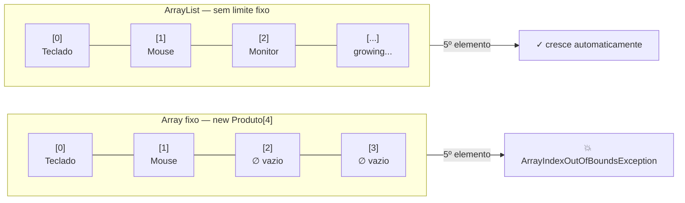
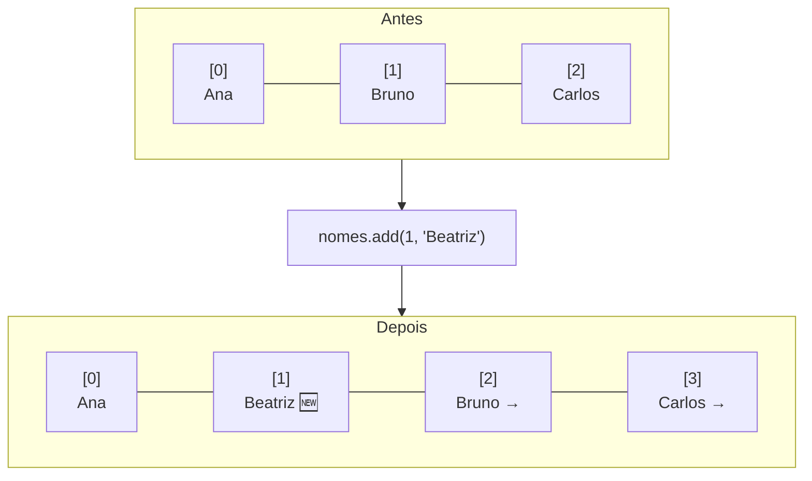
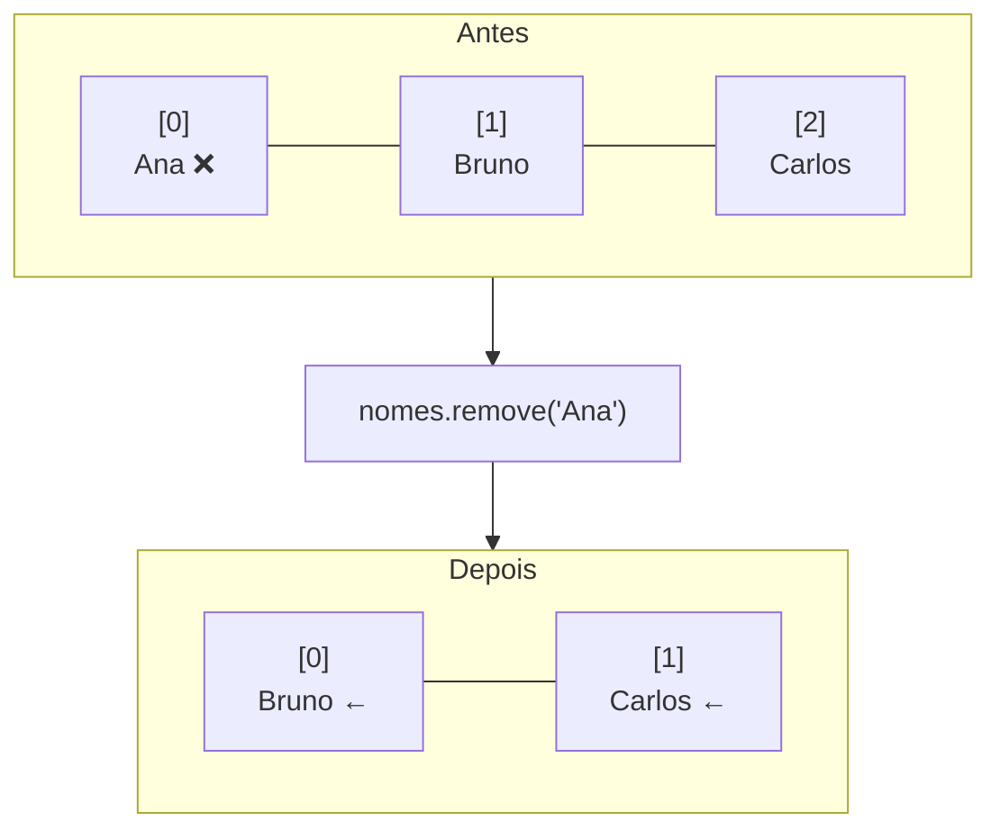
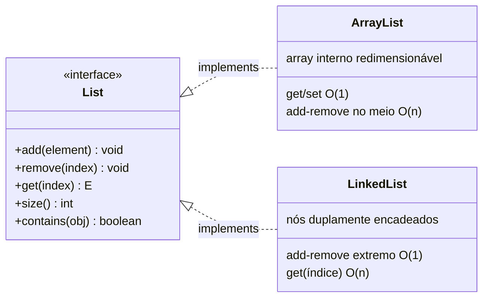
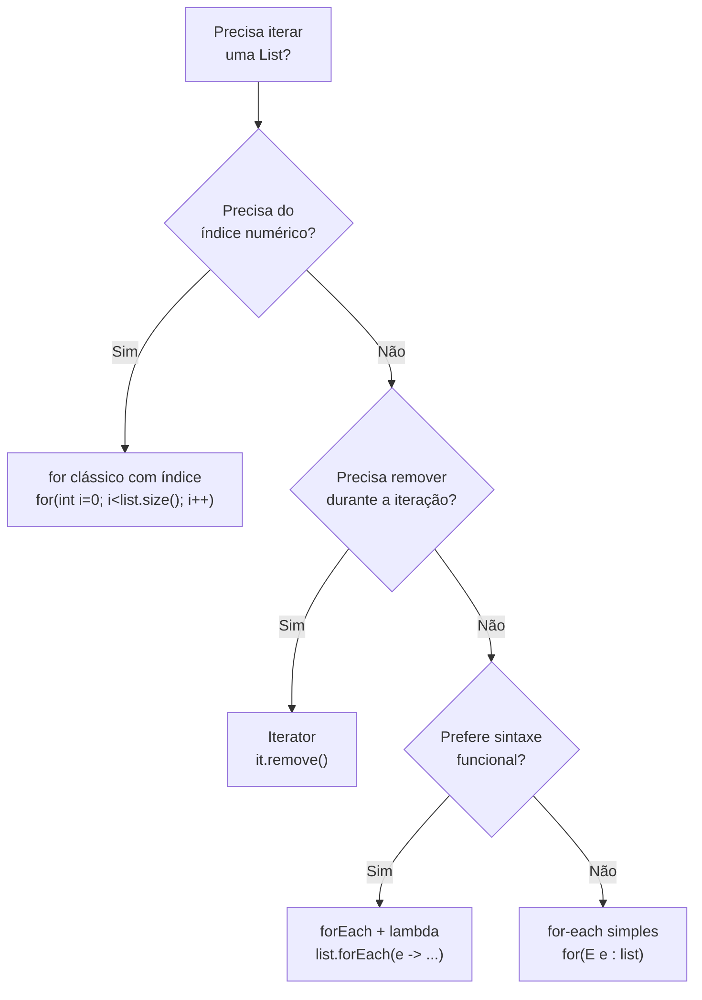
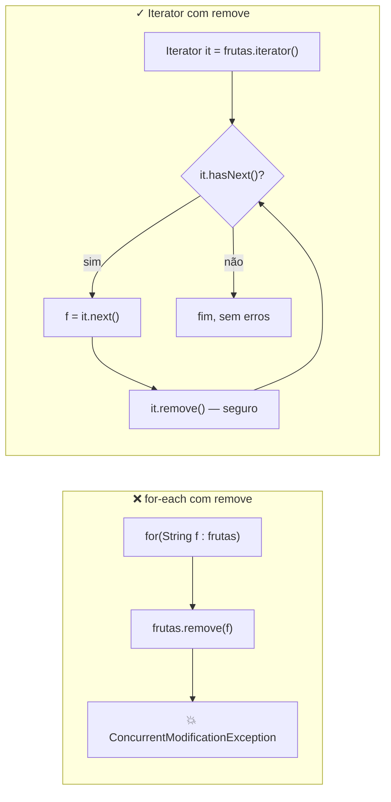

# Coleções — ArrayList, List e Iteração

> **Conteúdo Complementar · Módulo 2 · 60 XP**

Arrays nativos do Java têm um problema fundamental: **tamanho fixo**. Você declara `Produto[] produtos = new Produto[50]` e torce para nunca precisar do 51º. O Java Collections Framework resolve isso com estruturas de dados redimensionáveis, com APIs ricas e integradas ao sistema de tipos genéricos.

---

## Por que Collections?

```java
// Arrays: tamanho fixo, sem métodos úteis
Produto[] produtos = new Produto[50];
int cont = 0;
produtos[cont++] = new Produto("Teclado", 250.0);
// Para remover o item 0: precisa fazer shift manual de tudo

// ArrayList: tamanho dinâmico, API completa
ArrayList<Produto> produtos = new ArrayList<>();
produtos.add(new Produto("Teclado", 250.0));
produtos.remove(0); // feito!
System.out.println(produtos.size()); // 0
```

---



---

## 1. ArrayList — a lista mais usada

`ArrayList<E>` é uma lista baseada em array interno que cresce automaticamente. O `<E>` é o tipo dos elementos — isso é **Generics**.

```java
import java.util.ArrayList;

// Declaração com tipo genérico — nunca use ArrayList sem <Tipo>
ArrayList<String> nomes = new ArrayList<>();

// Adicionando
nomes.add("Ana");
nomes.add("Bruno");
nomes.add("Carlos");
nomes.add(1, "Beatriz"); // insere na posição 1, desloca os demais

// Acessando
System.out.println(nomes.get(0));  // Ana
System.out.println(nomes.size());  // 4

// Verificando
System.out.println(nomes.contains("Bruno")); // true
System.out.println(nomes.indexOf("Carlos")); // 2

// Removendo
nomes.remove("Ana");        // por valor
nomes.remove(0);            // por índice
nomes.clear();              // limpa tudo

// Convertendo para array
String[] arr = nomes.toArray(new String[0]);
```

**`add(index, element)` — elementos deslocam para a direita:**



**`remove(element)` — elementos deslocam para a esquerda:**



> **Custo O(n):** inserir ou remover no meio da lista obriga o Java a deslocar todos os elementos seguintes — quanto maior a lista, mais trabalho. Para inserções frequentes no meio, considere `LinkedList`.

---

## 2. A Interface List — programe para a abstração

Na prática, declare sempre como `List<E>`, não como `ArrayList<E>`:

```java
import java.util.List;
import java.util.ArrayList;

// CORRETO: declara pela interface, instancia pela implementação
List<String> nomes = new ArrayList<>();

// Se um dia quiser trocar para LinkedList, só muda uma linha:
// List<String> nomes = new LinkedList<>();
```



> **Por que isso importa?** Métodos que aceitam `List<E>` funcionam com qualquer implementação (ArrayList, LinkedList, etc.). Métodos que aceitam `ArrayList<E>` ficam presos a uma implementação específica — isso viola o DIP (Módulo 6).

---

## 3. Generics — `<E>` explicitado

O tipo entre `<>` impede erros em tempo de compilação:

```java
List<Produto> produtos = new ArrayList<>();
produtos.add(new Produto("Mouse", 80.0));

// Sem generics (raw type — nunca faça isso):
ArrayList semTipo = new ArrayList();
semTipo.add("texto");
semTipo.add(42); // compilou! mas vai explodir no get()
String s = (String) semTipo.get(1); // ClassCastException em runtime
```

---

## 4. Iteração — 4 formas

```java
List<String> frutas = new ArrayList<>(List.of("Maçã", "Banana", "Laranja"));

// Forma 1: for-each (recomendada para leitura simples)
for (String fruta : frutas) {
    System.out.println(fruta);
}

// Forma 2: for clássico com índice (use quando precisar do índice)
for (int i = 0; i < frutas.size(); i++) {
    System.out.printf("[%d] %s%n", i, frutas.get(i));
}

// Forma 3: Iterator (use quando precisar REMOVER durante a iteração)
import java.util.Iterator;
Iterator<String> it = frutas.iterator();
while (it.hasNext()) {
    String f = it.next();
    if (f.equals("Banana")) it.remove(); // seguro — sem ConcurrentModificationException
}

// Forma 4: forEach com lambda (Java 8+, mais expressivo)
frutas.forEach(f -> System.out.println(f.toUpperCase()));
// ou ainda mais curto com method reference:
frutas.forEach(System.out::println);
```

**Quando usar cada forma:**



**Por que `Iterator.remove()` é seguro e `for-each` não:**



> **Erro clássico**: remover elementos de uma lista com for-each normal causa `ConcurrentModificationException`. Use sempre o `Iterator` quando precisar remover durante a iteração.

---

## 5. Ordenação — Comparable e Comparator

```java
import java.util.Collections;
import java.util.Comparator;

// Ordenação natural (requer Comparable implementado na classe)
class Produto implements Comparable<Produto> {
    String nome;
    double preco;

    Produto(String nome, double preco) {
        this.nome = nome; this.preco = preco;
    }

    @Override
    public int compareTo(Produto outro) {
        return this.nome.compareTo(outro.nome); // ordem alfabética por nome
    }
}

List<Produto> lista = new ArrayList<>(List.of(
    new Produto("Teclado", 250.0),
    new Produto("Mouse",    80.0),
    new Produto("Monitor", 900.0)
));

Collections.sort(lista);                  // usa Comparable — ordena por nome
lista.sort(Comparator.naturalOrder());    // equivalente

// Ordenação por critério externo com Comparator (não precisa alterar a classe)
lista.sort(Comparator.comparingDouble(p -> p.preco)); // por preço crescente
lista.sort(Comparator.comparingDouble((Produto p) -> p.preco).reversed()); // decrescente
lista.sort(Comparator.comparing(p -> p.nome)); // por nome (alternativa ao Comparable)

// Comparator composto: primeiro por preço, depois por nome em caso de empate
lista.sort(Comparator.comparingDouble((Produto p) -> p.preco)
                     .thenComparing(p -> p.nome));
```

---

## 6. Buscas — contains, indexOf e stream

```java
// contains usa equals() — certifique-se de sobrescrever equals() nas suas classes!
boolean temMouse = lista.contains(new Produto("Mouse", 80.0)); // false sem equals()

// Busca manual simples
Produto encontrado = null;
for (Produto p : lista) {
    if (p.nome.equalsIgnoreCase("mouse")) {
        encontrado = p;
        break;
    }
}

// Busca com Stream (Java 8+) — mais expressivo
import java.util.Optional;
Optional<Produto> opt = lista.stream()
    .filter(p -> p.nome.equalsIgnoreCase("mouse"))
    .findFirst();

if (opt.isPresent()) {
    System.out.println("Encontrado: " + opt.get().nome);
}
// ou mais curto:
lista.stream()
     .filter(p -> p.preco > 100.0)
     .forEach(p -> System.out.println(p.nome)); // imprime itens acima de R$100
```

---

## 7. Criando listas já populadas

```java
// List.of — imutável (não aceita add/remove após criação)
List<String> fixo = List.of("A", "B", "C");

// new ArrayList com List.of — mutável
List<String> mutavel = new ArrayList<>(List.of("A", "B", "C"));

// Arrays.asList — tamanho fixo mas permite set()
import java.util.Arrays;
List<String> semAdd = Arrays.asList("A", "B", "C"); // add() lança UnsupportedOperationException
```

---

## 8. Exemplo integrado — Agenda com ArrayList

```java
import java.util.*;

class Contato implements Comparable<Contato> {
    String nome;
    String telefone;

    Contato(String nome, String telefone) {
        this.nome = nome; this.telefone = telefone;
    }

    @Override
    public int compareTo(Contato outro) {
        return this.nome.compareToIgnoreCase(outro.nome);
    }

    @Override
    public String toString() {
        return nome + " — " + telefone;
    }
}

class Agenda {
    private List<Contato> contatos = new ArrayList<>();

    void adicionar(Contato c) { contatos.add(c); }

    boolean remover(String nome) {
        Iterator<Contato> it = contatos.iterator();
        while (it.hasNext()) {
            if (it.next().nome.equalsIgnoreCase(nome)) {
                it.remove();
                return true;
            }
        }
        return false;
    }

    List<Contato> buscarPorNome(String termo) {
        List<Contato> resultado = new ArrayList<>();
        for (Contato c : contatos) {
            if (c.nome.toLowerCase().contains(termo.toLowerCase())) {
                resultado.add(c);
            }
        }
        return resultado;
    }

    void listarOrdenado() {
        List<Contato> ordenados = new ArrayList<>(contatos);
        Collections.sort(ordenados);
        ordenados.forEach(System.out::println);
    }

    int tamanho() { return contatos.size(); }
}

public class Main {
    public static void main(String[] args) {
        Agenda agenda = new Agenda();
        agenda.adicionar(new Contato("Carlos", "(11) 9999-0001"));
        agenda.adicionar(new Contato("Ana",    "(11) 9999-0002"));
        agenda.adicionar(new Contato("Bruno",  "(11) 9999-0003"));

        System.out.println("=== Ordenado ===");
        agenda.listarOrdenado();

        System.out.println("\n=== Busca 'a' ===");
        agenda.buscarPorNome("a").forEach(System.out::println);
    }
}
```

---

## Troubleshooting

O código abaixo tem **3 problemas**. Identifique e corrija cada um:

```java
import java.util.ArrayList;

public class Estoque {
    ArrayList produtos = new ArrayList();  // problema 1

    void adicionar(String nome, double preco) {
        produtos.add(nome);
        produtos.add(preco);  // problema 2
    }

    void removerPrimeiro() {
        for (String p : produtos) {  // problema 3
            produtos.remove(p);
            break;
        }
    }
}
```

> **Gabarito:**
> 1. `ArrayList` sem tipo genérico (raw type). Correto: `ArrayList<Produto>` com classe `Produto`
> 2. Misturar `String` e `double` na mesma lista não-tipada — cria lista incoerente. Correto: criar classe `Produto` e adicionar objetos `Produto`
> 3. `ConcurrentModificationException` — remover dentro de for-each. Correto: usar `Iterator.remove()` ou `removeIf()`

---

## Exercícios

**Exercício 1** — Crie uma classe `Turma` com `List<Aluno>` (use a classe `Aluno` do módulo 2). Implemente: `matricular(Aluno)`, `desmatricular(String nomeAluno)`, `buscarPorNome(String)` retornando `List<Aluno>`, `listarOrdenado()` por nota.

**Exercício 2** — Implemente um carrinho de compras: `Carrinho` com `List<Produto>`. Métodos: `adicionar(Produto)`, `remover(String nomeProduto)`, `getTotal()`, `listarItensPorPreco()`.

**Exercício 3** — Sistema de notas: dado um `List<Double>` de notas, calcule média, maior nota, menor nota e quantas estão acima da média. Use `Collections.max()`, `Collections.min()` e stream.

**Exercício 4** — Refatore o sistema de Agenda do encontro 05 (que usava array nativo `Contato[]`) para usar `List<Contato>`. Remova a variável `numContatos` — o `list.size()` substitui.

**Exercício 5** — Crie um `RankingAlunos` que mantém uma lista ordenada por média decrescente. Use `Comparator.comparingDouble(a -> -a.getMedia())` para ordenar após cada inserção.

**Exercício 6** — Implemente `filtrarAprovados(List<Aluno>)` que retorna todos com média ≥ 7 usando: (a) for-each clássico, (b) removeIf, (c) stream().filter(). Compare as três abordagens.

> **Gabarito:**
> Exercício 3 completo:
> ```java
> import java.util.*;
> 
> List<Double> notas = new ArrayList<>(List.of(8.5, 6.0, 9.2, 4.0, 7.5, 10.0, 5.5));
> double media = notas.stream().mapToDouble(Double::doubleValue).average().orElse(0);
> double maior = Collections.max(notas);
> double menor = Collections.min(notas);
> long acimaDaMedia = notas.stream().filter(n -> n > media).count();
> System.out.printf("Média: %.2f | Maior: %.1f | Menor: %.1f | Acima da média: %d%n",
>     media, maior, menor, acimaDaMedia);
> ```
