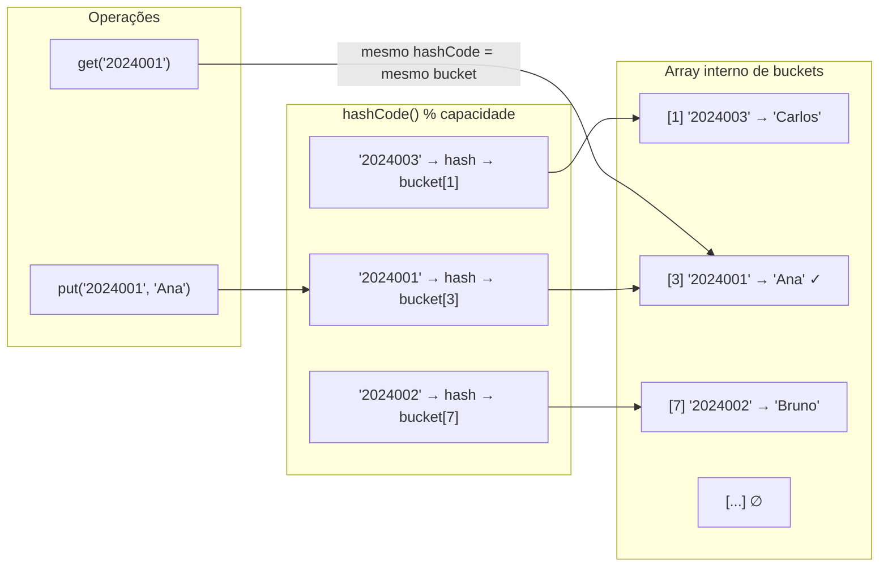
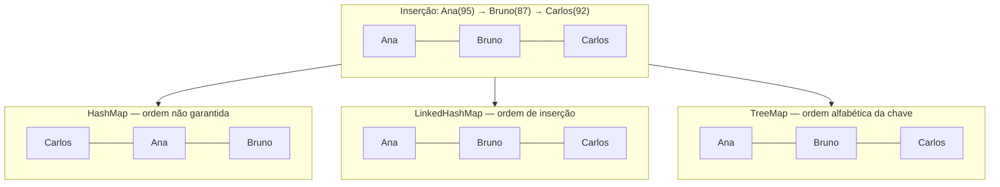
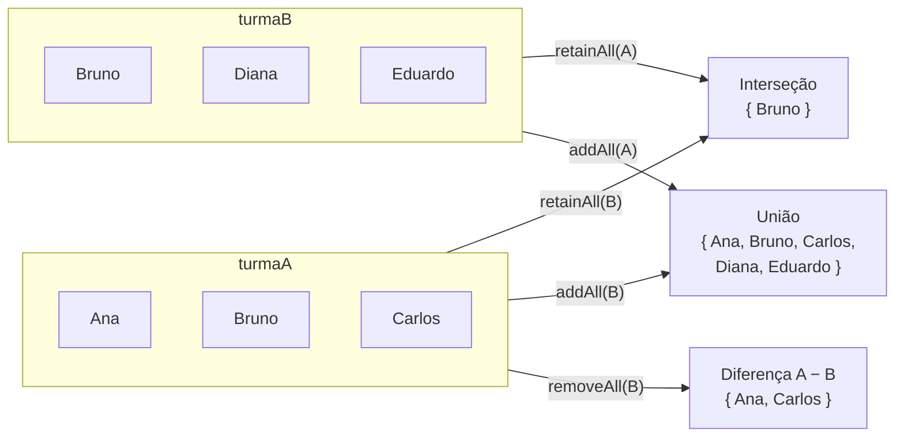
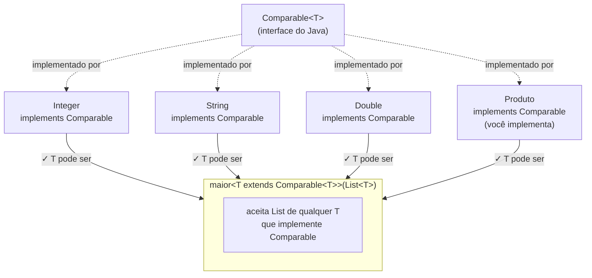
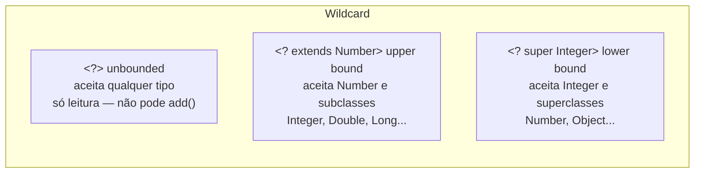
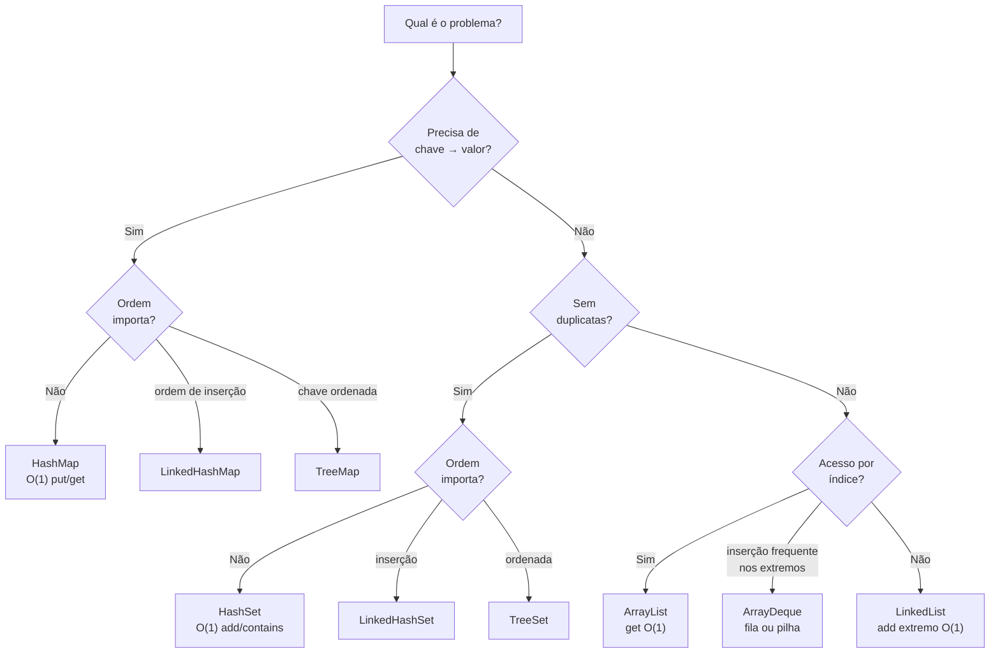

# Map, Set e Generics

> **Conteúdo Complementar · Módulo 2 · 60 XP**

`ArrayList` resolve listas. Mas e quando você precisa associar uma chave a um valor (dicionário), ou garantir que não há duplicatas (conjunto)? O Java Collections Framework tem estruturas específicas para cada problema.

---

## 1. HashMap — o dicionário do Java

`HashMap<K, V>` associa **chaves** (`K`) a **valores** (`V`). A busca por chave é O(1) — extremamente rápida.

```java
import java.util.HashMap;
import java.util.Map;

// Chave: matrícula (String) → Valor: nome do aluno (String)
Map<String, String> alunos = new HashMap<>();

// Inserindo (put sobrescreve se chave já existe)
alunos.put("2024001", "Ana Silva");
alunos.put("2024002", "Bruno Costa");
alunos.put("2024003", "Carlos Lima");

// Acessando
String nome = alunos.get("2024002");       // "Bruno Costa"
String inexistente = alunos.get("9999");   // null — não lança exceção

// Com valor padrão se não encontrar
String nomeOuPadrao = alunos.getOrDefault("9999", "Aluno não encontrado");

// Verificando
alunos.containsKey("2024001");   // true
alunos.containsValue("Ana Silva"); // true (mais lento — varre tudo)

// Removendo
alunos.remove("2024003");

// Tamanho
System.out.println(alunos.size()); // 2
```

**Como o HashMap funciona internamente — array de buckets com acesso O(1):**



> **Por que O(1)?** A chave passa por `hashCode()` que aponta direto para o bucket — não há varredura. Colisões (dois keys no mesmo bucket) degradam para O(n) no pior caso, mas são raras com uma boa função hash.

### Iterando sobre HashMap

```java
// Iterar pelas chaves
for (String matricula : alunos.keySet()) {
    System.out.println(matricula + ": " + alunos.get(matricula));
}

// Iterar pelos valores
for (String n : alunos.values()) {
    System.out.println(n);
}

// Iterar por pares chave-valor (mais eficiente)
for (Map.Entry<String, String> entry : alunos.entrySet()) {
    System.out.println(entry.getKey() + " → " + entry.getValue());
}

// forEach com lambda (Java 8+)
alunos.forEach((mat, n) -> System.out.println(mat + ": " + n));
```

### HashMap com objetos como valor

```java
Map<String, Aluno> cadastro = new HashMap<>();
cadastro.put("2024001", new Aluno("Ana", "2024001", 8.5, 7.0));

Aluno ana = cadastro.get("2024001");
System.out.println(ana.getNome()); // Ana
```

---

## 2. LinkedHashMap — mapa com ordem de inserção

`HashMap` não garante ordem. `LinkedHashMap` mantém a ordem em que os elementos foram inseridos:

```java
import java.util.LinkedHashMap;

Map<String, Integer> ranking = new LinkedHashMap<>();
ranking.put("Ana",    95);
ranking.put("Bruno",  87);
ranking.put("Carlos", 92);

// Itera na ordem de inserção: Ana, Bruno, Carlos
ranking.forEach((nome, pts) -> System.out.println(nome + ": " + pts));
```

---

## 3. TreeMap — mapa ordenado por chave

`TreeMap` mantém as chaves em **ordem natural** (ou por `Comparator`):

```java
import java.util.TreeMap;

Map<String, Integer> alfabetico = new TreeMap<>(ranking); // copia e ordena
// Itera em ordem alfabética: Ana, Bruno, Carlos
```

**Mesmos dados — três ordenações diferentes:**



> **Regra prática:** use `HashMap` por padrão (mais rápido), `LinkedHashMap` quando a ordem de exibição importa, e `TreeMap` quando precisar de ordenação por chave sem chamar `sort()` manualmente.

---

## 4. Set — conjunto sem duplicatas

`Set<E>` não permite elementos repetidos. Ideal para listas de permissões, tags, CPFs já cadastrados.

```java
import java.util.HashSet;
import java.util.Set;

Set<String> emails = new HashSet<>();
emails.add("ana@email.com");
emails.add("bruno@email.com");
emails.add("ana@email.com"); // duplicata — ignorada silenciosamente

System.out.println(emails.size());            // 2
System.out.println(emails.contains("ana@email.com")); // true

// Removendo
emails.remove("bruno@email.com");
```

> **Atenção**: `HashSet` não garante ordem. Se precisar de ordem de inserção use `LinkedHashSet`; para ordem natural use `TreeSet`.

### Operações de conjunto

```java
Set<String> turmaA = new HashSet<>(Set.of("Ana", "Bruno", "Carlos"));
Set<String> turmaB = new HashSet<>(Set.of("Bruno", "Diana", "Eduardo"));

// Interseção (elementos em ambas as turmas)
Set<String> ambas = new HashSet<>(turmaA);
ambas.retainAll(turmaB); // {Bruno}

// União
Set<String> todos = new HashSet<>(turmaA);
todos.addAll(turmaB); // {Ana, Bruno, Carlos, Diana, Eduardo}

// Diferença (em A mas não em B)
Set<String> somenteA = new HashSet<>(turmaA);
somenteA.removeAll(turmaB); // {Ana, Carlos}
```

**As três operações de conjunto visualizadas:**



### TreeSet — conjunto ordenado

```java
import java.util.TreeSet;

TreeSet<String> nomes = new TreeSet<>(Set.of("Carlos", "Ana", "Bruno"));
System.out.println(nomes.first()); // Ana
System.out.println(nomes.last());  // Carlos

// TreeSet com Comparator
TreeSet<Produto> porPreco = new TreeSet<>(
    Comparator.comparingDouble(p -> p.preco)
);
```

---

## 5. Generics aprofundado

### Por que Generics existem

```java
// Antes do Java 5 (sem Generics):
List lista = new ArrayList();
lista.add("texto");
lista.add(42);
String s = (String) lista.get(1); // ClassCastException em runtime!

// Com Generics — erro detectado em compile time:
List<String> lista = new ArrayList<>();
lista.add("texto");
lista.add(42); // ERRO DE COMPILAÇÃO — Java detecta antes de rodar
```

### Métodos genéricos

```java
// Método que funciona com qualquer tipo
public static <T> void trocar(List<T> lista, int i, int j) {
    T temp = lista.get(i);
    lista.set(i, lista.get(j));
    lista.set(j, temp);
}

// Uso:
List<String> nomes = new ArrayList<>(List.of("A", "B", "C"));
trocar(nomes, 0, 2); // [C, B, A]

List<Integer> nums = new ArrayList<>(List.of(1, 2, 3));
trocar(nums, 0, 2); // [3, 2, 1]
```

### Bounded generics — `<T extends Tipo>`

```java
// Aceita qualquer T que implemente Comparable
public static <T extends Comparable<T>> T maior(List<T> lista) {
    T max = lista.get(0);
    for (T item : lista) {
        if (item.compareTo(max) > 0) max = item;
    }
    return max;
}

// Funciona com Integer, String, Double, qualquer Comparable
System.out.println(maior(List.of(3, 1, 4, 1, 5, 9))); // 9
System.out.println(maior(List.of("banana", "abacaxi", "uva"))); // uva
```

**`<T extends Comparable<T>>` — quais tipos são aceitos:**



**Wildcard `<?>` — três variações:**



### Wildcard — `<?>`

```java
// Aceita List de qualquer tipo (só leitura — não pode adicionar)
public static void imprimirTodos(List<?> lista) {
    for (Object item : lista) System.out.println(item);
}

// Aceita List de Number ou subclasses (Integer, Double, Long...)
public static double somarNumeros(List<? extends Number> lista) {
    double soma = 0;
    for (Number n : lista) soma += n.doubleValue();
    return soma;
}

somarNumeros(List.of(1, 2, 3));         // aceita List<Integer>
somarNumeros(List.of(1.5, 2.5, 3.0));  // aceita List<Double>
```

---

## 6. Quando usar cada coleção

| Quando você precisa de... | Use |
|---|---|
| Lista ordenada com duplicatas | `List<E>` / `ArrayList<E>` |
| Associar chave a valor, busca rápida | `Map<K,V>` / `HashMap<K,V>` |
| Map com ordem de inserção | `LinkedHashMap<K,V>` |
| Map com chaves ordenadas | `TreeMap<K,V>` |
| Conjunto sem duplicatas, busca rápida | `Set<E>` / `HashSet<E>` |
| Conjunto ordenado | `TreeSet<E>` |
| Fila FIFO | `Queue<E>` / `LinkedList<E>` |
| Pilha LIFO | `Deque<E>` / `ArrayDeque<E>` |

**Árvore de decisão — escolha a coleção certa:**



---

## 7. Exemplo integrado — Sistema de Notas

```java
import java.util.*;

class SistemaNotas {
    // matrícula → lista de notas
    private Map<String, List<Double>> notas = new HashMap<>();
    // matrículas já inscritas (sem duplicatas)
    private Set<String> matriculados = new LinkedHashSet<>();

    void matricular(String matricula) {
        if (matriculados.add(matricula)) {  // add retorna false se duplicata
            notas.put(matricula, new ArrayList<>());
            System.out.println(matricula + " matriculado.");
        } else {
            System.out.println(matricula + " já matriculado!");
        }
    }

    void lancarNota(String matricula, double nota) {
        if (!matriculados.contains(matricula)) {
            System.out.println("Aluno não encontrado.");
            return;
        }
        notas.get(matricula).add(nota);
    }

    double getMedia(String matricula) {
        List<Double> ns = notas.getOrDefault(matricula, List.of());
        return ns.stream().mapToDouble(Double::doubleValue).average().orElse(0);
    }

    void relatorio() {
        // TreeMap para relatório em ordem de matrícula
        new TreeMap<>(notas).forEach((mat, ns) -> {
            double media = ns.stream().mapToDouble(Double::doubleValue).average().orElse(0);
            System.out.printf("%-10s | Notas: %-20s | Média: %.1f | %s%n",
                mat, ns, media, media >= 7 ? "APROVADO" : "REPROVADO");
        });
    }
}
```

---

## Troubleshooting

Identifique e corrija os 3 problemas:

```java
import java.util.*;

public class Estoque {
    Map produtos = new HashMap();  // problema 1

    void cadastrar(String codigo, String nome) {
        if (produtos.containsKey(codigo)) {
            produtos.put(codigo, nome); // problema 2
        }
    }

    Set<String> getCodigos() {
        return produtos.keySet(); // problema 3
    }
}
```

> **Gabarito:**
> 1. `Map` sem generics. Correto: `Map<String, String> produtos = new HashMap<>()`
> 2. A condição está invertida — só cadastra se **já existir**. Correto: `if (!produtos.containsKey(codigo))`
> 3. `keySet()` retorna uma **view ao vivo** do mapa — modificações no Set afetam o mapa e vice-versa. Se quiser uma cópia segura: `return new HashSet<>(produtos.keySet())`

---

## Exercícios

**Exercício 1** — Contador de frequência de palavras: dado um texto, use `HashMap<String, Integer>` para contar quantas vezes cada palavra aparece. Dica: `map.merge(palavra, 1, Integer::sum)`.

**Exercício 2** — Sistema de permissões: `Map<String, Set<String>>` onde a chave é o nome do usuário e o valor é o conjunto de permissões que ele tem ("ler", "escrever", "deletar"). Implemente `temPermissao(usuario, permissao)`.

**Exercício 3** — Índice invertido: dado `Map<String, List<String>>` (disciplina → lista de alunos), crie a estrutura inversa: `Map<String, List<String>>` (aluno → lista de disciplinas).

**Exercício 4** — Turma sem duplicatas: crie `TurmaUnica` que usa `LinkedHashSet<Aluno>` para garantir que o mesmo aluno não entre duas vezes. Para funcionar, implemente `equals()` e `hashCode()` em `Aluno` usando `matricula` como chave natural.

**Exercício 5** — Use `TreeMap` para criar um relatório de alunos ordenado por matrícula, onde cada entrada contém média e situação. Compare com `HashMap` na exibição — note a diferença de ordem.

> **Gabarito:**
> Exercício 1:
> ```java
> String texto = "java é bom java é rápido bom java";
> Map<String, Integer> freq = new HashMap<>();
> for (String palavra : texto.split(" ")) {
>     freq.merge(palavra, 1, Integer::sum);
>     // equivalente a: freq.put(p, freq.getOrDefault(p, 0) + 1)
> }
> // Ordenar por frequência decrescente:
> freq.entrySet().stream()
>     .sorted(Map.Entry.<String,Integer>comparingByValue().reversed())
>     .forEach(e -> System.out.println(e.getKey() + ": " + e.getValue()));
> ```
