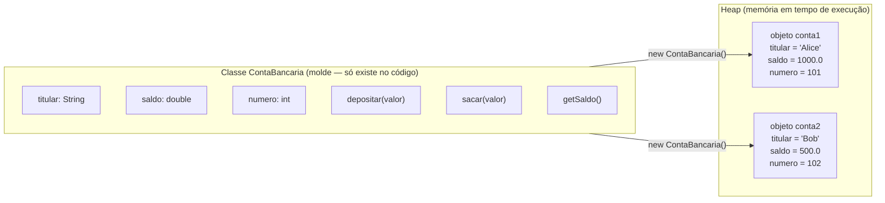
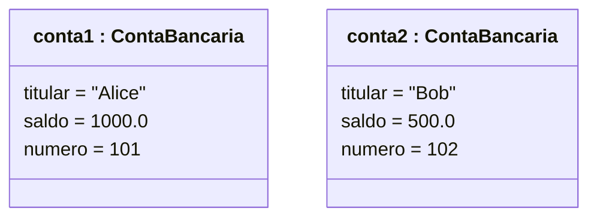
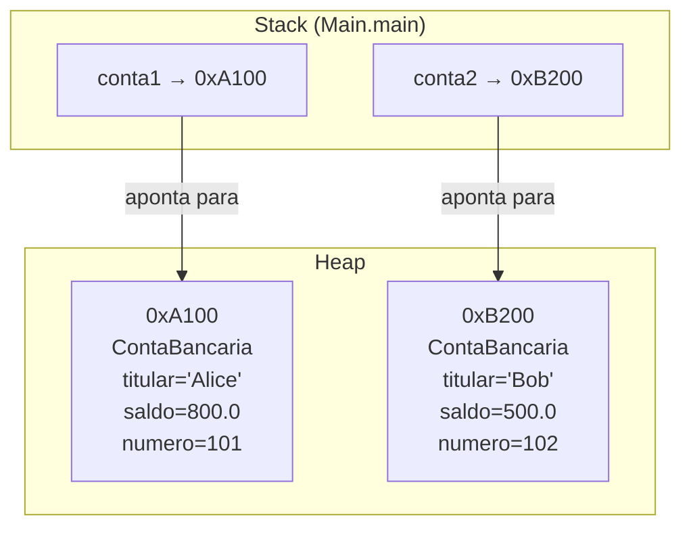
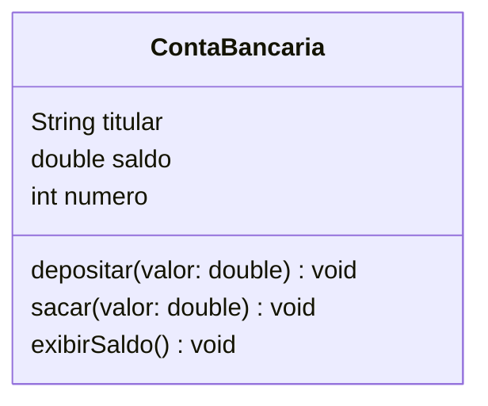
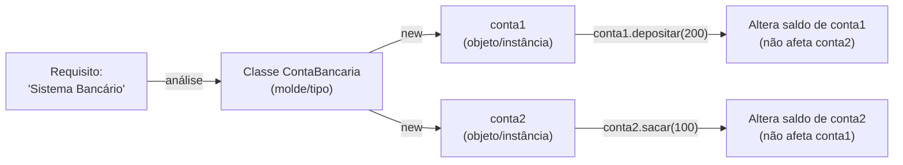
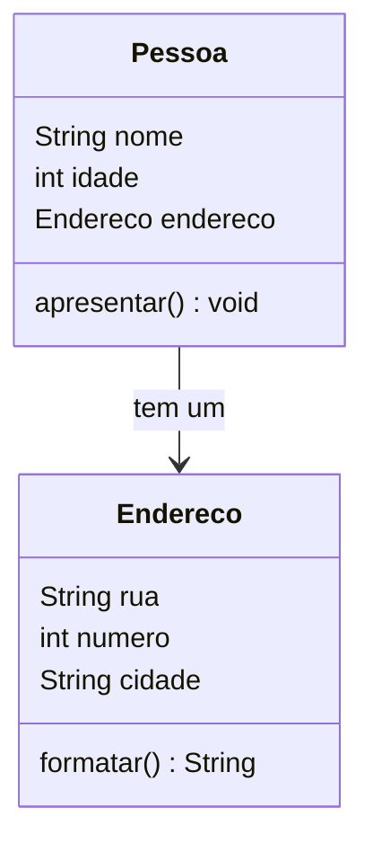

# Encontro 03 — Transição de Paradigma: Classes e Objetos I

> **Módulo 2 · 4 aulas · 50 XP**

---

## 1. Por que o paradigma procedural tem um limite?

Imagine um sistema bancário escrito de forma procedural. Para representar uma conta, você usaria variáveis soltas:

```java
// Abordagem PROCEDURAL — código frágil e difícil de escalar
public class BancoProcedural {
    public static void main(String[] args) {
        // Dados da conta 1
        String titular1 = "Alice";
        double saldo1   = 1000.0;
        int numero1     = 101;

        // Dados da conta 2
        String titular2 = "Bob";
        double saldo2   = 500.0;
        int numero2     = 102;

        // Para transferir, precisamos manipular tudo manualmente
        double valor = 200.0;
        saldo1 -= valor;
        saldo2 += valor;
        System.out.println(titular1 + " tem R$ " + saldo1);
        System.out.println(titular2 + " tem R$ " + saldo2);
    }
}
```

**Problemas desta abordagem:**
- Nada impede `saldo1 = -999999` (estado inválido)
- Para 1000 contas, precisamos de 3000 variáveis separadas
- Dados e comportamentos (sacar, depositar) estão espalhados pelo código
- Impossível reutilizar com segurança

---

## 2. A Abstração: o que é uma Classe?

> **Classe** é um molde, um tipo criado por você que descreve a estrutura (atributos) e o comportamento (métodos) de um conceito do mundo real.

> **Objeto** é uma instância concreta dessa classe — uma entidade real que ocupa espaço em memória, tem seu próprio estado e responde a mensagens.



**Analogia concreta:**
- A **planta baixa** de um apartamento = Classe
- Os **apartamentos construídos** naquele prédio = Objetos (cada um com seus móveis, moradores e estado)

---

## 3. Diagrama de Objetos — visualizando memória

O Diagrama de Objetos UML mostra instâncias concretas em um momento específico da execução.



> **Notação:** `nomeDoObjeto : NomeDaClasse` — o sublinhado indica que é uma instância, não uma classe.

---

## 4. Criando a primeira Classe de domínio

```java
// Arquivo: ContaBancaria.java
// Uma Classe é a descrição do tipo — ainda não é um objeto!
class ContaBancaria {

    // ── Atributos (estado do objeto) ─────────────────────────────────────
    // Cada objeto terá sua própria cópia independente destas variáveis
    String titular;
    double saldo;
    int numero;

    // ── Métodos de instância (comportamento do objeto) ────────────────────
    // 'this' aqui é implícito — o método opera sobre o OBJETO que o chamou

    void depositar(double valor) {
        saldo = saldo + valor; // altera o saldo DESTE objeto
        System.out.println("Depósito de R$ " + valor + " realizado.");
    }

    void sacar(double valor) {
        if (valor > saldo) {
            System.out.println("Saldo insuficiente!");
            return;
        }
        saldo = saldo - valor;
        System.out.println("Saque de R$ " + valor + " realizado.");
    }

    void exibirSaldo() {
        System.out.println("Conta " + numero + " | " + titular + " | R$ " + saldo);
    }
}
```

---

## 5. O operador `new` e o Heap

```java
// Arquivo: Main.java
public class Main {
    public static void main(String[] args) {

        // 1. 'new ContaBancaria()' ALOCA memória no Heap e cria o objeto
        // 2. 'conta1' é uma REFERÊNCIA (ponteiro) que fica no Stack
        ContaBancaria conta1 = new ContaBancaria();

        // Atribuindo estado ao objeto via referência
        conta1.titular = "Alice";
        conta1.saldo   = 1000.0;
        conta1.numero  = 101;

        // Criando um SEGUNDO objeto independente — cada um tem seu próprio estado
        ContaBancaria conta2 = new ContaBancaria();
        conta2.titular = "Bob";
        conta2.saldo   = 500.0;
        conta2.numero  = 102;

        // Enviando mensagens (chamando métodos) nos objetos
        conta1.exibirSaldo(); // Conta 101 | Alice | R$ 1000.0
        conta2.exibirSaldo(); // Conta 102 | Bob | R$ 500.0

        // Operação: Alice saca 200
        conta1.sacar(200.0);
        conta1.exibirSaldo(); // Conta 101 | Alice | R$ 800.0

        // Bob não foi afetado — estados são INDEPENDENTES
        conta2.exibirSaldo(); // Conta 102 | Bob | R$ 500.0
    }
}
```



---

## 6. Diagrama de Classes — a visão arquitetural

O Diagrama de Classes UML mostra a **estrutura** — não instâncias específicas.



**As três seções de uma classe no diagrama:**
```
┌──────────────────────┐
│    ContaBancaria     │  ← Nome da classe
├──────────────────────┤
│  titular : String    │  ← Atributos (estado)
│  saldo   : double    │
│  numero  : int       │
├──────────────────────┤
│  depositar(double)   │  ← Métodos (comportamento)
│  sacar(double)       │
│  exibirSaldo()       │
└──────────────────────┘
```

---

## 7. Método estático vs. Método de instância

Este é o ponto de virada do curso. Entenda a diferença fundamental:

| Aspecto | Método Estático | Método de Instância |
|---------|----------------|---------------------|
| Palavra-chave | `static` | (sem `static`) |
| Chamada | `NomeClasse.metodo()` | `objeto.metodo()` |
| Acessa atributos? | Não (sem objeto) | Sim (do próprio objeto) |
| Para quê? | Utilitários, cálculos | Comportamento do objeto |
| Exemplo | `Math.sqrt(4)` | `conta1.depositar(200)` |

```java
public class Comparacao {

    // ESTÁTICO: não pertence a nenhum objeto específico
    public static double calcularJuros(double capital, double taxa) {
        return capital * taxa; // opera apenas nos parâmetros
    }

    // DE INSTÂNCIA: opera sobre o estado do objeto que o chama
    double saldo;
    void creditar(double valor) {
        this.saldo += valor; // altera ESTE objeto
    }
}
```

---

## Resumo Visual do Encontro



---

## Exercícios Práticos

---

### Exercício 1 — Fácil · 25 XP
**Primeira Classe: Produto**

Crie a classe `Produto` com atributos `nome` (String), `preco` (double) e `estoque` (int). Implemente os métodos `vender(int quantidade)` (reduz o estoque), `repor(int quantidade)` (aumenta o estoque) e `exibir()` (imprime os dados). No `main`, crie dois produtos diferentes e manipule-os.

```java
class Produto {
    String nome;
    double preco;
    int estoque;

    void vender(int quantidade) {
        // SEU CÓDIGO AQUI: verifique se há estoque suficiente antes de vender
    }

    void repor(int quantidade) {
        // SEU CÓDIGO AQUI
    }

    void exibir() {
        // SEU CÓDIGO AQUI: imprime nome, preço formatado e estoque
    }
}

public class ExercicioProduto {
    public static void main(String[] args) {
        Produto notebook = new Produto();
        notebook.nome    = "Notebook";
        notebook.preco   = 2500.0;
        notebook.estoque = 10;

        Produto mouse = new Produto();
        // SEU CÓDIGO AQUI: preencha e manipule o mouse

        notebook.exibir();
        notebook.vender(3);
        notebook.exibir();
        notebook.vender(20); // deve imprimir mensagem de estoque insuficiente
    }
}
```

---

### Exercício 2 — Fácil · 25 XP
**Diagrama → Código**

Dado o diagrama abaixo, implemente a classe e crie 3 objetos diferentes no `main`:

```
┌─────────────────────┐
│      Aluno          │
├─────────────────────┤
│  nome : String      │
│  matricula : String │
│  media : double     │
├─────────────────────┤
│  calcularSituacao() │
│  exibirBoletim()    │
└─────────────────────┘
```

`calcularSituacao()` retorna `"Aprovado"` se média ≥ 7.0, `"Recuperação"` se ≥ 5.0, senão `"Reprovado"`.

---

### Exercício 3 — Médio · 25 XP
**Objeto como atributo de outro Objeto**

Crie a classe `Endereco` (rua, numero, cidade) e a classe `Pessoa` (nome, idade, endereco: Endereco). No `main`, crie um endereço e depois crie uma pessoa com esse endereço.



```java
class Endereco {
    String rua;
    int numero;
    String cidade;

    String formatar() {
        // SEU CÓDIGO AQUI: retorne "Rua X, 123 - Cidade"
    }
}

class Pessoa {
    String nome;
    int idade;
    Endereco endereco; // atributo que é um objeto!

    void apresentar() {
        // SEU CÓDIGO AQUI: imprime nome, idade e chama endereco.formatar()
    }
}

public class ExercicioComposicao {
    public static void main(String[] args) {
        Endereco end = new Endereco();
        // SEU CÓDIGO AQUI: preencha o endereço

        Pessoa pessoa = new Pessoa();
        pessoa.nome     = "Carlos";
        pessoa.idade    = 30;
        pessoa.endereco = end; // atribui o objeto Endereco

        pessoa.apresentar();
    }
}
```

---

### Exercício 4 — Médio · 25 XP
**Stack vs Heap na prática**

Leia o código abaixo e, **antes de compilar**, responda às perguntas. Depois compile e confirme.

```java
class Caixa {
    int valor;
}

public class StackHeapDemo {
    static void alterarPrimitivo(int n) {
        n = 100;
    }
    static void alterarObjeto(Caixa c) {
        c.valor = 100;
    }
    static void trocarReferencia(Caixa c) {
        c = new Caixa(); // cria novo objeto LOCAL
        c.valor = 999;
    }

    public static void main(String[] args) {
        int x = 10;
        alterarPrimitivo(x);
        System.out.println(x); // (a) O que imprime? Por quê?

        Caixa caixa = new Caixa();
        caixa.valor = 5;
        alterarObjeto(caixa);
        System.out.println(caixa.valor); // (b) O que imprime? Por quê?

        trocarReferencia(caixa);
        System.out.println(caixa.valor); // (c) O que imprime? Por quê?
    }
}
```

---

### Exercício 5 — Difícil · 25 XP
**Sistema de Biblioteca**

Modele e implemente um sistema com as classes `Livro` e `Emprestimo`.

**Requisitos textuais:** *"O sistema deve cadastrar livros com título, autor, ISBN e disponibilidade. Um empréstimo registra qual livro foi emprestado, para quem, e a data de devolução prevista. Ao emprestar, o livro torna-se indisponível. Ao devolver, fica disponível novamente."*

1. Extraia as classes, atributos e métodos dos requisitos acima (técnica substantivos/verbos)
2. Desenhe o Diagrama de Classes com a associação entre `Emprestimo` e `Livro`
3. Implemente o código em Java e teste no `main` com pelo menos 2 livros e 2 empréstimos

---

### Exercício 6 — Troubleshooting · 25 XP
**Diagnóstico: NullPointerException e Confusão Estático vs Instância**

O código abaixo contém **3 erros**. Um causa `NullPointerException` em runtime, um acessa atributo de instância como se fosse estático, e um confunde criação de objeto com declaração de variável. Identifique e corrija.

```java
public class Carro {
    String modelo;
    int ano;
    static int totalCarros = 0;

    Carro(String modelo, int ano) {
        this.modelo = modelo;
        this.ano    = ano;
        totalCarros++;
    }

    void exibir() {
        System.out.println(modelo + " (" + ano + ")");
    }

    public static void main(String[] args) {
        // Erro 1: declara variável mas não cria o objeto
        Carro meuCarro;
        meuCarro.exibir();   // NullPointerException aqui

        // Erro 2: acessa atributo de instância (modelo) sem objeto
        System.out.println(Carro.modelo);

        // Erro 3: totalCarros deveria ser acessado pela classe, não pelo objeto
        // (não é erro de compilação, mas é prática errada — explique por quê)
        Carro c2 = new Carro("Fusca", 1970);
        System.out.println(c2.totalCarros);
    }
}
```

> **Dicas:** (1) Declarar uma variável de referência não cria o objeto — é preciso `new`. (2) Atributos de instância (`modelo`) só existem em um objeto concreto, não na classe. (3) Atributos `static` pertencem à classe — acesse via `Carro.totalCarros`, não via instância.
