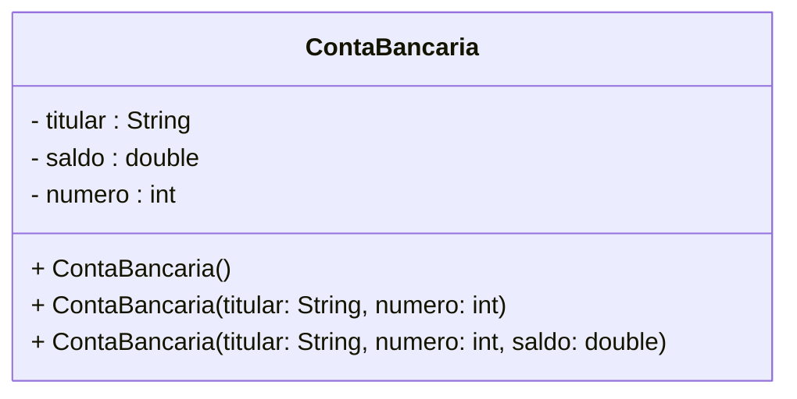
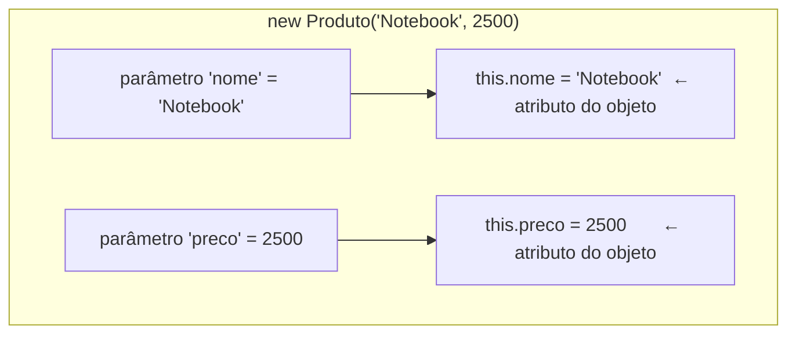
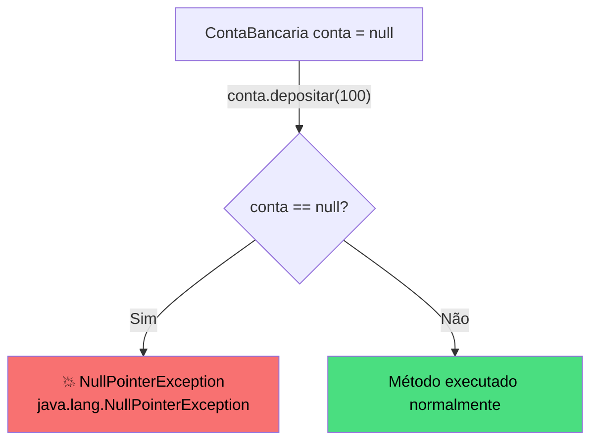
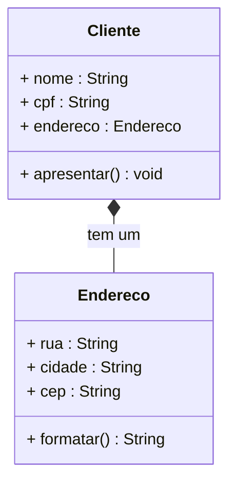
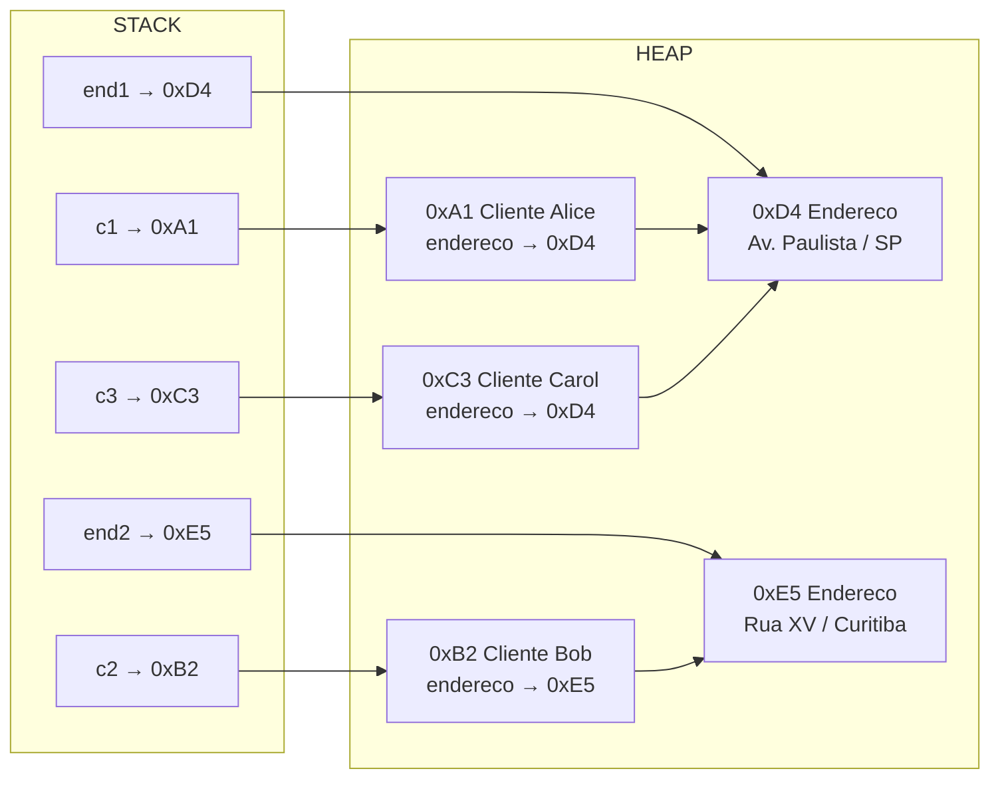

# Encontro 04 — Gerenciamento de Estado: Classes e Objetos II

> **Módulo 2 · 4 aulas · 50 XP**

---

## 1. O Ciclo de Vida de um Objeto

Todo objeto em Java passa pelas mesmas fases:


---

## 2. Construtores — inicializando objetos com garantia

Sem construtores, atributos ficam com valores-padrão (`null`, `0`, `false`), o que pode causar bugs silenciosos. O construtor garante que todo objeto nasce em estado válido.

```java
class ContaBancaria {
    String titular;
    double saldo;
    int numero;

    // ── Construtor PADRÃO (sem parâmetros) ────────────────────────────────
    // Chamado com: new ContaBancaria()
    ContaBancaria() {
        this.titular = "Sem nome";
        this.saldo   = 0.0;
        this.numero  = 0;
        System.out.println("Conta criada com valores padrão.");
    }

    // ── Construtor PARAMETRIZADO ───────────────────────────────────────────
    // Chamado com: new ContaBancaria("Alice", 101)
    ContaBancaria(String titular, int numero) {
        this.titular = titular; // 'this' resolve a ambiguidade de nomes
        this.numero  = numero;
        this.saldo   = 0.0;    // saldo sempre começa em zero
    }

    // ── Construtor com saldo inicial (sobrecarga de construtores) ──────────
    ContaBancaria(String titular, int numero, double saldoInicial) {
        this(titular, numero);  // chama o construtor acima — evita duplicação
        this.saldo = saldoInicial;
    }
}
```



---

> **Atenção:** O construtor padrão (sem parâmetros) é gerado automaticamente pelo Java **somente** quando você não define nenhum construtor. No momento em que você define qualquer construtor na sua classe, o construtor padrão **desaparece**. Isso causa um erro de compilação muito comum:

```java
class Produto {
    String nome;
    double preco;

    // Você definiu este construtor...
    Produto(String nome, double preco) {
        this.nome  = nome;
        this.preco = preco;
    }
}

// Agora isto FALHA — o construtor padrão não existe mais:
Produto p = new Produto(); // ERRO: constructor Produto() is undefined

// Solução: defina explicitamente o construtor sem parâmetros se precisar dele:
Produto() {
    this("Sem nome", 0.0); // delega para o construtor completo
}
```

---

## 3. A palavra-chave `this` — resolvendo ambiguidade

`this` é uma referência ao **objeto atual** — aquele que está executando o método ou construtor. Tem dois usos principais:

```java
class Produto {
    String nome;
    double preco;

    // USO 1: distinguir parâmetro do atributo com mesmo nome
    Produto(String nome, double preco) {
        this.nome  = nome;  // this.nome = atributo | nome = parâmetro
        this.preco = preco;
    }

    // USO 2: chamar outro construtor da mesma classe (deve ser a 1ª linha)
    Produto(String nome) {
        this(nome, 0.0); // delega para o construtor acima
    }

    // USO 3: passar o próprio objeto como argumento
    void registrar(Registro r) {
        r.registrar(this); // passa o objeto atual
    }
}
```



---

## 4. O perigo do `null` — NullPointerException

`null` significa "a referência não aponta para nenhum objeto". Tentar chamar um método em `null` lança `NullPointerException` — um dos erros mais comuns em Java.

```java
public class DemoNull {
    public static void main(String[] args) {
        ContaBancaria conta = null; // referência existe, mas não aponta para nada

        // conta.depositar(100); // ← NullPointerException aqui!
        //                            equivale a chamar método no "nada"

        // Proteção: verificar antes de usar
        if (conta != null) {
            conta.depositar(100);
        }

        // Com inicialização correta, nunca há NPE
        ContaBancaria contaValida = new ContaBancaria("Alice", 101);
        contaValida.depositar(500); // seguro
    }
}
```



---

## 5. Objetos como atributos — Composição

Quando um objeto contém outro objeto como atributo, chamamos isso de **composição** (relação TEM-UM).

```java
class Endereco {
    String rua;
    String cidade;
    String cep;

    Endereco(String rua, String cidade, String cep) {
        this.rua    = rua;
        this.cidade = cidade;
        this.cep    = cep;
    }

    String formatar() {
        return rua + " — " + cidade + " | CEP: " + cep;
    }
}

class Cliente {
    String nome;
    String cpf;
    Endereco endereco; // TEM-UM Endereco

    Cliente(String nome, String cpf, Endereco endereco) {
        this.nome     = nome;
        this.cpf      = cpf;
        this.endereco = endereco;
    }

    void apresentar() {
        System.out.println("Cliente: " + nome);
        System.out.println("CPF: " + cpf);
        System.out.println("Endereço: " + endereco.formatar()); // passagem de mensagem
    }
}
```



---

## 6. Rastreando referências no Heap

```java
public class RastreioReferencias {
    public static void main(String[] args) {
        Endereco end1 = new Endereco("Av. Paulista", "São Paulo", "01310-100");
        Endereco end2 = new Endereco("Rua XV de Novembro", "Curitiba", "80020-310");

        Cliente c1 = new Cliente("Alice", "111.111.111-11", end1);
        Cliente c2 = new Cliente("Bob",   "222.222.222-22", end2);

        // Dois clientes compartilhando o MESMO endereço (cuidado!)
        Cliente c3 = new Cliente("Carol", "333.333.333-33", end1);

        c1.apresentar();
        c2.apresentar();
        c3.apresentar(); // Carol também usa end1!

        // Modificar end1 afeta TANTO c1 quanto c3
        end1.cidade = "Guarulhos";
        System.out.println("\nApós modificar end1:");
        c1.apresentar(); // cidade agora é Guarulhos
        c3.apresentar(); // também afetado!
    }
}
```



---

## 7. Exemplo completo — Sistema de Pedidos

```java
// Representa um item em um pedido
class ItemPedido {
    String produto;
    double precoUnitario;
    int quantidade;

    ItemPedido(String produto, double precoUnitario, int quantidade) {
        this.produto        = produto;
        this.precoUnitario  = precoUnitario;
        this.quantidade     = quantidade;
    }

    double calcularSubtotal() {
        return precoUnitario * quantidade;
    }
}

// Representa um pedido completo
class Pedido {
    int numero;
    String cliente;
    ItemPedido[] itens;
    int totalItens;

    Pedido(int numero, String cliente, int capacidade) {
        this.numero     = numero;
        this.cliente    = cliente;
        this.itens      = new ItemPedido[capacidade]; // array de objetos
        this.totalItens = 0;
    }

    void adicionarItem(ItemPedido item) {
        if (totalItens < itens.length) {
            itens[totalItens] = item;
            totalItens++;
        }
    }

    double calcularTotal() {
        double total = 0;
        for (int i = 0; i < totalItens; i++) {
            total += itens[i].calcularSubtotal();
        }
        return total;
    }

    void imprimir() {
        System.out.println("=== PEDIDO #" + numero + " — " + cliente + " ===");
        for (int i = 0; i < totalItens; i++) {
            ItemPedido it = itens[i];
            System.out.printf("  %-20s %dx R$ %.2f = R$ %.2f%n",
                it.produto, it.quantidade, it.precoUnitario, it.calcularSubtotal());
        }
        System.out.printf("  TOTAL: R$ %.2f%n", calcularTotal());
    }
}

public class SistemaPedidos {
    public static void main(String[] args) {
        // Criando itens
        ItemPedido notebook  = new ItemPedido("Notebook Dell",   3500.0, 1);
        ItemPedido mouse     = new ItemPedido("Mouse Wireless",    89.0, 2);
        ItemPedido headphone = new ItemPedido("Headphone BT",    299.0, 1);

        // Criando pedido e adicionando itens
        Pedido pedido = new Pedido(1001, "Alice Silva", 10);
        pedido.adicionarItem(notebook);
        pedido.adicionarItem(mouse);
        pedido.adicionarItem(headphone);

        pedido.imprimir();
    }
}
```

---

## Exercícios Práticos

---

### Exercício 1 — Fácil · 25 XP
**Construtor Obrigatório**

Crie a classe `Funcionario` com os atributos `nome` (String), `cargo` (String) e `salario` (double). Implemente **três construtores sobrecarregados**:
1. `Funcionario(String nome)` — cargo = "Sem cargo", salário = 0
2. `Funcionario(String nome, String cargo)` — salário = 1412 (salário mínimo)
3. `Funcionario(String nome, String cargo, double salario)` — completo

Use `this(...)` para evitar duplicação de código.

```java
class Funcionario {
    String nome;
    String cargo;
    double salario;

    Funcionario(String nome) {
        // SEU CÓDIGO AQUI — use this(...)
    }

    Funcionario(String nome, String cargo) {
        // SEU CÓDIGO AQUI — use this(...)
    }

    Funcionario(String nome, String cargo, double salario) {
        // SEU CÓDIGO AQUI
    }

    void exibir() {
        System.out.printf("[%s] %s — R$ %.2f%n", cargo, nome, salario);
    }
}
```

---

### Exercício 2 — Fácil · 25 XP
**Preveja a saída**

Antes de compilar, escreva o que cada `println` vai imprimir e explique o papel do `this` em cada contexto:

```java
class Contador {
    int valor;

    Contador() { this(0); }
    Contador(int inicial) { this.valor = inicial; }

    void incrementar(int valor) {
        this.valor = this.valor + valor; // qual 'this.valor' e qual 'valor'?
    }

    Contador somar(Contador outro) {
        return new Contador(this.valor + outro.valor);
    }
}

public class TesteContador {
    public static void main(String[] args) {
        Contador a = new Contador();
        Contador b = new Contador(10);
        a.incrementar(5);
        System.out.println(a.valor);      // (1) ?
        System.out.println(b.valor);      // (2) ?
        Contador c = a.somar(b);
        System.out.println(c.valor);      // (3) ?
        System.out.println(a.valor);      // (4) ?
    }
}
```

---

### Exercício 3 — Médio · 25 XP
**Composição em Prática**

Modele e implemente um sistema de `Turma` que contém alunos. Uma `Turma` tem código, disciplina e um vetor de `Aluno[]`. Um `Aluno` tem matrícula, nome e notas (3 bimestres).

Implemente na `Turma`:
- `matricular(Aluno a)` — adiciona ao vetor
- `calcularMediaTurma()` — média de todas as médias dos alunos
- `imprimirBoletim()` — lista todos com suas médias e situação

---

### Exercício 4 — Médio · 25 XP
**Referências Compartilhadas**

Crie a classe `ConfiguracaoSistema` com atributos `tema` (String) e `idioma` (String). Crie dois objetos `Modulo` que compartilhem a mesma configuração. Mostre que alterar a configuração afeta ambos os módulos simultaneamente. Depois explique quando isso é desejável e quando é um bug.

---

### Exercício 5 — Difícil · 25 XP
**Sistema de Estacionamento**

Crie as classes `Veiculo` (placa, modelo, tipo: "carro"/"moto"), `Vaga` (numero, tipo: "normal"/"moto", ocupada, veiculo) e `Estacionamento` (nome, vagas[]).

Implemente:
- `Vaga.ocupar(Veiculo v)` — só ocupa se a vaga for do tipo certo e estiver livre
- `Vaga.liberar()` — libera a vaga
- `Estacionamento.entrar(Veiculo v)` — encontra vaga compatível e ocupa
- `Estacionamento.sair(String placa)` — libera a vaga do veículo
- `Estacionamento.status()` — imprime todas as vagas com estado

---

### Exercício 6 — Troubleshooting · 25 XP
**Diagnóstico: Construtores e `this` Quebrados**

O código abaixo contém **3 erros** relacionados a construtores e uso de `this`. Identifique cada um, explique o que vai acontecer e escreva a versão corrigida.

```java
public class Produto {
    private String nome;
    private double preco;
    private int estoque;

    // Erro 1: this() não é a primeira instrução do construtor
    Produto(String nome) {
        this.nome = nome;
        this(nome, 0.0, 0);   // tenta delegar — mas this() deve vir PRIMEIRO
    }

    Produto(String nome, double preco, int estoque) {
        // Erro 2: parâmetros com mesmo nome do atributo, mas sem 'this.' — atribui a si mesmo
        nome   = nome;
        preco  = preco;
        estoque = estoque;
    }

    // Erro 3: o método abaixo tenta chamar o construtor como método comum
    void reinicializar() {
        Produto(this.nome, 0.0, 0);   // construtores não podem ser chamados assim
    }

    void exibir() {
        System.out.printf("%s | R$ %.2f | Estoque: %d%n", nome, preco, estoque);
    }

    public static void main(String[] args) {
        Produto p = new Produto("Caneta", 2.50, 100);
        p.exibir();
        p.reinicializar();
        p.exibir();
    }
}
```

> **Dicas:** (1) `this()` deve ser a **primeira** linha do construtor, sem exceção. (2) `nome = nome` atribui o parâmetro a ele mesmo — use `this.nome = nome`. (3) Construtores não são métodos chamáveis — para resetar estado, crie um método regular como `resetarEstoque()`.
