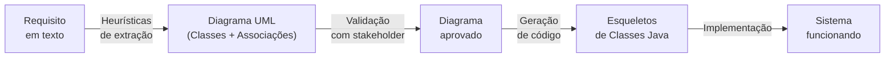
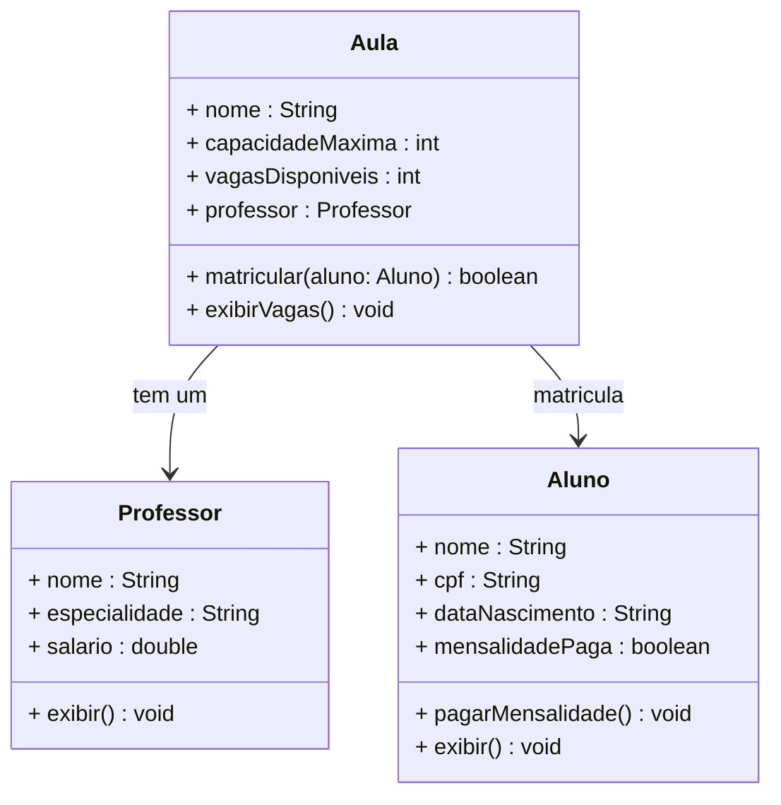
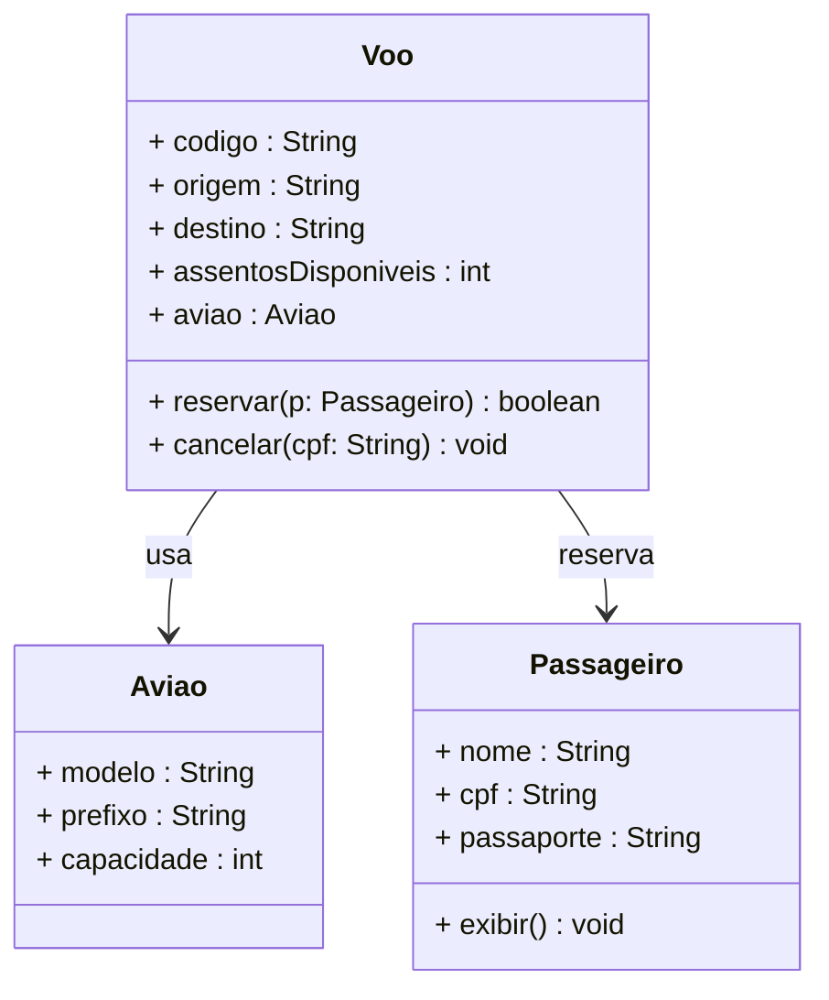
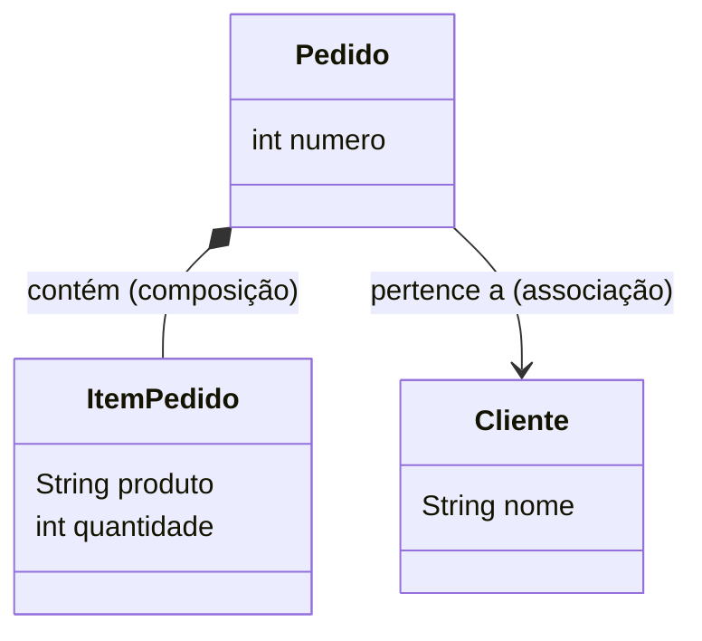
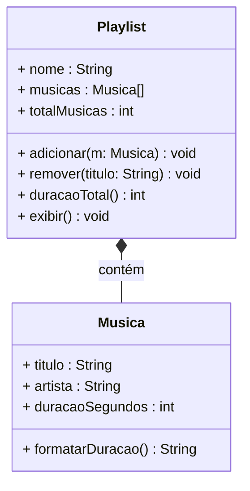
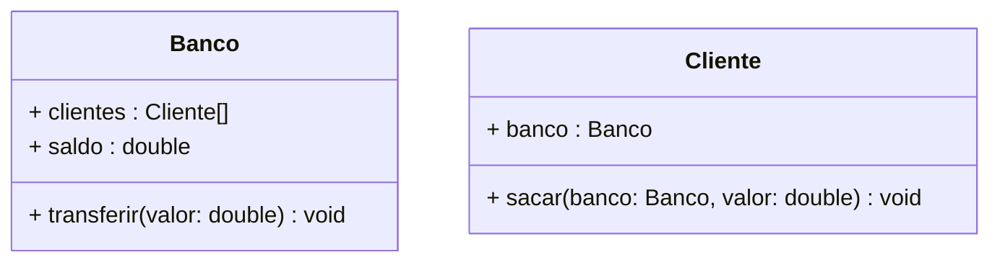

# Encontro 05 — Engenharia de Requisitos e Modelagem

> **Módulo 2 · 4 aulas · 50 XP**

---

## 1. Da linguagem natural ao diagrama

Um sistema nasce de uma **especificação textual** — um requisito em linguagem natural. A habilidade de extrair estrutura (classes, atributos, métodos) a partir de texto é fundamental para qualquer desenvolvedor.

**O processo completo:**



---

## 2. Heurísticas de extração

### Regra dos Substantivos → Classes e Atributos

> Sublinhe todos os **substantivos** do texto. Substantivos que representam conceitos do negócio com múltiplas instâncias = candidatos a **Classes**. Substantivos que descrevem características de outro conceito = candidatos a **Atributos**.

### Regra dos Verbos → Métodos

> Sublinhe todos os **verbos** associados a um substantivo-classe. Ações que o próprio conceito executa = candidatos a **Métodos**.

---

## 3. Exemplo guiado — Sistema de Academia

**Requisito:**
> *"A academia cadastra alunos, cada um com nome, CPF e data de nascimento. O aluno paga uma mensalidade mensal e pode se matricular em aulas. Cada aula tem um nome, um professor responsável e uma capacidade máxima. O professor tem nome, especialidade e salário. Quando um aluno se matricula em uma aula, a vaga disponível na aula diminui."*

### Passo 1 — Identifique os substantivos

| Substantivo | Candidato a... |
|-------------|----------------|
| academia | (contexto do sistema — não vira classe) |
| **aluno** | **Classe** |
| nome, CPF, data de nascimento | Atributos de Aluno |
| mensalidade | Atributo de Aluno |
| **aula** | **Classe** |
| nome da aula, capacidade | Atributos de Aula |
| **professor** | **Classe** |
| especialidade, salário | Atributos de Professor |

### Passo 2 — Identifique os verbos

| Verbo | Associado a... | Método |
|-------|---------------|--------|
| pagar mensalidade | Aluno | `pagarMensalidade()` |
| matricular-se | Aluno → Aula | `Aula.matricular(Aluno)` |
| diminuir vaga | Aula | implícito em `matricular` |

### Passo 3 — Diagrama de Classes



### Passo 4 — Esqueleto de código gerado a partir do diagrama

```java
class Professor {
    String nome;
    String especialidade;
    double salario;

    Professor(String nome, String especialidade, double salario) {
        this.nome          = nome;
        this.especialidade = especialidade;
        this.salario       = salario;
    }

    void exibir() {
        System.out.printf("[Prof. %s | %s | R$ %.2f]%n", nome, especialidade, salario);
    }
}

class Aluno {
    String nome;
    String cpf;
    boolean mensalidadePaga;

    Aluno(String nome, String cpf) {
        this.nome           = nome;
        this.cpf            = cpf;
        this.mensalidadePaga = false;
    }

    void pagarMensalidade() {
        this.mensalidadePaga = true;
        System.out.println(nome + " pagou a mensalidade.");
    }

    void exibir() {
        String status = mensalidadePaga ? "Em dia" : "Pendente";
        System.out.printf("[Aluno: %s | CPF: %s | Mensalidade: %s]%n", nome, cpf, status);
    }
}

class Aula {
    String nome;
    int capacidadeMaxima;
    int vagasDisponiveis;
    Professor professor;

    Aula(String nome, int capacidade, Professor professor) {
        this.nome              = nome;
        this.capacidadeMaxima  = capacidade;
        this.vagasDisponiveis  = capacidade; // começa com todas as vagas livres
        this.professor         = professor;
    }

    boolean matricular(Aluno aluno) {
        if (vagasDisponiveis == 0) {
            System.out.println("Aula " + nome + " está lotada!");
            return false;
        }
        if (!aluno.mensalidadePaga) {
            System.out.println(aluno.nome + " não pode matricular: mensalidade pendente.");
            return false;
        }
        vagasDisponiveis--;
        System.out.println(aluno.nome + " matriculado em " + nome + ". Vagas: " + vagasDisponiveis);
        return true;
    }

    void exibirVagas() {
        System.out.printf("[Aula: %s | Prof: %s | Vagas: %d/%d]%n",
            nome, professor.nome, vagasDisponiveis, capacidadeMaxima);
    }
}

public class SistemaAcademia {
    public static void main(String[] args) {
        Professor prof1 = new Professor("João Silva", "Musculação", 3500.0);
        Professor prof2 = new Professor("Maria Costa", "Pilates", 2800.0);

        Aula musculacao = new Aula("Musculação Avançada", 30, prof1);
        Aula pilates    = new Aula("Pilates Iniciante", 10, prof2);

        Aluno alice = new Aluno("Alice", "111.111.111-11");
        Aluno bob   = new Aluno("Bob",   "222.222.222-22");
        Aluno carol = new Aluno("Carol", "333.333.333-33");

        // Bob não pagou — não pode matricular
        musculacao.matricular(bob);

        alice.pagarMensalidade();
        carol.pagarMensalidade();

        musculacao.matricular(alice);
        musculacao.matricular(carol);
        pilates.matricular(alice);

        System.out.println();
        musculacao.exibirVagas();
        pilates.exibirVagas();
    }
}
```

---

## 4. Engenharia Reversa — do código para o diagrama

A habilidade inversa também é essencial: dado um código legado, gerar o diagrama UML.

**Código legado:**
```java
class Voo {
    String codigo;
    String origem;
    String destino;
    int assentosDisponiveis;
    Aviao aviao;

    Voo(String codigo, String origem, String destino, Aviao aviao) { ... }
    boolean reservar(Passageiro p) { ... }
    void cancelar(String cpfPassageiro) { ... }
}

class Passageiro {
    String nome;
    String cpf;
    String passaporte;

    Passageiro(String nome, String cpf) { ... }
    void exibir() { ... }
}

class Aviao {
    String modelo;
    String prefixo;
    int capacidade;

    Aviao(String modelo, String prefixo, int capacidade) { ... }
}
```

**Diagrama extraído:**


---

## 5. Identificando Associações

| Tipo de associação | Descrição | Exemplo |
|-------------------|-----------|---------|
| **Associação simples** (`→`) | A usa B | Pedido → Cliente |
| **Composição** (`*--`) | A contém B, B não existe sem A | Pedido `*--` ItemPedido |
| **Agregação** (`o--`) | A contém B, B pode existir sem A | Turma `o--` Aluno |



---

## Exercícios Práticos

---

### Exercício 1 — Fácil · 25 XP
**Extração de Requisito Simples**

Extraia classes, atributos e métodos do requisito abaixo e desenhe o Diagrama de Classes:

> *"O sistema gerencia uma frota de veículos. Cada veículo tem placa, modelo, ano e quilometragem. A empresa pode registrar abastecimentos para o veículo (data, litros, valor). O veículo pode ter seu histórico de abastecimentos consultado, retornando o custo total gasto."*

---

### Exercício 2 — Fácil · 25 XP
**Engenharia Reversa**

Dado o código abaixo, produza o Diagrama de Classes UML com as associações corretas:

```java
class Hospital {
    String nome;
    String cnpj;
    Medico[] medicos;
    Paciente[] pacientes;
    void internar(Paciente p) { ... }
    void alta(String cpf) { ... }
}
class Medico {
    String crm;
    String nome;
    String especialidade;
    void prescrever(Paciente p, String medicamento) { ... }
}
class Paciente {
    String nome;
    String cpf;
    boolean internado;
    Medico medicoResponsavel;
    void exibir() { ... }
}
```

---

### Exercício 3 — Médio · 25 XP
**Diagrama → Código**

Implemente em Java exatamente o sistema descrito pelo diagrama abaixo:



`formatarDuracao()` deve retornar no formato `"mm:ss"`. `duracaoTotal()` retorna segundos. Teste com ao menos 4 músicas.

---

### Exercício 4 — Médio · 25 XP
**Identificação de Erros de Modelagem**

Analise o diagrama e o código abaixo. Encontre e explique **3 erros de modelagem**. Corrija o código após a análise.



```java
class Banco {
    Cliente[] clientes;
    double saldo; // atributo questionável

    static void transferir(double valor) { // método questionável
        saldo -= valor; // erro de compilação
    }
}
class Cliente {
    Banco banco;
    void sacar(Banco banco, double valor) { // parâmetro redundante?
        this.banco.saldo -= valor; // acesso direto ao saldo
    }
}
```

---

### Exercício 5 — Difícil · 25 XP
**Modelagem Completa**

Modele e implemente do zero, partindo do requisito:

> *"Uma loja virtual tem um catálogo de produtos, cada um com código, nome, preço e quantidade em estoque. Um cliente pode criar um carrinho de compras, adicionar e remover produtos (respeitando o estoque), e finalizar a compra — o que gera um pedido com número sequencial, cliente, lista de itens, subtotais e total. Ao finalizar, o estoque de cada produto é atualizado."*

**Entregável:** Diagrama de Classes + implementação completa em Java.

---

### Exercício 6 — Troubleshooting · 25 XP
**Diagnóstico: Modelagem e Associações Incorretas**

O diagrama e o código abaixo têm **3 erros de modelagem/implementação**. Um mistura composição com herança incorretamente, um expõe objeto interno diretamente, e um cria dependência circular entre classes. Identifique e proponha a correção.

```java
// Erro 1: Pedido HERDA de Cliente — mas Pedido NÃO É-UM Cliente
class Cliente {
    String nome;
    String cpf;
}

class Pedido extends Cliente {   // ERRADO: deveria ser associação, não herança
    double valor;
    String descricao;
}

// Erro 2: Loja expõe o ArrayList interno diretamente (viola encapsulamento)
class Loja {
    private ArrayList<Pedido> pedidos = new ArrayList<>();

    public ArrayList<Pedido> getPedidos() {
        return pedidos;   // quem receber pode adicionar/remover sem controle!
    }
}

// Erro 3: dependência circular — Pedido tem Loja e Loja tem Pedido
class PedidoComLoja {
    Loja loja;           // Pedido conhece Loja...
}
// ... e Loja já conhece Pedido (acima).
// Isso cria um ciclo que torna as classes impossíveis de instanciar
// separadamente e dificulta testes.
```

> **Dicas:** (1) Pergunte "Pedido É-UM Cliente?" — se não, use atributo `private Cliente cliente` (composição/associação). (2) Em vez de retornar a coleção interna, retorne uma cópia ou exponha métodos específicos (`adicionarPedido`, `listarPedidos`). (3) Dependências circulares indicam que uma das classes precisa de um intermediário ou que uma está fazendo demais.
