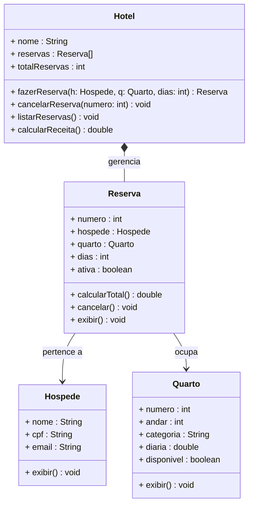

# Encontro 06 — Trabalho Prático 1: Sistema de Reservas de Hotel

> **Módulo 2 · 4 aulas · 150 XP · Avaliação**

---

## Enunciado do Trabalho

Você recebeu a seguinte especificação de negócio:

> *"O HotelPOO precisa de um sistema para gerenciar suas reservas. O hotel possui quartos de diferentes categorias (Standard, Superior e Luxo), cada um com número, andar e diária. Um hóspede tem nome, CPF e e-mail. Uma reserva associa um hóspede a um quarto por um período determinado (check-in e check-out em dias), calcula o valor total e pode ser cancelada. O sistema deve conseguir listar todas as reservas ativas e calcular a receita total do período."*

---

## Etapa 1 — Modelagem UML (obrigatória antes de codificar)

### 1.1 Extração dos candidatos

**Substantivos → Classes/Atributos:**

| Substantivo | Papel |
|-------------|-------|
| HotelPOO | Contexto do sistema |
| **quarto** | Classe |
| número, andar, diária, categoria | Atributos de Quarto |
| **hóspede** | Classe |
| nome, CPF, e-mail | Atributos de Hóspede |
| **reserva** | Classe |
| check-in, check-out, valor total | Atributos de Reserva |

**Verbos → Métodos:**

| Verbo | Método |
|-------|--------|
| calcular valor total | `Reserva.calcularTotal()` |
| cancelar reserva | `Reserva.cancelar()` |
| listar reservas ativas | `Hotel.listarReservas()` |
| calcular receita | `Hotel.calcularReceita()` |

### 1.2 Diagrama de Classes esperado



---

## Etapa 2 — Implementação de Referência

```java
// ──────────────────────────────────────────────────────
// Classe Quarto
// ──────────────────────────────────────────────────────
class Quarto {
    int numero;
    int andar;
    String categoria; // "Standard", "Superior", "Luxo"
    double diaria;
    boolean disponivel;

    Quarto(int numero, int andar, String categoria, double diaria) {
        this.numero     = numero;
        this.andar      = andar;
        this.categoria  = categoria;
        this.diaria     = diaria;
        this.disponivel = true;
    }

    void exibir() {
        String status = disponivel ? "Disponível" : "Ocupado";
        System.out.printf("[Quarto %03d | %s | Andar %d | R$ %.2f/dia | %s]%n",
            numero, categoria, andar, diaria, status);
    }
}

// ──────────────────────────────────────────────────────
// Classe Hospede
// ──────────────────────────────────────────────────────
class Hospede {
    String nome;
    String cpf;
    String email;

    Hospede(String nome, String cpf, String email) {
        this.nome  = nome;
        this.cpf   = cpf;
        this.email = email;
    }

    void exibir() {
        System.out.printf("[Hóspede: %s | CPF: %s | %s]%n", nome, cpf, email);
    }
}

// ──────────────────────────────────────────────────────
// Classe Reserva
// ──────────────────────────────────────────────────────
class Reserva {
    static int contadorNumero = 1; // gerador de número único

    int numero;
    Hospede hospede;
    Quarto quarto;
    int dias;
    boolean ativa;

    Reserva(Hospede hospede, Quarto quarto, int dias) {
        this.numero  = contadorNumero++;
        this.hospede = hospede;
        this.quarto  = quarto;
        this.dias    = dias;
        this.ativa   = true;
        quarto.disponivel = false; // ocupa o quarto ao criar a reserva
    }

    double calcularTotal() {
        return quarto.diaria * dias;
    }

    void cancelar() {
        if (!ativa) {
            System.out.println("Reserva #" + numero + " já está cancelada.");
            return;
        }
        ativa = false;
        quarto.disponivel = true; // libera o quarto
        System.out.println("Reserva #" + numero + " cancelada. Quarto " + quarto.numero + " liberado.");
    }

    void exibir() {
        String status = ativa ? "ATIVA" : "CANCELADA";
        System.out.println("┌── Reserva #" + numero + " [" + status + "] ──────────────────────");
        System.out.println("│ Hóspede: " + hospede.nome + " | CPF: " + hospede.cpf);
        System.out.printf( "│ Quarto: %03d (%s) | %d dias | Total: R$ %.2f%n",
            quarto.numero, quarto.categoria, dias, calcularTotal());
        System.out.println("└─────────────────────────────────────────────────");
    }
}

// ──────────────────────────────────────────────────────
// Classe Hotel
// ──────────────────────────────────────────────────────
class Hotel {
    String nome;
    Reserva[] reservas;
    int totalReservas;

    Hotel(String nome, int capacidadeReservas) {
        this.nome           = nome;
        this.reservas       = new Reserva[capacidadeReservas];
        this.totalReservas  = 0;
    }

    Reserva fazerReserva(Hospede hospede, Quarto quarto, int dias) {
        if (!quarto.disponivel) {
            System.out.println("Quarto " + quarto.numero + " não está disponível!");
            return null;
        }
        if (dias <= 0) {
            System.out.println("Número de dias inválido.");
            return null;
        }
        Reserva r = new Reserva(hospede, quarto, dias);
        reservas[totalReservas++] = r;
        System.out.println("Reserva #" + r.numero + " criada para " + hospede.nome + ".");
        return r;
    }

    void cancelarReserva(int numero) {
        for (int i = 0; i < totalReservas; i++) {
            if (reservas[i].numero == numero) {
                reservas[i].cancelar();
                return;
            }
        }
        System.out.println("Reserva #" + numero + " não encontrada.");
    }

    void listarReservas() {
        System.out.println("\n╔═══ RESERVAS DO " + nome.toUpperCase() + " ═══╗");
        int ativas = 0;
        for (int i = 0; i < totalReservas; i++) {
            if (reservas[i].ativa) {
                reservas[i].exibir();
                ativas++;
            }
        }
        if (ativas == 0) System.out.println("Nenhuma reserva ativa.");
        System.out.println("╚══════════════════════════════╝\n");
    }

    double calcularReceita() {
        double total = 0;
        for (int i = 0; i < totalReservas; i++) {
            if (reservas[i].ativa) {
                total += reservas[i].calcularTotal();
            }
        }
        return total;
    }
}

// ──────────────────────────────────────────────────────
// Classe de Teste (Main)
// ──────────────────────────────────────────────────────
public class HotelPOO {
    public static void main(String[] args) {
        Hotel hotel = new Hotel("HotelPOO", 50);

        // Cadastro de quartos
        Quarto q101 = new Quarto(101, 1, "Standard", 180.0);
        Quarto q201 = new Quarto(201, 2, "Superior", 280.0);
        Quarto q301 = new Quarto(301, 3, "Luxo",     450.0);

        // Cadastro de hóspedes
        Hospede alice = new Hospede("Alice Silva",   "111.111.111-11", "alice@email.com");
        Hospede bob   = new Hospede("Bob Marley",    "222.222.222-22", "bob@email.com");
        Hospede carol = new Hospede("Carol Danvers", "333.333.333-33", "carol@email.com");

        // Fazendo reservas
        Reserva r1 = hotel.fazerReserva(alice, q101, 3);
        Reserva r2 = hotel.fazerReserva(bob,   q301, 5);
        Reserva r3 = hotel.fazerReserva(carol, q201, 2);

        // Tentando reservar quarto já ocupado
        hotel.fazerReserva(alice, q101, 1); // deve falhar

        // Listando reservas
        hotel.listarReservas();

        // Cancelando uma reserva
        hotel.cancelarReserva(r1.numero);

        // Agora q101 está disponível de novo
        Reserva r4 = hotel.fazerReserva(carol, q101, 1);

        // Estado final
        hotel.listarReservas();
        System.out.printf("Receita total das reservas ativas: R$ %.2f%n", hotel.calcularReceita());

        // Exibindo estado dos quartos
        System.out.println("\n=== STATUS DOS QUARTOS ===");
        q101.exibir();
        q201.exibir();
        q301.exibir();
    }
}
```

---

## Critérios de Avaliação

| Critério | Pontuação |
|----------|-----------|
| Diagrama de Classes correto e completo | 25 pts |
| Precisão diagrama ↔ código | 20 pts |
| Construtores parametrizados em todas as classes | 15 pts |
| Regras de negócio implementadas corretamente | 20 pts |
| Código limpo, organizado e sem duplicação | 10 pts |
| Teste no `main` cobrindo todos os cenários | 10 pts |

**Total: 100 pontos**

---

## Extensão Desafio (bônus)

Implemente as seguintes melhorias no seu sistema:

1. **Busca de quarto disponível** — dado uma categoria, retorna o primeiro quarto disponível nessa categoria
2. **Histórico do hóspede** — dado um CPF, lista todas as reservas (ativas e canceladas) daquele hóspede
3. **Relatório por categoria** — imprime quantos quartos de cada categoria estão ocupados e quantos estão livres

---

### Troubleshooting de Revisão — 25 XP
**Diagnóstico: Bugs no Sistema de Hotel**

Antes de submeter seu TP1, um colega revisou o código e encontrou **3 bugs críticos**. Analise cada trecho, identifique o problema e escreva a correção.

**Bug 1 — Reserva criada sem verificar disponibilidade do quarto:**
```java
public void fazerReserva(Hospede hospede, Quarto quarto, String entrada, String saida) {
    Reserva r = new Reserva(hospede, quarto, entrada, saida);
    quarto.setOcupado(true);
    reservas[totalReservas++] = r;
    // BUG: e se o quarto já estiver ocupado?
}
```

**Bug 2 — Cancelamento sem restaurar o estado do quarto:**
```java
public void cancelarReserva(String codigo) {
    for (int i = 0; i < totalReservas; i++) {
        if (reservas[i].getCodigo().equals(codigo)) {
            reservas[i].setCancelada(true);
            // BUG: o quarto continua marcado como ocupado!
            return;
        }
    }
}
```

**Bug 3 — Cálculo de diárias com divisão inteira:**
```java
public double calcularTotal(String dataEntrada, String dataSaida) {
    // Simulação simplificada: diferença em dias
    int diarias = (int)(dataSaida.length() - dataEntrada.length()); // BUG: lógica errada
    return diarias * quarto.getPrecoDiaria();
}
```

> **Dicas:** (1) Sempre verifique pré-condições antes de executar operações — use `IllegalStateException` para estado inválido. (2) Cancelar uma reserva deve reverter todos os efeitos colaterais que a criação causou. (3) Nunca calcule datas pela diferença de `length()` de Strings — use uma lógica real de datas ou um campo inteiro `numeroDiarias` no construtor.
