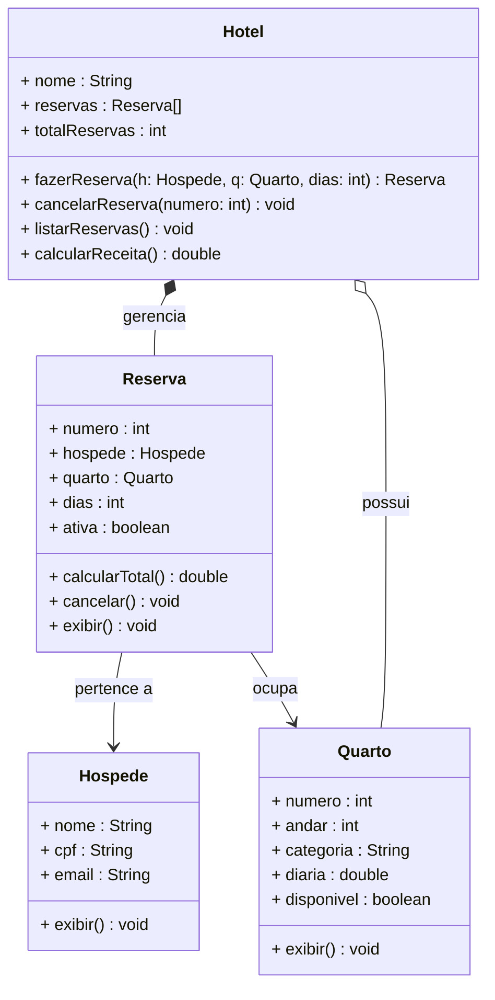

# Encontro 06 — Atividade Prática 1: Sistema de Reservas de Hotel

> **Módulo 2 · 4 aulas · 150 XP · Avaliação**

---

## Fase 0 — Planejamento com Story Points (10 min)

Antes de escrever uma linha de código, engenheiros de software **estimam o esforço** de cada tarefa. Isso é chamado de *planning poker* / *story points*. Não existe resposta certa — o objetivo é pensar sobre a complexidade antes de mergulhar.

**Preencha sua estimativa agora** (você vai comparar com a realidade no final):

```fill-table
COL1: Fase da Atividade
COL2: Minha Estimativa (1 / 2 / 3 / 5 / 8)
LEGEND: 1 = trivial, 2 = fácil, 3 = médio, 5 = complexo, 8 = muito complexo. Preencha ANTES de começar cada fase.
Analisar o enunciado e extrair classes | ___
Mapear as relações entre as classes | ___
Completar o diagrama UML | ___
Implementar a classe Quarto | ___
Implementar a classe Hospede | ___
Implementar a classe Reserva (com as regras de negócio) | ___
Implementar a classe Hotel (o orquestrador) | ___
Testar todos os cenários do main | ___
```

> **Dica:** Guarde suas estimativas — você vai usar esse número de novo na Fase 5.

---

## Enunciado da Atividade

Você recebeu a seguinte especificação de negócio:

> *"O HotelPOO precisa de um sistema para gerenciar suas reservas. O hotel possui quartos de diferentes categorias (Standard, Superior e Luxo), cada um com número, andar e diária. Um hóspede tem nome, CPF e e-mail. Uma reserva associa um hóspede a um quarto por um período determinado (check-in e check-out em dias), calcula o valor total e pode ser cancelada. O sistema deve conseguir listar todas as reservas ativas e calcular a receita total do período."*

---

## Etapa 1 — Modelagem UML

### 1.1 Extração dos candidatos

**Substantivos → Classes / Atributos**

A tabela abaixo lista os substantivos encontrados no enunciado. Preencha a coluna **Papel** para cada um.

```fill-table
COL1: Substantivo
COL2: Papel
LEGEND: Preencha o papel de cada substantivo. Use: "Classe", "Atributos de Quarto", "Atributos de Hóspede", "Atributos de Reserva" ou "Contexto do sistema".
HotelPOO | Contexto do sistema
quarto | Classe
número, andar, diária, categoria | Atributos de Quarto
hóspede | Classe
nome, CPF, e-mail | Atributos de Hóspede
reserva | Classe
check-in, check-out, valor total | Atributos de Reserva
```

**Verbos → Métodos**

A tabela abaixo lista as ações descritas no enunciado. Preencha a coluna **Método** com a assinatura Java correspondente.

```fill-table
COL1: Verbo (ação)
COL2: Método Java
LEGEND: Escreva o nome do método no formato NomeClasse.nomeMetodo(). Exemplo: "exibir quarto" → Quarto.exibir()
calcular valor total | Reserva.calcularTotal()
cancelar reserva | Reserva.cancelar()
listar reservas ativas | Hotel.listarReservas()
calcular receita | Hotel.calcularReceita()
```

---

### 1.2 Identifique as Relações entre Classes

As caixas abaixo mostram apenas os **nomes** das classes — atributos e métodos estão ocultos. Para cada par, identifique o tipo de relação e escreva o rótulo correto.

> **Dica:** Existem três tipos — **Associação** (`────→`), **Agregação** (`◇────→`) e **Composição** (`◆────→`). Composição e Agregação são relações **todo-parte**: a diferença é se as partes sobrevivem ao todo ou não.

```relationship-uml
CLASS:Hotel
CLASS:Reserva
CLASS:Hospede
CLASS:Quarto
REL:Hotel->Reserva:composition:gerencia
REL:Hotel->Quarto:aggregation:possui
REL:Reserva->Hospede:association:pertence a
REL:Reserva->Quarto:association:ocupa
```

---

### 1.3 Diagrama de Classes — preencha os campos em branco

Complete o diagrama abaixo com os nomes de classes, atributos e métodos que estão faltando.

```fill-uml
CLASS:Hotel
ATTR:nome : String
ATTR:___:reservas : Reserva[]
ATTR:totalReservas : int
METHOD:___:fazerReserva(h, q, dias) Reserva
METHOD:cancelarReserva(numero) void
METHOD:listarReservas() void
METHOD:___:calcularReceita() double

CLASS:___:Quarto
ATTR:numero : int
ATTR:andar : int
ATTR:categoria : String
ATTR:___:diaria : double
ATTR:disponivel : boolean
METHOD:exibir() void

CLASS:Hospede
ATTR:nome : String
ATTR:___:cpf : String
ATTR:email : String
METHOD:exibir() void

CLASS:___:Reserva
ATTR:numero : int
ATTR:hospede : Hospede
ATTR:quarto : Quarto
ATTR:___:dias : int
ATTR:ativa : boolean
METHOD:calcularTotal() double
METHOD:___:cancelar() void
METHOD:exibir() void
```

---

### 1.4 Diagrama de Classes — referência completa

<!-- gabarito-start -->

<!-- gabarito-end -->

---

## Etapa 2 — Rastreamento de Execução (antes de codificar!)

> **Atenção:** Esta etapa é feita **antes** da implementação. Você precisa rastrear o que o sistema **deveria** fazer quando corretamente implementado. Use os comentários `// TODO` do código da Etapa 3 para guiar seu raciocínio.

### 2.1 Trace a criação dos objetos e as reservas

```code-trace
KEY:hotel-reserva-trace
PRESET:diaria=150.0,dias=2,total=300.0
PRESET:diaria=180.0,dias=3,total=540.0
PRESET:diaria=200.0,dias=4,total=800.0
PRESET:diaria=250.0,dias=5,total=1250.0
SCENARIO:Considere o código do main (Etapa 3) com todos os TODOs corretamente implementados. Preencha os valores de cada variável/campo após cada instrução executada.
STEP:Quarto q101 = new Quarto(101, 1, "Standard", {diaria});
VAR:q101.numero:int:101
VAR:q101.diaria:double:{diaria}
VAR:q101.disponivel:boolean:true
STEP:Hotel hotel = new Hotel("HotelPOO", 50);
VAR:hotel.nome:String:HotelPOO
VAR:hotel.totalReservas:int:0
STEP:Hospede alice = new Hospede("Alice Silva", "111.111.111-11", "alice@email.com");
VAR:alice.nome:String:Alice Silva
VAR:alice.cpf:String:111.111.111-11
STEP:Reserva r1 = hotel.fazerReserva(alice, q101, {dias});
VAR:r1.numero:int:1
VAR:r1.ativa:boolean:true
VAR:r1.dias:int:{dias}
VAR:q101.disponivel:boolean:false
VAR:hotel.totalReservas:int:1
STEP:Reserva rX = hotel.fazerReserva(alice, q101, 1); // quarto já ocupado!
VAR:rX:Reserva:null
VAR:hotel.totalReservas:int:1
VAR:q101.disponivel:boolean:false
STEP:hotel.cancelarReserva(r1.numero);
VAR:r1.ativa:boolean:false
VAR:q101.disponivel:boolean:true
STEP:double total = r1.calcularTotal();
VAR:total:double:{total}
```

### 2.2 Preveja o comportamento em casos extremos

Para cada chamada abaixo, preencha **o que deveria acontecer** se a implementação estiver correta.

```fill-table
COL1: Chamada
COL2: Retorno / Efeito esperado
LEGEND: Descreva o comportamento em poucas palavras. Pense nas validações que os TODO comments pedem.
hotel.fazerReserva(alice, q101, 0) | retorna null + imprime aviso de dias inválido
hotel.fazerReserva(alice, q101, -5) | retorna null + imprime aviso de dias inválido
hotel.fazerReserva(alice, q101, 3) quando q101 já está ocupado | retorna null + imprime aviso de quarto indisponível
hotel.cancelarReserva(999) quando nenhuma reserva tem esse número | imprime aviso de reserva não encontrada
r1.cancelar() chamado duas vezes na mesma reserva | segunda chamada imprime aviso e retorna sem alterar
```

---

## Etapa 3 — Implementação de Referência

> **Dica:** Estude o código abaixo com atenção antes de escrever o seu. Os comentários `// TODO` marcam os trechos que você deve implementar por conta própria.

```java
// ──────────────────────────────────────────────────────
// Classe Quarto
// ──────────────────────────────────────────────────────
class Quarto {
    int numero;
    int andar;
    String categoria; // "Standard", "Superior", "Luxo"
    double diaria;
    boolean disponivel;

    Quarto(int numero, int andar, String categoria, double diaria) {
        this.numero     = numero;
        this.andar      = andar;
        this.categoria  = categoria;
        this.diaria     = diaria;
        this.disponivel = true;
    }

    void exibir() {
        // TODO: imprima número, categoria, andar, diária e status (Disponível/Ocupado)
        //       usando System.out.printf com formatação adequada
        throw new UnsupportedOperationException("implemente exibir()");
    }
}

// ──────────────────────────────────────────────────────
// Classe Hospede
// ──────────────────────────────────────────────────────
class Hospede {
    String nome;
    String cpf;
    String email;

    Hospede(String nome, String cpf, String email) {
        this.nome  = nome;
        this.cpf   = cpf;
        this.email = email;
    }

    void exibir() {
        // TODO: imprima nome, CPF e e-mail do hóspede
        throw new UnsupportedOperationException("implemente exibir()");
    }
}

// ──────────────────────────────────────────────────────
// Classe Reserva
// ──────────────────────────────────────────────────────
class Reserva {
    static int contadorNumero = 1;

    int numero;
    Hospede hospede;
    Quarto quarto;
    int dias;
    boolean ativa;

    Reserva(Hospede hospede, Quarto quarto, int dias) {
        this.numero  = contadorNumero++;
        this.hospede = hospede;
        this.quarto  = quarto;
        this.dias    = dias;
        this.ativa   = true;
        // TODO: marque o quarto como não disponível ao criar a reserva
    }

    double calcularTotal() {
        // TODO: retorne o valor total (diária do quarto × número de dias)
        throw new UnsupportedOperationException("implemente calcularTotal()");
    }

    void cancelar() {
        // TODO: verifique se a reserva já está cancelada (imprima aviso e retorne)
        //       caso contrário: marque como inativa e libere o quarto (disponivel = true)
        throw new UnsupportedOperationException("implemente cancelar()");
    }

    void exibir() {
        String status = ativa ? "ATIVA" : "CANCELADA";
        System.out.println("┌── Reserva #" + numero + " [" + status + "] ──────────────────────");
        System.out.println("│ Hóspede: " + hospede.nome + " | CPF: " + hospede.cpf);
        System.out.printf( "│ Quarto: %03d (%s) | %d dias | Total: R$ %.2f%n",
            quarto.numero, quarto.categoria, dias, calcularTotal());
        System.out.println("└─────────────────────────────────────────────────");
    }
}

// ──────────────────────────────────────────────────────
// Classe Hotel
// ──────────────────────────────────────────────────────
class Hotel {
    String nome;
    Reserva[] reservas;
    int totalReservas;

    Hotel(String nome, int capacidadeReservas) {
        this.nome          = nome;
        this.reservas      = new Reserva[capacidadeReservas];
        this.totalReservas = 0;
    }

    Reserva fazerReserva(Hospede hospede, Quarto quarto, int dias) {
        // TODO: valide se o quarto está disponível — imprima aviso e retorne null se não estiver
        // TODO: valide se dias > 0 — imprima aviso e retorne null se inválido
        // TODO: crie a Reserva, armazene no array e incremente totalReservas
        // TODO: imprima confirmação e retorne a reserva criada
        throw new UnsupportedOperationException("implemente fazerReserva()");
    }

    void cancelarReserva(int numero) {
        // TODO: percorra o array de reservas procurando pelo número informado
        //       se encontrar, chame cancelar(); se não encontrar, imprima aviso
        throw new UnsupportedOperationException("implemente cancelarReserva()");
    }

    void listarReservas() {
        System.out.println("\n╔═══ RESERVAS DO " + nome.toUpperCase() + " ═══╗");
        int ativas = 0;
        for (int i = 0; i < totalReservas; i++) {
            if (reservas[i].ativa) {
                reservas[i].exibir();
                ativas++;
            }
        }
        if (ativas == 0) System.out.println("Nenhuma reserva ativa.");
        System.out.println("╚══════════════════════════════╝\n");
    }

    double calcularReceita() {
        // TODO: some o total de todas as reservas ATIVAS e retorne o valor
        throw new UnsupportedOperationException("implemente calcularReceita()");
    }
}

// ──────────────────────────────────────────────────────
// Classe de Teste (Main)
// ──────────────────────────────────────────────────────
public class HotelPOO {
    public static void main(String[] args) {
        Hotel hotel = new Hotel("HotelPOO", 50);

        // Cadastro de quartos
        Quarto q101 = new Quarto(101, 1, "Standard", 180.0);
        Quarto q201 = new Quarto(201, 2, "Superior", 280.0);
        Quarto q301 = new Quarto(301, 3, "Luxo",     450.0);

        // Cadastro de hóspedes
        Hospede alice = new Hospede("Alice Silva",   "111.111.111-11", "alice@email.com");
        Hospede bob   = new Hospede("Bob Marley",    "222.222.222-22", "bob@email.com");
        Hospede carol = new Hospede("Carol Danvers", "333.333.333-33", "carol@email.com");

        // Fazendo reservas
        Reserva r1 = hotel.fazerReserva(alice, q101, 3);
        Reserva r2 = hotel.fazerReserva(bob,   q301, 5);
        Reserva r3 = hotel.fazerReserva(carol, q201, 2);

        // Tentando reservar quarto já ocupado (deve falhar)
        hotel.fazerReserva(alice, q101, 1);

        hotel.listarReservas();

        // Cancelando e re-reservando
        hotel.cancelarReserva(r1.numero);
        Reserva r4 = hotel.fazerReserva(carol, q101, 1);

        hotel.listarReservas();
        System.out.printf("Receita total das reservas ativas: R$ %.2f%n", hotel.calcularReceita());

        System.out.println("\n=== STATUS DOS QUARTOS ===");
        q101.exibir();
        q201.exibir();
        q301.exibir();
    }
}
```

---

## Etapa 4 — Diagnóstico de Bugs

Antes de submeter, um colega revisou o código e encontrou **3 bugs críticos**. Analise cada trecho, identifique o problema e escreva a correção.

**Bug 1 — Reserva criada sem verificar disponibilidade:**
```java
public void fazerReserva(Hospede hospede, Quarto quarto, String entrada, String saida) {
    Reserva r = new Reserva(hospede, quarto, entrada, saida);
    quarto.setOcupado(true);
    reservas[totalReservas++] = r;
    // BUG: e se o quarto já estiver ocupado?
}
```

**Bug 2 — Cancelamento sem restaurar o estado do quarto:**
```java
public void cancelarReserva(String codigo) {
    for (int i = 0; i < totalReservas; i++) {
        if (reservas[i].getCodigo().equals(codigo)) {
            reservas[i].setCancelada(true);
            // BUG: o quarto continua marcado como ocupado!
            return;
        }
    }
}
```

**Bug 3 — Cálculo de diárias com lógica errada:**
```java
public double calcularTotal(String dataEntrada, String dataSaida) {
    int diarias = (int)(dataSaida.length() - dataEntrada.length()); // BUG: lógica errada
    return diarias * quarto.getPrecoDiaria();
}
```

> **Dicas:** (1) Sempre verifique pré-condições antes de executar operações. (2) Cancelar uma reserva deve reverter todos os efeitos colaterais que a criação causou. (3) Nunca calcule datas pela diferença de `length()` de Strings.

Para cada bug, preencha:

```fill-table
COL1: Bug
COL2: Qual é o problema exato?
LEGEND: Descreva em uma frase o que está errado e por que causa falha em runtime ou em produção.
Bug 1 | Não valida se o quarto está disponível antes de criar a reserva — aceita reservas duplicadas
Bug 2 | Não restaura quarto.disponivel = true ao cancelar — quarto fica permanentemente bloqueado
Bug 3 | Subtrai o comprimento das strings de data (número de caracteres) em vez de calcular a diferença real de dias
```

---

## Etapa 5 — Retrospectiva e Auto-avaliação

### 5.1 Story Points Real vs Estimado

Agora que você terminou, volte às suas estimativas da Fase 0 e compare:

```fill-table
COL1: Fase da Atividade
COL2: Onde foi diferente da estimativa? (Se bateu, escreva "ok")
LEGEND: Não existe certo ou errado aqui — o objetivo é desenvolver sua intuição de estimativa.
Analisar o enunciado e extrair classes | ___
Mapear as relações entre as classes | ___
Completar o diagrama UML | ___
Implementar a classe Quarto | ___
Implementar a classe Hospede | ___
Implementar a classe Reserva | ___
Implementar a classe Hotel | ___
Testar todos os cenários do main | ___
```

### 5.2 Auto-avaliação Técnica

Avalie seu próprio trabalho com honestidade (0 = não fiz, 5 = fiz com dificuldades, 10 = fiz com segurança):

```fill-table
COL1: Critério Técnico
COL2: Minha nota (0-10)
LEGEND: Seja honesto — a auto-avaliação é para você aprender, não para o professor te julgar.
Diagrama UML correto e completo | ___
Relações entre classes identificadas corretamente | ___
Rastreamento de execução (Etapa 2) completo | ___
calcularTotal() implementado corretamente | ___
cancelar() com verificação de estado duplicado | ___
fazerReserva() valida disponibilidade E dias > 0 | ___
calcularReceita() soma apenas reservas ATIVAS | ___
Todos os cenários do main passam sem exceção | ___
```

### 5.3 Reflexão (escreva no caderno ou IDE)

Responda com suas próprias palavras — estas perguntas não têm resposta automática:

- 1. Por que `Hotel *-- Reserva` é **composição** e não associação? O que aconteceria com as reservas se o hotel "deixasse de existir"?
- 2. O `contadorNumero` de `Reserva` é `static`. Se você criar dois sistemas `Hotel` diferentes no mesmo programa, o que acontece com a numeração das reservas?
- 3. Qual foi a parte mais difícil de implementar? O que você faria diferente da próxima vez?
- 4. Se o hotel precisasse suportar reservas com **múltiplos quartos**, o que mudaria no diagrama e no código?

---

## Critérios de Avaliação

| Critério | Pontuação |
|----------|-----------|
| Diagrama de Classes correto e completo | 20 pts |
| Relações entre classes identificadas corretamente (1.2) | 10 pts |
| Rastreamento de execução correto (Etapa 2) | 15 pts |
| Construtores parametrizados em todas as classes | 10 pts |
| Regras de negócio implementadas corretamente | 25 pts |
| Diagnóstico dos 3 bugs (Etapa 4) | 10 pts |
| Auto-avaliação e reflexão preenchidas | 10 pts |

**Total: 100 pontos**

---

## Extensão Desafio (bônus)

Implemente as seguintes melhorias no seu sistema:

1. **Busca de quarto disponível** — dado uma categoria, retorna o primeiro quarto disponível nessa categoria
2. **Histórico do hóspede** — dado um CPF, lista todas as reservas (ativas e canceladas) daquele hóspede
3. **Relatório por categoria** — imprime quantos quartos de cada categoria estão ocupados e quantos estão livres

---

<!-- gabarito-start -->
## Gabarito — Implementação Completa

### Diagrama de Classes


### Implementação dos TODOs

```java
// Quarto.exibir()
void exibir() {
    String status = disponivel ? "Disponível" : "Ocupado";
    System.out.printf("Quarto %03d | %s | Andar %d | R$ %.2f/dia | %s%n",
        numero, categoria, andar, diaria, status);
}

// Hospede.exibir()
void exibir() {
    System.out.printf("Hóspede: %s | CPF: %s | Email: %s%n", nome, cpf, email);
}

// Reserva(construtor) — marcar quarto
Reserva(Hospede hospede, Quarto quarto, int dias) {
    this.numero  = contadorNumero++;
    this.hospede = hospede;
    this.quarto  = quarto;
    this.dias    = dias;
    this.ativa   = true;
    this.quarto.disponivel = false; // TODO implementado
}

// Reserva.calcularTotal()
double calcularTotal() {
    return quarto.diaria * dias;
}

// Reserva.cancelar()
void cancelar() {
    if (!ativa) {
        System.out.println("Reserva #" + numero + " já está cancelada.");
        return;
    }
    ativa = false;
    quarto.disponivel = true;
}

// Hotel.fazerReserva()
Reserva fazerReserva(Hospede hospede, Quarto quarto, int dias) {
    if (!quarto.disponivel) {
        System.out.println("Quarto " + quarto.numero + " não está disponível.");
        return null;
    }
    if (dias <= 0) {
        System.out.println("Número de dias inválido: " + dias);
        return null;
    }
    Reserva r = new Reserva(hospede, quarto, dias);
    reservas[totalReservas++] = r;
    System.out.println("Reserva #" + r.numero + " criada com sucesso.");
    return r;
}

// Hotel.cancelarReserva()
void cancelarReserva(int numero) {
    for (int i = 0; i < totalReservas; i++) {
        if (reservas[i].numero == numero) {
            reservas[i].cancelar();
            return;
        }
    }
    System.out.println("Reserva #" + numero + " não encontrada.");
}

// Hotel.calcularReceita()
double calcularReceita() {
    double total = 0;
    for (int i = 0; i < totalReservas; i++) {
        if (reservas[i].ativa) {
            total += reservas[i].calcularTotal();
        }
    }
    return total;
}
```

### Story Points do Professor

| Fase | Story Points | Raciocínio |
|------|-------------|-----------|
| Analisar o enunciado | 2 | Leitura guiada com tabela |
| Mapear relações | 3 | Requer entender todo-parte vs associação |
| Completar diagrama UML | 3 | Mecânico mas precisa conhecer o domínio |
| Implementar Quarto | 2 | Só `printf` formatado |
| Implementar Hospede | 1 | Trivial — só `printf` |
| Implementar Reserva | 5 | Envolve estado compartilhado (quarto.disponivel) e cancelamento com efeito reverso |
| Implementar Hotel | 8 | Orquestra tudo, 4 métodos com lógica de validação e busca |
| Testar cenários | 3 | Vários casos-limite a verificar manualmente |
<!-- gabarito-end -->
