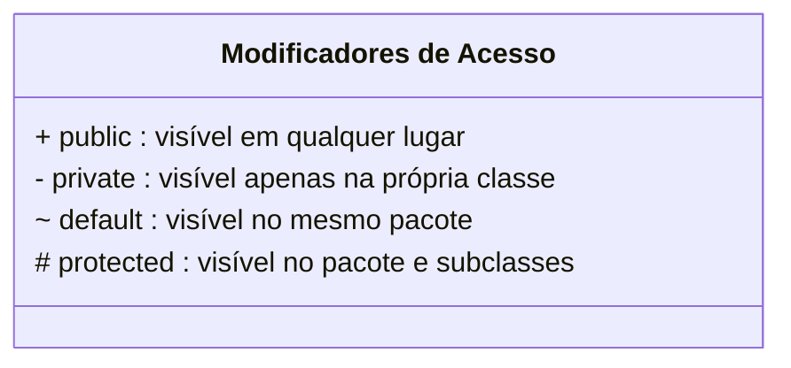
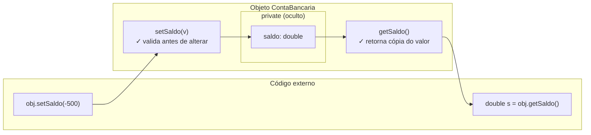
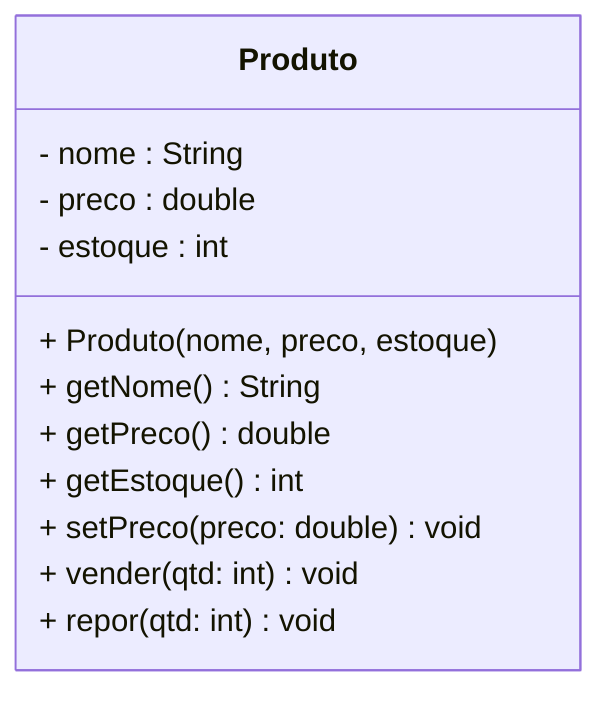

# Encontro 07 — Ocultação de Informação: Encapsulamento I

> **Módulo 3 · 4 aulas · 50 XP**

---

## 1. O problema que o Encapsulamento resolve

Volte ao `Quarto` do TP1. Sem proteção, qualquer código pode fazer isso:

```java
// Código SEM encapsulamento — classe completamente exposta
Quarto q = new Quarto(101, 1, "Standard", 180.0);

// Qualquer um pode colocar o quarto em estado inválido:
q.diaria     = -500.0;   // diária negativa!
q.andar      = -999;     // andar impossível!
q.disponivel = false;    // quarto "ocupado" sem ter reserva!
q.categoria  = "";       // categoria em branco!
```

Não há nada que impeça esses abusos. O estado do objeto fica completamente vulnerável a qualquer parte do código.

---

## 2. O Princípio de Parnas — Information Hiding

David Parnas, em 1972, definiu:

> *"A interface de um módulo deve esconder os detalhes de implementação de forma que o usuário não precise conhecê-los e não possa depender deles."*

**Tradução para POO:**
- Atributos = detalhes de implementação → **ocultar** com `private`
- Métodos públicos = interface controlada → **expor** com `public`
- Só o próprio objeto decide como seu estado muda

---

## 3. Modificadores de Acesso em Java



```java
package academia;

public class ContaBancaria {

    // ── PRIVATE: ninguém de fora enxerga ou altera diretamente ────────────
    private String titular;
    private double saldo;
    private int numero;

    // ── PUBLIC: a interface controlada exposta ao mundo ───────────────────
    public ContaBancaria(String titular, int numero) {
        this.titular = titular;
        this.numero  = numero;
        this.saldo   = 0.0;
    }

    // Getter: apenas leitura do estado
    public double getSaldo()   { return saldo;   }
    public String getTitular() { return titular; }
    public int    getNumero()  { return numero;  }

    // Método de negócio: depositar com validação
    public void depositar(double valor) {
        if (valor <= 0) {
            System.out.println("Valor de depósito deve ser positivo.");
            return;
        }
        this.saldo += valor;
    }
}

// Em outro arquivo/pacote:
class TesteAcesso {
    void testar() {
        ContaBancaria c = new ContaBancaria("Alice", 101);

        // c.saldo = -9999; ← ERRO de compilação! 'saldo' é private
        // c.titular = "";  ← ERRO de compilação!

        c.depositar(500);          // OK — método público
        System.out.println(c.getSaldo()); // OK — getter público
    }
}
```

---

## 4. Getters e Setters — a interface controlada



```java
public class Produto {
    private String nome;
    private double preco;
    private int estoque;

    public Produto(String nome, double preco, int estoque) {
        // Validações já no construtor
        if (preco < 0)    throw new IllegalArgumentException("Preço não pode ser negativo");
        if (estoque < 0)  throw new IllegalArgumentException("Estoque não pode ser negativo");
        this.nome    = nome;
        this.preco   = preco;
        this.estoque = estoque;
    }

    // ── Getters: somente leitura ──────────────────────────────────────────
    public String getNome()   { return nome;    }
    public double getPreco()  { return preco;   }
    public int    getEstoque(){ return estoque; }

    // ── Setters com validação ─────────────────────────────────────────────
    public void setPreco(double novoPreco) {
        if (novoPreco < 0) {
            System.out.println("Preço inválido. Operação ignorada.");
            return;
        }
        this.preco = novoPreco;
    }

    // Sem setter para 'nome' — nome não muda após criação
    // Sem setter para 'estoque' — só muda via vender/repor

    // ── Métodos de negócio ────────────────────────────────────────────────
    public void vender(int quantidade) {
        if (quantidade > estoque) {
            System.out.println("Estoque insuficiente! Disponível: " + estoque);
            return;
        }
        estoque -= quantidade;
    }

    public void repor(int quantidade) {
        if (quantidade <= 0) return;
        estoque += quantidade;
    }

    @Override
    public String toString() {
        return String.format("[%s | R$ %.2f | Estoque: %d]", nome, preco, estoque);
    }
}
```

---

## 5. Notação UML com visibilidade



| Símbolo UML | Modificador | Descrição |
|-------------|-------------|-----------|
| `+` | `public` | Acessível de qualquer lugar |
| `-` | `private` | Só na própria classe |
| `#` | `protected` | Classe e subclasses |
| `~` | `default` | Mesmo pacote |

---

## 6. Refatoração — antes e depois

```java
// ANTES — classe exposta, sem encapsulamento
class ContaAntiga {
    String titular;
    double saldo;
    boolean ativa;
}

// DEPOIS — classe encapsulada
class ContaModerna {
    private String titular;
    private double saldo;
    private boolean ativa;
    private static int proximoNumero = 1;
    private int numero;

    public ContaModerna(String titular) {
        if (titular == null || titular.isBlank())
            throw new IllegalArgumentException("Titular inválido");
        this.titular = titular;
        this.saldo   = 0.0;
        this.ativa   = true;
        this.numero  = proximoNumero++;
    }

    public String getTitular() { return titular; }
    public double getSaldo()   { return saldo;   }
    public boolean isAtiva()   { return ativa;   }
    public int    getNumero()  { return numero;  }

    public void depositar(double valor) {
        validarAtiva();
        if (valor <= 0) throw new IllegalArgumentException("Valor deve ser positivo");
        saldo += valor;
    }

    public void sacar(double valor) {
        validarAtiva();
        if (valor <= 0)   throw new IllegalArgumentException("Valor deve ser positivo");
        if (valor > saldo) throw new IllegalStateException("Saldo insuficiente");
        saldo -= valor;
    }

    public void encerrar() {
        if (!ativa) throw new IllegalStateException("Conta já encerrada");
        ativa = false;
        saldo = 0.0;
    }

    // Método privado auxiliar — encapsula regra interna
    private void validarAtiva() {
        if (!ativa) throw new IllegalStateException("Operação em conta encerrada");
    }

    @Override
    public String toString() {
        return String.format("Conta #%d | %s | R$ %.2f | %s",
            numero, titular, saldo, ativa ? "Ativa" : "Encerrada");
    }
}
```

---

## Exercícios Práticos

---

### Exercício 1 — Fácil · 25 XP
**Encapsulando a Classe Aluno**

Pegue a classe `Aluno` que você criou nos encontros anteriores (sem encapsulamento) e refatore-a:
- Torne todos os atributos `private`
- Crie getters para todos
- Crie setters APENAS para `email` e `telefone` (com validação básica: não nulo, não vazio)
- Mantenha `matricula` sem setter (imutável após criação)
- Atualize o `main` para usar apenas a interface pública

---

### Exercício 2 — Fácil · 25 XP
**Diagrama com Visibilidade**

Produza o diagrama UML com os símbolos `+`, `-`, `#`, `~` para a classe abaixo. Identifique cada modificador e justifique a escolha:

```java
public class Sensor {
    private double leituraAtual;
    private double limiteMaximo;
    protected String unidade;
    boolean ativo;

    public Sensor(double limiteMaximo, String unidade) { ... }
    public double getLeitura() { return leituraAtual; }
    private void calibrar() { ... }
    protected void ajustarUnidade(String novaUnidade) { ... }
    public boolean isAlerta() { return leituraAtual > limiteMaximo; }
    void registrar(double valor) { ... }
}
```

---

### Exercício 3 — Médio · 25 XP
**Conta Poupança com Rendimento**

Crie a classe `ContaPoupanca` encapsulada com:
- Atributos `private`: `titular`, `saldo`, `taxaRendimentoMensal`
- Construtor que exige titular e taxa (valide: taxa entre 0 e 100)
- `depositar(double)` e `sacar(double)` com validações
- `aplicarRendimento()` que aumenta o saldo pela taxa e imprime o rendimento
- `extrato()` que imprime saldo atual, taxa e titular

Crie ao menos 2 contas e simule 3 meses de rendimento.

---

### Exercício 4 — Médio · 25 XP
**Encontrando Violações**

O código abaixo viola o encapsulamento de formas diferentes. Liste todas as violações, explique o problema de cada uma e proponha a correção:

```java
public class Pedido {
    public int numero;
    public ArrayList<String> itens = new ArrayList<>();
    public double total;
    public String status;

    public void addItem(String item, double preco) {
        itens.add(item);
        total += preco;
    }

    public void setStatus(String s) {
        status = s; // aceita qualquer string, mesmo inválida
    }

    public double getTotal() {
        return total;
    }

    public void setTotal(double t) { // PROBLEMA?
        total = t;
    }
}
```

---

### Exercício 5 — Difícil · 25 XP
**Sistema de Acesso Biométrico**

Crie a classe `UsuarioBiometrico` com encapsulamento rigoroso:

- `private String login` — imutável após criação
- `private String senhaHash` — nunca retornada diretamente (sem getter da senha!)
- `private int tentativasFalhas` — máximo 3 antes de bloquear
- `private boolean bloqueado`
- `private String[] roles` — lista de permissões

Implemente:
- `boolean autenticar(String senha)` — compara hash, registra falhas, bloqueia após 3
- `boolean temPermissao(String role)` — verifica se o usuário tem aquela permissão
- `void desbloquear(String codigoAdmin)` — só desbloqueia se o código for `"ADMIN2024"`
- `void adicionarRole(String role)` — só funciona se não bloqueado

Simule no `main` o cenário de um usuário errando a senha 3 vezes, sendo bloqueado e depois desbloqueado.

---

### Exercício 6 — Troubleshooting · 25 XP
**Diagnóstico: Encapsulamento Violado**

O código abaixo tem **3 violações de encapsulamento**. Uma expõe atributo como `public`, outra retorna referência interna de array, e outra permite setter sem validação alguma. Identifique, explique o risco e corrija.

```java
public class Turma {

    // Violação 1: atributo público — qualquer classe pode modificar diretamente
    public String nomeProfessor;

    private double[] notas;
    private int totalNotas;
    private String nome;

    public Turma(String nome, int capacidade) {
        this.nome       = nome;
        this.notas      = new double[capacidade];
        this.totalNotas = 0;
    }

    // Violação 2: retorna a referência direta do array interno
    public double[] getNotas() {
        return notas;   // quem receber pode modificar notas[0] = -999!
    }

    // Violação 3: setter aceita qualquer valor, incluindo inválidos
    public void setNomeProfessor(String nomeProfessor) {
        this.nomeProfessor = nomeProfessor; // aceita null, vazio, etc.
    }

    public void adicionarNota(double nota) {
        notas[totalNotas++] = nota;
    }
}
```

> **Dicas:** (1) Atributos devem ser `private` — exponha via getters/setters quando necessário. (2) Em vez de retornar o array original, retorne uma **cópia**: `Arrays.copyOf(notas, totalNotas)`. (3) Todo setter deve validar: `if (nome == null || nome.isBlank()) throw new IllegalArgumentException(...)`.
