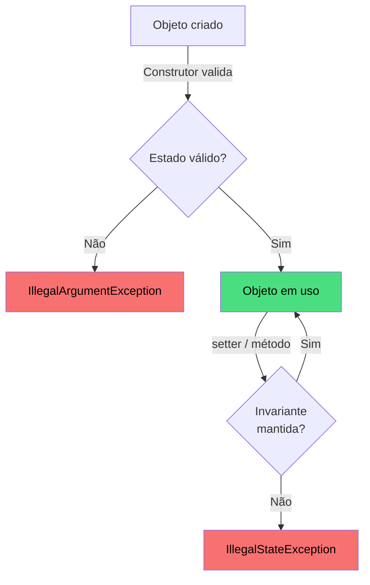
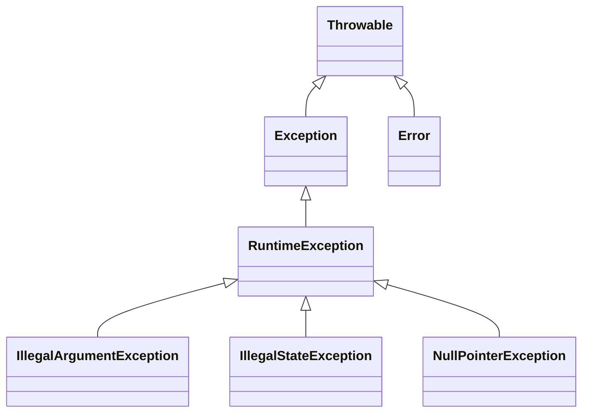

# Encontro 08 — Invariantes de Classe: Encapsulamento II

> **Módulo 3 · 4 aulas · 50 XP**

---

## 1. Encapsulamento além do Getter/Setter mecânico

Um erro comum é pensar que encapsulamento = "tornar atributos private e criar getters/setters para todos". Isso é apenas a superfície.

**O verdadeiro propósito:** garantir que o objeto nunca fique em estado inconsistente, independente de como é usado.

```java
// Getter/Setter mecânico — encapsulamento FALSO
class Temperatura {
    private double graus;

    public double getGraus() { return graus; }

    public void setGraus(double graus) {
        this.graus = graus; // sem validação — aceita -500°C, +10.000°C...
    }
}

// Encapsulamento REAL — com invariante de domínio
class Temperatura {
    private static final double KELVIN_ZERO = -273.15;
    private double graus;

    public Temperatura(double graus) {
        if (graus < KELVIN_ZERO)
            throw new IllegalArgumentException("Impossível: abaixo do zero absoluto.");
        this.graus = graus;
    }

    public double getGraus() { return graus; }

    public void setGraus(double graus) {
        if (graus < KELVIN_ZERO)
            throw new IllegalArgumentException("Impossível: abaixo do zero absoluto.");
        this.graus = graus;
    }
}
```

---

## 2. Invariantes de Classe

> Uma **invariante de classe** é uma condição que **sempre deve ser verdadeira** para que o objeto seja considerado válido, independente de qual método foi chamado antes.

**Exemplos de invariantes:**

| Classe | Invariante |
|--------|-----------|
| `ContaBancaria` | saldo ≥ −limite |
| `Retangulo` | largura > 0 e altura > 0 |
| `Estoque` | quantidade ≥ 0 |
| `Temperatura` | graus ≥ −273.15 |
| `Aluno` | 0.0 ≤ média ≤ 10.0 |
| `Voo` | assentosOcupados ≤ capacidade |



---

## 3. Exceções de Domínio — comunicando estado inválido

Java tem duas hierarquias de exceções:



**Para invariantes de classe, use:**
- `IllegalArgumentException` — argumento inválido passado ao método/construtor
- `IllegalStateException` — operação inválida para o estado atual do objeto

```java
public class ContaBancaria {
    private String titular;
    private double saldo;
    private double limite; // limite de cheque especial (negativo permitido até aqui)
    private boolean ativa;

    public ContaBancaria(String titular, double limite) {
        if (titular == null || titular.isBlank())
            throw new IllegalArgumentException("Titular não pode ser vazio.");
        if (limite < 0)
            throw new IllegalArgumentException("Limite não pode ser negativo.");

        this.titular = titular;
        this.limite  = limite;
        this.saldo   = 0.0;
        this.ativa   = true;
    }

    public void depositar(double valor) {
        if (!ativa)
            throw new IllegalStateException("Conta encerrada — não aceita depósitos.");
        if (valor <= 0)
            throw new IllegalArgumentException("Valor de depósito deve ser positivo.");
        saldo += valor;
    }

    public void sacar(double valor) {
        if (!ativa)
            throw new IllegalStateException("Conta encerrada — não aceita saques.");
        if (valor <= 0)
            throw new IllegalArgumentException("Valor de saque deve ser positivo.");
        // Invariante: saldo não pode cair abaixo de -limite
        if (saldo - valor < -limite)
            throw new IllegalStateException(
                String.format("Saldo insuficiente. Disponível: R$ %.2f", saldo + limite));
        saldo -= valor;
    }

    public void transferir(ContaBancaria destino, double valor) {
        if (destino == null)
            throw new IllegalArgumentException("Conta destino não pode ser nula.");
        this.sacar(valor);      // já valida tudo
        destino.depositar(valor); // já valida tudo
        System.out.printf("Transferência de R$ %.2f: %s → %s%n",
            valor, this.titular, destino.titular);
    }

    public void encerrar() {
        if (!ativa) throw new IllegalStateException("Conta já está encerrada.");
        if (saldo < 0) throw new IllegalStateException("Não pode encerrar conta com saldo negativo.");
        ativa = false;
        System.out.println("Conta de " + titular + " encerrada.");
    }

    // Getters
    public double getSaldo()   { return saldo;   }
    public String getTitular() { return titular; }
    public boolean isAtiva()   { return ativa;   }

    @Override
    public String toString() {
        return String.format("Conta[%s | R$ %.2f | Limite: R$ %.2f | %s]",
            titular, saldo, limite, ativa ? "Ativa" : "Encerrada");
    }
}
```

---

## 4. Capturando exceções para tratar erros

```java
public class DemoExcecoes {
    public static void main(String[] args) {
        ContaBancaria conta = new ContaBancaria("Alice", 500.0);

        // Depósito válido
        conta.depositar(1000.0);
        System.out.println(conta);

        // Tentativa de saque além do limite — com tratamento
        try {
            conta.sacar(2000.0); // vai lançar exceção
        } catch (IllegalStateException e) {
            System.out.println("Erro ao sacar: " + e.getMessage());
        }

        // Argumento inválido
        try {
            conta.depositar(-50.0);
        } catch (IllegalArgumentException e) {
            System.out.println("Argumento inválido: " + e.getMessage());
        }

        // Conta encerrada
        conta.depositar(500.0);
        conta.encerrar();
        try {
            conta.depositar(100.0);
        } catch (IllegalStateException e) {
            System.out.println("Estado inválido: " + e.getMessage());
        }
    }
}
```

---

## 5. Coesão — a classe faz exatamente o que deve

**Alta coesão** = uma classe tem uma responsabilidade clara e bem definida.

```java
// BAIXA coesão — faz tudo
class GerenciadorGeral {
    void salvarNoBanco() { ... }
    void enviarEmail()   { ... }
    void calcularIR()    { ... }
    void imprimirPDF()   { ... }
}

// ALTA coesão — cada classe tem 1 responsabilidade
class RepositorioCliente { void salvar(Cliente c) { ... } }
class ServicoEmail        { void enviar(String dest, String body) { ... } }
class CalculadoraIR       { double calcular(double rendimento) { ... } }
class GeradorPDF          { byte[] gerar(Relatorio r) { ... } }
```

---

## 6. Caso completo — Sistema de Estoque com Invariantes

```java
public class Estoque {
    private String produto;
    private int quantidade;
    private int quantidadeMinima; // nível de alerta
    private double precoUnitario;

    public Estoque(String produto, int quantidadeInicial, int minimo, double preco) {
        if (produto == null || produto.isBlank())
            throw new IllegalArgumentException("Nome do produto inválido.");
        if (quantidadeInicial < 0)
            throw new IllegalArgumentException("Quantidade inicial não pode ser negativa.");
        if (minimo < 0)
            throw new IllegalArgumentException("Quantidade mínima não pode ser negativa.");
        if (preco <= 0)
            throw new IllegalArgumentException("Preço deve ser positivo.");

        this.produto           = produto;
        this.quantidade        = quantidadeInicial;
        this.quantidadeMinima  = minimo;
        this.precoUnitario     = preco;
    }

    public void entrada(int qtd) {
        if (qtd <= 0)
            throw new IllegalArgumentException("Quantidade de entrada deve ser positiva.");
        quantidade += qtd;
        System.out.printf("[+] Entrada de %d un. | Estoque: %d%n", qtd, quantidade);
    }

    public void saida(int qtd) {
        if (qtd <= 0)
            throw new IllegalArgumentException("Quantidade de saída deve ser positiva.");
        if (qtd > quantidade)
            throw new IllegalStateException(
                String.format("Estoque insuficiente. Disponível: %d", quantidade));
        quantidade -= qtd;
        System.out.printf("[-] Saída de %d un. | Estoque: %d%s%n",
            qtd, quantidade, emAlerta() ? " ⚠ ALERTA: estoque baixo!" : "");
    }

    public boolean emAlerta() {
        return quantidade <= quantidadeMinima;
    }

    public double calcularValorTotal() {
        return quantidade * precoUnitario;
    }

    public void status() {
        System.out.printf("[%s | Qtd: %d | Mín: %d | R$ %.2f/un | Total: R$ %.2f]%n",
            produto, quantidade, quantidadeMinima, precoUnitario, calcularValorTotal());
    }

    // Getters apenas de leitura
    public int getQuantidade()    { return quantidade;   }
    public String getProduto()    { return produto;      }
    public double getPreco()      { return precoUnitario;}
}
```

---

## Exercícios Práticos

---

### Exercício 1 — Fácil · 25 XP
**Identificando invariantes**

Para cada classe abaixo, escreva pelo menos 2 invariantes que devem ser sempre verdadeiras:
- `Retangulo` (largura e altura como atributos)
- `Nota` (representa uma nota escolar de 0 a 10)
- `Senha` (string com mínimo 8 caracteres, pelo menos 1 número)
- `Intervalo` (representa [início, fim] de uma faixa numérica)

---

### Exercício 2 — Fácil · 25 XP
**Construtor blindado**

Implemente a classe `Nota` com o atributo `private double valor` (0.0 a 10.0). Lança `IllegalArgumentException` em construtor e setter. Implemente também `getConceito()` que retorna "A" (≥9), "B" (≥7), "C" (≥5), "D" (<5).

---

### Exercício 3 — Médio · 25 XP
**Refatoração com invariantes**

Refatore o sistema de `ContaBancaria` do Encontro 03 (sem encapsulamento) para ter:
- Todos os atributos `private`
- Invariante: saldo ≥ 0 sempre (sem cheque especial, mas pode ter limite separado)
- `sacar(double)` lança `IllegalStateException` se saldo insuficiente
- `depositar(double)` lança `IllegalArgumentException` se valor ≤ 0
- `transferir(ContaBancaria, double)` reutiliza sacar e depositar

---

### Exercício 4 — Médio · 25 XP
**Agenda de Consultas**

Crie a classe `Consulta` com: `paciente` (String), `medico` (String), `data` (String no formato "DD/MM/AAAA"), `hora` (int, 0–23) e `status` (enum ou String: "agendada", "realizada", "cancelada").

Invariantes:
- Paciente e médico não nulos/vazios
- Hora entre 0 e 23
- Não pode `realizar()` uma consulta cancelada
- Não pode `cancelar()` uma consulta já realizada

---

### Exercício 5 — Difícil · 25 XP
**Pilha (Stack) com Encapsulamento Total**

Implemente a estrutura de dados `PilhaInteiros` que armazena inteiros com tamanho limitado:

```java
public class PilhaInteiros {
    private int[] elementos;
    private int topo;
    private final int capacidade;
    // ...
}
```

Invariantes: `0 ≤ topo ≤ capacidade`. Métodos:
- `push(int)` — lança `IllegalStateException` se cheia
- `pop()` — lança `IllegalStateException` se vazia, retorna o topo e remove
- `peek()` — retorna o topo sem remover, lança exceção se vazia
- `isEmpty()`, `isFull()`, `size()`
- `toString()` — imprime `[3, 7, 2]` (topo por último)

Simule no `main` com push, pop, peek e as exceções sendo capturadas.

---

### Exercício 6 — Troubleshooting · 25 XP
**Diagnóstico: Exceções Mal Usadas**

O código abaixo tem **3 erros no uso de exceções**. Um engole silenciosamente o erro, outro usa `Exception` genérica onde deveria ser específica, e um terceiro lança exceção no lugar errado quebrando a invariante. Identifique e corrija.

```java
public class ContaPoupanca {
    private double saldo;
    private double taxaJurosMensal;

    public ContaPoupanca(double saldoInicial, double taxa) {
        this.saldo          = saldoInicial;
        this.taxaJurosMensal = taxa;
    }

    // Erro 1: catch vazio — engole o erro silenciosamente
    public void sacar(double valor) {
        try {
            if (valor > saldo) throw new RuntimeException("Saldo insuficiente");
            saldo -= valor;
        } catch (Exception e) {
            // nada aqui — o erro some!
        }
    }

    // Erro 2: lança Exception genérica — dificulta tratamento pelo chamador
    public void depositar(double valor) throws Exception {
        if (valor <= 0) throw new Exception("Valor inválido");
        saldo += valor;
    }

    // Erro 3: aplica juros ANTES de validar, deixando a conta em estado corrompido
    public void aplicarJuros() {
        saldo *= (1 + taxaJurosMensal);   // modifica saldo...
        if (taxaJurosMensal <= 0) {
            throw new IllegalStateException("Taxa inválida"); // ...depois lança exceção
            // Objeto ficou em estado corrompido!
        }
    }
}
```

> **Dicas:** (1) Nunca deixe um `catch` vazio — no mínimo loggue ou relance. (2) Use `IllegalArgumentException` (unchecked) para argumentos inválidos — o chamador não é obrigado a declarar `throws`. (3) Valide **antes** de modificar estado — princípio "fail fast": cheque primeiro, execute depois.
