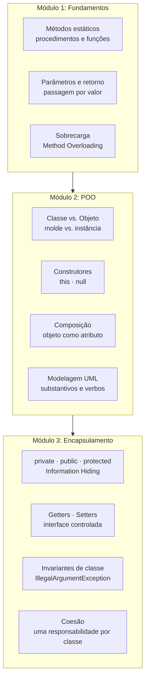
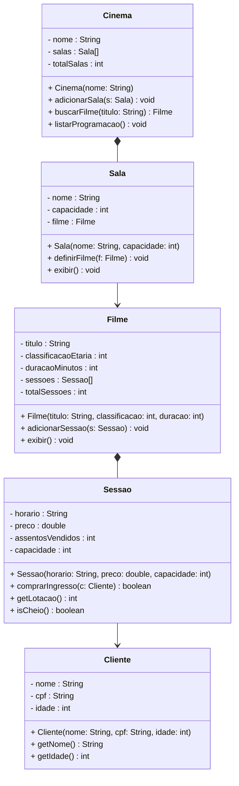
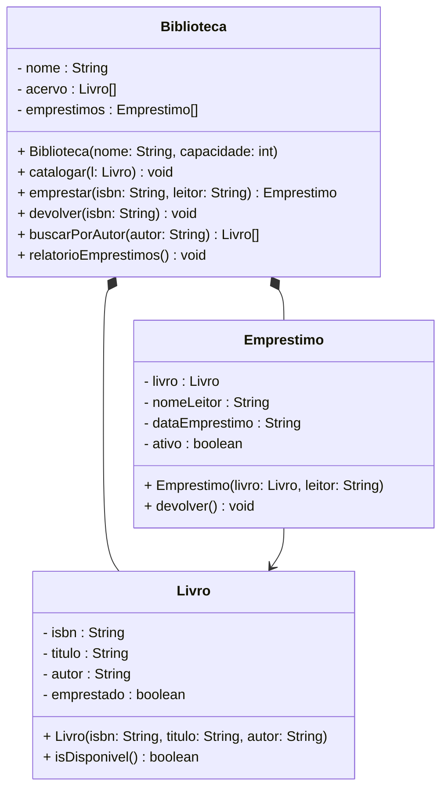

# Encontro 09 — Revisão Geral e Laboratório de Fixação

> **Módulo 3 · 4 aulas · 50 XP · Laboratório**

---

## Mapa Conceitual dos 3 Módulos



---

## Erros Mais Comuns — Guia de Diagnóstico

### ❌ Erro 1: NullPointerException ao chamar método

```java
// Problema
Produto p = null;
p.getNome(); // NullPointerException!

// Diagnóstico: objeto não foi instanciado (new)
// Solução
Produto p = new Produto("Notebook", 2500.0, 10);
p.getNome(); // OK
```

---

### ❌ Erro 2: Constructor not found

```java
class Carro {
    Carro(String modelo, int ano) { ... } // construtor parametrizado
}

// Problema
Carro c = new Carro(); // erro: sem construtor padrão!

// Diagnóstico: se existe construtor parametrizado, Java NÃO cria o padrão automaticamente
// Solução A: use o construtor que existe
Carro c = new Carro("Gol", 2020);
// Solução B: adicione explicitamente o construtor padrão
Carro() { this("Sem modelo", 0); }
```

---

### ❌ Erro 3: Atributo vs. parâmetro sem `this`

```java
class Aluno {
    String nome;
    Aluno(String nome) {
        nome = nome; // ← bug! está atribuindo o parâmetro a ele mesmo
        // this.nome = nome; ← correto
    }
}

// Diagnóstico: sem 'this', Java usa o parâmetro local para os dois lados
```

---

### ❌ Erro 4: Setter sem validação (encapsulamento falso)

```java
// Encapsulamento superficial — atributo é private, mas setter aceita qualquer coisa
class Nota {
    private double valor;
    public void setValor(double valor) {
        this.valor = valor; // aceita 1000.0, -5.0, etc.
    }
}

// Correto:
public void setValor(double valor) {
    if (valor < 0 || valor > 10)
        throw new IllegalArgumentException("Nota deve estar entre 0 e 10. Recebido: " + valor);
    this.valor = valor;
}
```

---

### ❌ Erro 5: Classe com múltiplas responsabilidades

```java
// Problema: classe faz tudo
class SistemaCompleto {
    void cadastrarCliente() { ... }
    void enviarEmail()      { ... }
    void gerarRelatorio()   { ... }
    void salvarNoBanco()    { ... }
}

// Correto: uma responsabilidade por classe
class ServicoCliente  { void cadastrar(Cliente c) { ... } }
class ServicoEmail    { void enviar(Email e)      { ... } }
class GeradorRelatorio{ Relatorio gerar()         { ... } }
```

---

## Exercício Integrador 1 — Sistema de Cinema

**Enunciado completo:** Modele e implemente um sistema de cinema com encapsulamento total.

**Requisito:**
> *"O cinema tem salas, cada uma com nome, capacidade e filmes em cartaz. Um filme tem título, classificação etária, duração em minutos e sessões disponíveis. Uma sessão tem horário, preço e assentos vendidos. Um cliente tem nome, CPF e idade. Para comprar um ingresso, o cliente precisa ter idade adequada à classificação do filme e a sessão não pode estar lotada."*

### Diagrama de Classes (preencha antes de implementar):



### Implementação base — complete os métodos marcados:

```java
public class Sessao {
    private String horario;
    private double preco;
    private int assentosVendidos;
    private int capacidade;

    public Sessao(String horario, double preco, int capacidade) {
        if (horario == null || horario.isBlank())
            throw new IllegalArgumentException("Horário inválido.");
        if (preco <= 0)
            throw new IllegalArgumentException("Preço deve ser positivo.");
        if (capacidade <= 0)
            throw new IllegalArgumentException("Capacidade deve ser positiva.");

        this.horario          = horario;
        this.preco            = preco;
        this.capacidade       = capacidade;
        this.assentosVendidos = 0;
    }

    public boolean isCheio() {
        return assentosVendidos >= capacidade;
    }

    public int getLotacao() {
        return capacidade - assentosVendidos;
    }

    // SEU CÓDIGO AQUI: comprarIngresso(Cliente c, int classificacaoFilme)
    // Valide: sessão não cheia + idade do cliente >= classificação
    // Lance IllegalStateException ou IllegalArgumentException se inválido

    public String getHorario() { return horario; }
    public double getPreco()   { return preco;   }
}

// Implemente: Filme, Sala, Cliente, Cinema e o main de teste
```

---

## Exercício Integrador 2 — Diagnóstico de Código

Analise o código abaixo. Para cada trecho, diga: (a) qual conceito viola, (b) qual o impacto, (c) como corrigir.

```java
class Veiculo {
    public String placa;        // (1)
    public int ano;             // (2)

    Veiculo() {}                // (3)

    public void setAno(int a) {
        ano = a;                // (4) sem validação
    }
}

class Frotas {
    public Veiculo[] veiculos = new Veiculo[100]; // (5)
    public int count = 0;                         // (6)

    public void adicionar(Veiculo v) {
        veiculos[count] = v;
        count++;                // (7) sem verificar overflow
    }

    public double calcularSeguro() {
        double total = 0;
        for (int i = 0; i < count; i++) {
            total += veiculos[i].ano * 1.5;    // (8) lógica no lugar errado?
        }
        return total;
    }
}
```

---

## Exercício Integrador 3 — Revisão UML → Código



Implemente todas as classes com encapsulamento completo e invariantes apropriadas. Teste com pelo menos 5 livros, 3 empréstimos e 1 devolução.

---

### Exercício 6 — Troubleshooting · 25 XP
**Diagnóstico: Múltiplas Responsabilidades e Acoplamento**

O código abaixo integra os três módulos vistos até aqui, mas tem **3 problemas de design**. Um método faz coisas demais, uma classe conhece detalhes internos de outra, e um campo é exposto indevidamente. Identifique, classifique (qual princípio viola) e proponha a refatoração.

```java
public class SistemaBiblioteca {
    private Livro[] acervo;
    private int totalLivros;

    // Problema 1: método faz 4 coisas distintas (viola Single Responsibility)
    public void processarEmprestimo(String cpfUsuario, String isbnLivro) {
        // 1. busca usuário no banco
        Usuario u = BancoDados.buscarUsuario(cpfUsuario);
        // 2. busca livro
        Livro l = BancoDados.buscarLivro(isbnLivro);
        // 3. verifica disponibilidade
        if (!l.disponivel) return;
        // 4. registra empréstimo
        l.disponivel = false;        // acesso direto ao campo!
        BancoDados.salvar(new Emprestimo(u, l));
        // 5. envia e-mail
        EmailService.enviar(u.email, "Empréstimo confirmado: " + l.titulo);
    }
}

class Livro {
    // Problema 2: campos públicos — sem encapsulamento
    public boolean disponivel;
    public String titulo;
    public String isbn;
}

class Usuario {
    // Problema 3: e-mail exposto diretamente
    public String email;
    public String cpf;
    public String nome;
}
```

> **Dicas:** (1) "Faça uma coisa e faça bem" — separe em `buscarUsuario`, `buscarLivro`, `registrarEmprestimo`, `notificarUsuario`. (2) `l.disponivel = false` é acoplamento direto ao campo — use `l.marcarComoEmprestado()`. (3) Exponha `email` somente via getter com validação, ou via método `notificar(mensagem)` que encapsula o envio.
