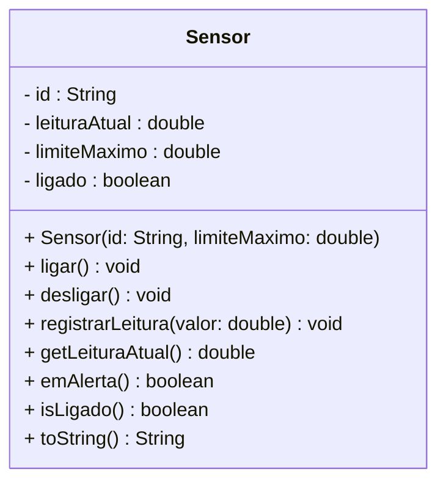

# Avaliação de Fechamento — Módulo 3: Proteção e Integridade

> **Módulo 3 · 10 questões · 150 XP · Avaliação**

---

## Orientações

Esta avaliação cobre todo o **Módulo 3** — Encapsulamento I e II, Invariantes de Classe, Hierarquia de Exceções e Exceções de Domínio.

São **10 questões** com formatos variados: preencher lacunas, traçar execução, relacionar colunas, completar tabela, encontrar erros, ordenar, verdadeiro/falso com justificativa, UML↔código e análise comparativa.

**Não há alternativas para marcar.** Você deve escrever, completar ou produzir cada resposta.

| Questão | Formato | Pontos |
|---------|---------|--------|
| Q1 | Preencher lacunas no código | 15 |
| Q2 | Traçar execução (tabela) | 15 |
| Q3 | Relacionar colunas | 10 |
| Q4 | Completar tabela de acesso | 10 |
| Q5 | Encontrar e corrigir erros | 20 |
| Q6 | Ordenar guard clauses | 10 |
| Q7 | Verdadeiro/Falso com justificativa | 15 |
| Q8 | UML → Código | 20 |
| Q9 | Código → UML | 10 |
| Q10 | Análise comparativa e defesa de design | 25 |
| **Total** | | **150** |

---

## Q1 — Preencher Lacunas no Código · 15 pts

Substitua cada `___` pelo valor correto: modificador de acesso (`private`, `public`, `protected`, `default`), tipo de exceção, ou expressão lógica. Cada lacuna vale ponto separado — leia os comentários de contexto.

```java
public class Produto {

    ___(1) String nome;         // ← visível apenas nesta classe
    ___(2) double preco;        // ← visível apenas nesta classe
    ___(3) int estoque;         // ← visível apenas nesta classe

    ___(4) Produto(String nome, double preco, int estoque) {  // ← qualquer pacote pode instanciar

        if (___(5))             // ← nome é null OU está em branco
            throw new ___(6)("Nome do produto não pode ser vazio");

        if (___(7))             // ← preço menor ou igual a zero
            throw new ___(8)("Preço deve ser positivo. Recebido: " + preco);

        if (___(9))             // ← estoque menor que zero
            throw new ___(10)("Estoque inicial não pode ser negativo");

        this.nome    = nome;
        this.preco   = preco;
        this.estoque = estoque;
    }

    ___(11) String getNome()  { return nome;  }   // ← leitura por qualquer classe
    ___(12) double getPreco() { return preco; }   // ← leitura por qualquer classe

    ___(13) void setPreco(double novoPreco) {      // ← alteração por qualquer classe
        if (novoPreco ___(14) 0)                   // ← operador: preço não pode ser negativo
            throw new ___(15)("Preço inválido: " + novoPreco);
        this.preco = novoPreco;
    }

    ___(16) void vender(int qtd) {                 // ← operação por qualquer classe
        if (qtd ___(17) estoque)                   // ← operador: sem estoque suficiente
            throw new ___(18)("Estoque insuficiente. Disponível: " + estoque);
        estoque -= qtd;
    }
}
```

> **Gabarito:**
> (1) `private` — (2) `private` — (3) `private` — (4) `public` — (5) `nome == null || nome.isBlank()`
> (6) `IllegalArgumentException` — (7) `preco <= 0` — (8) `IllegalArgumentException`
> (9) `estoque < 0` — (10) `IllegalArgumentException` — (11) `public` — (12) `public`
> (13) `public` — (14) `<` — (15) `IllegalArgumentException` — (16) `public` — (17) `>` — (18) `IllegalStateException`
>
> **Atenção na diferença de exceção:** (6), (8) e (10) são `IllegalArgumentException` porque o problema está no **argumento recebido**. (18) é `IllegalStateException` porque o problema está no **estado atual do objeto** (estoque zerado), não no argumento `qtd` em si.

---

## Q2 — Trace de Execução · 15 pts

Execute o código mentalmente linha a linha usando a `ContaBancaria` do Encontro 08 (com limite de cheque especial). Preencha a tabela: para exceções, escreva o tipo e a mensagem; para chamadas normais, deixe a coluna de exceção em branco.

```java
ContaBancaria c = new ContaBancaria("Ana", 500.0); // limite de cheque especial = R$500
c.depositar(1000.0);  // (2)
c.sacar(200.0);       // (3)
c.sacar(1500.0);      // (4) ← o que acontece?
c.depositar(-50.0);   // (5) ← e aqui?
c.encerrar();         // (6)
c.depositar(10.0);    // (7) ← e agora?
```

| # | Chamada | `saldo` após | `ativa` após | Exceção lançada (tipo + mensagem) |
|---|---------|-------------|-------------|-----------------------------------|
| 1 | `new ContaBancaria("Ana", 500.0)` | `0.0` | `true` | — |
| 2 | `depositar(1000.0)` | | | |
| 3 | `sacar(200.0)` | | | |
| 4 | `sacar(1500.0)` | | | |
| 5 | `depositar(-50.0)` | | | |
| 6 | `encerrar()` | | | |
| 7 | `depositar(10.0)` | | | |

> **Gabarito:**
>
> | 2 | `depositar(1000.0)` | `1000.0` | `true` | — |
> | 3 | `sacar(200.0)` | `800.0` | `true` | — |
> | 4 | `sacar(1500.0)` | `800.0` | `true` | `IllegalStateException: "Saldo insuficiente. Disponível: R$ 1300.00"` — saldo 800 + limite 500 = R$1300 disponível; 1500 > 1300 → rejeita sem alterar saldo |
> | 5 | `depositar(-50.0)` | `800.0` | `true` | `IllegalArgumentException: "Valor de depósito deve ser positivo."` — saldo inalterado |
> | 6 | `encerrar()` | `0.0` | `false` | — (imprime mensagem de encerramento) |
> | 7 | `depositar(10.0)` | `0.0` | `false` | `IllegalStateException: "Conta encerrada — não aceita depósitos."` |
>
> **Ponto-chave da linha 4:** o saldo permanece `800.0` mesmo após a tentativa de saque. A exception interrompeu o método antes do `saldo -= valor` — o objeto não foi corrompido. Isso é encapsulamento protegendo a invariante.

---

## Q3 — Relacione as Colunas · 10 pts

Escreva a letra da **Coluna B** ao lado de cada situação da **Coluna A**. Algumas letras podem ser usadas mais de uma vez.

**Coluna A — Situação:**

| # | Situação no código | Resposta |
|---|-------------------|----------|
| 1 | `sacar(-100.0)` quando o parâmetro não pode ser negativo | ___ |
| 2 | `empresa.contratar()` quando `empresa.falida == true` | ___ |
| 3 | `new Aluno(null, "123")` quando nome é obrigatório | ___ |
| 4 | `livro.emprestar()` quando `livro.emprestado == true` | ___ |
| 5 | `Integer.parseInt("abc")` com entrada inválida | ___ |
| 6 | `lista.get(10)` quando a lista tem apenas 5 elementos | ___ |
| 7 | Método `static` tentando acessar atributo de instância | ___ |
| 8 | `catch (Exception e) { }` sem nenhuma ação dentro | ___ |

**Coluna B — Conceito ou exceção:**

```
A → IllegalArgumentException   (argumento passado é inválido)
B → IllegalStateException      (estado do objeto impede a operação)
C → NumberFormatException      (subcategoria de RuntimeException)
D → IndexOutOfBoundsException  (subcategoria de RuntimeException)
E → Erro de COMPILAÇÃO
F → Antipadrão de design       (não é erro de compilação ou runtime)
```

> **Gabarito:** 1→A 2→B 3→A 4→B 5→C 6→D 7→E 8→F
>
> **Atenção:** Situação 3 — `NullPointerException` também é aceitável, mas `IllegalArgumentException` com mensagem clara é preferível (`Objects.requireNonNull(nome, "Nome não pode ser nulo")`). Situação 8 — não é erro de compilação nem runtime; o código compila e executa, mas **engole o erro silenciosamente**, violando a prática de não suprimir exceções.

---

## Q4 — Complete a Tabela de Acesso · 10 pts

A classe abaixo está no pacote `banco.dominio`. Preencha cada célula com **"✅ acessa"** ou **"❌ não acessa"**, indicando se o código **compila** a partir de cada localização:

```java
package banco.dominio;

public class ContaBancaria {
    private String titular;           // (A)
    double saldo;                     // (B) — sem modificador = default
    protected boolean ativa;          // (C)
    public String getTitular() { ... } // (D)
}
```

| Onde está o código | (A) `private titular` | (B) `default saldo` | (C) `protected ativa` | (D) `public getTitular()` |
|---|---|---|---|---|
| Dentro da própria `ContaBancaria` | | | | |
| Outra classe no **mesmo pacote** `banco.dominio` | | | | |
| Subclasse em **outro pacote** `app.ui extends ContaBancaria` | | | | |
| Classe sem relação em **outro pacote** `app.ui` | | | | |

> **Gabarito:**
>
> | Dentro da própria `ContaBancaria` | ✅ | ✅ | ✅ | ✅ |
> | Mesmo pacote `banco.dominio` | ❌ | ✅ | ✅ | ✅ |
> | Subclasse em outro pacote | ❌ | ❌ | ✅ | ✅ |
> | Sem relação em outro pacote | ❌ | ❌ | ❌ | ✅ |
>
> **Regra resumida:** `private` → só a própria classe. `default` → classe + mesmo pacote. `protected` → classe + mesmo pacote + subclasses em qualquer pacote. `public` → qualquer lugar.

---

## Q5 — Encontre e Corrija Todos os Erros · 20 pts

O código abaixo tem **5 erros** distribuídos pelas linhas. Para cada um: **(a)** descreva o problema em uma frase, **(b)** classifique como `compilação`, `runtime/lógica` ou `design`, e **(c)** escreva a linha corrigida.

```java
public class Voo {
    public int numero;                             // linha 2
    private String destino;
    private int capacidade;
    private int assentosVendidos;

    public Voo(int numero, String destino, int capacidade) {
        this.numero    = numero;
        destino        = destino;                  // linha 9
        this.capacidade = capacidade;
        this.assentosVendidos = 0;
    }

    public static int getLotacaoPercentual() {     // linha 14
        return (assentosVendidos * 100) / capacidade;
    }

    public void venderAssento() {
        if (assentosVendidos == capacidade)
            throw new IllegalArgumentException("Voo lotado"); // linha 20
        assentosVendidos++;
    }

    public void setCapacidade(int c) {
        this.capacidade = c;                       // linha 25 — problema de design
    }
}
```

| # | Linha | **(a)** Problema | **(b)** Tipo | **(c)** Linha corrigida |
|---|-------|-----------------|-------------|------------------------|
| 1 | 2 | | | |
| 2 | 9 | | | |
| 3 | 14–15 | | | |
| 4 | 20 | | | |
| 5 | 24–25 | | | |

> **Gabarito:**
>
> | 1 | 2 | `public int numero` expõe o atributo diretamente — qualquer classe pode fazer `voo.numero = -999` | design | `private int numero;` |
> | 2 | 9 | `destino = destino` atribui o parâmetro a si mesmo; `this.destino` nunca é inicializado, permanece `null` | runtime/lógica | `this.destino = destino;` |
> | 3 | 14–15 | Método `static` acessa atributos de instância `assentosVendidos` e `capacidade` — não compila | compilação | Remover `static`: `public int getLotacaoPercentual() {` |
> | 4 | 20 | Voo lotado é um problema de **estado do objeto**, não de argumento inválido — exceção semanticamente errada | design | `throw new IllegalStateException("Voo " + destino + " está lotado");` |
> | 5 | 24–25 | Setter de capacidade sem validação alguma quebra a invariante: alguém pode chamar `setCapacidade(0)` e a linha 15 divide por zero; pior: se `assentosVendidos > novaCapacidade`, o estado fica inconsistente | design | No mínimo: `if (c <= 0 || c < assentosVendidos) throw new IllegalArgumentException("Capacidade inválida");` antes da atribuição. Melhor ainda: remover o setter — capacidade não deveria mudar após criação. |

---

## Q6 — Ordene as Guard Clauses · 10 pts

As 7 linhas abaixo formam um método `transferir`, mas estão **fora de ordem**. Escreva os rótulos `(A)`–`(G)` na sequência correta de execução e responda à pergunta de justificativa.

```
(A)  destino.depositar(valor);
(B)  if (valor <= 0) throw new IllegalArgumentException("Valor inválido: " + valor);
(C)  this.saldo -= valor;
(D)  Objects.requireNonNull(destino, "Conta destino não pode ser nula");
(E)  if (!this.ativa) throw new IllegalStateException("Conta de origem encerrada");
(F)  if (valor > this.saldo) throw new IllegalStateException("Saldo insuficiente");
(G)  public void transferir(ContaBancaria destino, double valor) {
```

**Ordem correta:** `(G)` → `___` → `___` → `___` → `___` → `___` → `(A)`

**Justificativa:** Por que `(D)` deve vir antes de `(B)`, e por que todas as guards devem vir antes de `(C)`?

> **Gabarito — ordem:** `(G) → (D) → (B) → (E) → (F) → (C) → (A)`
>
> **Justificativa:**
> - `(D)` antes de `(B)` — se `destino` é nulo, qualquer referência a ele causaria `NullPointerException`. O null check protege todo o resto.
> - `(B)` antes de `(E)` e `(F)` — não faz sentido verificar estado do objeto se o argumento já é inválido. Economiza trabalho e deixa as mensagens de erro mais precisas.
> - `(E)` e `(F)` antes de `(C)` e `(A)` — **princípio "fail fast"**: só modificamos estado (`saldo -=` e `depositar`) depois de confirmar que TUDO é válido. Se `(C)` executasse antes de `(F)` ser verificada, o saldo já teria sido decrementado mesmo com saldo insuficiente — objeto corrompido.
>
> ```mermaid
> flowchart TD
>     G["transferir(destino, valor)"] --> D{"destino\nnulo?"}
>     D -- "sim" --> X1["💥 NullPointerException"]
>     D -- "não" --> B{"valor\n<= 0?"}
>     B -- "sim" --> X2["💥 IllegalArgumentException"]
>     B -- "não" --> E{"this.ativa\n= false?"}
>     E -- "sim" --> X3["💥 IllegalStateException\nconta encerrada"]
>     E -- "não" --> F{"valor\n> saldo?"}
>     F -- "sim" --> X4["💥 IllegalStateException\nsaldo insuficiente"]
>     F -- "não" --> C["✅ this.saldo -= valor"]
>     C --> A["✅ destino.depositar(valor)"]
>
>     style X1 fill:#7f1d1d,color:#fff
>     style X2 fill:#7f1d1d,color:#fff
>     style X3 fill:#7f1d1d,color:#fff
>     style X4 fill:#7f1d1d,color:#fff
>     style C fill:#14532d,color:#fff
>     style A fill:#14532d,color:#fff
>     style G fill:#1e3a5f,color:#fff
> ```

---

## Q7 — Verdadeiro, Falso e Por Quê · 15 pts

Para cada afirmação, marque **V** (verdadeiro) ou **F** (falso) e escreva **obrigatoriamente uma frase** de justificativa. **Respostas sem justificativa valem zero** — não basta acertar o V/F.

| # | Afirmação | V ou F | Justificativa (obrigatória — uma frase) |
|---|-----------|:------:|----------------------------------------|
| 1 | Tornar todos os atributos `private` e criar getters/setters para todos é suficiente para garantir encapsulamento real. | | |
| 2 | Um método `static` não pode lançar `IllegalArgumentException`. | | |
| 3 | `IllegalStateException` é a exceção correta quando um argumento inválido é recebido por um método. | | |
| 4 | Uma invariante de classe deve ser verdadeira após qualquer chamada de método público, não apenas após o construtor. | | |
| 5 | `Optional<T>` deve sempre ser preferido a lançar exceção quando um objeto não é encontrado. | | |
| 6 | O Princípio de Parnas (Information Hiding) afirma que detalhes de implementação devem ser visíveis para facilitar o reuso. | | |

> **Gabarito:**
>
> **1 → F** — Setters sem validação criam encapsulamento superficial; `setPreco(-500)` sem verificação aceita estado inválido e viola a invariante. O `private` protege o acesso direto, mas não garante consistência.
>
> **2 → F** — Qualquer método, estático ou de instância, pode lançar `IllegalArgumentException` (unchecked); o que `static` não pode fazer é acessar atributos de instância — são restrições distintas.
>
> **3 → F** — `IllegalStateException` é para quando o **estado atual do objeto** impede a operação (`conta.encerrada`, `voo.lotado`); argumento inválido usa `IllegalArgumentException`.
>
> **4 → V** — A invariante define "objeto válido"; qualquer método que a quebre deixa o objeto em estado corrompido, independente de ter passado pelo construtor corretamente.
>
> **5 → F** — `Optional` é adequado quando a ausência é comportamento normal (busca pode não encontrar); exception é correta quando a ausência representa violação de contrato ou regra de negócio (ex.: tentar sacar de conta inexistente é um bug do chamador).
>
> **6 → F** — Parnas afirma o **oposto**: detalhes de implementação devem ser **ocultados** da interface pública; quem usa o módulo não precisa (e não deve) conhecer o interior.

---

## Q8 — UML → Código · 20 pts

Implemente a classe Java `Sensor` completa a partir do diagrama e das invariantes abaixo. **Não omita nada**: construtor com validação usando `Objects.requireNonNull`, todos os métodos, `toString`. Cuide do acesso correto para cada atributo.



**Invariantes que seu código DEVE garantir:**
- `id` nunca nulo ou vazio (use `Objects.requireNonNull` + verificação de blank)
- `limiteMaximo > 0`
- `leituraAtual >= 0` sempre — rejeitar leituras negativas
- `registrarLeitura` só funciona quando ligado — lançar exceção com qual tipo? (pense antes de escrever)
- `emAlerta()` retorna `true` somente quando ligado **E** `leituraAtual > limiteMaximo`

> **Gabarito:**
> ```java
> import java.util.Objects;
>
> public class Sensor {
>     private final String id;
>     private double leituraAtual;
>     private final double limiteMaximo;
>     private boolean ligado;
>
>     public Sensor(String id, double limiteMaximo) {
>         this.id = Objects.requireNonNull(id, "ID não pode ser nulo");
>         if (id.isBlank())
>             throw new IllegalArgumentException("ID não pode ser vazio");
>         if (limiteMaximo <= 0)
>             throw new IllegalArgumentException("Limite deve ser positivo. Recebido: " + limiteMaximo);
>         this.limiteMaximo = limiteMaximo;
>         this.leituraAtual = 0.0;
>         this.ligado       = false;
>     }
>
>     public void ligar()    { ligado = true;  }
>     public void desligar() { ligado = false; }
>
>     public void registrarLeitura(double valor) {
>         if (!ligado)
>             throw new IllegalStateException("Sensor " + id + " está desligado — não pode registrar leitura");
>         if (valor < 0)
>             throw new IllegalArgumentException("Leitura não pode ser negativa. Recebido: " + valor);
>         this.leituraAtual = valor;
>     }
>
>     public double getLeituraAtual() { return leituraAtual; }
>     public boolean isLigado()       { return ligado;       }
>     public boolean emAlerta()       { return ligado && leituraAtual > limiteMaximo; }
>
>     @Override
>     public String toString() {
>         return String.format("Sensor[%s | %.2f / %.2f | %s%s]",
>             id, leituraAtual, limiteMaximo,
>             ligado ? "ON" : "OFF",
>             emAlerta() ? " ⚠ ALERTA" : "");
>     }
> }
> ```
> **Por que `IllegalStateException` em `registrarLeitura`?** — O sensor desligado é um **estado** do objeto. O valor passado pode ser válido; o problema é o estado atual do objeto, não o argumento.

---

## Q9 — Código → UML · 10 pts

Produza o diagrama de classes **Mermaid completo** para a classe abaixo. Use os símbolos corretos de visibilidade (`+`, `-`, `#`, `~`) e inclua tipos de retorno e parâmetros de todos os métodos:

```java
public class Estoque {
    private String produto;
    private int quantidade;
    protected int quantidadeMinima;
    double precoUnitario;       // sem modificador → default

    public Estoque(String produto, int quantidadeInicial, int minimo, double preco) { ... }
    public void entrada(int qtd) { ... }
    public void saida(int qtd) { ... }
    public boolean emAlerta() { ... }
    public double calcularValorTotal() { ... }
    private void verificarIntegridade() { ... }
    public int getQuantidade() { ... }
}
```

> **Gabarito:**
> ```mermaid
> classDiagram
>     class Estoque {
>         - produto : String
>         - quantidade : int
>         # quantidadeMinima : int
>         ~ precoUnitario : double
>         + Estoque(produto: String, quantidadeInicial: int, minimo: int, preco: double)
>         + entrada(qtd: int) void
>         + saida(qtd: int) void
>         + emAlerta() boolean
>         + calcularValorTotal() double
>         - verificarIntegridade() void
>         + getQuantidade() int
>     }
> ```
> **Atenção ao `~`**: `default` (sem modificador) é representado por `~` na notação UML — é o modificador mais esquecido na conversão código↔UML.

---

## Q10 — Compare, Analise e Decida · 25 pts

Dois times implementaram a mesma `ContaCorrente`. Analise ambas e responda às **4 perguntas** abaixo. Seja específico — respostas genéricas como "A é ruim, B é bom" não pontuam.

**Implementação A:**
```java
public class ContaCorrente {
    public double saldo;
    public boolean ativa;

    public void operacao(String tipo, double valor) {
        if (tipo.equals("deposito")) {
            if (valor > 0) saldo += valor;
        } else if (tipo.equals("saque")) {
            if (valor > 0 && valor <= saldo) saldo -= valor;
        } else if (tipo.equals("encerrar")) {
            ativa = false;
        }
    }
}
```

**Implementação B:**
```java
public class ContaCorrente {
    private double saldo;
    private boolean ativa;

    public ContaCorrente() { this.ativa = true; }

    public void depositar(double valor) {
        if (!ativa) throw new IllegalStateException("Conta encerrada");
        if (valor <= 0) throw new IllegalArgumentException("Valor deve ser positivo");
        saldo += valor;
    }

    public void sacar(double valor) {
        if (!ativa) throw new IllegalStateException("Conta encerrada");
        if (valor <= 0) throw new IllegalArgumentException("Valor deve ser positivo");
        if (valor > saldo) throw new IllegalStateException("Saldo insuficiente");
        saldo -= valor;
    }

    public void encerrar() {
        if (!ativa) throw new IllegalStateException("Conta já encerrada");
        ativa = false;
    }

    public double getSaldo() { return saldo; }
}
```

---

**(a)** Escreva duas linhas de código que exploram falhas concretas da Implementação A — falhas que seriam **impossíveis** na Implementação B. Para cada uma, explique o impacto.

**(b)** Chame `operacao("saque", -100.0)` na Implementação A. O que acontece com `saldo`? Por quê? Isso é problema de compilação, runtime ou design? Explique.

**(c)** Na Implementação B, `encerrar()` lança `IllegalStateException`. Por que **não** lança `IllegalArgumentException`? Qual a distinção conceitual entre as duas exceções?

**(d)** Crie a classe `SaldoInsuficienteException` (unchecked, com campos `saldoDisponivel` e `valorSolicitado`) e mostre onde ela seria integrada na **Implementação B**. Por que essa integração seria mais difícil ou impossível de forma limpa na Implementação A?

> **Gabarito:**
>
> **(a)**
> ```java
> // Falha 1: atributo público — qualquer classe corrompe o estado sem passar por validação
> ContaCorrente c = new ContaCorrente();
> c.saldo = -9999.0; // compila e executa — invariante destruída
>
> // Falha 2: ativa = false externamente, sem passar pelo encerramento controlado
> c.ativa = false;   // conta "encerrada" sem nenhuma lógica de negócio executada
> ```
> Impacto da Falha 1: saldo negativo não controlado — sistema financeiro em estado impossível.
> Impacto da Falha 2: quem chamou pode nem saber que a conta foi encerrada e continuar tentando operações.
>
> **(b)** `operacao("saque", -100.0)` — o guard `valor > 0` é `false` para -100, então **nada acontece**. `saldo` permanece inalterado. É problema de **design**: a operação falha silenciosamente — o chamador não recebe nenhuma indicação de que o saque foi recusado. Pode continuar acreditando que o saldo foi decrementado quando na verdade não foi.
>
> **(c)** `IllegalStateException` é lançada quando o **estado atual do objeto** torna a operação impossível — a conta já está encerrada, independente de qualquer argumento passado. `IllegalArgumentException` é para quando o **argumento passado** ao método é inválido. `encerrar()` não recebe argumentos; o problema é o estado, não o input.
>
> **(d)**
> ```java
> public class SaldoInsuficienteException extends RuntimeException {
>     private final double saldoDisponivel;
>     private final double valorSolicitado;
>
>     public SaldoInsuficienteException(double saldo, double valor) {
>         super(String.format("Saldo insuficiente. Disponível: R$%.2f | Solicitado: R$%.2f",
>               saldo, valor));
>         this.saldoDisponivel = saldo;
>         this.valorSolicitado = valor;
>     }
>
>     public double getSaldoDisponivel() { return saldoDisponivel; }
>     public double getValorSolicitado() { return valorSolicitado; }
> }
>
> // Na Implementação B — integração natural em sacar():
> public void sacar(double valor) {
>     if (!ativa) throw new IllegalStateException("Conta encerrada");
>     if (valor <= 0) throw new IllegalArgumentException("Valor deve ser positivo");
>     if (valor > saldo) throw new SaldoInsuficienteException(saldo, valor); // ← aqui
>     saldo -= valor;
> }
> ```
> Na **Implementação A** seria impossível de forma limpa: o método `operacao` usa `String tipo` como discriminador — para lançar `SaldoInsuficienteException` especificamente no saque, precisaria de um `if (tipo.equals("saque") && ...)` dentro do método genérico, quebrando todo o design. Além disso, `saldo` sendo público permite que o chamador verifique antes em vez de tratar a exception — exatamente o antipadrão "Ask, don't Tell" que o encapsulamento elimina.
