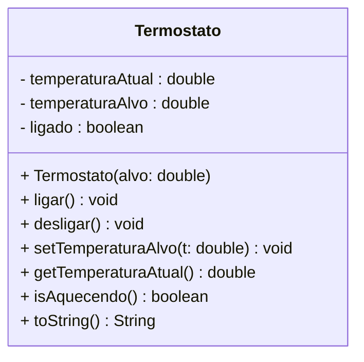

# Encontro 10 — Avaliação Objetiva

> **Módulo 3 · 4 aulas · 150 XP · Prova**

---

## Instruções

Esta avaliação cobre os **Módulos 1, 2 e 3** do curso. São 4 seções:
- **A:** Prevendo saídas (lógica de execução)
- **B:** Identificando erros
- **C:** UML → Código e Código → UML
- **D:** Questões conceituais

Cada questão tem a resposta comentada ao final — use para autocorreção após a prova.

---

## Seção A — Preveja a Saída

### A1

```java
class Caixa {
    int valor;
    Caixa(int v) { this.valor = v; }
}

public class Q1 {
    static void dobrar(int n, Caixa c) {
        n = n * 2;
        c.valor = c.valor * 2;
    }
    public static void main(String[] args) {
        int x = 5;
        Caixa cx = new Caixa(5);
        dobrar(x, cx);
        System.out.println(x);        // (1)
        System.out.println(cx.valor); // (2)
    }
}
```

> **Resposta:** (1) `5` — primitivo passado por valor, a cópia foi dobrada mas o original não. (2) `10` — a referência de `cx` foi copiada, mas ambas apontam para o mesmo objeto no Heap, então `c.valor = c.valor * 2` modifica o objeto original.

---

### A2

```java
class Contador {
    private int n = 0;
    Contador() {}
    Contador(int inicial) { this.n = inicial; }
    void inc() { n++; }
    int get() { return n; }
}

public class Q2 {
    public static void main(String[] args) {
        Contador a = new Contador();
        Contador b = new Contador(3);
        a.inc(); a.inc();
        Contador c = b;    // c aponta para o mesmo objeto que b
        c.inc();
        System.out.println(a.get()); // (1)
        System.out.println(b.get()); // (2)
        System.out.println(c.get()); // (3)
        System.out.println(a == c);  // (4)
        System.out.println(b == c);  // (5)
    }
}
```

> **Resposta:** (1) `2` — a incrementado 2x. (2) `4` — b e c apontam para o mesmo objeto, c.inc() incrementou b também. (3) `4` — mesmo objeto que b. (4) `false` — a e c são objetos diferentes. (5) `true` — b e c são a mesma referência.

---

### A3

```java
class Sensor {
    private double leitura;

    Sensor() { this(0.0); }
    Sensor(double inicial) {
        if (inicial < 0) throw new IllegalArgumentException("Negativo!");
        leitura = inicial;
    }

    void atualizar(double v) {
        if (v < 0) { System.out.println("Rejeitado: " + v); return; }
        leitura = v;
    }

    double get() { return leitura; }
}

public class Q3 {
    public static void main(String[] args) {
        Sensor s1 = new Sensor();
        Sensor s2 = new Sensor(10.0);
        s1.atualizar(5.0);
        s1.atualizar(-3.0);
        s2.atualizar(s1.get());
        System.out.println(s1.get()); // (1)
        System.out.println(s2.get()); // (2)
        try {
            Sensor s3 = new Sensor(-1.0);
        } catch (IllegalArgumentException e) {
            System.out.println(e.getMessage()); // (3)
        }
    }
}
```

> **Resposta:** (1) `5.0` — atualizar(-3.0) foi rejeitado, s1 ficou em 5.0. (2) `5.0` — s2 recebeu s1.get() que é 5.0. (3) `Negativo!`

---

## Seção B — Encontre os Erros

### B1 — Identifique e classifique cada problema (compilação, lógica ou design)

```java
class Produto {
    String nome;
    double preco;

    Produto(String n) {
        nome = n;  // ← B1a: ok ou problema?
    }

    public static double desconto(double pct) {
        return preco * (1 - pct / 100); // ← B1b
    }

    void setPreco(double p) {
        preco = p; // ← B1c: sem validação
    }
}

class Main {
    public static void main(String[] args) {
        Produto p = new Produto;   // ← B1d: falta parênteses
        p.setPreco(-50.0);         // ← B1e: estado inválido aceito
        System.out.println(Produto.desconto(10)); // ← B1f
    }
}
```

> **Respostas:**
> - B1a: Design — nome deveria ser `this.nome = n`, aqui funciona apenas porque o parâmetro tem nome diferente.
> - B1b: Compilação — método `static` não acessa atributo de instância `preco`.
> - B1c: Design — setter sem validação, aceita preço negativo.
> - B1d: Compilação — `new Produto` sem `()` é inválido em Java.
> - B1e: Lógica — preço negativo aceito (consequência do B1c).
> - B1f: Compilação — chamada incorreta de método estático quebrado (B1b já impede compilação).

---

### B2 — Corrija o NullPointerException

```java
class Pedido {
    private Cliente cliente;
    private String status;

    Pedido(String status) { this.status = status; }

    void finalizar() {
        if (cliente.getNome().equals("VIP")) { // ← pode lançar NPE
            System.out.println("Desconto VIP aplicado!");
        }
        status = "Finalizado";
    }
}
```

> **Resposta:** `cliente` nunca foi inicializado — é `null`. Correção: verificar `if (cliente != null && cliente.getNome().equals("VIP"))` ou garantir que `cliente` seja passado no construtor.

---

## Seção C — UML ↔ Código

### C1 — Código → UML

Produza o Diagrama de Classes completo com visibilidades para:

```java
public class ContaCorrente {
    private String titular;
    private double saldo;
    private double limite;
    private boolean ativa;

    public ContaCorrente(String titular, double limite) { ... }
    public void depositar(double valor) { ... }
    public void sacar(double valor) { ... }
    public void transferir(ContaCorrente dest, double valor) { ... }
    public double getSaldo() { ... }
    public boolean isAtiva() { ... }
    private void validarAtiva() { ... }
}
```

> **Resposta esperada:**
> ```
> classDiagram
>     class ContaCorrente {
>         - titular : String
>         - saldo : double
>         - limite : double
>         - ativa : boolean
>         + ContaCorrente(titular, limite)
>         + depositar(valor: double) void
>         + sacar(valor: double) void
>         + transferir(dest: ContaCorrente, valor: double) void
>         + getSaldo() double
>         + isAtiva() boolean
>         - validarAtiva() void
>     }
> ```

---

### C2 — UML → Código

Implemente a classe Java exata a partir do diagrama:



Invariantes: `temperaturaAlvo` entre 10°C e 35°C. `isAquecendo()` retorna `true` se ligado e temperatura atual < alvo.

---

## Seção D — Questões Conceituais

### D1
Explique a diferença entre **método estático** e **método de instância** usando um exemplo prático com a classe `Calculadora`.

> **Resposta:** Um método estático pertence à **classe** e não a nenhum objeto específico — é chamado com `Calculadora.somar(2, 3)` e não acessa atributos de instância. Um método de instância pertence a um **objeto** e pode acessar e modificar seus atributos — é chamado com `calc.acumular(5)`, onde `calc` é um objeto com estado próprio.

---

### D2
Por que em Java não é possível ter um setter que retorne a `double saldo` diretamente para alteração, como `public double getSaldo()` que permita `conta.getSaldo() = 999`?

> **Resposta:** Em Java, um método sempre retorna uma **cópia** do valor primitivo. `getSaldo()` retorna uma cópia do `double`, não uma referência ao campo. Atribuir a esse retorno não afeta o objeto. (Com tipos por referência, o getter retorna a referência — por isso é possível modificar objetos retornados por getters, o que pode ser um problema de encapsulamento se a coleção interna for exposta diretamente.)

---

### D3
Dado o código abaixo, justifique qual exceção lançar e por quê:

```java
// a) método recebe prazo de 0 dias
void agendar(int prazo) { if (prazo == 0) throw ??? }

// b) tenta sacar de conta já encerrada
void sacar(double v) { if (!ativa) throw ??? }

// c) recebe string nula onde era esperada uma não-nula
void setNome(String nome) { if (nome == null) throw ??? }
```

> **Respostas:**
> - (a) `IllegalArgumentException` — o argumento `prazo` tem valor inválido.
> - (b) `IllegalStateException` — a operação é inválida para o **estado atual** do objeto (encerrado).
> - (c) `IllegalArgumentException` (ou `NullPointerException` é aceitável) — o argumento é inválido (nulo não é permitido).

---

### D4 — Dissertativa
Explique o Princípio de Parnas (Information Hiding) em suas próprias palavras e dê um exemplo concreto de como a violação desse princípio levou a um bug (real ou imaginado).

> **Critérios de avaliação:** mencionar que atributos internos devem ser ocultos, que a interface pública controla o acesso, e que mudanças internas não devem afetar quem usa a classe. O exemplo precisa demonstrar como o acesso direto a atributos causou um estado inválido.

---

### Questão E — Troubleshooting de Código · 25 XP
**Diagnóstico: Erros de Encapsulamento, Construtor e Exceção**

Analise o trecho abaixo e identifique **todos os erros** (há pelo menos 4). Para cada erro: (a) descreva o problema, (b) classifique o tipo de erro (compilação / runtime / design), e (c) escreva a linha corrigida.

```java
public class ContaInvestimento {

    public double saldo;           // (1) ?
    private double taxaAnual;
    private boolean encerrada;

    ContaInvestimento(double taxaAnual) {
        saldo     = 0;
        taxaAnual = taxaAnual;     // (2) ?
    }

    public void aplicar(double valor) {
        try {
            if (valor <= 0) throw new Exception("Valor inválido");
            saldo += valor;
        } catch (Exception e) { }  // (3) ?
    }

    public void encerrar() {
        encerrada = true;
    }

    public void resgatar(double valor) {
        if (valor > saldo)
            throw new RuntimeException("Saldo insuficiente");
        saldo -= valor;            // (4) ? — e se a conta estiver encerrada?
    }
}
```

> **Gabarito:**
> - (1) `public double saldo` — viola encapsulamento; deve ser `private`. Qualquer classe pode atribuir `conta.saldo = -999`.
> - (2) `taxaAnual = taxaAnual` — atribui o parâmetro a si mesmo; o atributo da classe nunca é inicializado. Corrija com `this.taxaAnual = taxaAnual`.
> - (3) `catch (Exception e) { }` — exceção engolida silenciosamente. No mínimo `throw new IllegalArgumentException("Valor inválido")` (unchecked, sem try/catch necessário no chamador).
> - (4) Falta verificar `encerrada` antes de permitir resgate. Adicionar: `if (encerrada) throw new IllegalStateException("Conta encerrada")` **antes** de modificar o saldo.
