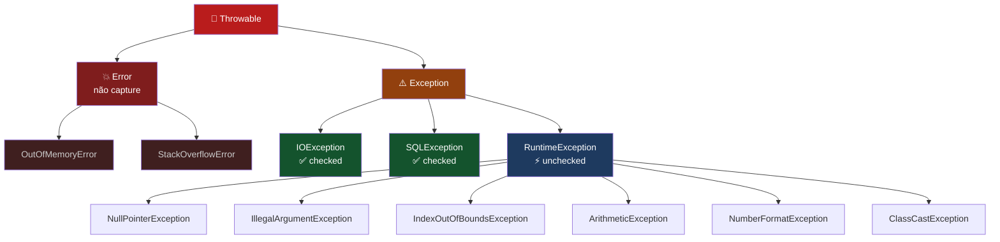
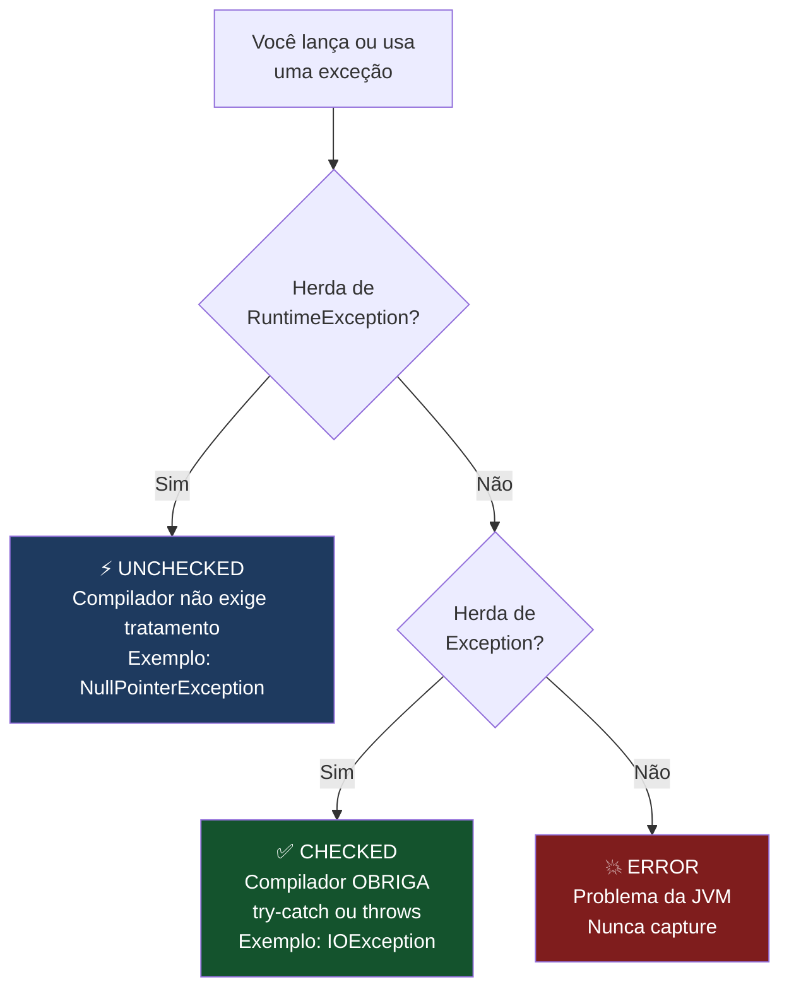
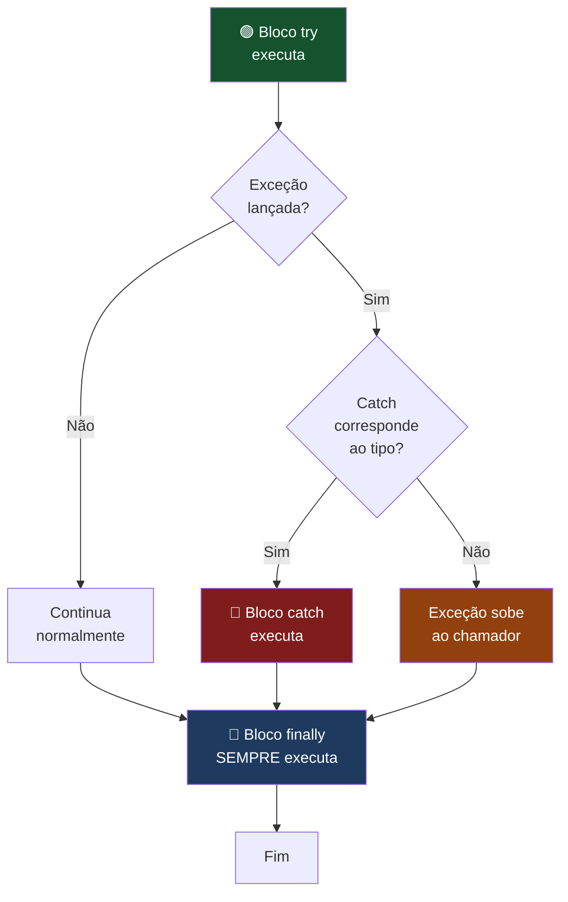
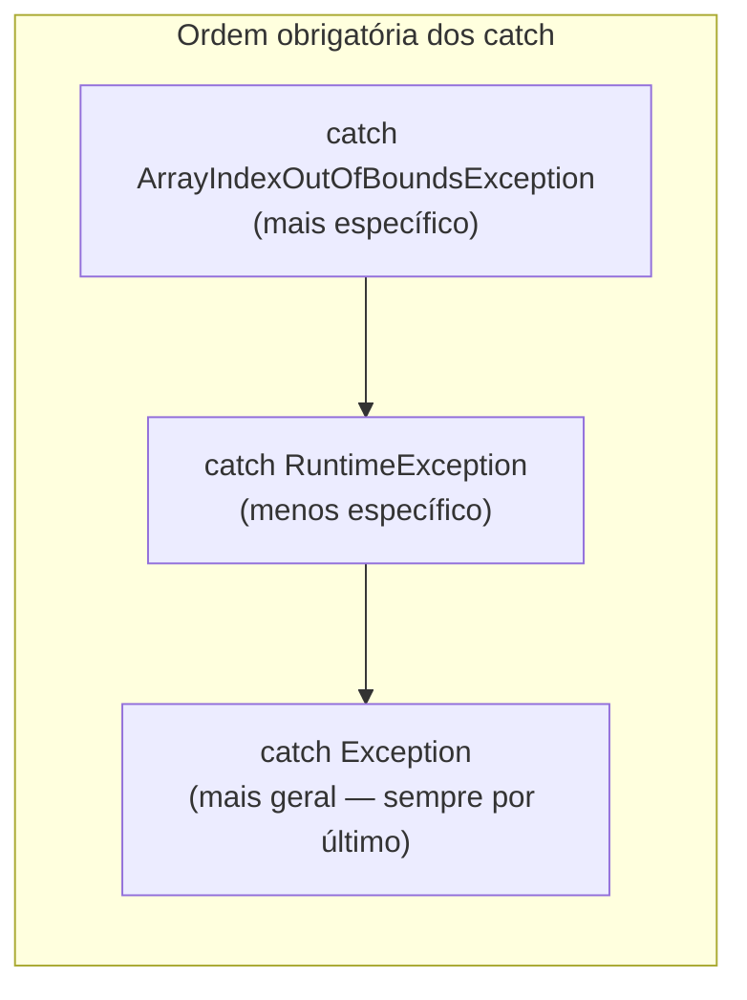
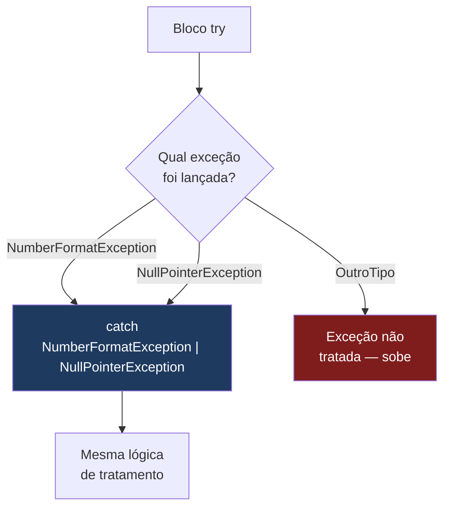
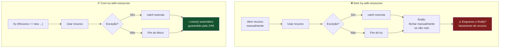
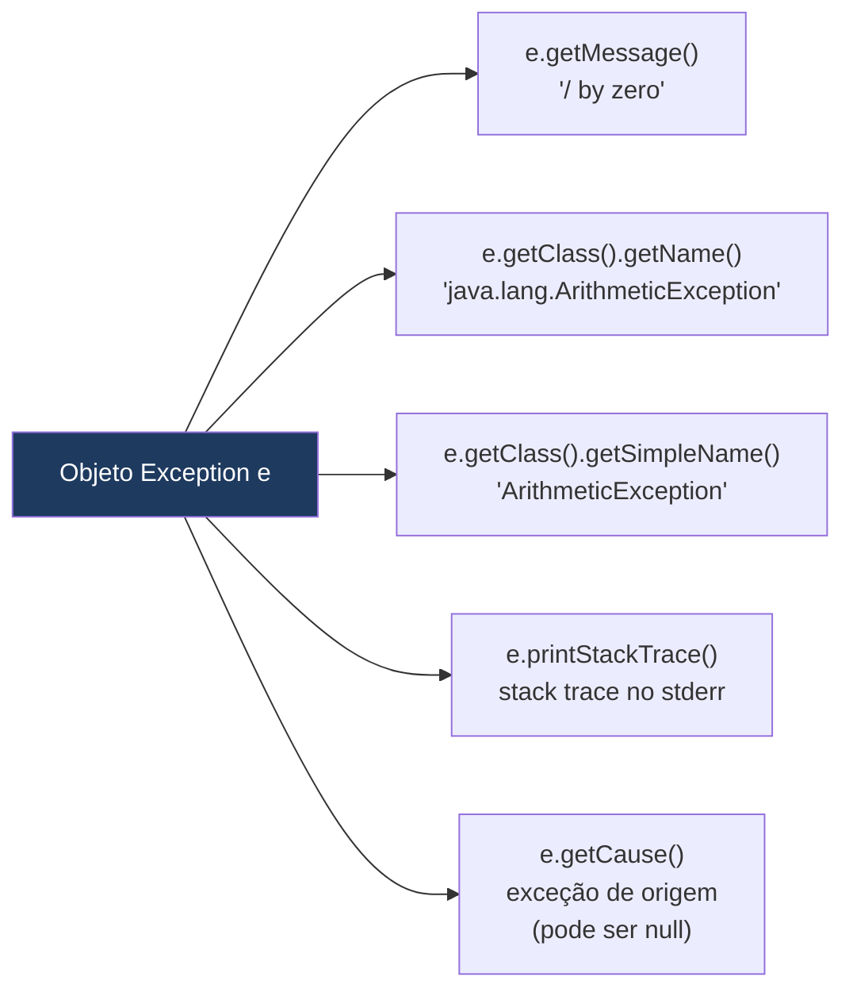
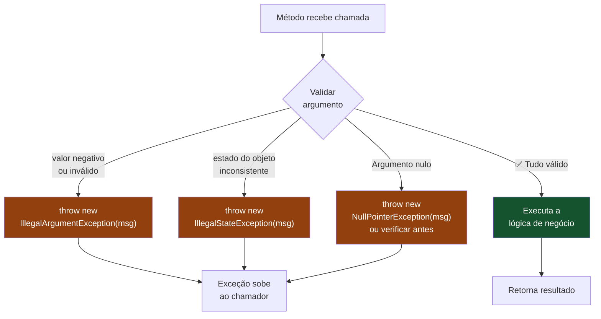
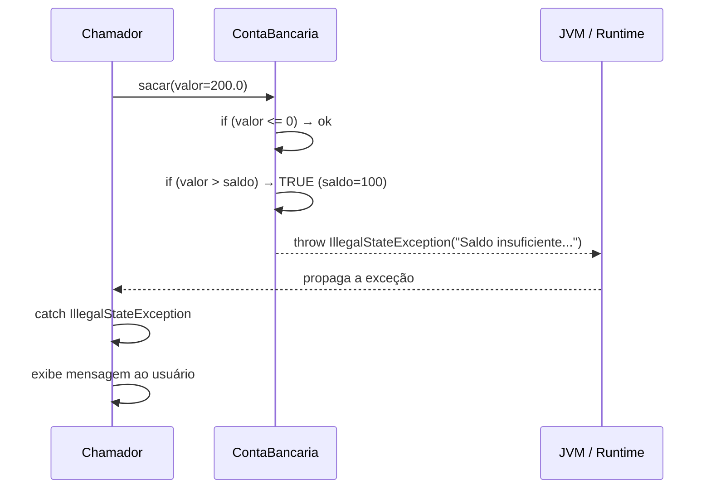
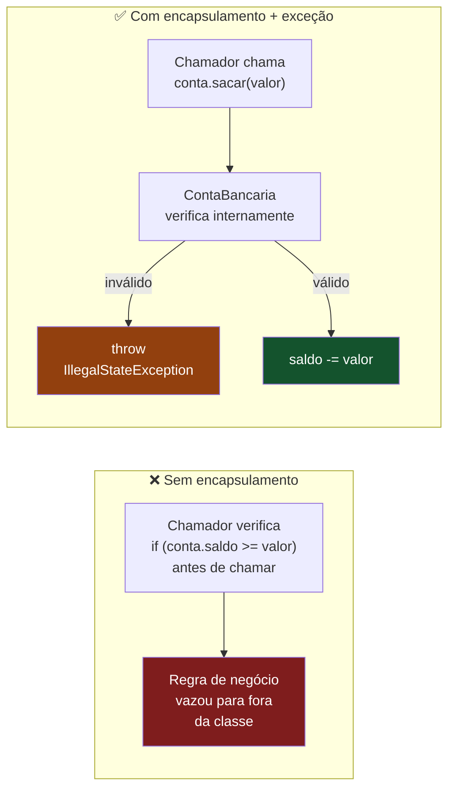

# Hierarquia de Exceções — checked vs unchecked

> **Conteúdo Complementar · Módulo 3 · 60 XP**

Encapsulamento protege os dados. Exceções comunicam quando essa proteção foi violada. Entender a hierarquia de exceções do Java é fundamental para construir sistemas que falham de forma previsível, legível e controlável.

---

## A hierarquia



> **Regra de ouro**: `Error` → nunca capture. `RuntimeException` → unchecked, sem obrigação. O restante de `Exception` → checked, compilador exige tratamento.

---

## 1. Checked vs Unchecked — a diferença prática



**Checked** (`Exception` e subclasses, exceto `RuntimeException`):
- O compilador **obriga** você a tratar ou declarar com `throws`
- Representa condições externas que o código não controla: arquivo não encontrado, conexão caiu, banco indisponível

**Unchecked** (`RuntimeException` e subclasses):
- O compilador **não obriga** tratamento
- Representa bugs de programação: null pointer, índice inválido, argumento ilegal

```java
// Checked — compilador obriga tratamento:
import java.io.FileReader;
import java.io.IOException;

// Opção A: tratar com try-catch
try {
    FileReader f = new FileReader("dados.txt");
} catch (IOException e) {
    System.err.println("Arquivo não encontrado: " + e.getMessage());
}

// Opção B: propagar com throws
public void lerArquivo(String path) throws IOException {
    FileReader f = new FileReader(path); // quem chamar este método DEVE tratar
}

// Unchecked — compilador não exige nada (mas pode explodir em runtime):
String s = null;
s.length(); // NullPointerException — não precisa de try-catch mas vai travar
```

---

## 2. try-catch-finally



> **Importante**: o `finally` executa **sempre** — com ou sem exceção, com ou sem `return` no bloco anterior.

```java
try {
    // código que pode lançar exceção
    int[] arr = new int[5];
    arr[10] = 42; // ArrayIndexOutOfBoundsException

} catch (ArrayIndexOutOfBoundsException e) {
    // captura exceção específica
    System.err.println("Índice inválido: " + e.getMessage());

} catch (NullPointerException e) {
    // múltiplos catch: do mais específico para o mais geral
    System.err.println("Referência nula: " + e.getMessage());

} catch (Exception e) {
    // catch genérico — evite usar sozinho (esconde o tipo real do erro)
    System.err.println("Erro inesperado: " + e.getMessage());

} finally {
    // SEMPRE executa — com ou sem exceção, com ou sem return
    System.out.println("Bloco finally executado.");
}
```



> **Regra**: ordene os `catch` do mais específico ao mais geral. Se colocar `catch (Exception e)` primeiro, os demais blocos nunca executam (erro de compilação).

---

## 3. Multi-catch — Java 7+



Use multi-catch quando **dois tipos de exceção têm o mesmo tratamento**:

```java
try {
    String s = null;
    int n = Integer.parseInt(s); // NumberFormatException (s é null)
    System.out.println(s.length()); // NullPointerException

} catch (NumberFormatException | NullPointerException e) {
    // trata dois tipos com a mesma lógica
    System.err.println("Entrada inválida: " + e.getClass().getSimpleName());
}
```

---

## 4. try-with-resources — Java 7+

Recursos que implementam `AutoCloseable` (Scanner, FileReader, conexões de banco) são fechados automaticamente, mesmo em caso de exceção:



```java
import java.io.*;

// Sem try-with-resources: precisa de finally para fechar
BufferedReader br = null;
try {
    br = new BufferedReader(new FileReader("arquivo.txt"));
    System.out.println(br.readLine());
} catch (IOException e) {
    e.printStackTrace();
} finally {
    if (br != null) try { br.close(); } catch (IOException e) { /* ignorar */ }
}

// Com try-with-resources: fecha automaticamente
try (BufferedReader br = new BufferedReader(new FileReader("arquivo.txt"))) {
    System.out.println(br.readLine());
} catch (IOException e) {
    System.err.println("Erro ao ler arquivo: " + e.getMessage());
}
// br.close() é chamado automaticamente aqui — mesmo se houve exceção
```

---

## 5. getMessage(), getClass(), printStackTrace()

Quando você captura uma exceção, o objeto `e` carrega informações sobre o que aconteceu:

| Método | O que retorna | Exemplo de saída |
|--------|--------------|-----------------|
| `e.getMessage()` | A mensagem passada ao construtor | `"/ by zero"` |
| `e.getClass().getName()` | Nome completo com pacote | `"java.lang.ArithmeticException"` |
| `e.getClass().getSimpleName()` | Só o nome da classe | `"ArithmeticException"` |
| `e.printStackTrace()` | Stack trace completo no stderr | veja abaixo |
| `e.getCause()` | A exceção que originou esta | útil em exception chaining |



```java
try {
    int resultado = 10 / 0;
} catch (ArithmeticException e) {
    e.getMessage();              // "/ by zero"
    e.getClass().getName();      // "java.lang.ArithmeticException"
    e.getClass().getSimpleName();// "ArithmeticException"
    e.printStackTrace();         // imprime stack trace completo no stderr
    
    // Para logar em String (útil para sistemas reais):
    StringWriter sw = new StringWriter();
    e.printStackTrace(new PrintWriter(sw));
    String stackTrace = sw.toString();
}
```

---

## 6. throw — lançando exceções manualmente



```java
public void setIdade(int idade) {
    if (idade < 0 || idade > 150) {
        throw new IllegalArgumentException("Idade inválida: " + idade);
        // IllegalArgumentException é unchecked — não precisa de throws na assinatura
    }
    this.idade = idade;
}

public void lerArquivoCritico(String path) throws IOException {
    if (path == null || path.isBlank()) {
        throw new IllegalArgumentException("Caminho não pode ser nulo ou vazio");
    }
    // IOException é checked — precisa do "throws IOException"
    BufferedReader br = new BufferedReader(new FileReader(path));
    // ...
}
```

> **Quando usar qual?**
>
> | Situação | Exception recomendada |
> |----------|----------------------|
> | Argumento com valor inválido | `IllegalArgumentException` |
> | Objeto em estado inválido para a operação | `IllegalStateException` |
> | Parâmetro que não deveria ser null | `NullPointerException` ou verificar antes |
> | Índice fora do intervalo | `IndexOutOfBoundsException` |
> | Operação não suportada | `UnsupportedOperationException` |

---

## 7. Relação com Encapsulamento

Exceções são a **voz do encapsulamento**. Quando uma invariante de classe é violada, a classe comunica isso através de uma exceção.





```java
class ContaBancaria {
    private double saldo;
    private static final double SALDO_MINIMO = 0.0;

    public void sacar(double valor) {
        // Guarda o encapsulamento: a regra de negócio vive AQUI, não no chamador
        if (valor <= 0) {
            throw new IllegalArgumentException("Valor de saque deve ser positivo. Recebido: " + valor);
        }
        if (valor > saldo) {
            throw new IllegalStateException(
                String.format("Saldo insuficiente. Saldo: R$%.2f | Saque solicitado: R$%.2f", saldo, valor)
            );
        }
        saldo -= valor;
    }
}

// No chamador — duas abordagens:
ContaBancaria conta = new ContaBancaria(100.0);

// Abordagem 1: deixar propagar (quando o chamador não sabe como tratar)
conta.sacar(200.0); // IllegalStateException sobe até quem sabe lidar

// Abordagem 2: tratar localmente
try {
    conta.sacar(200.0);
} catch (IllegalStateException e) {
    System.err.println("Operação negada: " + e.getMessage());
} catch (IllegalArgumentException e) {
    System.err.println("Entrada inválida: " + e.getMessage());
}
```

---

## Troubleshooting

O código abaixo tem **4 problemas** relacionados a exceções. Identifique cada um:

```java
public class Processador {

    // problema 1
    public void processar(String entrada) throws Exception {
        if (entrada == null) throw new Exception("Entrada nula");
        System.out.println(entrada.toUpperCase());
    }

    // problema 2
    public double dividir(double a, double b) {
        try {
            return a / b;
        } catch (Exception e) {
            return 0;
        }
    }

    // problema 3
    public void lerDados() {
        try {
            BufferedReader br = new BufferedReader(new FileReader("dados.txt"));
            System.out.println(br.readLine());
        } catch (IOException e) {
            // problema 4
        }
    }
}
```

> **Gabarito:**
> 1. Usar `throws Exception` genérico obriga todos os chamadores a tratar `Exception`, que é amplo demais. Use `throws IllegalArgumentException` (unchecked, nem precisa de throws) ou uma exception específica
> 2. `a / b` com double **não lança** `ArithmeticException` — divide por zero retorna `Infinity`. O try-catch é desnecessário. Divisão inteira (`int a, int b`) sim lança. Além disso, retornar 0 silenciosamente esconde o problema
> 3. `BufferedReader br` não é fechado se houver exceção antes de `readLine()`. Use try-with-resources
> 4. Catch vazio silencia o erro completamente — o código continua como se nada tivesse acontecido. Sempre no mínimo: `e.printStackTrace()` ou `throw new RuntimeException("Falha ao ler dados", e)`

---

## Exercícios

**Exercício 1** — Converta o seguinte código para usar try-with-resources e trate `IOException` adequadamente (não silenciosamente):

```java
Scanner sc = new Scanner(new File("entrada.txt"));
while (sc.hasNextLine()) System.out.println(sc.nextLine());
sc.close();
```

**Exercício 2** — Refatore a classe `ContaBancaria` do Módulo 3 para lançar `IllegalArgumentException` em vez de usar JOptionPane nas validações. Qual abordagem tem melhor separação de responsabilidades?

**Exercício 3** — Crie um método `parseNotaSegura(String input)` que: retorna o double se válido (0–10), lança `NumberFormatException` (já existe no Java) se não for número, lança `IllegalArgumentException("Nota deve estar entre 0 e 10")` se fora do range.

**Exercício 4** — Identifique quais das exceções a seguir são checked e quais são unchecked, e quando cada uma seria lançada: `FileNotFoundException`, `NullPointerException`, `SQLException`, `IndexOutOfBoundsException`, `ClassNotFoundException`, `ArithmeticException`.

**Exercício 5** — Implemente um parser de arquivo CSV simples que usa multi-catch para tratar `IOException` (arquivo não lido) e `NumberFormatException` (valor não é número) com mensagens de erro distintas.

> **Gabarito:**
> Exercício 4:
> - **Checked**: `FileNotFoundException`, `SQLException`, `ClassNotFoundException` — representam condições externas
> - **Unchecked**: `NullPointerException`, `IndexOutOfBoundsException`, `ArithmeticException` — representam bugs de programação
