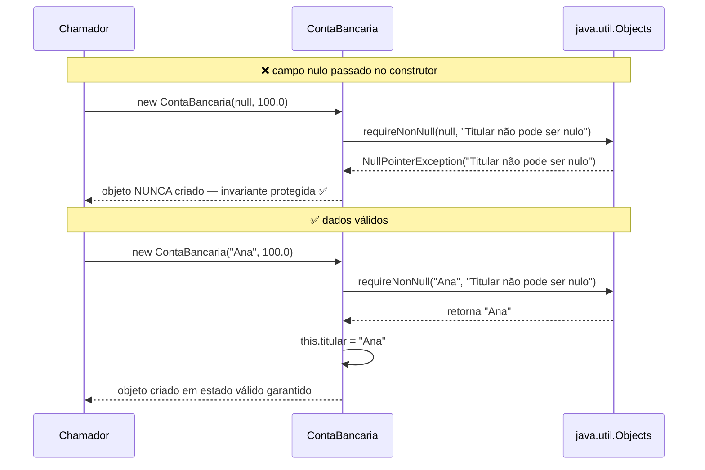
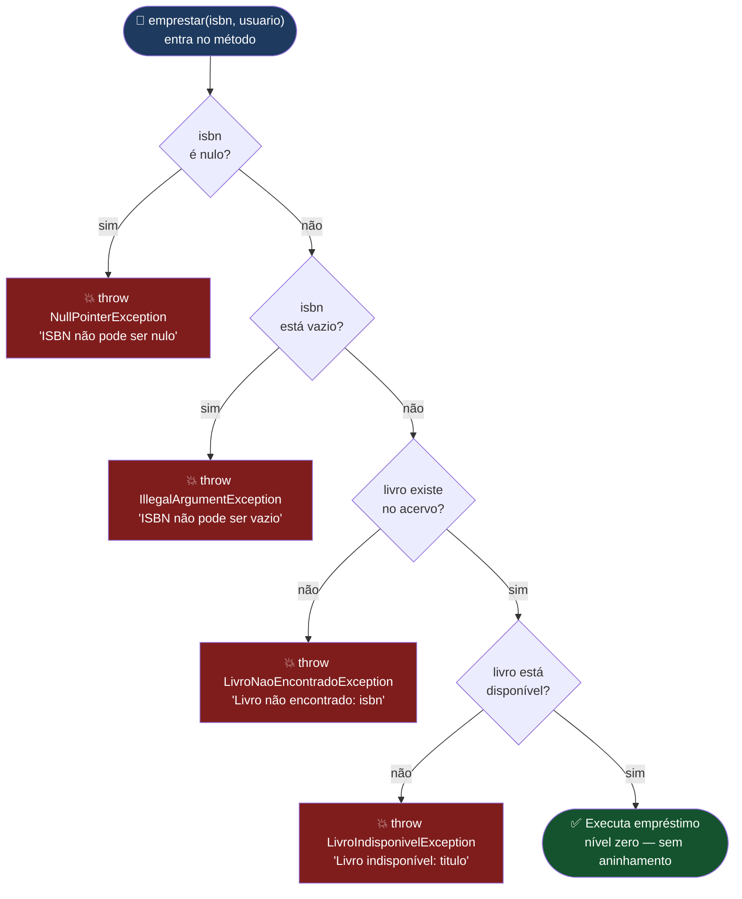
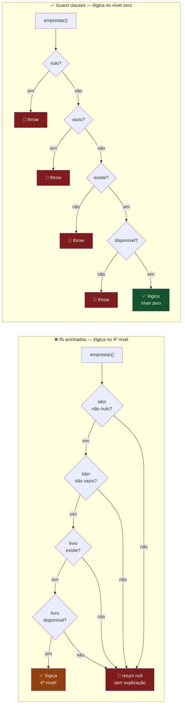
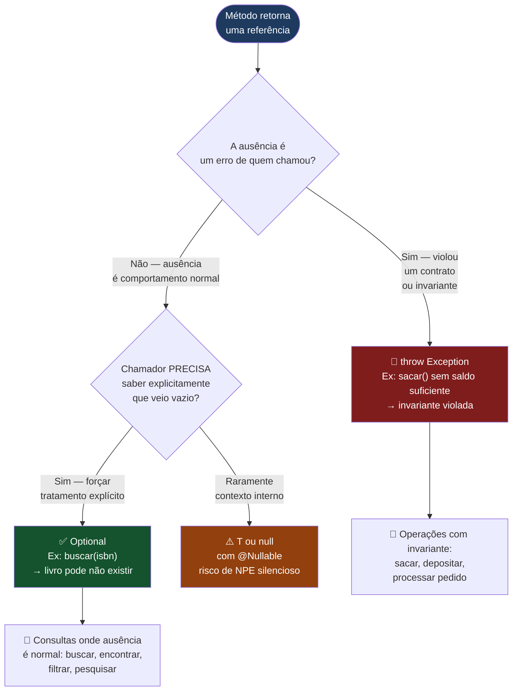
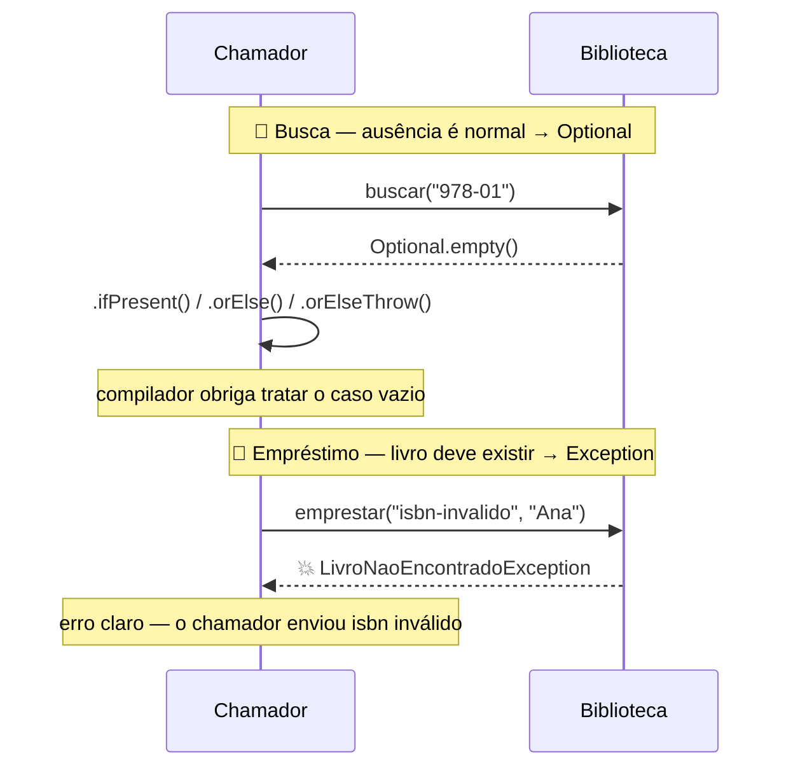

# Exceções de Domínio e Custom Exceptions

> **Conteúdo Complementar · Módulo 3 · 60 XP**

Exceções genéricas do Java — `IllegalArgumentException`, `IllegalStateException` — são úteis, mas não revelam o vocabulário do negócio. Um sistema bancário real não lança `IllegalStateException("saldo insuficiente")` — ele lança `SaldoInsuficienteException`. Um sistema médico lança `PacienteNaoEncontradoException`, não `RuntimeException("not found")`.

Custom exceptions são o OO aplicado ao tratamento de erros.

---

## 1. Criando sua primeira exception customizada

```java
// Herdar de RuntimeException → unchecked (recomendado para erros de domínio)
public class SaldoInsuficienteException extends RuntimeException {

    // Construtor mínimo
    public SaldoInsuficienteException(String message) {
        super(message);
    }

    // Construtor com causa (exception chaining)
    public SaldoInsuficienteException(String message, Throwable cause) {
        super(message, cause);
    }
}

// Uso:
throw new SaldoInsuficienteException(
    String.format("Saldo insuficiente. Disponível: R$%.2f | Solicitado: R$%.2f", saldo, valor)
);
```

---

## 2. checked vs unchecked — qual escolher?

A maioria dos sistemas modernos prefere **unchecked** para exceções de domínio:

| | Checked (`extends Exception`) | Unchecked (`extends RuntimeException`) |
|---|---|---|
| Compilador exige | `try-catch` ou `throws` | Nada |
| Quando usar | Falhas **externas** recuperáveis (IO, rede, banco) | Violações de regras de negócio |
| Problema | Polui todas as assinaturas com `throws` | Pode ser ignorado acidentalmente |
| Tendência atual | Spring, JPA, Hibernate | Exceções de domínio |

```java
// Checked — boa para: arquivo não encontrado (usuário pode escolher outro)
public class ArquivoNaoEncontradoException extends Exception {
    public ArquivoNaoEncontradoException(String path) {
        super("Arquivo não encontrado: " + path);
    }
}

// Unchecked — boa para: regra de negócio violada
public class EstoqueInsuficienteException extends RuntimeException {
    private final int quantidadeSolicitada;
    private final int quantidadeDisponivel;

    public EstoqueInsuficienteException(int solicitado, int disponivel) {
        super(String.format("Estoque insuficiente. Solicitado: %d | Disponível: %d",
              solicitado, disponivel));
        this.quantidadeSolicitada = solicitado;
        this.quantidadeDisponivel = disponivel;
    }

    // Getters para quem quiser dados estruturados do erro
    public int getQuantidadeSolicitada() { return quantidadeSolicitada; }
    public int getQuantidadeDisponivel() { return quantidadeDisponivel; }
}
```

---

## 3. Hierarquia de exceptions de domínio

Em sistemas maiores, organize suas exceptions numa hierarquia:

```java
// Exception raiz do domínio — captura tudo relacionado ao sistema
public class SistemaBancarioException extends RuntimeException {
    public SistemaBancarioException(String message) { super(message); }
    public SistemaBancarioException(String message, Throwable cause) { super(message, cause); }
}

// Exceções específicas herdam da raiz do domínio
public class ContaNaoEncontradaException extends SistemaBancarioException {
    public ContaNaoEncontradaException(String numeroConta) {
        super("Conta não encontrada: " + numeroConta);
    }
}

public class SaldoInsuficienteException extends SistemaBancarioException {
    public SaldoInsuficienteException(double saldo, double valor) {
        super(String.format("Saldo insuficiente. Saldo: R$%.2f | Saque: R$%.2f", saldo, valor));
    }
}

public class ContaBloqueadaException extends SistemaBancarioException {
    public ContaBloqueadaException(String motivo) {
        super("Conta bloqueada: " + motivo);
    }
}
```

Agora quem quiser capturar qualquer erro bancário usa `catch (SistemaBancarioException e)`, e quem quiser específico usa o tipo exato:

```java
try {
    banco.sacar("0001", 5000.0);
} catch (ContaNaoEncontradaException e) {
    System.err.println("Conta inválida: " + e.getMessage());
} catch (ContaBloqueadaException e) {
    System.err.println("Operação bloqueada: " + e.getMessage());
} catch (SaldoInsuficienteException e) {
    System.err.println("Saldo insuficiente: " + e.getMessage());
} catch (SistemaBancarioException e) {
    // Captura qualquer outro erro bancário não tratado acima
    System.err.println("Erro bancário: " + e.getMessage());
}
```

---

## 4. Exception chaining — encadeamento

Quando uma exception de baixo nível (ex: `SQLException`) causa uma de alto nível (ex: `RepositorioException`), preserve a causa original:

```java
public class RepositorioException extends RuntimeException {
    public RepositorioException(String message, Throwable cause) {
        super(message, cause); // preserva a stack trace original
    }
}

// No código de acesso a dados:
try {
    // simulando acesso ao banco de dados
    throw new Exception("Connection refused"); // causa original
} catch (Exception e) {
    // Encadeia: RepositorioException causada pela SQLException
    throw new RepositorioException("Falha ao buscar dados do usuário", e);
}

// Ao capturar:
try {
    repositorio.buscar("user123");
} catch (RepositorioException e) {
    System.err.println("Erro: " + e.getMessage());
    System.err.println("Causa: " + e.getCause().getMessage()); // causa original
}
```

---

## 5. Onde jogar vs onde capturar

**Regra geral**: jogue onde a regra é violada, capture onde você sabe o que fazer.

```java
// Camada de domínio: JOGA a exception (não sabe como apresentar ao usuário)
class ContaBancaria {
    public void sacar(double valor) {
        if (valor > saldo) throw new SaldoInsuficienteException(saldo, valor);
        saldo -= valor;
    }
}

// Camada de serviço: propaga ou traduz
class BancoService {
    public void realizarTransferencia(String origem, String destino, double valor) {
        Conta co = encontrarConta(origem); // pode lançar ContaNaoEncontradaException
        Conta cd = encontrarConta(destino);
        co.sacar(valor);    // pode lançar SaldoInsuficienteException
        cd.depositar(valor);
    }
    // Não captura aqui — propaga para quem sabe o que fazer
}

// Camada de apresentação (JOptionPane, Controller, API): CAPTURA e apresenta
public class Main {
    public static void main(String[] args) {
        try {
            bancoService.realizarTransferencia("0001", "0002", 1000.0);
            JOptionPane.showMessageDialog(null, "Transferência realizada!");
        } catch (SaldoInsuficienteException e) {
            JOptionPane.showMessageDialog(null, e.getMessage(), "Erro", JOptionPane.WARNING_MESSAGE);
        } catch (ContaNaoEncontradaException e) {
            JOptionPane.showMessageDialog(null, e.getMessage(), "Erro", JOptionPane.ERROR_MESSAGE);
        }
    }
}
```

---

## 6. Guard clauses + `Objects.requireNonNull` — falha rápido, lógica no nível zero

Exceções mudam a **geometria do código**. Com `throw`, cada validação inválida encerra o método imediatamente — eliminando aninhamento e deixando a lógica real no nível zero.

`Objects.requireNonNull` é o idioma Java para null checks no construtor — mais expressivo que um `if` manual e é o que todo código profissional usa:



Agora veja o impacto de `throw` na **estrutura de um método** de empréstimo:



Comparando as duas estruturas lado a lado:



```java
import java.util.Objects;

// ❌ Ifs aninhados — cada validação aprofunda um nível de indentação
public String emprestar(String isbn, String nomeUsuario) {
    if (isbn != null) {
        if (!isbn.isBlank()) {
            Livro livro = acervo.get(isbn);
            if (livro != null) {
                if (livro.disponivel) {
                    // lógica real — 4º nível de indentação
                    livro.disponivel = false;
                    String id = "EMP-" + System.currentTimeMillis();
                    emprestimos.put(id, isbn);
                    return id;
                }
            }
        }
    }
    return null; // chamador não sabe o que deu errado
}

// ✅ Guard clauses — cada throw "corta" o fluxo; lógica real no nível zero
public String emprestar(String isbn, String nomeUsuario) {
    Objects.requireNonNull(isbn, "ISBN não pode ser nulo"); // idioma Java para null check
    if (isbn.isBlank())     throw new IllegalArgumentException("ISBN não pode ser vazio");
    Livro livro = acervo.get(isbn);
    if (livro == null)      throw new LivroNaoEncontradoException(isbn);
    if (!livro.disponivel)  throw new LivroIndisponivelException(livro.titulo);

    // lógica real — nível zero, sem aninhamento, fácil de ler
    livro.disponivel = false;
    String id = "EMP-" + System.currentTimeMillis();
    emprestimos.put(id, isbn);
    return id;
}

// Objects.requireNonNull no construtor — protege o objeto desde o nascimento
public class ContaBancaria {
    private final String titular; // final garante imutabilidade após construção
    private double saldo;

    public ContaBancaria(String titular, double saldo) {
        // idioma Java: mais legível que "if (titular == null) throw new NullPointerException(...)"
        this.titular = Objects.requireNonNull(titular, "Titular não pode ser nulo");
        if (saldo < 0) throw new IllegalArgumentException("Saldo inicial não pode ser negativo: " + saldo);
        this.saldo = saldo;
    }
    // Garantia: se o objeto existe, titular != null e saldo >= 0
}
```

> **Princípio**: faça o código **falhar cedo, claro e rápido**. Cada `throw` é uma guarda que elimina estados inválidos antes da lógica de negócio. O leitor chega à lógica real sem decifrar aninhamento.

---

## 7. `Optional<T>` vs Exception — quando não lançar

Nem toda ausência de valor é um erro. `Optional` e exception têm **semânticas diferentes** — escolher errado comunica uma intenção incorreta ao chamador:





```java
class Biblioteca {

    // buscar — é NORMAL não encontrar → Optional
    public Optional<Livro> buscar(String isbn) {
        return Optional.ofNullable(acervo.get(isbn));
    }

    // emprestar — o livro DEVE existir neste contexto → exception
    public String emprestar(String isbn, String usuario) {
        Livro livro = acervo.get(isbn);
        if (livro == null) throw new LivroNaoEncontradoException(isbn); // bug do chamador
        if (!livro.disponivel) throw new LivroIndisponivelException(livro.titulo);
        // ...
    }
}

// Chamador com Optional — compilador não deixa esquecer o caso vazio:
biblioteca.buscar("978-01")
    .ifPresent(livro -> System.out.println("Encontrado: " + livro.titulo));

// Se a ausência se tornar erro pra você, converta no ponto correto:
Livro livro = biblioteca.buscar("978-01")
    .orElseThrow(() -> new LivroNaoEncontradoException("978-01"));

// Chamador com exception — trata o erro diretamente:
try {
    String id = biblioteca.emprestar("978-99", "Ana");
} catch (LivroNaoEncontradoException e) {
    System.err.println(e.getMessage()); // "Livro não encontrado: ISBN 978-99"
}
```

| Situação | Use |
|----------|-----|
| Busca onde o item pode legitimamente não existir | `Optional<T>` |
| Operação onde a ausência viola regra de negócio | `throw Exception` |
| Valor de configuração com fallback natural | `Optional<T>` com `.orElse(padrao)` |
| Campo obrigatório em construtor | `Objects.requireNonNull` |

---

## 8. Boas práticas — o que fazer e o que evitar

```java
// ❌ Exception vaga — sem informação útil
throw new RuntimeException("Erro");

// ✅ Exception específica com contexto
throw new SaldoInsuficienteException(saldo, valorSolicitado);

// ❌ Capturar e silenciar
try { operacao(); } catch (Exception e) { }

// ✅ Capturar e tratar ou relançar com contexto
try { operacao(); } catch (Exception e) {
    logger.error("Falha ao executar operação", e);
    throw new ServicoException("Falha na operação X", e);
}

// ❌ Usar exceptions para controle de fluxo normal
try {
    return lista.get(indice);
} catch (IndexOutOfBoundsException e) {
    return null; // use if (indice < lista.size()) em vez disso!
}

// ❌ Capturar Throwable ou Error
catch (Throwable t) { } // nunca — inclui OutOfMemoryError, StackOverflow...

// ✅ Exception com dados estruturados para programas que precisam inspecionar
public class ProdutoSemEstoqueException extends RuntimeException {
    private final String codigoProduto;
    private final int quantidadeSolicitada;
    // construtor + getters
}
```

---

## 9. Exemplo completo — Sistema de Biblioteca

```java
// Hierarquia de domínio
class BibliotecaException extends RuntimeException {
    BibliotecaException(String msg) { super(msg); }
    BibliotecaException(String msg, Throwable c) { super(msg, c); }
}
class LivroNaoEncontradoException  extends BibliotecaException {
    LivroNaoEncontradoException(String isbn)  { super("Livro não encontrado: ISBN " + isbn); }
}
class LivroIndisponivelException   extends BibliotecaException {
    LivroIndisponivelException(String titulo)  { super("Livro indisponível: " + titulo); }
}
class EmprestimoNaoEncontradoException extends BibliotecaException {
    EmprestimoNaoEncontradoException(String id){ super("Empréstimo não encontrado: " + id); }
}

class Livro {
    String isbn, titulo;
    boolean disponivel = true;
    Livro(String isbn, String titulo) { this.isbn = isbn; this.titulo = titulo; }
}

class Biblioteca {
    private Map<String, Livro> acervo = new HashMap<>();
    private Map<String, String> emprestimos = new HashMap<>(); // empId → isbn

    void cadastrar(Livro livro) { acervo.put(livro.isbn, livro); }

    String emprestar(String isbn, String nomeUsuario) {
        Livro livro = acervo.get(isbn);
        if (livro == null)        throw new LivroNaoEncontradoException(isbn);
        if (!livro.disponivel)    throw new LivroIndisponivelException(livro.titulo);
        livro.disponivel = false;
        String id = "EMP-" + System.currentTimeMillis();
        emprestimos.put(id, isbn);
        return id;
    }

    void devolver(String empId) {
        String isbn = emprestimos.get(empId);
        if (isbn == null) throw new EmprestimoNaoEncontradoException(empId);
        acervo.get(isbn).disponivel = true;
        emprestimos.remove(empId);
    }
}

public class Main {
    public static void main(String[] args) {
        Biblioteca bib = new Biblioteca();
        bib.cadastrar(new Livro("978-01", "Clean Code"));

        try {
            String empId = bib.emprestar("978-01", "Ana");
            System.out.println("Empréstimo: " + empId);
            bib.emprestar("978-01", "Bruno"); // livro já emprestado
        } catch (LivroIndisponivelException e) {
            System.err.println(e.getMessage()); // "Livro indisponível: Clean Code"
        } catch (BibliotecaException e) {
            System.err.println("Erro geral: " + e.getMessage());
        }
    }
}
```

---

## Troubleshooting

```java
public class Processador {
    public double calcularMedia(List<Double> notas) {
        try {
            double soma = notas.stream().mapToDouble(Double::doubleValue).sum();
            return soma / notas.size();
        } catch (ArithmeticException e) {
            return 0; // problema 1
        }
    }

    public Produto buscarProduto(String codigo) {
        // problema 2
        throw new Exception("Produto não encontrado: " + codigo);
    }

    public void processar() {
        try {
            operacaoAriscada();
        } catch (RuntimeException e) {
            throw new RuntimeException("Erro no processamento"); // problema 3
        }
    }
}
```

> **Gabarito:**
> 1. `ArithmeticException` não é lançada com double (`/0.0` retorna `Infinity`). O problema real é `notas.size() == 0` que causa divisão por zero apenas com `int`. A solução correta: verificar antes — `if (notas.isEmpty()) throw new IllegalArgumentException("Lista de notas vazia")`
> 2. `throw new Exception(...)` em método não-declarado com `throws Exception`. Solução: usar `throw new RuntimeException(...)` (unchecked) ou declarar `throws Exception` na assinatura
> 3. Ao relançar, a causa original é perdida. Solução: `throw new RuntimeException("Erro no processamento", e)` — preserva o stack trace original

---

## Exercícios

**Exercício 1** — Crie a hierarquia de exceptions para um sistema de academia: `AcademiaException` → `AlunoNaoEncontradoException`, `PlanoVencidoException`, `ModalidadeIndisponivelException`. Implemente uma classe `Academia` que lança cada uma delas.

**Exercício 2** — Refatore a `ContaBancaria` do Módulo 3 substituindo todos os `JOptionPane.showMessageDialog` por `throws SaldoInsuficienteException` e `throws ValorInvalidoException`. A camada `JOptionPane` fica no `main`, não na classe.

**Exercício 3** — Implemente `parseIntComMensagem(String s, String nomeCampo)` que lança `IllegalArgumentException("Campo 'nomeCampo' inválido: 'valor' não é um número inteiro")` quando o parse falha. Use exception chaining preservando o `NumberFormatException` original.

**Exercício 4** — Crie `EstoqueException` com campos `codigoProduto`, `quantidadeDisponivel` e `quantidadeSolicitada`. Na camada de apresentação, use esses campos para montar a mensagem do JOptionPane (não a mensagem genérica da exception).

**Exercício 5** — Leia um arquivo CSV de notas (formato: `matricula,nota1,nota2`) e trate separadamente: arquivo não encontrado, linha com formato inválido, nota fora do range 0-10. Use exceptions customizadas para os dois últimos.

**Exercício 6** — Refatore o método `sacar(double valor)` da `ContaBancaria` usando guard clauses com `Objects.requireNonNull` e `throw` antecipado. A lógica de débito deve ficar no nível zero — sem `if-else` aninhado. Compare o antes e depois da indentação.

**Exercício 7** — Adicione um método `buscarPorTitular(String titular)` à `ContaBancaria` que retorna `Optional<ContaBancaria>` em vez de `null` ou exception. Na camada de apresentação, use `.orElseThrow()` para converter a ausência em `ContaNaoEncontradaException` apenas quando necessário. Explique por que `buscar` usa `Optional` mas `sacar` usa exception.

> **Gabarito:**
> Exercício 3:
> ```java
> public static int parseIntComMensagem(String s, String campo) {
>     try {
>         return Integer.parseInt(s);
>     } catch (NumberFormatException e) {
>         throw new IllegalArgumentException(
>             String.format("Campo '%s' inválido: '%s' não é um número inteiro", campo, s), e
>             // segundo argumento 'e' = exception chaining — preserva causa original
>         );
>     }
> }
> ```
