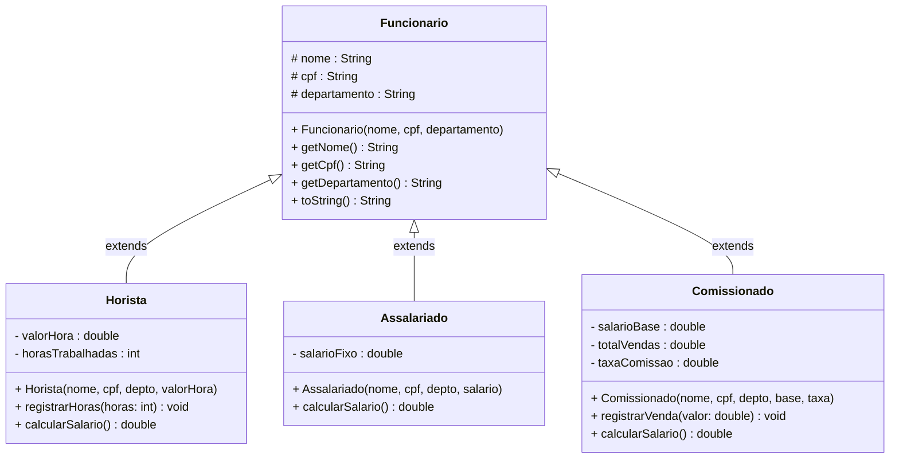
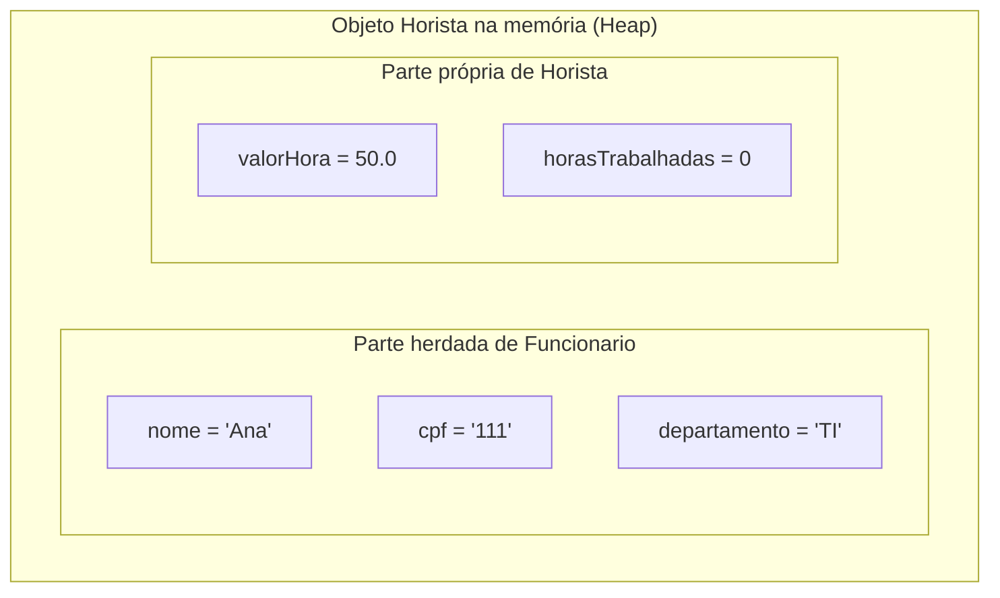

# Encontro 11 — Generalização e Especialização: Herança I

> **Módulo 4 · 4 aulas · 50 XP**

---

## 1. O problema que a Herança resolve

Imagine um sistema com três tipos de funcionários — cada um com dados e comportamentos muito parecidos:

```java
// SEM herança — duplicação de código enorme
class FuncionarioHorista {
    private String nome;
    private String cpf;
    private double valorHora;
    private int horasTrabalhadas;
    // métodos getNome, getCpf se repetem em TODAS as classes!
    double calcularSalario() { return valorHora * horasTrabalhadas; }
}

class FuncionarioAssalariado {
    private String nome;    // duplicado!
    private String cpf;     // duplicado!
    private double salarioFixo;
    double calcularSalario() { return salarioFixo; }
}

class FuncionarioComissionado {
    private String nome;    // duplicado!
    private String cpf;     // duplicado!
    private double salarioBase;
    private double totalVendas;
    private double taxaComissao;
    double calcularSalario() { return salarioBase + totalVendas * taxaComissao; }
}
```

**Problemas:**
- `nome` e `cpf` duplicados em 3 lugares — se mudar o tipo, tem que mudar em todos
- Impossível tratar todos os funcionários uniformemente (lista heterogênea)
- Qualquer regra comum (ex: "todos ganham bônus de R$ 100 no fim do ano") precisa ser implementada 3 vezes

---

## 2. A relação É-UM (Is-A)

> Use herança quando a subclasse **É-UM** tipo da superclasse — não apenas quando tem atributos iguais.

| Relação | Herança? | Motivo |
|---------|----------|--------|
| Horista É-UM Funcionario | ✅ | Todo horista é um funcionário |
| Carro É-UM Veiculo | ✅ | Todo carro é um veículo |
| Gerente TEM-UM Funcionario | ❌ | Composição, não herança |
| Cachorro É-UM Animal | ✅ | Todo cachorro é um animal |
| Pilha TEM-UM ArrayList | ❌ | Pilha usa ArrayList internamente, não É-UM |

---

> **Atenção:** Herança é a relação mais forte entre classes em Java — é permanente e inflexível. Use com critério. O maior erro dos iniciantes é usar herança para "reaproveitar código" sem que exista uma relação É-UM genuína.

### Quando NÃO usar herança — Composição é melhor

```java
// ERRADO: Gerente "herdando" de Funcionario apenas para ter os atributos
// Gerente NÃO é um Funcionario no mesmo sentido hierárquico —
// na vida real, Gerente TEM UM Funcionario subordinado
class Gerente extends Funcionario { // ❌ uso incorreto
    List<Funcionario> subordinados;
}

// CORRETO: Composição — Gerente TEM-UM cargo de Funcionario
class Gerente {
    private final Funcionario dadosFuncionais; // composição!
    private List<Funcionario> subordinados;

    Gerente(Funcionario dados) {
        this.dadosFuncionais = dados;
        this.subordinados    = new ArrayList<>();
    }

    public double calcularSalario() {
        return dadosFuncionais.calcularSalario() * 1.30; // bônus de 30%
    }
}
```

| Sinal de alerta | Diagnóstico |
|-----------------|-------------|
| A subclasse usa apenas 30% dos métodos da superclasse | Provavelmente é composição |
| Precisa "desativar" métodos herdados retornando `null` ou lançando `UnsupportedOperationException` | Está violando o LSP |
| A relação É-UM não faz sentido no domínio do problema | Use composição |
| A superclasse é de uma biblioteca externa e você não controla | Use composição (Decorator Pattern) |

---

## 3. A palavra-chave `extends`



```java
// A SUPERCLASSE — contém o que é COMUM a todos os funcionários
public class Funcionario {
    // 'protected' — visível para esta classe e todas as subclasses
    protected String nome;
    protected String cpf;
    protected String departamento;

    public Funcionario(String nome, String cpf, String departamento) {
        if (nome == null || nome.isBlank())
            throw new IllegalArgumentException("Nome inválido.");
        this.nome         = nome;
        this.cpf          = cpf;
        this.departamento = departamento;
    }

    public String getNome()         { return nome;         }
    public String getCpf()          { return cpf;          }
    public String getDepartamento() { return departamento; }

    @Override
    public String toString() {
        return String.format("[%s | CPF: %s | Depto: %s]", nome, cpf, departamento);
    }
}

// A SUBCLASSE — herda tudo de Funcionario + adiciona o que é específico
public class Horista extends Funcionario {
    private double valorHora;
    private int horasTrabalhadas;

    public Horista(String nome, String cpf, String departamento, double valorHora) {
        super(nome, cpf, departamento); // chama o construtor da SUPERCLASSE — obrigatório!
        if (valorHora <= 0)
            throw new IllegalArgumentException("Valor da hora deve ser positivo.");
        this.valorHora        = valorHora;
        this.horasTrabalhadas = 0;
    }

    public void registrarHoras(int horas) {
        if (horas < 0) throw new IllegalArgumentException("Horas não podem ser negativas.");
        horasTrabalhadas += horas;
    }

    public double calcularSalario() {
        return valorHora * horasTrabalhadas;
    }

    @Override
    public String toString() {
        return super.toString() + String.format(" | Horista | R$ %.2f/h | %dh | Sal: R$ %.2f",
            valorHora, horasTrabalhadas, calcularSalario());
    }
}
```

---

## 4. O que é herdado — visualizando na memória

Quando criamos `new Horista("Ana", "111", "TI", 50.0)`:



**O objeto Horista É um Funcionario** — ele carrega dentro de si todos os atributos da superclasse.

---

## 5. O modificador `protected`

| Modificador | Mesma classe | Mesmo pacote | Subclasses | Qualquer lugar |
|-------------|:---:|:---:|:---:|:---:|
| `private` | ✅ | ❌ | ❌ | ❌ |
| `default` | ✅ | ✅ | ❌ | ❌ |
| `protected` | ✅ | ✅ | ✅ | ❌ |
| `public` | ✅ | ✅ | ✅ | ✅ |

```java
class Animal {
    protected String nome; // subclasses podem acessar diretamente
    private int id;        // subclasses NÃO podem acessar diretamente

    protected void emitirSom() { // subclasses herdam e podem sobrescrever
        System.out.println(nome + " fez um som.");
    }
}

class Cachorro extends Animal {
    void latir() {
        System.out.println(nome + " late: Au au!"); // OK — protected
        // System.out.println(id); // ERRO — private
    }
}
```

---

## 6. Hierarquia completa — sistema de folha de pagamento

```java
public class Assalariado extends Funcionario {
    private double salarioFixo;

    public Assalariado(String nome, String cpf, String departamento, double salario) {
        super(nome, cpf, departamento);
        if (salario <= 0) throw new IllegalArgumentException("Salário deve ser positivo.");
        this.salarioFixo = salario;
    }

    public double calcularSalario() { return salarioFixo; }

    @Override
    public String toString() {
        return super.toString() + String.format(" | Assalariado | Sal: R$ %.2f", salarioFixo);
    }
}

public class Comissionado extends Funcionario {
    private double salarioBase;
    private double totalVendas;
    private double taxaComissao; // 0.0 a 1.0

    public Comissionado(String nome, String cpf, String departamento,
                        double salarioBase, double taxaComissao) {
        super(nome, cpf, departamento);
        if (taxaComissao < 0 || taxaComissao > 1)
            throw new IllegalArgumentException("Taxa deve estar entre 0 e 1.");
        this.salarioBase   = salarioBase;
        this.totalVendas   = 0;
        this.taxaComissao  = taxaComissao;
    }

    public void registrarVenda(double valor) {
        if (valor <= 0) throw new IllegalArgumentException("Venda deve ser positiva.");
        totalVendas += valor;
    }

    public double calcularSalario() {
        return salarioBase + totalVendas * taxaComissao;
    }

    @Override
    public String toString() {
        return super.toString() + String.format(
            " | Comissionado | Base: R$ %.2f | Vendas: R$ %.2f | Sal: R$ %.2f",
            salarioBase, totalVendas, calcularSalario());
    }
}

// Uso no main
public class FolhaDePagamento {
    public static void main(String[] args) {
        Horista       ana   = new Horista("Ana",   "111", "TI",       45.0);
        Assalariado   bob   = new Assalariado("Bob","222", "RH",     3500.0);
        Comissionado  carol = new Comissionado("Carol","333","Vendas",1500.0, 0.08);

        ana.registrarHoras(160);
        carol.registrarVenda(20000.0);
        carol.registrarVenda(5000.0);

        System.out.println(ana);
        System.out.println(bob);
        System.out.println(carol);

        // Todos são Funcionarios!
        Funcionario[] equipe = { ana, bob, carol };
        double totalFolha = 0;
        for (Funcionario f : equipe) {
            // Mas ainda não posso chamar calcularSalario() aqui...
            // Isso muda no Encontro 13 com classes abstratas!
            System.out.println(f.getNome()); // OK — método herdado
        }
    }
}
```

---

## Exercícios Práticos

---

### Exercício 1 — Fácil · 25 XP
**Hierarquia Simples**

Crie a hierarquia: `Veiculo` (placa, marca, ano) → `Carro` (numeroPortas) e `Moto` (cilindrada). Ambos devem ter `calcularIPVA()`: carros pagam 4% do valor estimado (ano × 50), motos pagam 2%. Use `protected` para os atributos da superclasse.

---

### Exercício 2 — Fácil · 25 XP
**Is-A ou Has-A?**

Para cada relação abaixo, classifique como Herança (É-UM) ou Composição (TEM-UM) e justifique:

1. `ContaCorrente` e `ContaPoupanca`
2. `Pedido` e `ItemPedido`
3. `Gerente` e `Funcionario`
4. `Turma` e `Aluno`
5. `Estudante` e `PessoaFisica`
6. `Motor` e `Carro`

---

### Exercício 3 — Médio · 25 XP
**Extração Bottom-Up**

Você tem as três classes abaixo com duplicação. Extraia a superclasse `Animal` com os atributos e métodos comuns, e refatore:

```java
class Cachorro {
    String nome; int idade; String raca;
    void comer() { System.out.println(nome + " comendo."); }
    void dormir(){ System.out.println(nome + " dormindo."); }
    void latir()  { System.out.println(nome + " Au au!"); }
}
class Gato {
    String nome; int idade; String cor;
    void comer() { System.out.println(nome + " comendo."); }
    void dormir(){ System.out.println(nome + " dormindo."); }
    void miar()  { System.out.println(nome + " Miau!"); }
}
class Passaro {
    String nome; int idade; boolean voa;
    void comer() { System.out.println(nome + " comendo."); }
    void dormir(){ System.out.println(nome + " dormindo."); }
    void cantar() { System.out.println(nome + " piu piu!"); }
}
```

---

### Exercício 4 — Médio · 25 XP
**Sistema de Contas Bancárias**

Crie a hierarquia: `Conta` → `ContaCorrente` e `ContaPoupanca`.
- `Conta`: titular, numero, saldo (encapsulados), depositar(), getSaldo(), toString()
- `ContaCorrente`: limite de cheque especial, sacar() que usa o limite
- `ContaPoupanca`: taxaRendimento, aplicarRendimento() que incrementa o saldo

Use `super()` no construtor de cada subclasse. Mostre que ambas são `Conta`.

---

### Exercício 5 — Difícil · 25 XP
**Sistema de Formas Geométricas**

Crie a hierarquia: `FormaGeometrica` (cor) → `Circulo` (raio), `Retangulo` (base, altura), `Triangulo` (base, altura). Cada forma implementa `calcularArea()` e `calcularPerimetro()`. A superclasse tem `exibir()` que imprime cor + área + perímetro.

Crie um array `FormaGeometrica[]` com todas as formas, calcule a soma de todas as áreas e a forma com maior perímetro.

---

### Exercício 6 — Troubleshooting · 25 XP
**Diagnóstico: Herança Usada Incorretamente**

O código abaixo tem **3 erros de herança**. Um acessa campo `private` da superclasse diretamente, um usa herança onde deveria ser composição, e um "desativa" método herdado — sinal claro de violação do LSP. Identifique e corrija.

```java
class Animal {
    private String nome;
    private int idade;

    Animal(String nome, int idade) {
        this.nome  = nome;
        this.idade = idade;
    }

    public String getNome() { return nome; }
    public int    getIdade(){ return idade;}
    public void   emitirSom(){ System.out.println("..."); }
}

class Cachorro extends Animal {
    Cachorro(String nome, int idade) {
        super(nome, idade);
    }

    void latir() {
        // Erro 1: tenta acessar campo 'nome' que é private na superclasse
        System.out.println(nome + " está latindo!");   // não compila
    }
}

// Erro 2: Gerente herda de Funcionario só para ter os dados —
// mas Gerente TEM-UM subordinado, não É-UM tipo especial de Funcionario neste contexto
class Gerente extends Funcionario {
    Funcionario subordinado;   // composição DENTRO de herança desnecessária
}

// Erro 3: desativar método herdado com throw — violação do LSP
class Peixe extends Animal {
    Peixe(String nome) { super(nome, 0); }

    @Override
    public void emitirSom() {
        throw new UnsupportedOperationException("Peixe não emite som");
        // Quebra o contrato: quem usa Animal espera poder chamar emitirSom() sem exceção
    }
}
```

> **Dicas:** (1) Use `getNome()` em vez de acessar `nome` diretamente — é para isso que getters existem. (2) Se você precisaria explicar "Gerente É-UM Funcionario?", e a resposta é "depende do contexto", use composição. (3) Se uma subclasse não pode honrar o contrato da superclasse, ela não deve herdar — crie uma hierarquia separada ou use interface.
