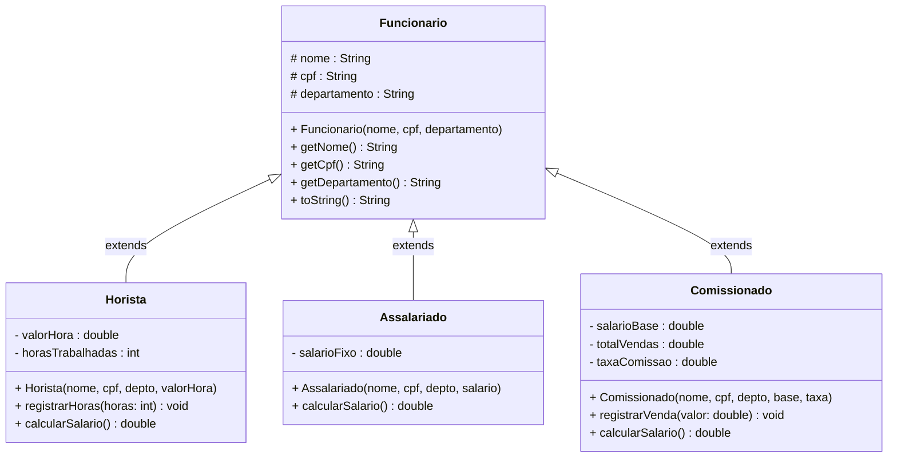
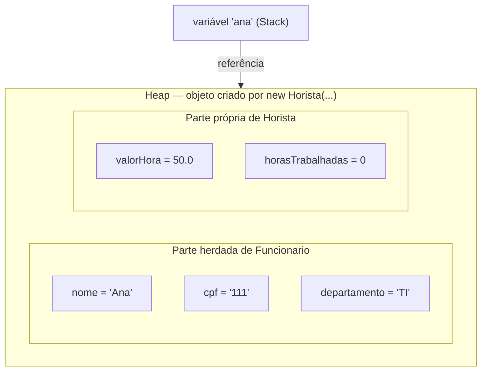
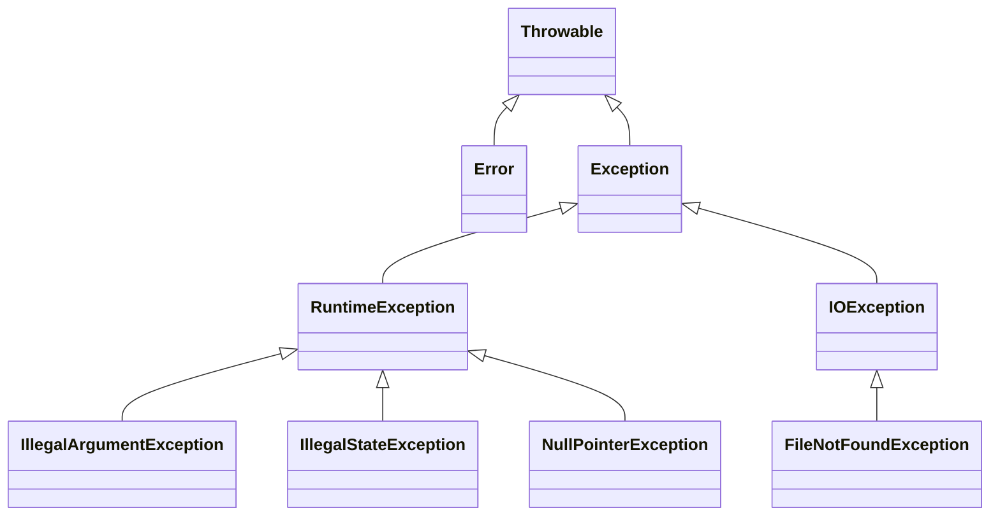
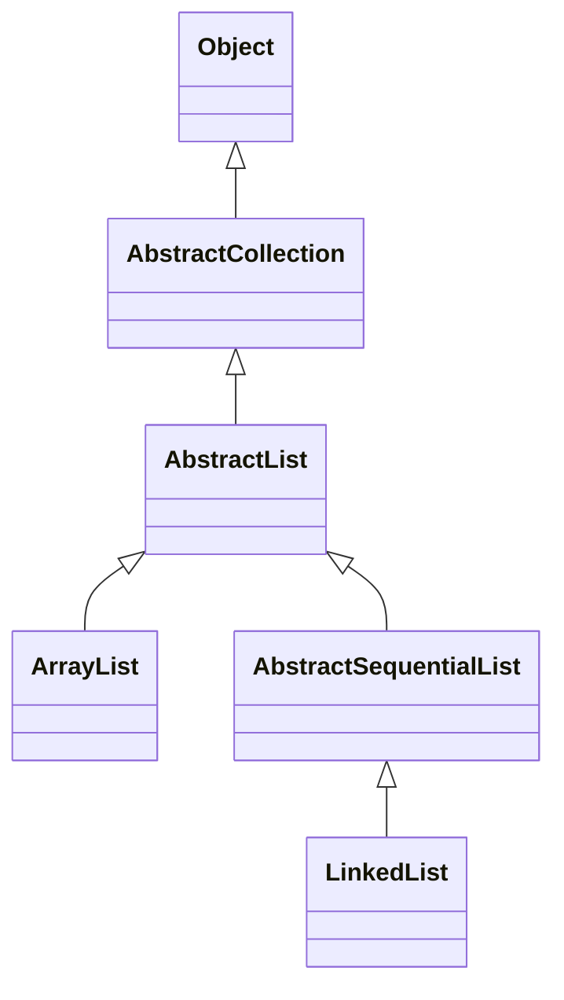
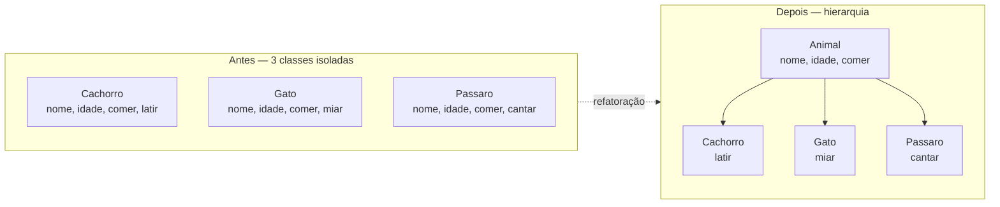

# Encontro 11 — Generalização e Especialização: Herança I

> **Módulo 4 · 4 aulas · 50 XP**

---

## 1. O problema que a Herança resolve

Imagine que você está construindo um sistema de folha de pagamento. Tem três tipos de funcionário — horista, assalariado e comissionado. Você começa a escrever as classes e logo percebe algo incômodo:

```java
// SEM herança — duplicação explosiva
class FuncionarioHorista {
    private String nome;        // ← mesmo campo
    private String cpf;         // ← mesmo campo
    private String departamento;// ← mesmo campo
    private double valorHora;
    private int horasTrabalhadas;

    double calcularSalario() { return valorHora * horasTrabalhadas; }
}

class FuncionarioAssalariado {
    private String nome;        // ← duplicado!
    private String cpf;         // ← duplicado!
    private String departamento;// ← duplicado!
    private double salarioFixo;

    double calcularSalario() { return salarioFixo; }
}

class FuncionarioComissionado {
    private String nome;        // ← duplicado de novo!
    private String cpf;         // ← duplicado de novo!
    private String departamento;// ← duplicado de novo!
    private double salarioBase;
    private double totalVendas;
    private double taxaComissao;

    double calcularSalario() { return salarioBase + totalVendas * taxaComissao; }
}
```

**Três problemas concretos que isso causa:**

| Problema | Consequência real |
|----------|-------------------|
| `nome`, `cpf` e `departamento` em 3 lugares | Se precisar mudar o tipo de `cpf` para uma classe `CPF`, tem que mudar em 3 lugares |
| Impossível tratar todos uniformemente | Não dá para ter uma lista `List<Funcionario>` que guarda os três tipos |
| Regra comum tem que ser implementada 3× | "Todos ganham bônus de R$ 100 em dezembro" → 3 métodos `darBonus()` separados |

A herança resolve exatamente isso: permite **extrair o que é comum para uma superclasse** e reutilizar em todas as subclasses.

---

## 2. A relação É-UM (Is-A) — o critério de ouro

> Antes de escrever `extends`, faça sempre essa pergunta: **"A subclasse É-UM tipo da superclasse?"**

Se a resposta for sim no **mundo real**, herança faz sentido. Se a resposta for "depende" ou "nem sempre", use composição.

| Relação | Herança? | Por quê |
|---------|:--------:|---------|
| `Horista` É-UM `Funcionario` | ✅ | Todo horista é um funcionário |
| `Carro` É-UM `Veiculo` | ✅ | Todo carro é um veículo |
| `Cachorro` É-UM `Animal` | ✅ | Todo cachorro é um animal |
| `Gerente` TEM-UM `Funcionario` | ❌ | Um gerente *gerencia* funcionários — não é um tipo especial deles |
| `Pilha` TEM-UM `ArrayList` | ❌ | Pilha *usa* ArrayList internamente — não é uma lista |
| `Turma` TEM-UM `Aluno` | ❌ | Turma contém alunos — não é um aluno |

> **Atenção:** Herança é a relação mais forte do Java — é permanente e inflexível. Use com critério. O maior erro dos iniciantes é usar herança para "reaproveitar código" sem que exista uma relação É-UM genuína.

### Quando Composição é melhor

```java
// ❌ ERRADO — Gerente não É-UM Funcionario neste sentido
class Gerente extends Funcionario {
    List<Funcionario> subordinados; // contradição: herda de Funcionario E tem Funcionario?
}

// ✅ CORRETO — Gerente TEM-UM cargo funcional (composição)
class Gerente {
    private final Funcionario dadosFuncionais; // composição
    private List<Funcionario> subordinados;

    Gerente(Funcionario dados) {
        this.dadosFuncionais = dados;
        this.subordinados    = new ArrayList<>();
    }

    public double calcularSalario() {
        return dadosFuncionais.calcularSalario() * 1.30; // bônus de 30%
    }
}
```

| Sinal de alerta | Diagnóstico |
|-----------------|-------------|
| A subclasse usa menos de 50% dos métodos herdados | Provavelmente é composição |
| Precisa "desativar" métodos herdados com `throw new UnsupportedOperationException` | Violação do Liskov Substitution Principle |
| "A É-UM B" não soa natural em português | Use composição |

---

## 3. A palavra-chave `extends`



```java
// SUPERCLASSE — contém o que é COMUM a todos os funcionários
public class Funcionario {
    // 'protected' — acessível por esta classe e todas as subclasses
    protected String nome;
    protected String cpf;
    protected String departamento;

    public Funcionario(String nome, String cpf, String departamento) {
        if (nome == null || nome.isBlank())
            throw new IllegalArgumentException("Nome inválido.");
        this.nome         = nome;
        this.cpf          = cpf;
        this.departamento = departamento;
    }

    public String getNome()         { return nome;         }
    public String getCpf()          { return cpf;          }
    public String getDepartamento() { return departamento; }

    @Override
    public String toString() {
        return String.format("[%s | CPF: %s | Depto: %s]", nome, cpf, departamento);
    }
}

// SUBCLASSE — herda tudo de Funcionario + adiciona o que é específico
public class Horista extends Funcionario {
    private double valorHora;
    private int horasTrabalhadas;

    public Horista(String nome, String cpf, String departamento, double valorHora) {
        super(nome, cpf, departamento); // ← chama o construtor da superclasse
        if (valorHora <= 0)
            throw new IllegalArgumentException("Valor da hora deve ser positivo.");
        this.valorHora        = valorHora;
        this.horasTrabalhadas = 0;
    }

    public void registrarHoras(int horas) {
        if (horas < 0) throw new IllegalArgumentException("Horas não podem ser negativas.");
        horasTrabalhadas += horas;
    }

    public double calcularSalario() {
        return valorHora * horasTrabalhadas;
    }

    @Override
    public String toString() {
        return super.toString() + String.format(" | Horista | R$ %.2f/h | %dh | Sal: R$ %.2f",
            valorHora, horasTrabalhadas, calcularSalario());
    }
}
```

---

## 4. O que é herdado — o objeto na memória

Quando `new Horista("Ana", "111", "TI", 50.0)` termina de executar, um único objeto é criado no Heap — mas ele carrega dentro de si a parte herdada de `Funcionario` e a parte própria de `Horista`:



**O que a subclasse herda automaticamente:**
- Todos os atributos `public`, `protected` e `default` da superclasse
- Todos os métodos `public`, `protected` e `default` da superclasse
- **Não herda:** atributos e métodos `private` (existem no objeto, mas são inacessíveis diretamente)
- **Não herda:** construtores (são chamados via `super()`, mas não se tornam construtores da subclasse)

---

## 5. `super()` — inicializando a superclasse

Toda subclasse precisa garantir que a superclasse seja inicializada antes de qualquer coisa sua. Isso é feito com `super()`:

```java
public Horista(String nome, String cpf, String departamento, double valorHora) {
    super(nome, cpf, departamento); // ← DEVE ser a primeira instrução
    // Só depois vêm as validações e atribuições próprias de Horista
    if (valorHora <= 0)
        throw new IllegalArgumentException("Valor da hora deve ser positivo.");
    this.valorHora = valorHora;
}
```

**Regras:**
1. `super()` deve ser a **primeira instrução** do construtor da subclasse — nada pode vir antes
2. Se você não escrever `super()`, o Java tenta chamar `super()` sem argumentos automaticamente — se a superclasse não tiver construtor sem argumentos, **não compila**
3. Os construtores são executados em cadeia, sempre do mais geral para o mais específico

> No **Encontro 12** veremos em detalhes como essa cadeia funciona em hierarquias mais profundas.

---

## 6. O modificador `protected`

`protected` é o nível de acesso criado especificamente para herança: acessível pela classe, pelo mesmo pacote, e por **todas as subclasses — mesmo em pacotes diferentes**.

| Modificador | Mesma classe | Mesmo pacote | Subclasses | Qualquer lugar |
|-------------|:---:|:---:|:---:|:---:|
| `private` | ✅ | ❌ | ❌ | ❌ |
| `default` (sem modificador) | ✅ | ✅ | ❌ | ❌ |
| `protected` | ✅ | ✅ | ✅ | ❌ |
| `public` | ✅ | ✅ | ✅ | ✅ |

```java
class Animal {
    protected String nome; // subclasses acessam diretamente
    private   int    id;   // subclasses NÃO acessam diretamente

    protected void emitirSom() {
        System.out.println(nome + " fez um som."); // OK
    }
}

class Cachorro extends Animal {
    void latir() {
        System.out.println(nome + " late: Au au!"); // ✅ nome é protected
        // System.out.println(id);                  // ❌ id é private — não compila
    }
}
```

> **Dica de design:** Prefira `private` + getter/setter ao `protected` direto nos atributos. `protected` em atributos expõe o estado interno para todas as subclasses, dificultando mudanças futuras.

---

## 7. `@Override` — a subclasse redefine o comportamento

Quando uma subclasse reescreve um método herdado com a mesma assinatura, isso se chama **sobrescrita** (*override*). A anotação `@Override` avisa o compilador que a intenção é sobrescrever:

```java
class Animal {
    public String emitirSom() {
        return "...";               // comportamento genérico
    }
}

class Cachorro extends Animal {
    @Override
    public String emitirSom() {     // SOBRESCREVE — mesma assinatura, novo comportamento
        return "Au au!";
    }
}

class Gato extends Animal {
    @Override
    public String emitirSom() {
        return "Miau!";
    }
}
```

**Por que usar `@Override`?**

```java
class Cachorro extends Animal {
    // SEM @Override — o compilador não avisa se você errar a assinatura
    public String emitirsom() { // 's' minúsculo — sobrecarga acidental, não sobrescrita!
        return "Au au!";
    }

    // COM @Override — compilador garante que é realmente uma sobrescrita
    @Override
    public String emitirSom() { // ← compilador valida que Animal tem esse método
        return "Au au!";
    }
}
```

Nos exemplos deste encontro, `toString()` é sobrescrito nas subclasses:

```java
// Horista.toString() usa o toString() de Funcionario como ponto de partida
@Override
public String toString() {
    return super.toString()    // ← chama toString() da superclasse
         + String.format(" | Horista | R$ %.2f/h | %dh | Sal: R$ %.2f",
               valorHora, horasTrabalhadas, calcularSalario());
}
```

**Saída:**
```
[Ana | CPF: 111 | Depto: TI] | Horista | R$ 50,00/h | 160h | Sal: R$ 8.000,00
  ↑ vem de super.toString()              ↑ vem da parte específica de Horista
```

> No **Encontro 12** estudamos sobrescrita em profundidade: regras de visibilidade, covariant return type, diferença entre sobrescrita e sobrecarga, e os métodos herdados de `Object`.

---

## 8. Upcasting — subclasse onde superclasse é esperada

Como `Horista` É-UM `Funcionario`, você pode armazenar uma referência de `Horista` em uma variável do tipo `Funcionario`. Isso chama-se **upcasting** — "subindo" na hierarquia:

```java
Horista ana = new Horista("Ana", "111", "TI", 45.0);

// Upcasting implícito — automático, sempre seguro
Funcionario f = ana;

// 'f' e 'ana' apontam para o MESMO objeto no heap
// Mas 'f' só enxerga a "interface" de Funcionario
f.getNome();          // ✅ — getNome() existe em Funcionario
f.calcularSalario();  // ❌ não compila — Funcionario não tem calcularSalario()
f.registrarHoras(10); // ❌ não compila — Funcionario não tem registrarHoras()
```

**O poder do upcasting: listas heterogêneas**

```java
Horista       ana   = new Horista("Ana",   "111", "TI",      45.0);
Assalariado   bob   = new Assalariado("Bob", "222", "RH",  3500.0);
Comissionado  carol = new Comissionado("Carol","333","Vendas",1500.0, 0.08);

ana.registrarHoras(160);
carol.registrarVenda(20000.0);

// Array de Funcionario — aceita os três tipos por upcasting
Funcionario[] equipe = { ana, bob, carol };

for (Funcionario f : equipe) {
    System.out.println(f.getNome() + " — " + f.getDepartamento());
    // Ainda não posso chamar calcularSalario() aqui —
    // isso muda no Encontro 13 com classes abstratas!
}
```

> **O que acontece na memória com o upcasting?** O objeto não muda — `ana` continua sendo um `Horista` completo com todos os seus atributos. O que muda é apenas a *visão que temos do objeto*: olhando pelo tipo `Funcionario`, só enxergamos o que `Funcionario` define.

---

## 9. `instanceof` — identificando o tipo em tempo de execução

Após um upcasting, como saber qual é o tipo real do objeto? Com o operador `instanceof`:

```java
Funcionario f = new Horista("Ana", "111", "TI", 45.0);

System.out.println(f instanceof Funcionario); // true — Horista É-UM Funcionario
System.out.println(f instanceof Horista);     // true — o tipo real é Horista
System.out.println(f instanceof Assalariado); // false — não é um Assalariado
```

**`instanceof` + downcasting — voltando ao tipo específico:**

```java
for (Funcionario f : equipe) {
    System.out.print(f.getNome() + ": ");

    if (f instanceof Horista h) {            // Java 16+ — pattern matching
        System.out.println("horista, R$ " + h.calcularSalario());
    } else if (f instanceof Comissionado c) {
        System.out.println("comissionado, R$ " + c.calcularSalario());
    } else if (f instanceof Assalariado a) {
        System.out.println("assalariado, R$ " + a.calcularSalario());
    }
}
```

> **Cuidado com downcasting sem verificação:**
> ```java
> Funcionario f = new Assalariado("Bob", "222", "RH", 3500.0);
> Horista h = (Horista) f; // compila, mas lança ClassCastException em runtime!
> ```
> Sempre use `instanceof` antes de fazer downcasting.

---

## 10. Hierarquia completa — sistema de folha de pagamento

```java
public class Assalariado extends Funcionario {
    private double salarioFixo;

    public Assalariado(String nome, String cpf, String departamento, double salario) {
        super(nome, cpf, departamento);
        if (salario <= 0) throw new IllegalArgumentException("Salário deve ser positivo.");
        this.salarioFixo = salario;
    }

    public double calcularSalario() { return salarioFixo; }

    @Override
    public String toString() {
        return super.toString() + String.format(" | Assalariado | Sal: R$ %.2f", salarioFixo);
    }
}

public class Comissionado extends Funcionario {
    private double salarioBase;
    private double totalVendas;
    private double taxaComissao;

    public Comissionado(String nome, String cpf, String departamento,
                        double salarioBase, double taxaComissao) {
        super(nome, cpf, departamento);
        if (taxaComissao < 0 || taxaComissao > 1)
            throw new IllegalArgumentException("Taxa deve estar entre 0 e 1.");
        this.salarioBase  = salarioBase;
        this.totalVendas  = 0;
        this.taxaComissao = taxaComissao;
    }

    public void registrarVenda(double valor) {
        if (valor <= 0) throw new IllegalArgumentException("Venda deve ser positiva.");
        totalVendas += valor;
    }

    public double calcularSalario() {
        return salarioBase + totalVendas * taxaComissao;
    }

    @Override
    public String toString() {
        return super.toString() + String.format(
            " | Comissionado | Base: R$ %.2f | Vendas: R$ %.2f | Sal: R$ %.2f",
            salarioBase, totalVendas, calcularSalario());
    }
}

public class FolhaDePagamento {
    public static void main(String[] args) {
        Horista       ana   = new Horista("Ana",   "111", "TI",      45.0);
        Assalariado   bob   = new Assalariado("Bob", "222", "RH",  3500.0);
        Comissionado  carol = new Comissionado("Carol","333","Vendas",1500.0, 0.08);

        ana.registrarHoras(160);
        carol.registrarVenda(20000.0);
        carol.registrarVenda(5000.0);

        System.out.println(ana);
        System.out.println(bob);
        System.out.println(carol);

        // Upcasting — array de Funcionario aceita todos os tipos
        Funcionario[] equipe = { ana, bob, carol };
        for (Funcionario f : equipe) {
            System.out.println(f.getNome() + " — " + f.getDepartamento());
        }
    }
}
```

---

## Resumo visual

```mermaid
mindmap
  root((Herança I))
    É-UM
      critério fundamental
      composição quando TEM-UM
    extends
      superclasse
      subclasse
    protected
      mesma classe
      mesmo pacote
      subclasses
    super()
      primeira instrução
      inicializa superclasse
    @Override
      sobrescreve método herdado
      compilador valida assinatura
    Memória
      objeto único no heap
      parte herdada + parte própria
    Upcasting
      implícito e seguro
      listas heterogêneas
    instanceof
      identifica tipo real
      segurança no downcasting
```

---

## 11. Herança na API do Java — você já usou sem saber

Herança não é um conceito acadêmico. Cada vez que você usou `ArrayList`, `IllegalArgumentException` ou `Scanner`, estava usando hierarquias de herança construídas pela equipe do Java. Veja:

### A hierarquia de Exceções — do Módulo 3



Você já usou `IllegalArgumentException` e `IllegalStateException` no Módulo 3. Agora sabe **por que** pode fazer `catch (RuntimeException e)` e capturar as duas ao mesmo tempo: ambas são `RuntimeException` — upcasting em ação.

### A hierarquia de Coleções



Quando você faz `List<String> lista = new ArrayList<>()` — isso é upcasting. `ArrayList` É-UMA `AbstractList` que É-UMA `AbstractCollection` que É-UM `Object`. A cadeia toda foi construída exatamente com `extends`.

> **Por que isso importa?** Quando o compilador aceita `List<String> lista = new ArrayList<>()`, é porque `ArrayList` passa no teste É-UM: todo `ArrayList` É-UMA `List`. Você pode trocar por `LinkedList<>` sem mudar o restante do código — o upcasting garante isso.

---

## 12. Refatoração guiada — da duplicação à hierarquia

Este é o exercício mental que você vai fazer toda vez que encontrar código duplicado. O processo tem três passos:

**Passo 1 — Identificar o que é comum:**

Olhe as três classes e sublinhe o que se repete.

```java
class Cachorro { String nome; int idade; void comer() {...} void latir() {...} }
class Gato     { String nome; int idade; void comer() {...} void miar()  {...} }
class Passaro  { String nome; int idade; void comer() {...} void cantar(){...} }
//              ↑ comum ↑    ↑ comum ↑  ↑ comum ↑         ↑ específico de cada um ↑
```

**Passo 2 — Extrair a superclasse com o que é comum:**

```java
class Animal {
    protected String nome;
    protected int idade;

    Animal(String nome, int idade) {
        this.nome  = nome;
        this.idade = idade;
    }

    void comer() { System.out.println(nome + " comendo."); }
}
```

**Passo 3 — Refatorar as subclasses:**

```java
class Cachorro extends Animal {
    Cachorro(String nome, int idade) {
        super(nome, idade); // inicializa Animal
    }
    void latir() { System.out.println(nome + " Au au!"); }
}

class Gato extends Animal {
    Gato(String nome, int idade) {
        super(nome, idade);
    }
    void miar() { System.out.println(nome + " Miau!"); }
}
```

**Resultado:** `comer()` está em um só lugar. Qualquer mudança (ex: "comendo ração premium") é feita uma única vez em `Animal` e propaga automaticamente para `Cachorro`, `Gato` e `Passaro`. Os 6 campos `nome` e `idade` duplicados viram 2.



---

## Exercícios Práticos

---

### Exercício 1 — Fácil · 25 XP
**Hierarquia Simples**

Crie a hierarquia: `Veiculo` (placa, marca, ano) → `Carro` (numeroPortas) e `Moto` (cilindrada). Ambos devem ter `calcularIPVA()`: carros pagam 4% do valor estimado (ano × 50), motos pagam 2%. Use `protected` para os atributos da superclasse e `super()` nos construtores das subclasses.

---

### Exercício 2 — Fácil · 25 XP
**Is-A ou Has-A?**

Para cada par abaixo, decida: a primeira classe **É-UM tipo** da segunda (herança) ou **TEM-UM** relacionamento com ela (composição)?

```is-a-has-a
PAIR:ContaCorrente|ContaPoupanca:heranca:Correto! Ambas são tipos de Conta — compartilham saldo, titular e operações básicas. A superclasse natural seria Conta.
PAIR:Pedido|ItemPedido:composicao:Correto! Um Pedido contém vários ItemPedido — a relação é "TEM-UM". ItemPedido não é um tipo de Pedido.
PAIR:Gerente|Funcionario:composicao:Correto! Gerente gerencia Funcionários — não é um tipo especial deles neste contexto. Use composição: Gerente TEM-UM Funcionario como subordinado.
PAIR:Turma|Aluno:composicao:Correto! Uma Turma agrega vários Alunos — relação de coleção, não de especialização. Turma TEM-UM (na verdade, TEM-VÁRIOS) Aluno.
PAIR:Estudante|PessoaFisica:heranca:Correto! Estudante É-UMA PessoaFísica — compartilha nome, CPF, data de nascimento. Faz sentido herdar.
PAIR:Motor|Carro:composicao:Correto! Carro TEM-UM Motor — Motor não é um tipo de Carro. Composição clássica de partes.
PAIR:Notebook|Computador:heranca:Correto! Notebook É-UM Computador — tem processador, memória e sistema operacional. Apenas especializa com mobilidade e bateria.
PAIR:Empresa|Funcionario:composicao:Correto! Empresa TEM vários Funcionários. Uma Empresa não é um tipo de Funcionário — é uma coleção/agregação.
PAIR:Aluno|Pessoa:heranca:Correto! Aluno É-UMA Pessoa — herda nome, CPF, endereço. Especializa com matrícula, notas e curso.
PAIR:Biblioteca|Livro:composicao:Correto! Biblioteca TEM vários Livros. Uma Biblioteca não é um tipo de Livro — é um repositório deles.
```

---

### Exercício 3 — Médio · 25 XP
**Extração Bottom-Up**

Você tem as três classes abaixo com duplicação. Extraia a superclasse `Animal` com os atributos e métodos comuns, e refatore cada subclasse para usar `extends` e `super()`:

```java
class Cachorro {
    String nome; int idade; String raca;
    void comer() { System.out.println(nome + " comendo."); }
    void dormir(){ System.out.println(nome + " dormindo."); }
    void latir()  { System.out.println(nome + " Au au!"); }
}
class Gato {
    String nome; int idade; String cor;
    void comer() { System.out.println(nome + " comendo."); }
    void dormir(){ System.out.println(nome + " dormindo."); }
    void miar()  { System.out.println(nome + " Miau!"); }
}
class Passaro {
    String nome; int idade; boolean voa;
    void comer() { System.out.println(nome + " comendo."); }
    void dormir(){ System.out.println(nome + " dormindo."); }
    void cantar() { System.out.println(nome + " piu piu!"); }
}
```

---

### Exercício 4 — Médio · 25 XP
**Sistema de Contas Bancárias**

Crie a hierarquia: `Conta` → `ContaCorrente` e `ContaPoupanca`.
- `Conta`: titular, numero, saldo (encapsulados), `depositar()`, `getSaldo()`, `toString()`
- `ContaCorrente`: limite de cheque especial; `sacar()` que usa o limite quando o saldo não basta
- `ContaPoupanca`: taxaRendimento; `aplicarRendimento()` que incrementa o saldo com base na taxa

Use `super()` no construtor de cada subclasse. No `main`, coloque as duas em um array `Conta[]` e demonstre upcasting e `instanceof`.

---

### Exercício 5 — Difícil · 25 XP
**Sistema de Formas Geométricas**

Crie a hierarquia: `FormaGeometrica` (cor) → `Circulo` (raio), `Retangulo` (base, altura), `Triangulo` (base, altura). Cada forma implementa `calcularArea()` e `calcularPerimetro()`. A superclasse tem `exibir()` que imprime cor + área + perímetro.

Crie um array `FormaGeometrica[]` com pelo menos 5 formas. Use `instanceof` para identificar o tipo de cada forma. Calcule a soma de todas as áreas e encontre a forma com maior perímetro.

---

### Exercício 6 — Troubleshooting · 25 XP
**Diagnóstico: Herança Usada Incorretamente**

O código abaixo tem **3 erros de herança**. Um acessa campo `private` da superclasse diretamente, um usa herança onde deveria ser composição, e um "desativa" método herdado — sinal claro de violação do LSP. Identifique e corrija cada um:

```java
class Animal {
    private String nome;
    private int idade;

    Animal(String nome, int idade) {
        this.nome  = nome;
        this.idade = idade;
    }

    public String getNome() { return nome; }
    public int    getIdade(){ return idade;}
    public void   emitirSom(){ System.out.println("..."); }
}

class Cachorro extends Animal {
    Cachorro(String nome, int idade) {
        super(nome, idade);
    }

    void latir() {
        // Erro 1: tenta acessar campo 'nome' que é private na superclasse
        System.out.println(nome + " está latindo!");   // não compila
    }
}

// Erro 2: Gerente herda de Funcionario só para ter os dados —
// mas Gerente TEM-UM subordinado, não É-UM tipo especial de Funcionario neste contexto
class Gerente extends Funcionario {
    Funcionario subordinado;   // composição DENTRO de herança desnecessária
}

// Erro 3: desativar método herdado com throw — violação do LSP
class Peixe extends Animal {
    Peixe(String nome) { super(nome, 0); }

    @Override
    public void emitirSom() {
        throw new UnsupportedOperationException("Peixe não emite som");
        // Quebra o contrato: quem usa Animal espera poder chamar emitirSom() sem exceção
    }
}
```

> **Dicas:** (1) Use `getNome()` em vez de acessar `nome` diretamente. (2) Se "Gerente É-UM Funcionario?" não tem resposta clara, use composição. (3) Se uma subclasse não pode honrar o contrato da superclasse, ela não deve herdar — crie uma hierarquia separada ou use interface.
