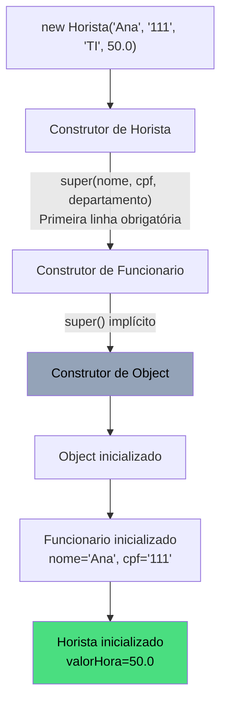
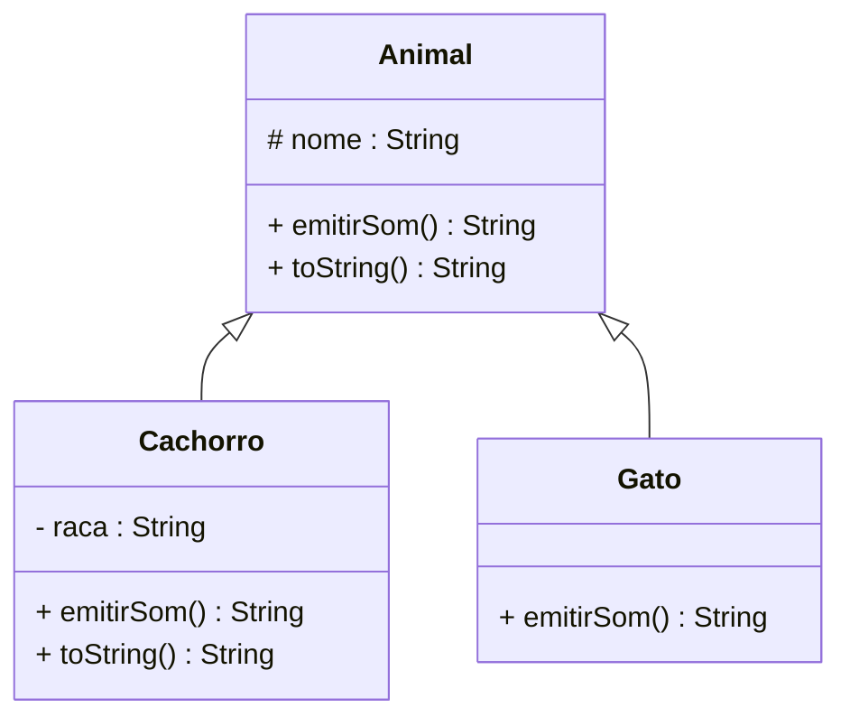
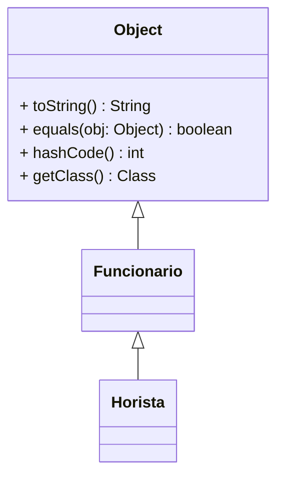
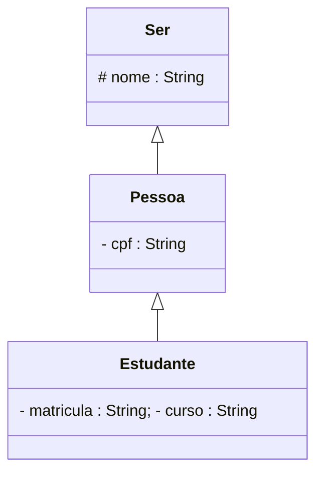
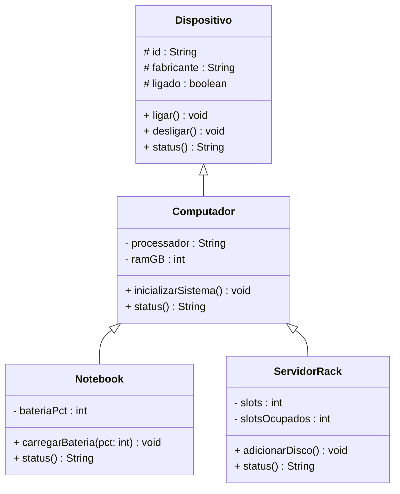

# Encontro 12 — Mecânica de Herança: Herança II

> **Módulo 4 · 4 aulas · 50 XP**

---

## 1. A cadeia de construtores

Quando criamos `new Horista(...)`, os construtores são chamados em **cadeia**, de cima para baixo na hierarquia:



```java
class A {
    A() {
        System.out.println("Construtor de A");
    }
}

class B extends A {
    B() {
        // super() é chamado IMPLICITAMENTE aqui se não houver chamada explícita
        System.out.println("Construtor de B");
    }
}

class C extends B {
    C() {
        super(); // explícito — mas seria implícito de qualquer forma
        System.out.println("Construtor de C");
    }
}

// new C() imprime:
// Construtor de A
// Construtor de B
// Construtor de C
```

---

## 2. `super()` com parâmetros — passando argumentos para cima

```java
class Veiculo {
    protected String placa;
    protected String marca;
    protected int ano;

    Veiculo(String placa, String marca, int ano) {
        if (ano < 1886 || ano > 2030)
            throw new IllegalArgumentException("Ano inválido: " + ano);
        this.placa = placa;
        this.marca = marca;
        this.ano   = ano;
    }
}

class Carro extends Veiculo {
    private int numeroPortas;

    Carro(String placa, String marca, int ano, int portas) {
        super(placa, marca, ano); // DEVE ser a primeira instrução do construtor
        if (portas < 2 || portas > 5)
            throw new IllegalArgumentException("Número de portas inválido.");
        this.numeroPortas = portas;
    }
}

class CarroEletrico extends Carro {
    private int autonomiaKm;

    CarroEletrico(String placa, String marca, int ano, int portas, int autonomia) {
        super(placa, marca, ano, portas); // passa para Carro, que passa para Veiculo
        if (autonomia <= 0)
            throw new IllegalArgumentException("Autonomia deve ser positiva.");
        this.autonomiaKm = autonomia;
    }
}
```

---

## 3. Sobrescrita de Métodos com `@Override`

A sobrescrita permite que a subclasse **redefina o comportamento** de um método herdado.

**Regras da sobrescrita:**
- Mesmo nome, mesmos parâmetros, mesmo tipo de retorno (ou subtipo)
- Visibilidade não pode ser mais restrita
- A anotação `@Override` é opcional, mas altamente recomendada

```java
class Animal {
    protected String nome;

    Animal(String nome) { this.nome = nome; }

    String emitirSom() {
        return nome + " fez um som genérico.";
    }

    @Override
    public String toString() {
        return "Animal[" + nome + "]";
    }
}

class Cachorro extends Animal {
    private String raca;

    Cachorro(String nome, String raca) {
        super(nome);
        this.raca = raca;
    }

    @Override // Redefine o comportamento para Cachorro
    String emitirSom() {
        return nome + " late: Au au!"; // comportamento específico
    }

    @Override
    public String toString() {
        return "Cachorro[" + nome + " | Raça: " + raca + "]";
    }
}

class Gato extends Animal {
    Gato(String nome) { super(nome); }

    @Override
    String emitirSom() { return nome + " mia: Miau!"; }
}
```



---

## 4. Chamando o método da superclasse com `super.metodo()`

Às vezes queremos **estender** o comportamento da superclasse, não substituí-lo:

```java
class Funcionario {
    protected String nome;
    protected String departamento;

    @Override
    public String toString() {
        return String.format("[%s | %s]", nome, departamento);
    }
}

class Gerente extends Funcionario {
    private String[] subordinados;
    private int totalSubordinados;

    @Override
    public String toString() {
        // Chama o toString da superclasse e ACRESCENTA informações
        return super.toString() +
               String.format(" | Gerente | %d subordinados", totalSubordinados);
    }
}
```

---

## 5. A classe `Object` — a raiz de tudo

Em Java, toda classe herda implicitamente de `java.lang.Object`. Isso significa que todo objeto tem os métodos de Object:



```java
// toString() padrão de Object: "Classe@hashHex" — praticamente inútil
Produto p = new Produto("Notebook", 2500.0);
System.out.println(p); // sem @Override: "Produto@4e50df2e"

// Com @Override: legível e útil
class Produto {
    private String nome;
    private double preco;

    @Override
    public String toString() {
        return String.format("Produto[%s | R$ %.2f]", nome, preco);
    }

    @Override
    public boolean equals(Object obj) {
        if (this == obj) return true;
        if (!(obj instanceof Produto outro)) return false;
        return this.nome.equals(outro.nome) && this.preco == outro.preco;
    }
}

// Agora:
Produto p1 = new Produto("Notebook", 2500.0);
Produto p2 = new Produto("Notebook", 2500.0);
System.out.println(p1);           // Produto[Notebook | R$ 2500,00]
System.out.println(p1.equals(p2)); // true (sem override seria false — referências diferentes)
```

---

## 6. Chamada composta — super.metodo() + lógica própria

```java
class Conta {
    protected String titular;
    protected double saldo;

    double calcularRendimento() {
        return saldo * 0.005; // 0.5% base para todos
    }
}

class ContaPremiada extends Conta {
    private boolean vip;

    @Override
    double calcularRendimento() {
        double rendimentoBase = super.calcularRendimento(); // herda o cálculo base
        double bonus = vip ? rendimentoBase * 0.5 : 0;    // VIP ganha 50% a mais
        return rendimentoBase + bonus;
    }
}
```

---

## Exercícios Práticos

---

### Exercício 1 — Fácil · 25 XP
**Rastreando a cadeia de construtores**

Antes de compilar, escreva exatamente o que será impresso na ordem correta:

```java
class X {
    X()        { System.out.println("X()");      }
    X(int n)   { System.out.println("X(" + n + ")"); }
}
class Y extends X {
    Y()        { System.out.println("Y()");      }
    Y(int n)   { super(n); System.out.println("Y(" + n + ")"); }
}
class Z extends Y {
    Z()        { super(5); System.out.println("Z()"); }
}

// new Z() imprime:
// ???
```

---

### Exercício 2 — Fácil · 25 XP
**Sobrescrevendo toString()**

Implemente as classes abaixo com `@Override toString()` em cada uma, usando `super.toString()` para construir a string progressivamente:



`new Estudante("Ana", "111.111.111-11", "MAT001", "Ciência da Computação").toString()` deve produzir:
`"[Ser:Ana][Pessoa:111.111.111-11][Estudante:MAT001-Ciência da Computação]"`

---

### Exercício 3 — Médio · 25 XP
**Cálculo Composto com super**

Crie a hierarquia de impostos: `Imposto` → `ICMS` → `ICMSInterestadual`.

- `Imposto.calcular(baseCalculo)` → retorna `baseCalculo * 0.10`
- `ICMS.calcular(base)` → retorna `super.calcular(base) + base * 0.02`
- `ICMSInterestadual.calcular(base)` → retorna `super.calcular(base) + base * 0.01`

Crie 3 objetos e mostre os diferentes valores calculados para a mesma base de R$ 1000.

---

### Exercício 4 — Médio · 25 XP
**Equals e comparação de objetos**

Implemente a classe `Livro` (isbn, titulo, autor) com `@Override equals` que considera dois livros iguais se tiverem o mesmo ISBN. Demonstre:

```java
Livro l1 = new Livro("978-0", "Clean Code", "Martin");
Livro l2 = new Livro("978-0", "Clean Code", "Martin");
Livro l3 = new Livro("978-1", "Outro Livro", "Autor");

// SEM override: l1.equals(l2) = false (referências diferentes)
// COM override: l1.equals(l2) = true (mesmo ISBN)
// l1 == l2 sempre false (referências diferentes)
```

---

### Exercício 5 — Difícil · 25 XP
**Hierarquia de Dispositivos**

Modele e implemente:



Cada `status()` deve usar `super.status()` e acrescentar informações específicas do tipo.

---

### Exercício 6 — Troubleshooting · 25 XP
**Diagnóstico: `super()`, `@Override` e Shadowing**

O código abaixo tem **3 erros** relacionados a herança e sobrescrita. Um não chama `super()` primeiro, um usa `@Override` em método com assinatura errada (sobrecarga, não sobrescrita), e um campo da subclasse esconde o da superclasse criando comportamento inesperado. Identifique e corrija.

```java
class Veiculo {
    protected String marca;
    protected int ano;

    Veiculo(String marca, int ano) {
        this.marca = marca;
        this.ano   = ano;
    }

    public String toString() {
        return marca + " (" + ano + ")";
    }
}

class Carro extends Veiculo {
    // Erro 3: campo com mesmo nome que o da superclasse — shadowing!
    private String marca;   // agora existem DOIS campos 'marca'

    Carro(String marca, int ano, String modelo) {
        // Erro 1: atribuição antes do super() — NÃO compila
        this.marca = marca;      // ← isso teria que vir DEPOIS do super(...)
        super(marca, ano);       // super() deve ser A PRIMEIRA LINHA
    }

    // Erro 2: assinatura diferente — não é @Override, é sobrecarga!
    @Override
    public String toString(int formato) {   // parâmetro extra muda a assinatura
        return "[" + marca + "]";
    }
}
```

> **Dicas:** (1) `super(...)` deve ser a **primeira instrução** do construtor — o Java garante que a superclasse seja inicializada antes. (2) `@Override` exige assinatura **idêntica** à da superclasse — adicionar parâmetros cria uma sobrecarga, não uma sobrescrita, e o compilador vai reclamar. (3) Declare campo de mesmo nome na subclasse somente se realmente precisar de outro campo; caso contrário, use o `this.marca` da superclasse via `protected`.
