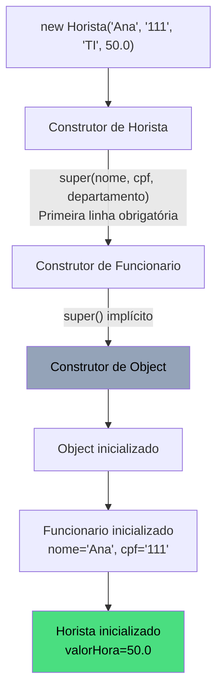
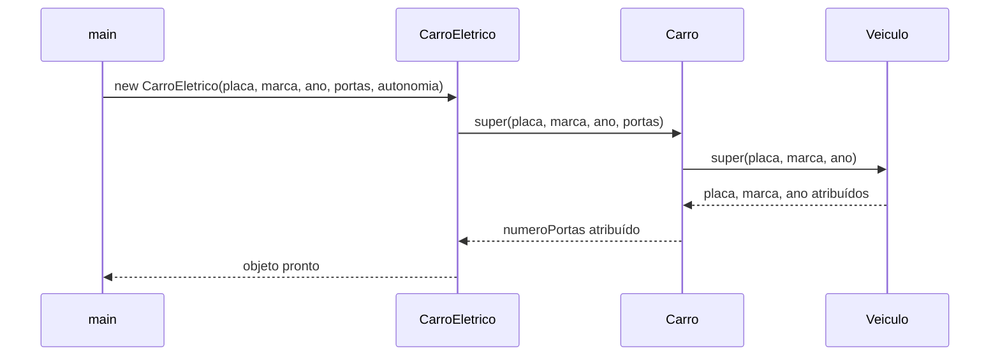
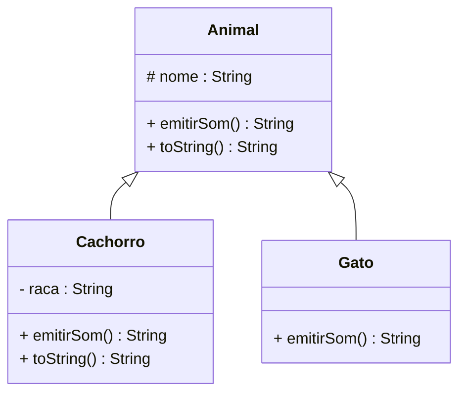
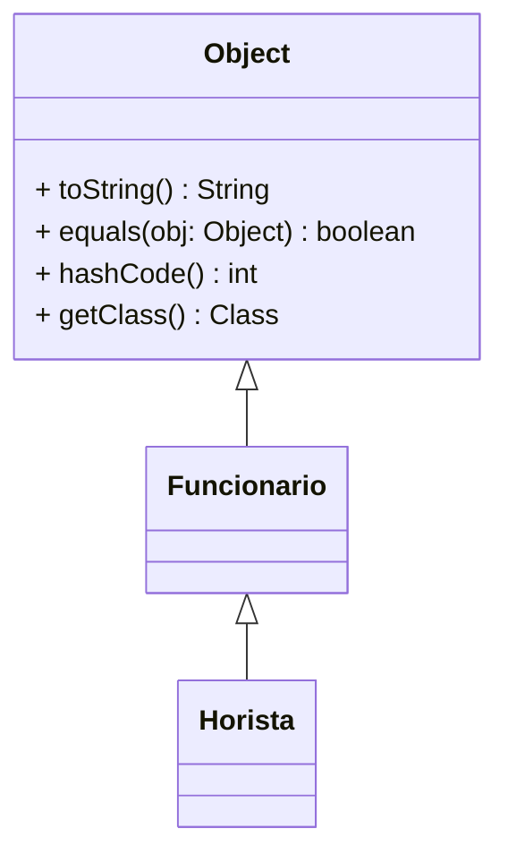
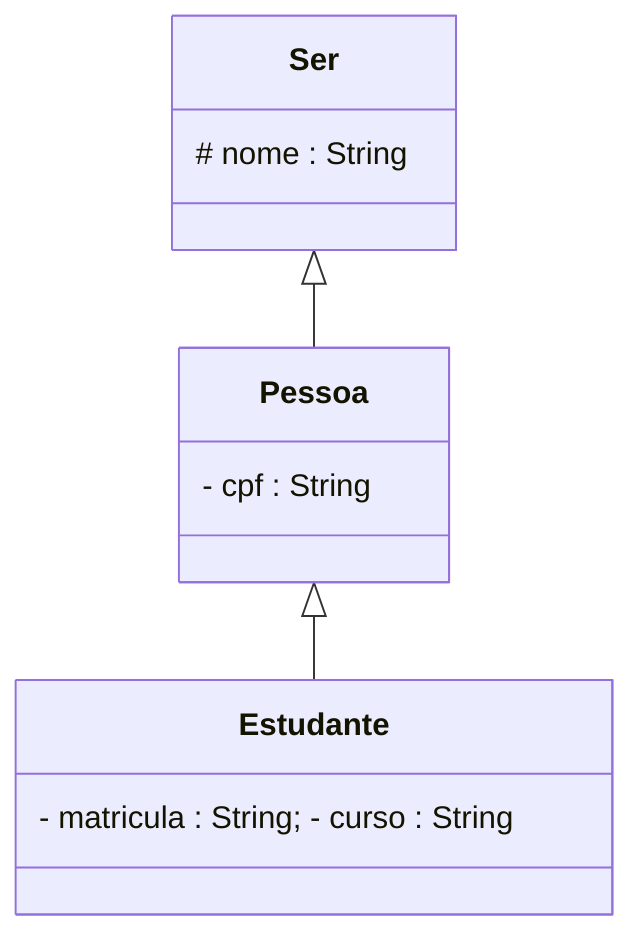
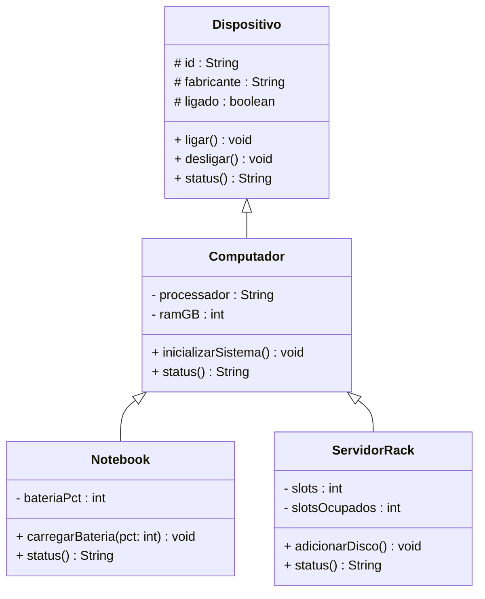

# Encontro 12 — Mecânica de Herança: Herança II

> **Módulo 4 · 4 aulas · 50 XP**

---

## 1. A cadeia de construtores

Quando criamos `new Horista(...)`, os construtores são chamados em **cadeia**, sempre do mais geral para o mais específico:



Para ver a ordem na prática, basta adicionar um `println` em cada construtor:

```java
class Funcionario {
    protected String nome;
    protected String cpf;

    Funcionario(String nome, String cpf) {
        System.out.println("  2. Construtor de Funcionario — nome e cpf atribuídos");
        this.nome = nome;
        this.cpf  = cpf;
    }
}

class Horista extends Funcionario {
    private double valorHora;

    Horista(String nome, String cpf, double valorHora) {
        super(nome, cpf); // ← dispara Funcionario(), que dispara Object()
        System.out.println("  3. Construtor de Horista — valorHora atribuído");
        this.valorHora = valorHora;
    }
}

// new Horista("Ana", "111", 50.0) imprime:
//   1. Construtor de Object  (implícito — sempre o topo da cadeia)
//   2. Construtor de Funcionario — nome e cpf atribuídos
//   3. Construtor de Horista — valorHora atribuído
```

**Ponto-chave:** o objeto só está "pronto" quando o construtor mais específico termina. Até lá, a inicialização vai de cima para baixo — da raiz (`Object`) até a folha (`Horista`).

---

## 2. `super()` com parâmetros — hierarquia de três níveis

Cada nível da hierarquia passa os dados que lhe cabem para o nível acima:

```java
class Veiculo {
    protected String placa;
    protected String marca;
    protected int ano;

    Veiculo(String placa, String marca, int ano) {
        if (ano < 1886 || ano > 2030)
            throw new IllegalArgumentException("Ano inválido: " + ano);
        this.placa = placa;
        this.marca = marca;
        this.ano   = ano;
    }
}

class Carro extends Veiculo {
    private int numeroPortas;

    Carro(String placa, String marca, int ano, int portas) {
        super(placa, marca, ano); // passa para Veiculo
        if (portas < 2 || portas > 5)
            throw new IllegalArgumentException("Número de portas inválido.");
        this.numeroPortas = portas;
    }
}

class CarroEletrico extends Carro {
    private int autonomiaKm;

    CarroEletrico(String placa, String marca, int ano, int portas, int autonomia) {
        super(placa, marca, ano, portas); // passa para Carro, que passa para Veiculo
        if (autonomia <= 0)
            throw new IllegalArgumentException("Autonomia deve ser positiva.");
        this.autonomiaKm = autonomia;
    }
}
```



---

## 3. Sobrescrita de Métodos com `@Override`

A sobrescrita (*override*) permite que a subclasse **redefina o comportamento** de um método herdado. A assinatura deve ser idêntica — mesmo nome, mesmos parâmetros, mesmo tipo de retorno.

```java
class Animal {
    protected String nome;
    Animal(String nome) { this.nome = nome; }

    public String emitirSom() {
        return nome + " fez um som."; // comportamento genérico
    }

    @Override
    public String toString() { return "Animal[" + nome + "]"; }
}

class Cachorro extends Animal {
    private String raca;
    Cachorro(String nome, String raca) { super(nome); this.raca = raca; }

    @Override
    public String emitirSom() {
        return nome + " late: Au au!"; // SOBRESCREVE — mesma assinatura, novo comportamento
    }

    @Override
    public String toString() { return "Cachorro[" + nome + " | " + raca + "]"; }
}

class Gato extends Animal {
    Gato(String nome) { super(nome); }

    @Override
    public String emitirSom() { return nome + " mia: Miau!"; }
}
```

**Por que `@Override` é obrigatório na prática:**

```java
class Cachorro extends Animal {
    // SEM @Override — erro de digitação passa despercebido
    public String emitirsom() { // 's' minúsculo — isso é uma sobrecarga, não sobrescrita!
        return "Au au!";        // Animal.emitirSom() continua sendo chamado — bug silencioso
    }

    // COM @Override — compilador rejeita se a assinatura não existir na superclasse
    @Override
    public String emitirSom() { // ← compilador valida que Animal tem exatamente este método
        return "Au au!";
    }
}
```

**Regras da sobrescrita:**

| Regra | Detalhe |
|-------|---------|
| Mesma assinatura | Nome + parâmetros + tipo de retorno idênticos (ou subtipo) |
| Visibilidade não pode ser mais restrita | `public` na super → não pode virar `protected` na sub |
| `@Override` é opcional, mas obrigatório na prática | Protege contra typos e assinaturas erradas |
| Métodos `final` não podem ser sobrescritos | Compilador bloqueia |
| Métodos `static` não são sobrescritos — são escondidos (*hiding*) | Comportamento diferente — tema avançado |



---

## 4. `super.método()` — estender em vez de substituir

Às vezes queremos acrescentar comportamento ao método herdado, não substituí-lo inteiramente. `super.método()` chama a implementação da superclasse e permite construir em cima dela:

```java
class Funcionario {
    protected String nome;
    protected String departamento;

    @Override
    public String toString() {
        return String.format("[%s | %s]", nome, departamento);
    }
}

class Gerente extends Funcionario {
    private int totalSubordinados;

    @Override
    public String toString() {
        return super.toString()  // ← reutiliza o que Funcionario já formata
             + String.format(" | Gerente | %d subordinados", totalSubordinados);
    }
}

// Saída:
// [Ana | TI] | Gerente | 5 subordinados
//  ↑ super.toString()    ↑ acréscimo de Gerente
```

**Estendendo cálculos — não só strings:**

```java
class Conta {
    protected double saldo;

    double calcularRendimento() {
        return saldo * 0.005; // 0,5% — rendimento base para todos
    }
}

class ContaPremiada extends Conta {
    private boolean vip;

    @Override
    double calcularRendimento() {
        double base  = super.calcularRendimento(); // herda o cálculo base
        double bonus = vip ? base * 0.5 : 0;      // VIP ganha 50% a mais
        return base + bonus;
    }
}
```

> **Regra de ouro:** se você sobrescreve `fecharMes()` em `Horista` e precisa que o comportamento de `Funcionario.fecharMes()` também rode, chame `super.fecharMes()` **antes** do código específico. Esquecer esse `super` é um dos bugs mais comuns em hierarquias reais.

---

## 5. A classe `Object` — `toString`, `equals` e `hashCode`

Em Java, toda classe herda implicitamente de `java.lang.Object`. Dois dos métodos mais importantes que `Object` fornece — e que quase sempre devemos sobrescrever — são `equals` e `hashCode`.



### `toString()` — representação legível

```java
Produto p = new Produto("Notebook", 2500.0);
System.out.println(p); // SEM @Override: "Produto@4e50df2e" — inútil

// COM @Override:
class Produto {
    private String nome;
    private double preco;

    @Override
    public String toString() {
        return String.format("Produto[%s | R$ %.2f]", nome, preco);
    }
}
// Agora: "Produto[Notebook | R$ 2.500,00]"
```

### `equals()` e `hashCode()` — o contrato que não pode ser quebrado

Por padrão, `equals()` compara **referências** (`==`). Para comparar por **valor**, precisamos sobrescrever:

```java
class Produto {
    private String nome;
    private double preco;

    @Override
    public boolean equals(Object obj) {
        if (this == obj) return true;           // mesma referência — trivialmente igual
        if (!(obj instanceof Produto)) return false; // tipo errado — nunca igual
        Produto outro = (Produto) obj;          // cast seguro — instanceof já garantiu
        return this.nome.equals(outro.nome)
            && Double.compare(this.preco, outro.preco) == 0;
    }

    @Override
    public int hashCode() {
        // Deve usar OS MESMOS campos que equals usa
        int resultado = nome.hashCode();
        resultado = 31 * resultado + Double.hashCode(preco);
        return resultado;
    }
}
```

> **O contrato `equals`/`hashCode` — nunca viole:**
> Se `a.equals(b)` é `true`, então `a.hashCode() == b.hashCode()` **deve** ser `true`.
> O inverso não precisa valer — dois objetos podem ter o mesmo `hashCode` sem serem iguais.
>
> Se você sobrescrever `equals` sem sobrescrever `hashCode`, `HashSet` e `HashMap` vão se comportar de forma imprevisível — dois objetos "iguais" coexistirão no mesmo conjunto como se fossem diferentes.

```java
Produto p1 = new Produto("Notebook", 2500.0);
Produto p2 = new Produto("Notebook", 2500.0);

// SEM override de equals:
System.out.println(p1.equals(p2)); // false — referências diferentes
System.out.println(p1 == p2);      // false — sempre false para objetos distintos

// COM override (implementação acima):
System.out.println(p1.equals(p2)); // true — mesmo nome e preço
System.out.println(p1 == p2);      // false — == sempre compara referência

// COM override de equals E hashCode:
Set<Produto> catalogo = new HashSet<>();
catalogo.add(p1);
catalogo.add(p2); // sem hashCode: adiciona os dois — "duplicata" no set!
System.out.println(catalogo.size()); // com hashCode correto: 1 ✅ | sem: 2 ❌
```

---

## Exercícios Práticos

---

### Exercício 1 — Fácil · 25 XP
**Rastreando a cadeia de construtores**

Antes de compilar, escreva exatamente o que será impresso na ordem correta:

```java
class X {
    X()        { System.out.println("X()");      }
    X(int n)   { System.out.println("X(" + n + ")"); }
}
class Y extends X {
    Y()        { System.out.println("Y()");      }
    Y(int n)   { super(n); System.out.println("Y(" + n + ")"); }
}
class Z extends Y {
    Z()        { super(5); System.out.println("Z()"); }
}

// new Z() imprime:
// ???
```

---

### Exercício 2 — Fácil · 25 XP
**Sobrescrevendo toString()**

Implemente as classes abaixo com `@Override toString()` em cada uma, usando `super.toString()` para construir a string progressivamente:



`new Estudante("Ana", "111.111.111-11", "MAT001", "Ciência da Computação").toString()` deve produzir:
`"[Ser:Ana][Pessoa:111.111.111-11][Estudante:MAT001-Ciência da Computação]"`

---

### Exercício 3 — Médio · 25 XP
**Cálculo Composto com super**

Crie a hierarquia de impostos: `Imposto` → `ICMS` → `ICMSInterestadual`.

- `Imposto.calcular(baseCalculo)` → retorna `baseCalculo * 0.10`
- `ICMS.calcular(base)` → retorna `super.calcular(base) + base * 0.02`
- `ICMSInterestadual.calcular(base)` → retorna `super.calcular(base) + base * 0.01`

Crie 3 objetos e mostre os diferentes valores calculados para a mesma base de R$ 1000.

---

### Exercício 4 — Médio · 25 XP
**equals e hashCode — contrato completo**

Implemente a classe `Livro` (isbn, titulo, autor) com `@Override equals` que considera dois livros iguais se tiverem o mesmo ISBN, **e** `@Override hashCode` usando o mesmo campo. Demonstre:

```java
Livro l1 = new Livro("978-0", "Clean Code", "Martin");
Livro l2 = new Livro("978-0", "Clean Code", "Martin");
Livro l3 = new Livro("978-1", "Outro Livro", "Autor");

System.out.println(l1.equals(l2)); // true  — mesmo ISBN
System.out.println(l1.equals(l3)); // false — ISBN diferente
System.out.println(l1 == l2);      // false — referências distintas

Set<Livro> acervo = new HashSet<>();
acervo.add(l1);
acervo.add(l2); // l2 é "igual" a l1 — não deve duplicar
System.out.println(acervo.size()); // deve imprimir 1
```

---

### Exercício 5 — Difícil · 25 XP
**Hierarquia de Dispositivos**

Modele e implemente:



Cada `status()` deve usar `super.status()` e acrescentar informações específicas do tipo.

---

### Exercício 6 — Troubleshooting · 25 XP
**Diagnóstico: `super()`, `@Override` e Shadowing**

O código abaixo tem **3 erros** relacionados a herança e sobrescrita. Um não chama `super()` primeiro, um usa `@Override` em método com assinatura errada (sobrecarga, não sobrescrita), e um campo da subclasse esconde o da superclasse criando comportamento inesperado. Identifique e corrija.

```java
class Veiculo {
    protected String marca;
    protected int ano;

    Veiculo(String marca, int ano) {
        this.marca = marca;
        this.ano   = ano;
    }

    public String toString() {
        return marca + " (" + ano + ")";
    }
}

class Carro extends Veiculo {
    // Erro 3: campo com mesmo nome que o da superclasse — shadowing!
    private String marca;   // agora existem DOIS campos 'marca'

    Carro(String marca, int ano, String modelo) {
        // Erro 1: atribuição antes do super() — NÃO compila
        this.marca = marca;      // ← teria que vir DEPOIS do super(...)
        super(marca, ano);       // super() deve ser A PRIMEIRA LINHA
    }

    // Erro 2: assinatura diferente — não é @Override, é sobrecarga!
    @Override
    public String toString(int formato) {   // parâmetro extra muda a assinatura
        return "[" + marca + "]";
    }
}
```

> **Dicas:** (1) `super(...)` deve ser a **primeira instrução** do construtor. (2) `@Override` exige assinatura **idêntica** — adicionar parâmetros cria uma sobrecarga, e o compilador vai reclamar. (3) Declare campo de mesmo nome na subclasse somente se realmente precisar de outro campo; caso contrário, use o `this.marca` herdado via `protected`.
