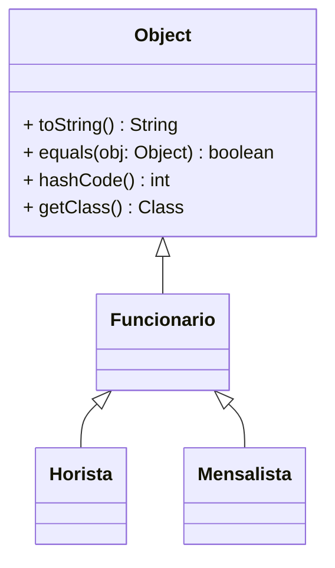

# A Classe Object — equals e hashCode

> **Módulo 4 · 50 XP**

## Objetivo do encontro

Toda classe Java herda silenciosamente de `java.lang.Object`. Neste encontro vamos entender o que isso significa na prática — especialmente para os métodos `toString()`, `equals()` e `hashCode()` — e por que sobrescrever `equals()` sem sobrescrever `hashCode()` causa bugs silenciosos em `HashSet` e `HashMap`.

---

## 1. A Hierarquia Raiz — `java.lang.Object`

Em Java, toda classe que você cria herda implicitamente de `java.lang.Object`, mesmo que você não escreva `extends Object`. Isso significa que toda classe já vem com um conjunto de métodos prontos — mesmo que você nunca os tenha declarado.



Os três métodos que você vai precisar sobrescrever com mais frequência:

| Método | Comportamento padrão (sem override) | O que você quer |
|--------|--------------------------------------|-----------------|
| `toString()` | `"NomeDaClasse@endereçoDeMemória"` | Representação legível do objeto |
| `equals(obj)` | Compara referências (`==`) | Comparação por valor dos campos |
| `hashCode()` | Número baseado no endereço de memória | Número consistente com `equals()` |

### `toString()` — a base que você já conhece

Você viu no Encontro 12 que `super.toString()` pode ser encadeado. Aqui, vale recordar o ponto de partida:

```java
Produto p = new Produto("Notebook", 2500.0);
System.out.println(p); // SEM @Override: "Produto@4e50df2e" — inútil

// COM @Override:
class Produto {
    private String nome;
    private double preco;

    @Override
    public String toString() {
        return String.format("Produto[%s | R$ %.2f]", nome, preco);
    }
}
// Agora: "Produto[Notebook | R$ 2500,00]"
```

---

## 2. Por que você precisa sobrescrever — os três cenários reais

Antes de ver como implementar, vamos entender **quando** o problema aparece. São três situações que todo sistema real vai enfrentar.

### Cenário 1 — `List.contains()` retorna mentira

Imagine um carrinho de compras. Você quer saber se um produto já foi adicionado:

```java
List<Produto> carrinho = new ArrayList<>();
carrinho.add(new Produto("Notebook", 2500.0));

// Mais tarde, o usuário tenta adicionar o mesmo produto de novo:
Produto novaBusca = new Produto("Notebook", 2500.0);
System.out.println(carrinho.contains(novaBusca)); // → false ← ERRADO!

// A pergunta "o Notebook já está no carrinho?" retorna false.
// O produto está lá — mas o Java não reconhece como "igual".
```

`contains()` usa `equals()` internamente. Sem override, compara referências. `novaBusca` e o objeto dentro do carrinho são dois objetos diferentes na memória — logo, `contains()` diz que não estão lá. O carrinho vai adicionar o mesmo produto duas vezes.

### Cenário 2 — `Set` não detecta duplicatas

Um sistema de cadastro precisa garantir que não haja CPF duplicado:

```java
Set<Usuario> usuarios = new HashSet<>();
usuarios.add(new Usuario("Ana", "111.111.111-11"));
usuarios.add(new Usuario("Ana", "111.111.111-11")); // tentativa de duplicata

System.out.println(usuarios.size()); // → 2 ← ERRADO! Esperávamos 1.

// O Set aceita os dois como usuários distintos.
// O sistema agora tem dois cadastros com o mesmo CPF — bug de integridade.
```

`HashSet` usa `hashCode()` para localizar o bucket e `equals()` para verificar duplicata. Sem ambos, a proteção contra duplicatas não funciona.

### Cenário 3 — `Map` "perde" os dados

Um cache que mapeia produto a preço promocional:

```java
Map<Produto, Double> cache = new HashMap<>();
Produto p = new Produto("Notebook", 2500.0);
cache.put(p, 1999.99); // guarda o preço promocional

// Em outra parte do código, cria um objeto com os mesmos dados:
Produto busca = new Produto("Notebook", 2500.0);
System.out.println(cache.get(busca)); // → null ← ERRADO! O preço "sumiu".

// O HashMap não encontra o preço porque busca e p têm hashCodes diferentes.
// O dado está lá — mas nunca será encontrado.
```

Sem `hashCode()` consistente, `HashMap.get()` procura no bucket errado e não acha nada. O cache é inútil.

---

### O padrão que une os três cenários

Toda vez que você usar um objeto como **chave** em `Map`, ou dentro de `Set`, ou em qualquer método que chame `equals()` (`contains()`, `remove()`, `indexOf()`...) — você precisa dos dois sobrescritos:

| Operação | Usa `equals()`? | Usa `hashCode()`? |
|----------|:---------------:|:-----------------:|
| `list.contains(obj)` | ✅ | ❌ |
| `set.contains(obj)` | ✅ | ✅ |
| `set.add(obj)` (detectar duplicata) | ✅ | ✅ |
| `map.put(obj, valor)` | ✅ | ✅ |
| `map.get(obj)` | ✅ | ✅ |
| `if (a.equals(b))` direto no código | ✅ | ❌ |

A regra prática: **se o objeto vai entrar em `Set` ou `Map`, você precisa dos dois. Se só vai comparar com `if (a.equals(b))`, basta `equals()`.**

---

## 3. `equals()` — comparação por valor

Por padrão, `equals()` herdado de `Object` compara **referências** — é equivalente ao operador `==`. Para que dois objetos com os mesmos dados sejam considerados iguais, você precisa sobrescrever `equals()`.

```java
Produto p1 = new Produto("Notebook", 2500.0);
Produto p2 = new Produto("Notebook", 2500.0);

// SEM override:
System.out.println(p1.equals(p2)); // false — referências diferentes no heap
System.out.println(p1 == p2);      // false — sempre false para objetos distintos
```

A implementação correta segue um padrão fixo com três verificações obrigatórias:

```java
@Override
public boolean equals(Object obj) {
    if (this == obj) return true;            // mesma referência — trivialmente igual
    if (!(obj instanceof Produto)) return false; // tipo errado — nunca igual
    Produto outro = (Produto) obj;           // cast seguro — instanceof já verificou
    return this.nome.equals(outro.nome)
        && Double.compare(this.preco, outro.preco) == 0;
}
```

> **Por que `Double.compare` e não `==` para o preço?** Porque `double` é ponto flutuante — `0.1 + 0.2` em Java não é `0.3` exato. `Double.compare` trata essas imprecisões corretamente.

```java
// COM override:
System.out.println(p1.equals(p2)); // true — mesmo nome e preço
System.out.println(p1 == p2);      // false — == sempre compara referência
```

---

## 4. `hashCode()` — o parceiro obrigatório de `equals()`

`HashSet` e `HashMap` não começam pela comparação de igualdade. Eles começam pelo `hashCode()`. Pense assim: o `HashSet` é um armário com gavetas numeradas. Para encontrar a gaveta certa, ele chama `hashCode()`. Só depois de achar a gaveta ele chama `equals()` para confirmar.

```java
Set<Produto> catalogo = new HashSet<>();
catalogo.add(p1);
catalogo.add(p2); // p2 é "igual" a p1...

// COM equals() sobrescrito MAS hashCode() ainda usando o padrão de Object:
System.out.println(catalogo.size()); // → 2  ← bug! esperávamos 1
```

**Por que isso acontece?** `p1` e `p2` têm `hashCode()` padrão baseado em endereço de memória — são diferentes. O Set nem chega a chamar `equals()` para comparar os dois, porque eles já foram para gavetas diferentes.

A correção é sempre sobrescrever `hashCode()` **usando os mesmos campos que `equals()` usa**:

```java
@Override
public int hashCode() {
    int resultado = nome.hashCode();
    resultado = 31 * resultado + Double.hashCode(preco);
    return resultado;
}
```

```java
// COM equals() E hashCode() sobrescritos:
System.out.println(catalogo.size()); // → 1 ✅
```

---

## 5. O Contrato — a regra que não pode ser quebrada

> **Se `a.equals(b)` é `true`, então `a.hashCode() == b.hashCode()` deve ser `true`.**
>
> O contrário não precisa valer — dois objetos podem ter o mesmo `hashCode()` sem serem iguais (colisão de hash). Mas se são iguais por `equals()`, obrigatoriamente têm o mesmo `hashCode()`.

Violou esse contrato? Resultado imprevisível em qualquer coleção que use hash. O compilador não avisa — o bug aparece em runtime.

| Cenário | `equals()` | `hashCode()` | HashSet funciona? |
|---------|:----------:|:------------:|:-----------------:|
| Nenhum override | referências | endereço de memória | ✅ (mas equals é `==`) |
| Só `equals()` sobrescrito | por valor | endereço de memória | ❌ bug silencioso |
| Ambos sobrescritos (campos iguais) | por valor | por valor | ✅ correto |

---

### Atividade — Diagnose o contrato quebrado

```bug-hunt
BUG:1:System.out.println(p1.equals(p2)); // → false:Produto sem nenhum override de equals. p1 e p2 têm mesmo nome e preço, mas foram criados com new separadamente.
Q:Por que equals() retorna false mesmo nome e preço sendo idênticos?:O equals() padrão herdado de Object compara referências (==) — p1 e p2 são objetos distintos na memória|equals() só funciona com tipos primitivos, não com objetos de classes customizadas|String.equals() propagaria automaticamente se os campos fossem public|@Override ativa comparação por valor automaticamente em qualquer método:0
Q:Qual método deve ser sobrescrito para que a comparação seja por valor?:equals(Object obj) — implementando comparação campo a campo com instanceof|compareTo(Produto outro) — usado para ordenar objetos|toString() — usado para representação textual do objeto|clone() — usado para criar cópias independentes do objeto:0

BUG:2:System.out.println(set.size()); // → 2 (esperado: 1):Produto com equals(Object) corretamente sobrescrito, mas hashCode() ainda usa o padrão de Object — dois objetos iguais por equals() produzem hashCodes distintos.
Q:Por que o HashSet aceita p1 e p2 como elementos distintos mesmo com equals retornando true?:HashSet usa hashCode() para localizar o bucket antes de chamar equals — hashCodes diferentes fazem o set nem chegar a comparar os objetos|equals() funciona diferente dentro de coleções do que quando chamado diretamente|HashSet permite duplicatas quando os objetos são da mesma classe|O equals ainda compara referências internamente quando usado dentro do HashSet:0
Q:Qual regra do contrato equals/hashCode foi violada?:Se a.equals(b) é true, então a.hashCode() deve ser igual a b.hashCode()|Se a.hashCode() == b.hashCode(), então a.equals(b) deve ser true|Sempre que equals é sobrescrito, toString() também deve ser sobrescrito|hashCode() deve retornar sempre zero quando equals não foi sobrescrito:0
```

---

## Exercícios Práticos

---

### Exercício 1 — Médio · 25 XP
**equals e hashCode — contrato completo**

Implemente a classe `Livro` (isbn, titulo, autor) com `@Override equals` que considera dois livros iguais se tiverem o mesmo ISBN, **e** `@Override hashCode` usando o mesmo campo. Demonstre:

```java
Livro l1 = new Livro("978-0", "Clean Code", "Martin");
Livro l2 = new Livro("978-0", "Clean Code", "Martin");
Livro l3 = new Livro("978-1", "Outro Livro", "Autor");

System.out.println(l1.equals(l2)); // true  — mesmo ISBN
System.out.println(l1.equals(l3)); // false — ISBN diferente
System.out.println(l1 == l2);      // false — referências distintas

Set<Livro> acervo = new HashSet<>();
acervo.add(l1);
acervo.add(l2); // l2 é "igual" a l1 — não deve duplicar
System.out.println(acervo.size()); // deve imprimir 1
```

---

### Exercício 2 — Médio · 25 XP
**Ponto2D — igualdade geométrica**

Implemente a classe `Ponto2D` com campos `double x` e `double y`. Dois pontos são iguais se tiverem as mesmas coordenadas (use `Double.compare` para comparar doubles).

```java
Ponto2D a = new Ponto2D(3.0, 4.0);
Ponto2D b = new Ponto2D(3.0, 4.0);
Ponto2D c = new Ponto2D(1.0, 2.0);

System.out.println(a.equals(b)); // true  — mesmas coordenadas
System.out.println(a.equals(c)); // false — coordenadas diferentes
System.out.println(a == b);      // false — referências distintas

Set<Ponto2D> pontos = new HashSet<>();
pontos.add(a);
pontos.add(b); // duplicata — mesmo ponto geométrico
pontos.add(c);
System.out.println(pontos.size()); // 2 — {(3,4), (1,2)}
```

> **Dica:** para `hashCode()` com dois campos double, você pode usar:
> ```java
> int h = Double.hashCode(x);
> h = 31 * h + Double.hashCode(y);
> return h;
> ```

---

### Exercício 3 — Difícil · 25 XP
**Troubleshooting: equals e hashCode quebrados**

O código abaixo tem **2 erros** no contrato `equals`/`hashCode`. O resultado do `HashSet` não é o esperado. Identifique os erros e corrija.

```java
class Produto {
    private String nome;
    private double preco;

    Produto(String nome, double preco) {
        this.nome  = nome;
        this.preco = preco;
    }

    // Erro 1: parâmetro errado — não está sobrescrevendo Object.equals()
    @Override
    public boolean equals(Produto outro) {
        if (outro == null) return false;
        return this.nome.equals(outro.nome)
            && this.preco == outro.preco;
    }

    // Erro 2: hashCode usa campo que equals não usa
    @Override
    public int hashCode() {
        return System.identityHashCode(this); // endereço de memória — ignora os campos
    }
}

// main:
Produto p1 = new Produto("Notebook", 2500.0);
Produto p2 = new Produto("Notebook", 2500.0);

System.out.println(p1.equals(p2)); // esperado: true  | obtido: false
Set<Produto> s = new HashSet<>();
s.add(p1); s.add(p2);
System.out.println(s.size());      // esperado: 1     | obtido: 2
```

> **Dicas:** (1) `equals()` em `Object` recebe `Object obj`, não o tipo específico — `@Override` com `Produto outro` cria uma sobrecarga, não uma sobrescrita; o compilador não detecta porque `@Override` verifica apenas se existe um método de mesmo nome na hierarquia, não a assinatura exata. (2) `hashCode()` deve usar os mesmos campos que `equals()` para garantir que objetos iguais caiam no mesmo bucket.
