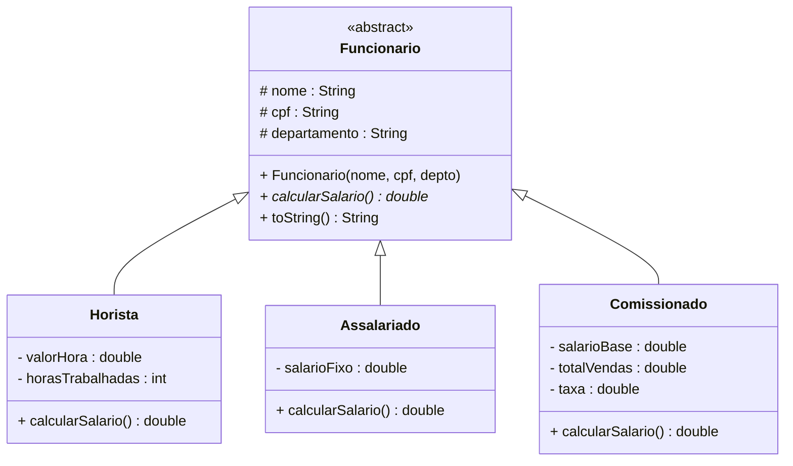
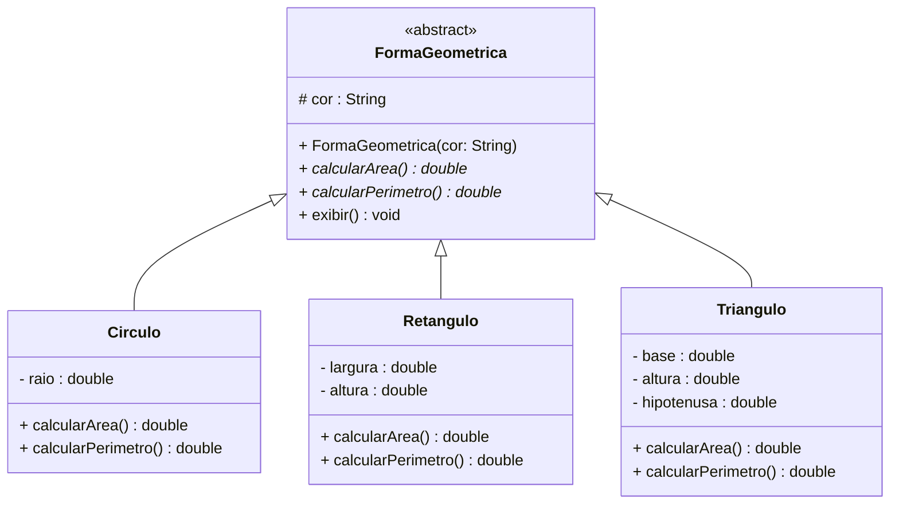
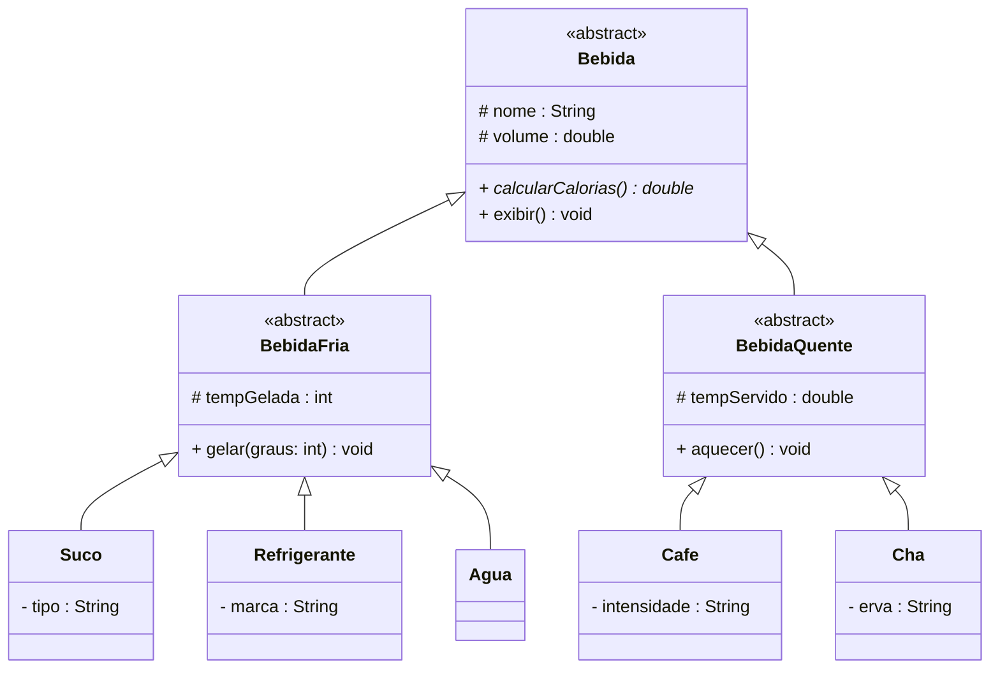
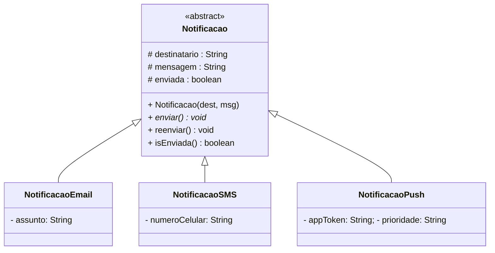

# Encontro 13 — Classes Abstratas

> **Módulo 4 · 4 aulas · 50 XP**

---

### Atividade — Aquecimento: revise o Encontro 12

```fill-table
COL1:Situação ou regra
COL2:Palavra-chave ou resposta curta
LEGEND:Garanta que o E12 está sólido antes de avançar. Clique fora de cada campo para verificar.
Quando você escreve new Horista(...), o primeiro construtor a executar é o de... | Object
Instrução obrigatória como primeira linha do construtor da subclasse | super()
Para executar o método da superclasse dentro de um @Override, usamos | super.método()
Declarar um campo com o mesmo nome na subclasse que na superclasse se chama | shadowing
Palavra-chave que impede que um método seja sobrescrito por subclasses | final
Métodos static não são sobrescritos — esse comportamento se chama | method hiding
```

---

## 1. O problema do método genérico vazio

Voltando à hierarquia de Funcionário do Encontro 11, temos um problema:

```java
class Funcionario {
    // calcularSalario() não faz sentido aqui — como calcular o salário de um "Funcionário genérico"?
    double calcularSalario() {
        return 0; // retorno falso apenas para compilar!
    }
}
```

Além disso, nada impede alguém de fazer:

```java
Funcionario f = new Funcionario("Carlos", "111", "TI"); // faz sentido?
f.calcularSalario(); // retorna 0 — resultado sem significado!
```

**Funcionário genérico** é um conceito abstrato que só existe para categorizar. Nunca deve ser instanciado diretamente.

### Atividade 1 — Diagnose o design quebrado

```bug-hunt
BUG:1:Funcionario f = new Funcionario("Carlos", "111.111.111-11", "TI");\nSystem.out.println(f.calcularSalario()); // → 0.0:Funcionario é classe concreta. O compilador permite new Funcionario(...) e calcularSalario() devolve 0 — sem nenhuma regra de negócio.
Q:Qual é o problema conceitual de permitir new Funcionario(...)?:Funcionário é um conceito abstrato — na vida real só existem Horista, Assalariado e Comissionado; jamais um "funcionário genérico"|Funcionario não deveria ter construtor público — apenas protected|O construtor aceita String onde deveria aceitar enum de departamento|Falta validação de CPF no construtor para garantir formato correto:0
Q:O que o retorno 0 em calcularSalario() representa no contexto de negócio?:Um valor fictício sem significado — nenhuma empresa calcula salário como zero fixo para qualquer tipo de funcionário|O salário mínimo legal que toda classe-base deve garantir|Uma convenção de Java que indica método "a ser implementado depois"|O valor padrão correto para estagiários e aprendizes na hierarquia:0

BUG:2:class Vendedor extends Funcionario {\n    // esqueceu de implementar calcularSalario()\n    private double comissao;\n}\n// Vendedor v = new Vendedor("Eva", "222", "Vendas"):Funcionario concreto com calcularSalario() retornando 0. Vendedor herda silenciosamente esse retorno zero sem nenhum aviso do compilador.
Q:Por que herdar calcularSalario() retornando 0 é pior do que um erro de compilação?:O sistema roda normalmente mas gera folha de pagamento errada — zero para toda equipe de vendas sem nenhum alerta|Causar erro em runtime seria melhor porque ao menos o sistema pararia imediatamente|O Java lança NullPointerException ao retornar 0 de um método double — erraria em tempo de execução|O problema só aparece ao comparar salários com ==, que não funciona para double:0
Q:Que mecanismo Java força cada subclasse a definir sua própria regra de cálculo?:Declarar calcularSalario() como abstract na superclasse — o compilador então exige @Override em toda subclasse concreta|Adicionar @Override na superclasse para propagar a obrigação para baixo|Lançar UnsupportedOperationException() no corpo do método em Funcionario|Tornar o campo salario como private final para que ninguém acesse sem calcular:0
```

---

## 2. Classes Abstratas — conceitos sem instanciação



> **Notação UML:** classes e métodos abstratos são representados em **itálico**. O estereótipo `<<abstract>>` também é usado.

```java
// A palavra-chave 'abstract' na classe impede instanciação direta
public abstract class Funcionario {
    protected String nome;
    protected String cpf;
    protected String departamento;

    public Funcionario(String nome, String cpf, String departamento) {
        if (nome == null || nome.isBlank())
            throw new IllegalArgumentException("Nome inválido.");
        this.nome         = nome;
        this.cpf          = cpf;
        this.departamento = departamento;
    }

    // Método abstrato: define o CONTRATO — toda subclasse DEVE implementar
    // Note: sem corpo '{}' — apenas assinatura seguida de ';'
    public abstract double calcularSalario();

    // Método concreto: herdado por todas as subclasses
    public String getNome()         { return nome;         }
    public String getDepartamento() { return departamento; }

    @Override
    public String toString() {
        return String.format("[%s | %s | Sal: R$ %.2f]", nome, departamento, calcularSalario());
    }
}
```

```java
// Subclasse CONCRETA — deve implementar calcularSalario() ou ser abstract também
public class Horista extends Funcionario {
    private double valorHora;
    private int horasTrabalhadas;

    public Horista(String nome, String cpf, String depto, double valorHora) {
        super(nome, cpf, depto);
        this.valorHora        = valorHora;
        this.horasTrabalhadas = 0;
    }

    public void registrarHoras(int horas) {
        if (horas < 0) throw new IllegalArgumentException("Horas não podem ser negativas.");
        horasTrabalhadas += horas;
    }

    @Override
    public double calcularSalario() {
        return valorHora * horasTrabalhadas; // implementação concreta do contrato
    }
}
```

### Atividade 2 — Complete o diagrama da hierarquia

```fill-uml
CLASS:Funcionario
ATTR:# nome : String
ATTR:# cpf : String
ATTR:# departamento : String
METHOD:___:abstract double calcularSalario()
METHOD:getNome() String
METHOD:getDepartamento() String
METHOD:toString() String

CLASS:Horista
ATTR:- valorHora : double
ATTR:- horasTrabalhadas : int
METHOD:registrarHoras(int horas) void
METHOD:___:@Override double calcularSalario()

CLASS:Assalariado
ATTR:___:- salarioFixo : double
METHOD:___:@Override double calcularSalario()

CLASS:Comissionado
ATTR:- salarioBase : double
ATTR:- totalVendas : double
ATTR:___:- taxa : double
METHOD:registrarVenda(double) void
METHOD:___:@Override double calcularSalario()
```

---

## 3. Tentando instanciar uma classe abstrata

```java
// Funcionario f = new Funcionario("Ana", "111", "TI");
// ERRO de compilação: "Funcionario is abstract; cannot be instantiated"

// Correto — instanciar a subclasse concreta:
Funcionario f = new Horista("Ana", "111", "TI", 45.0);
// 'f' é do TIPO Funcionario (referência), mas o OBJETO é Horista
// Isso é o fundamento do Polimorfismo — veremos no Módulo 5!
```

### Atividade 3 — Preveja o compilador

```fill-table
COL1:Código Java (Funcionario é abstract class)
COL2:Compila ou Erro?
LEGEND:Para cada instrução, preveja o resultado. Responda exatamente "compila" ou "erro".
new Funcionario("Ana", "111", "TI") | erro
Funcionario h = new Horista("Ana", "111", "TI", 45.0) | compila
class Vendedor extends Funcionario { private double comissao; } | erro
abstract class Gerente extends Funcionario { } | compila
Funcionario f = new Horista("Ana", "111", "TI", 45.0); Horista h = (Horista) f | compila
```

---

## 4. O que `abstract` torna possível — prévia de um padrão

> **Nota:** esta seção é uma **ilustração**, não um conteúdo obrigatório do encontro. O objetivo é mostrar onde classes abstratas chegam naturalmente. O padrão Template Method será explorado formalmente em um módulo futuro.

Considere o problema: você precisa gerar vários tipos de relatório. Todos seguem a mesma sequência — cabeçalho, conteúdo, rodapé — mas o conteúdo varia por tipo.

Sem `abstract`, não há como garantir que toda subclasse implemente o conteúdo. Com `abstract`, o compilador garante isso:

```java
public abstract class RelatorioPDF {

    // Sequência fixa — 'final' impede que subclasses mudem a ordem
    public final void gerar() {
        imprimirCabecalho();   // fixo — implementado aqui
        imprimirConteudo();    // variável — CADA SUBCLASSE implementa o seu
        imprimirRodape();      // fixo — implementado aqui
    }

    private void imprimirCabecalho() {
        System.out.println("=== RELATÓRIO — " + java.time.LocalDate.now() + " ===");
    }
    private void imprimirRodape() {
        System.out.println("=== FIM ===");
    }

    // Abstrato: sem corpo. O compilador exige implementação em toda subclasse concreta.
    protected abstract void imprimirConteudo();
}

class RelatorioVendas extends RelatorioPDF {
    private double totalVendas;
    RelatorioVendas(double total) { this.totalVendas = total; }

    @Override
    protected void imprimirConteudo() {
        System.out.printf("  Total de Vendas: R$ %.2f%n", totalVendas);
    }
}

class RelatorioFuncionarios extends RelatorioPDF {
    private int totalFuncionarios;
    RelatorioFuncionarios(int total) { this.totalFuncionarios = total; }

    @Override
    protected void imprimirConteudo() {
        System.out.println("  Funcionários ativos: " + totalFuncionarios);
    }
}
```

O que `abstract` fez aqui: tornou impossível criar um relatório sem implementar o conteúdo. A estrutura é garantida pela superclasse; a variação é delegada às subclasses. Isso é `abstract` fazendo seu trabalho.

### Atividade 4 — Papéis no Template Method

```fill-table
COL1:Papel no padrão Template Method
COL2:Palavra-chave ou elemento Java
LEGEND:Preencha com a palavra-chave ou elemento correto para cada papel. Respostas curtas — uma palavra ou nome de método.
Impede que subclasses mudem a sequência de execução | final
Exige que cada subclasse preencha um passo específico | abstract
Método que define e executa o esqueleto da operação | gerar
Passo variável que difere entre RelatorioVendas e RelatorioFuncionarios | imprimirConteudo
Passos implementados uma vez na superclasse e herdados por todas | concretos
```

---

## 5. Classe Abstrata vs. Método Abstrato — revisitando o Exercício 5 do Encontro 11

No Encontro 11, você implementou `FormaGeometrica` como classe concreta. Agora veja o que muda quando ela se torna abstrata — e por que a versão abstrata é a correta para este domínio:



```java
public abstract class FormaGeometrica {
    protected String cor;

    public FormaGeometrica(String cor) { this.cor = cor; }

    public abstract double calcularArea();
    public abstract double calcularPerimetro();

    // Método concreto que usa os abstratos — isso é o poder da abstração!
    // getClass().getSimpleName() retorna o nome da classe real em tempo de execução:
    // para um Circulo, retorna "Circulo"; para um Retangulo, retorna "Retangulo".
    public void exibir() {
        System.out.printf("[%s | Cor: %s | Área: %.2f | Perímetro: %.2f]%n",
            getClass().getSimpleName(), cor, calcularArea(), calcularPerimetro());
    }
}

public class Circulo extends FormaGeometrica {
    private double raio;

    public Circulo(String cor, double raio) {
        super(cor);
        if (raio <= 0) throw new IllegalArgumentException("Raio deve ser positivo.");
        this.raio = raio;
    }

    @Override public double calcularArea()       { return Math.PI * raio * raio; }
    @Override public double calcularPerimetro()  { return 2 * Math.PI * raio;   }
}

public class Retangulo extends FormaGeometrica {
    private double largura, altura;

    public Retangulo(String cor, double largura, double altura) {
        super(cor);
        if (largura <= 0 || altura <= 0)
            throw new IllegalArgumentException("Dimensões devem ser positivas.");
        this.largura = largura;
        this.altura  = altura;
    }

    @Override public double calcularArea()      { return largura * altura;            }
    @Override public double calcularPerimetro() { return 2 * (largura + altura);      }
}

public class DemoFormas {
    public static void main(String[] args) {
        FormaGeometrica[] formas = {
            new Circulo("Vermelho", 5.0),
            new Retangulo("Azul", 4.0, 6.0),
            new Circulo("Verde", 3.0),
        };

        double somaAreas = 0;
        FormaGeometrica maior = formas[0];

        for (FormaGeometrica f : formas) {
            f.exibir();
            somaAreas += f.calcularArea();
            if (f.calcularArea() > maior.calcularArea()) maior = f;
        }

        System.out.printf("%nSoma das áreas: %.2f%n", somaAreas);
        System.out.println("Maior forma: " + maior.getClass().getSimpleName()); // ex: "Circulo"
    }
}
```

### Atividade 5 — É-UM ou TEM-UM?

```is-a-has-a
PAIR:Horista|Funcionario:heranca:Horista É-UM tipo de Funcionario — a subclasse concreta implementa o método abstrato calcularSalario()
PAIR:Circulo|FormaGeometrica:heranca:Circulo É-UM tipo de FormaGeometrica — implementa calcularArea() e calcularPerimetro() obrigatoriamente
PAIR:RelatorioVendas|RelatorioPDF:heranca:RelatorioVendas É-UM RelatorioPDF — estende a superclasse e implementa o passo abstrato imprimirConteudo()
PAIR:DemoFormas|FormaGeometrica:composicao:DemoFormas TEM-UM array de FormaGeometrica — usa objetos da hierarquia sem herdar deles; isso é composição
PAIR:ProcessadorCSV|ProcessadorArquivo:heranca:ProcessadorCSV É-UM ProcessadorArquivo — subclasse concreta que implementa os três passos abstratos do Template Method
PAIR:FolhaDePagamento|Funcionario:composicao:FolhaDePagamento TEM MÚLTIPLOS Funcionario em um ArrayList — gerencia objetos da hierarquia, mas não faz parte dela
```

---

## Exercícios Práticos

---

### Exercício 1 — Fácil · 25 XP
**Abstract ou Concreto?**

Para cada classe abaixo, classifique diretamente na plataforma. A pergunta-guia: *"pode existir um objeto desse tipo sem ser um subtipo mais específico?"* — se não pode, é `abstract`.

```fill-table
COL1:Classe Java
COL2:abstract ou concreto?
LEGEND:Responda exatamente "abstract" ou "concreto" para cada classe. Feedback imediato ao clicar fora do campo.
Animal | abstract
Cachorro | concreto
Veiculo | abstract
Carro | concreto
FormaGeometrica | abstract
Retangulo | concreto
Pessoa | abstract
Estudante | concreto
Conta | abstract
ContaCorrente | concreto
Imposto | abstract
ICMS | concreto
```

---

### Exercício 2 — Médio · 25 XP
**Hierarquia de Bebidas — dois níveis de abstração**

A hierarquia tem **dois níveis de classe abstrata** antes das classes concretas. `BebidaFria` e `BebidaQuente` são abstratas mas **não precisam redeclarar** `calcularCalorias()` — elas apenas herdam a obrigação de `Bebida`. A primeira classe concreta de cada ramo é quem implementa.



Complete o diagrama de classes abaixo e implemente toda a hierarquia na IDE. As calorias por ml: `Suco = 0.4`, `Refrigerante = 0.42`, `Agua = 0`, `Cafe = 0.5`, `Cha = 0.1`.

```fill-uml
CLASS:Bebida
ATTR:# nome : String
ATTR:# volume : double
METHOD:___:abstract double calcularCalorias()
METHOD:exibir() void

CLASS:BebidaFria
ATTR:___:# tempGelada : int
METHOD:gelar(int graus) void

CLASS:Suco
ATTR:- tipo : String
METHOD:___:@Override double calcularCalorias()

CLASS:BebidaQuente
ATTR:___:# tempServido : double
METHOD:aquecer() void

CLASS:Cafe
ATTR:- intensidade : String
METHOD:___:@Override double calcularCalorias()
```

> **Ponto-chave:** `BebidaFria` e `BebidaQuente` são `abstract class` mas não re-implementam `calcularCalorias()`. O compilador aceita porque elas também são abstratas — a obrigação passa adiante. Só `Suco`, `Refrigerante`, `Agua`, `Cafe` e `Cha` (classes concretas) são forçadas a implementar.

---

### Exercício 3 — Médio · 25 XP
**Folha de Pagamento Completa**

Complete a hierarquia de Funcionário (Horista, Assalariado, Comissionado) com a superclasse abstrata. Adicione à superclasse:
- `abstract double calcularSalario()`
- `void receberBonus(double pct)` — concreto, aplica bônus percentual ao salário (mas o salário é calculado pelo método abstrato — use-o!)

Crie um `ArrayList<Funcionario>` com 5 funcionários de tipos variados. Calcule: total da folha, maior salário, funcionário com menor salário.

---

### Exercício 4 — Difícil · 25 XP
**Sistema de Notificações**

Crie a hierarquia:



- `enviar()` é abstrato — cada tipo simula o envio de forma diferente (pode só imprimir)
- `reenviar()` é concreto — usa `enviar()` internamente, mas imprime uma mensagem diferente se a notificação já foi enviada
- `enviada` só muda para `true` dentro do método `enviar()`

Crie uma fila de 5 notificações de tipos variados, envie todas, e tente reenviar as 3 primeiras.

---

### Exercício 5 — Troubleshooting · 25 XP
**Diagnóstico: Classes Abstratas com Erros**

O código abaixo tem **3 erros** relacionados a classes abstratas. Um tenta instanciar uma classe abstrata, outro define método abstrato com corpo, e o terceiro esquece de implementar todos os métodos abstratos na subclasse. Identifique e corrija.

```java
public abstract class Forma {
    protected String cor;

    Forma(String cor) { this.cor = cor; }

    // Erro 2: método abstrato com corpo — contradição!
    public abstract double calcularArea() {
        return 0; // não pode ter implementação
    }

    public abstract double calcularPerimetro();

    public void exibir() {
        System.out.printf("Forma %s — Área: %.2f%n", cor, calcularArea());
    }
}

class Circulo extends Forma {
    private double raio;

    Circulo(String cor, double raio) {
        super(cor);
        this.raio = raio;
    }

    @Override
    public double calcularArea() {
        return Math.PI * raio * raio;
    }

    // Erro 3: esqueceu de implementar calcularPerimetro()
    // Circulo não é abstrata mas não implementou todos os métodos abstratos
}

public class Main {
    public static void main(String[] args) {
        // Erro 1: tenta instanciar classe abstrata diretamente
        Forma f = new Forma("azul");   // não compila!
        f.exibir();
    }
}
```

> **Dicas:** (1) Classes abstratas nunca podem ser instanciadas — use sempre uma subclasse concreta. (2) Um método `abstract` define apenas a **assinatura**: sem `{}` e sem corpo. (3) Uma classe concreta que herda de abstrata deve implementar **todos** os métodos abstratos — ou ela mesma precisa ser declarada `abstract`.
