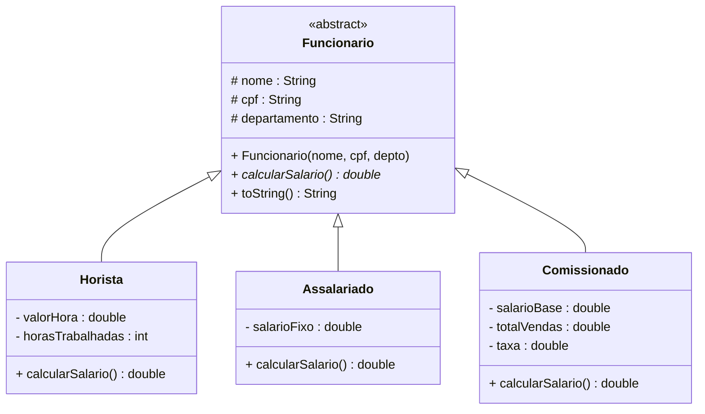
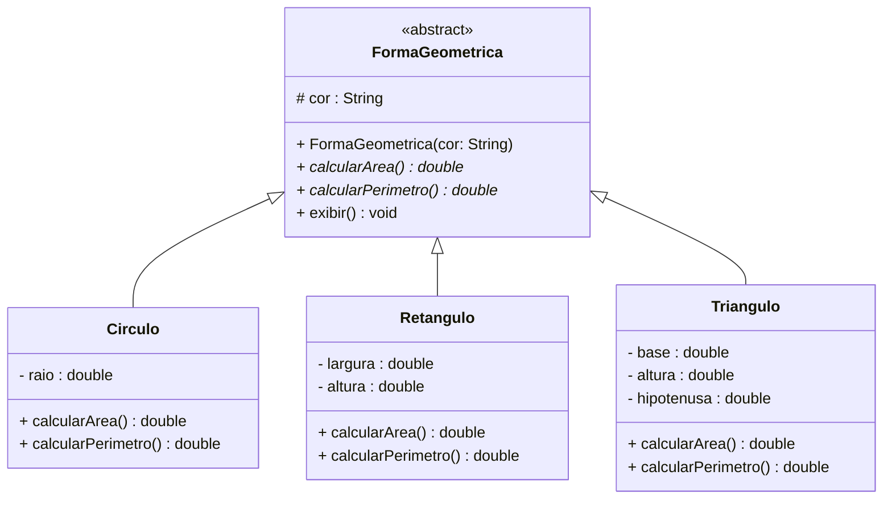
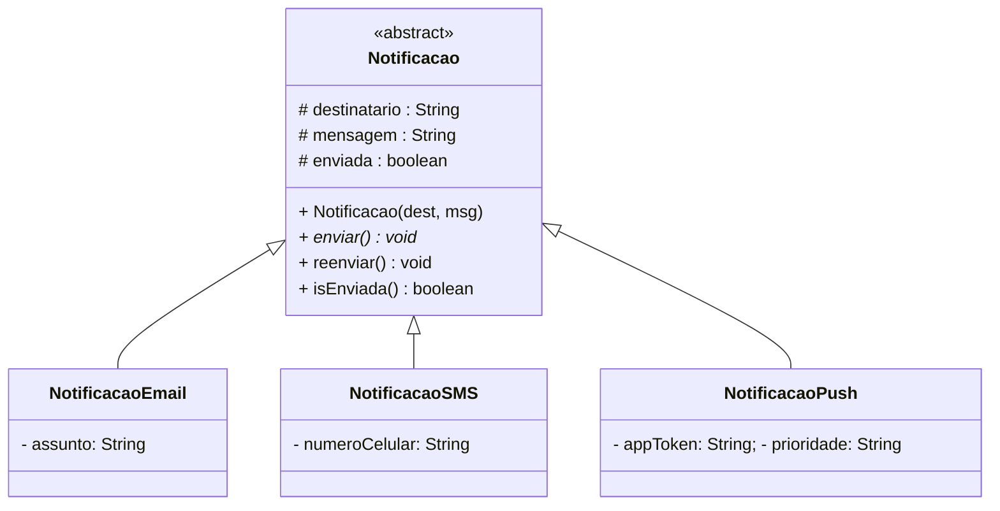

# Encontro 13 — Classes Abstratas

> **Módulo 4 · 4 aulas · 50 XP**

---

## 1. O problema do método genérico vazio

Voltando à hierarquia de Funcionário do Encontro 11, temos um problema:

```java
class Funcionario {
    // calcularSalario() não faz sentido aqui — como calcular o salário de um "Funcionário genérico"?
    double calcularSalario() {
        return 0; // retorno falso apenas para compilar!
    }
}
```

Além disso, nada impede alguém de fazer:

```java
Funcionario f = new Funcionario("Carlos", "111", "TI"); // faz sentido?
f.calcularSalario(); // retorna 0 — resultado sem significado!
```

**Funcionário genérico** é um conceito abstrato que só existe para categorizar. Nunca deve ser instanciado diretamente.

---

## 2. Classes Abstratas — conceitos sem instanciação



> **Notação UML:** classes e métodos abstratos são representados em **itálico**. O estereótipo `<<abstract>>` também é usado.

```java
// A palavra-chave 'abstract' na classe impede instanciação direta
public abstract class Funcionario {
    protected String nome;
    protected String cpf;
    protected String departamento;

    public Funcionario(String nome, String cpf, String departamento) {
        if (nome == null || nome.isBlank())
            throw new IllegalArgumentException("Nome inválido.");
        this.nome         = nome;
        this.cpf          = cpf;
        this.departamento = departamento;
    }

    // Método abstrato: define o CONTRATO — toda subclasse DEVE implementar
    // Note: sem corpo '{}' — apenas assinatura seguida de ';'
    public abstract double calcularSalario();

    // Método concreto: herdado por todas as subclasses
    public String getNome()         { return nome;         }
    public String getDepartamento() { return departamento; }

    @Override
    public String toString() {
        return String.format("[%s | %s | Sal: R$ %.2f]", nome, departamento, calcularSalario());
    }
}
```

```java
// Subclasse CONCRETA — deve implementar calcularSalario() ou ser abstract também
public class Horista extends Funcionario {
    private double valorHora;
    private int horasTrabalhadas;

    public Horista(String nome, String cpf, String depto, double valorHora) {
        super(nome, cpf, depto);
        this.valorHora        = valorHora;
        this.horasTrabalhadas = 0;
    }

    public void registrarHoras(int horas) {
        if (horas < 0) throw new IllegalArgumentException("Horas não podem ser negativas.");
        horasTrabalhadas += horas;
    }

    @Override
    public double calcularSalario() {
        return valorHora * horasTrabalhadas; // implementação concreta do contrato
    }
}
```

---

## 3. Tentando instanciar uma classe abstrata

```java
// Funcionario f = new Funcionario("Ana", "111", "TI");
// ERRO de compilação: "Funcionario is abstract; cannot be instantiated"

// Correto — instanciar a subclasse concreta:
Funcionario f = new Horista("Ana", "111", "TI", 45.0);
// 'f' é do TIPO Funcionario (referência), mas o OBJETO é Horista
// Isso é o fundamento do Polimorfismo — veremos no Módulo 5!
```

---

## 4. Template Method — padrão com classe abstrata

Classes abstratas são perfeitas para o **Template Method Pattern**: a superclasse define a estrutura do algoritmo, as subclasses implementam os passos específicos.

```java
public abstract class RelatorioPDF {

    // Template Method: define a sequência — não pode ser sobrescrito
    public final void gerar() {
        imprimirCabecalho();   // passo fixo
        imprimirConteudo();    // passo variável — subclasse implementa
        imprimirRodape();      // passo fixo
    }

    // Implementações fixas
    private void imprimirCabecalho() {
        System.out.println("=== RELATÓRIO GERADO EM " + java.time.LocalDate.now() + " ===");
    }
    private void imprimirRodape() {
        System.out.println("=== FIM DO RELATÓRIO ===");
    }

    // Passo que VARIA por tipo de relatório — subclasse deve implementar
    protected abstract void imprimirConteudo();
}

class RelatorioVendas extends RelatorioPDF {
    private double totalVendas;
    RelatorioVendas(double total) { this.totalVendas = total; }

    @Override
    protected void imprimirConteudo() {
        System.out.printf("  Total de Vendas: R$ %.2f%n", totalVendas);
    }
}

class RelatorioFuncionarios extends RelatorioPDF {
    private int totalFuncionarios;
    RelatorioFuncionarios(int total) { this.totalFuncionarios = total; }

    @Override
    protected void imprimirConteudo() {
        System.out.println("  Funcionários ativos: " + totalFuncionarios);
    }
}

// Uso:
// new RelatorioVendas(150000.0).gerar();
// new RelatorioFuncionarios(42).gerar();
```

---

## 5. Classe Abstrata vs. Método Abstrato



```java
public abstract class FormaGeometrica {
    protected String cor;

    public FormaGeometrica(String cor) { this.cor = cor; }

    public abstract double calcularArea();
    public abstract double calcularPerimetro();

    // Método concreto que usa os abstratos — isso é o poder da abstração!
    public void exibir() {
        System.out.printf("[%s | Cor: %s | Área: %.2f | Perímetro: %.2f]%n",
            getClass().getSimpleName(), cor, calcularArea(), calcularPerimetro());
    }
}

public class Circulo extends FormaGeometrica {
    private double raio;

    public Circulo(String cor, double raio) {
        super(cor);
        if (raio <= 0) throw new IllegalArgumentException("Raio deve ser positivo.");
        this.raio = raio;
    }

    @Override public double calcularArea()       { return Math.PI * raio * raio; }
    @Override public double calcularPerimetro()  { return 2 * Math.PI * raio;   }
}

public class Retangulo extends FormaGeometrica {
    private double largura, altura;

    public Retangulo(String cor, double largura, double altura) {
        super(cor);
        if (largura <= 0 || altura <= 0)
            throw new IllegalArgumentException("Dimensões devem ser positivas.");
        this.largura = largura;
        this.altura  = altura;
    }

    @Override public double calcularArea()      { return largura * altura;            }
    @Override public double calcularPerimetro() { return 2 * (largura + altura);      }
}

public class DemoFormas {
    public static void main(String[] args) {
        FormaGeometrica[] formas = {
            new Circulo("Vermelho", 5.0),
            new Retangulo("Azul", 4.0, 6.0),
            new Circulo("Verde", 3.0),
        };

        double somaAreas = 0;
        FormaGeometrica maior = formas[0];

        for (FormaGeometrica f : formas) {
            f.exibir();
            somaAreas += f.calcularArea();
            if (f.calcularArea() > maior.calcularArea()) maior = f;
        }

        System.out.printf("%nSoma das áreas: %.2f%n", somaAreas);
        System.out.println("Maior forma: " + maior.getClass().getSimpleName());
    }
}
```

---

## Exercícios Práticos

---

### Exercício 1 — Fácil · 25 XP
**Abstract ou Concreto?**

Para cada classe abaixo, decida se deve ser `abstract` ou concreta. Justifique:
- `Animal`, `Cachorro`, `Veiculo`, `Carro`, `FormaGeometrica`, `Retangulo`, `Pessoa`, `Estudante`, `Conta`, `ContaCorrente`, `Imposto`, `ICMS`

---

### Exercício 2 — Fácil · 25 XP
**Primeiro Método Abstrato**

Implemente a hierarquia básica com classe abstrata:

```java
abstract class Bebida {
    protected String nome;
    protected double volume; // em ml
    abstract double calcularCalorias(); // kcal por ml × volume
    void exibir() {
        System.out.printf("[%s | %.0f ml | %.1f kcal]%n",
            nome, volume, calcularCalorias());
    }
}
// Subclasses: Suco(kcal=0.4/ml), Refrigerante(kcal=0.42/ml), Agua(kcal=0)
```

---

### Exercício 3 — Médio · 25 XP
**Folha de Pagamento Completa**

Complete a hierarquia de Funcionário (Horista, Assalariado, Comissionado) com a superclasse abstrata. Adicione à superclasse:
- `abstract double calcularSalario()`
- `void receberBonus(double pct)` — concreto, aplica bônus percentual ao salário (mas o salário é calculado pelo método abstrato — use-o!)

Crie um `ArrayList<Funcionario>` com 5 funcionários de tipos variados. Calcule: total da folha, maior salário, funcionário com menor salário.

---

### Exercício 4 — Médio · 25 XP
**Template Method**

Implemente o padrão Template Method para processamento de arquivos:

```java
abstract class ProcessadorArquivo {
    // Template Method — ordem fixa de passos
    public final void processar(String arquivo) {
        abrirArquivo(arquivo);      // fixo
        validarFormato();           // abstrato
        processarConteudo();        // abstrato
        gerarRelatorio();           // abstrato
        fecharArquivo();            // fixo
    }
    // Implemente os métodos fixos e abstratos
}
// Subclasses: ProcessadorCSV, ProcessadorJSON, ProcessadorXML
```

---

### Exercício 5 — Difícil · 25 XP
**Sistema de Notificações**

Crie a hierarquia:



- `enviar()` é abstrato — cada tipo simula o envio de forma diferente (pode só imprimir)
- `reenviar()` é concreto — usa `enviar()` internamente, mas imprime uma mensagem diferente se a notificação já foi enviada
- `enviada` só muda para `true` dentro do método `enviar()`

Crie uma fila de 5 notificações de tipos variados, envie todas, e tente reenviar as 3 primeiras.

---

### Exercício 6 — Troubleshooting · 25 XP
**Diagnóstico: Classes Abstratas com Erros**

O código abaixo tem **3 erros** relacionados a classes abstratas. Um tenta instanciar uma classe abstrata, outro define método abstrato com corpo, e o terceiro esquece de implementar todos os métodos abstratos na subclasse. Identifique e corrija.

```java
public abstract class Forma {
    protected String cor;

    Forma(String cor) { this.cor = cor; }

    // Erro 2: método abstrato com corpo — contradição!
    public abstract double calcularArea() {
        return 0; // não pode ter implementação
    }

    public abstract double calcularPerimetro();

    public void exibir() {
        System.out.printf("Forma %s — Área: %.2f%n", cor, calcularArea());
    }
}

class Circulo extends Forma {
    private double raio;

    Circulo(String cor, double raio) {
        super(cor);
        this.raio = raio;
    }

    @Override
    public double calcularArea() {
        return Math.PI * raio * raio;
    }

    // Erro 3: esqueceu de implementar calcularPerimetro()
    // Circulo não é abstrata mas não implementou todos os métodos abstratos
}

public class Main {
    public static void main(String[] args) {
        // Erro 1: tenta instanciar classe abstrata diretamente
        Forma f = new Forma("azul");   // não compila!
        f.exibir();
    }
}
```

> **Dicas:** (1) Classes abstratas nunca podem ser instanciadas — use sempre uma subclasse concreta. (2) Um método `abstract` define apenas a **assinatura**: sem `{}` e sem corpo. (3) Uma classe concreta que herda de abstrata deve implementar **todos** os métodos abstratos — ou ela mesma precisa ser declarada `abstract`.
