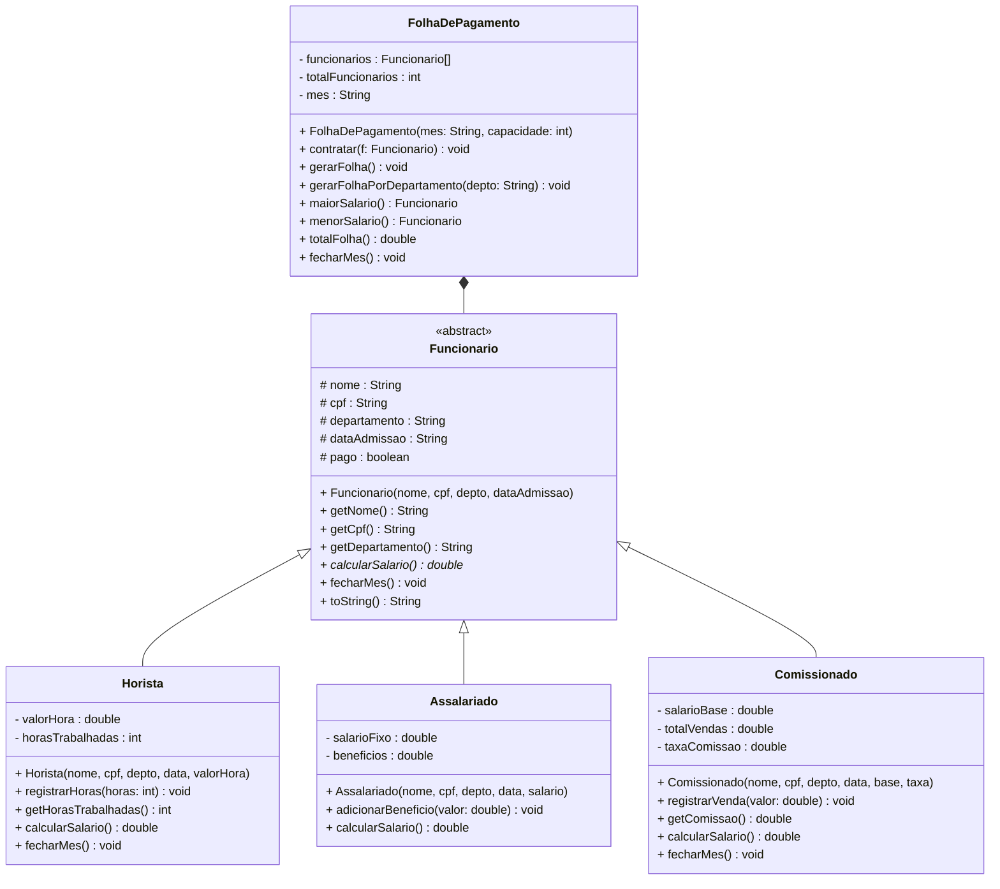

# Atividade Prática 2 — Herança e Classes Abstratas

> **Módulo 4 · Atividade Prática · 150 XP · Avaliação**

---

## Contexto

> *A empresa ACME está modernizando seu sistema de RH. O sistema antigo tratava todos os funcionários com a mesma classe — um campo `tipo` controlava como o salário era calculado via `if/else`. O resultado: código frágil, impossível de testar separadamente e cheio de duplicação.*
>
> *Você foi contratado para reescrever o sistema usando herança e classes abstratas. A nova arquitetura precisa suportar três regimes de contratação — horista, assalariado e comissionado — sem que o módulo de folha de pagamento precise saber qual tipo está processando.*

---

## O que você vai construir

Um sistema de folha de pagamento com as seguintes classes:



---

## Etapa 1 — Superclasse Abstrata `Funcionario` · 25 pts

Implemente a classe abstrata `Funcionario` com as seguintes exigências:

- Atributos `nome`, `cpf`, `departamento`, `dataAdmissao` como `protected final` (imutáveis após criação)
- Atributo `pago` como `protected boolean`, inicializado como `false`
- Construtor com validação: `nome` e `cpf` não podem ser nulos nem em branco — use mensagens de erro descritivas
- Método **abstrato** `calcularSalario()` — sem implementação; cada subclasse é responsável
- Método **concreto** `fecharMes()` — registra o pagamento (`pago = true`) e imprime o nome e o valor calculado. Subclasses podem sobrescrever para adicionar comportamento extra
- `toString()` formatado — inclua `dataAdmissao` e `calcularSalario()`; mesmo sendo abstrato, `calcularSalario()` pode ser chamado em método concreto da superclasse

---

## Etapa 2 — Subclasses · 35 pts

### `Horista` — 12 pts

- Atributos: `valorHora` (`double`, imutável) e `horasTrabalhadas` (`int`, inicia em 0)
- `registrarHoras(int horas)` — valida que `horas >= 0`; acumula no total do mês
- `calcularSalario()` → `valorHora × horasTrabalhadas`
- `fecharMes()` → chama `super.fecharMes()` **e** zera `horasTrabalhadas` para o mês seguinte
- `toString()` — use `super.toString()` e adicione tipo, horas e valor/hora

### `Assalariado` — 11 pts

- Atributos: `salarioFixo` (`double`, imutável) e `beneficios` (`double`, inicia em 0)
- `adicionarBeneficio(double valor)` — valida que `valor >= 0`; acumula benefícios
- `calcularSalario()` → `salarioFixo + beneficios`
- `toString()` — use `super.toString()` e adicione tipo, salário base e benefícios

### `Comissionado` — 12 pts

- Atributos: `salarioBase` e `taxaComissao` (ambos imutáveis); `totalVendas` (inicia em 0)
- Valide: `taxaComissao` deve estar entre 0.0 e 1.0
- `registrarVenda(double valor)` — valida que `valor > 0`; acumula em `totalVendas`
- `getComissao()` → `totalVendas × taxaComissao`
- `calcularSalario()` → `salarioBase + getComissao()`
- `fecharMes()` → chama `super.fecharMes()` **e** zera `totalVendas`
- `toString()` — use `super.toString()` e adicione tipo, base, taxa e comissão

---

## Etapa 3 — `FolhaDePagamento` · 30 pts

A classe de gerenciamento deve operar **exclusivamente pelo tipo `Funcionario`** — sem nenhum `instanceof` ou cast interno. Isso prova que a abstração funciona.

| Método | Comportamento esperado |
|--------|------------------------|
| `contratar(Funcionario f)` | Adiciona ao array; lança `IllegalStateException` se capacidade esgotada |
| `gerarFolha()` | Imprime todos os funcionários, total da folha, maior e menor salário — formatado em tabela |
| `gerarFolhaPorDepartamento(String depto)` | Filtra e imprime somente o departamento; exibe subtotal |
| `totalFolha()` | Soma todos os `calcularSalario()` |
| `maiorSalario()` | Retorna o `Funcionario` com maior salário |
| `menorSalario()` | Retorna o `Funcionario` com menor salário |
| `fecharMes()` | Chama `fecharMes()` de cada funcionário — o polimorfismo faz o resto |

---

## Etapa 4 — Demonstração no `main` · 10 pts

Crie a classe `SistemaFolha` com `main` que demonstre **todos os cenários**:

1. Instanciar pelo menos 5 funcionários (mínimo: 2 horistas, 1 assalariado, 1 comissionado, 1 assalariado com benefício)
2. Registrar horas para os horistas e vendas para o comissionado
3. Adicionar benefícios a pelo menos um assalariado
4. Chamar `gerarFolha()` com saída visível e formatada
5. Chamar `gerarFolhaPorDepartamento()` para pelo menos 2 departamentos distintos
6. Chamar `fecharMes()` e mostrar que horistas e comissionados zeraram seus contadores
7. Imprimir os funcionários admitidos **antes de 2023** — use `dataAdmissao.endsWith("2022")` ou extraia o ano com `dataAdmissao.substring(dataAdmissao.length() - 4)`

---

## Saída de Referência

Sua saída não precisa ser idêntica a esta, mas deve conter as mesmas informações com formatação legível:

```
╔══════════════════════════════════════════════════════════╗
║          FOLHA DE PAGAMENTO — JULHO/2025                 ║
╠══════════════════════════════════════════════════════════╣
  Ana Silva            | CPF: 111 | Depto: TI         | Sal: R$  7560,00 | Horista | 168h × R$ 45,00
  Bob Costa            | CPF: 222 | Depto: RH         | Sal: R$  5000,00 | Assalariado | Base: R$ 4500,00 + Ben: R$ 500,00
  Carol Melo           | CPF: 333 | Depto: Vendas     | Sal: R$  3460,00 | Comissionado | Base: R$ 1500,00 + Com(8%): R$ 1960,00
  Diana Leal           | CPF: 444 | Depto: TI         | Sal: R$  7920,00 | Horista | 144h × R$ 55,00
  Eli Faria            | CPF: 555 | Depto: Financeiro | Sal: R$  7600,00 | Assalariado | Base: R$ 6800,00 + Ben: R$ 800,00
╠══════════════════════════════════════════════════════════╣
║  TOTAL DA FOLHA: R$ 31.540,00
║  MAIOR SALÁRIO:  Diana Leal (R$ 7.920,00)
║  MENOR SALÁRIO:  Carol Melo (R$ 3.460,00)
╚══════════════════════════════════════════════════════════╝

--- Departamento: TI ---
  Ana Silva  ...
  Diana Leal ...
Subtotal TI: R$ 15.480,00

--- Fechando mês: Julho/2025 ---
  Pagamento registrado: Ana Silva — R$ 7.560,00
  Pagamento registrado: Bob Costa — R$ 5.000,00
  ...

Admitidos antes de 2023: Ana Silva (01/03/2022), Bob Costa (15/06/2020), Eli Faria (20/09/2021)
```

---

## Restrições obrigatórias

- `Funcionario` **não pode** ser instanciada diretamente — tente e veja o erro de compilação
- `FolhaDePagamento` **não pode** usar `instanceof` ou cast em nenhum método — o polimorfismo é suficiente
- Todos os atributos devem ser encapsulados; nenhum campo `public`
- Toda validação de invariante deve ser feita no construtor ou no método que recebe o valor

---

## Extensão — Bônus · +25 XP

Para quem quer o desafio extra:

1. **Histórico de pagamentos:** adicione à superclasse um `ArrayList<Double>` que registra todos os salários de meses anteriores. Implemente `getHistorico()` e `mediaHistorica()`
2. **Ordenação por salário:** implemente um método `ordenarPorSalario()` em `FolhaDePagamento` usando bubble sort — do maior para o menor
3. **Relatório de tipos:** implemente `contarPorTipo()` que imprime quantos horistas, assalariados e comissionados existem. **Aqui** você pode usar `instanceof` — justifique por que é o lugar correto para ele

---

## Critérios de Avaliação

| Critério | Pontuação |
|----------|-----------|
| `Funcionario` abstrata com método abstrato e validações corretas | 25 pts |
| Subclasses com `super()`, `@Override`, encapsulamento e invariantes | 35 pts |
| `FolhaDePagamento` operando só via tipo `Funcionario` | 30 pts |
| `main` cobrindo todos os cenários exigidos | 10 pts |
| **Total** | **100 pts** |

> **Bônus:** até +25 XP pelas extensões. Bônus é cumulativo com a nota base.

---

## Gabarito

> **Superclasse Abstrata:**
>
> ```java
> public abstract class Funcionario {
>     protected final String nome;
>     protected final String cpf;
>     protected String departamento;
>     protected final String dataAdmissao;
>     protected boolean pago;
>
>     public Funcionario(String nome, String cpf, String departamento, String dataAdmissao) {
>         if (nome == null || nome.isBlank())
>             throw new IllegalArgumentException("Nome é obrigatório.");
>         if (cpf == null || cpf.isBlank())
>             throw new IllegalArgumentException("CPF é obrigatório.");
>         this.nome         = nome;
>         this.cpf          = cpf;
>         this.departamento = departamento;
>         this.dataAdmissao = dataAdmissao;
>         this.pago         = false;
>     }
>
>     public abstract double calcularSalario();
>
>     public void fecharMes() {
>         pago = true;
>         System.out.printf("  Pagamento registrado: %s — R$ %.2f%n", nome, calcularSalario());
>     }
>
>     public String getNome()         { return nome;         }
>     public String getCpf()          { return cpf;          }
>     public String getDepartamento() { return departamento; }
>     public boolean isPago()         { return pago;         }
>
>     @Override
>     public String toString() {
>         return String.format("  %-20s | CPF: %s | Depto: %-10s | Sal: R$ %8.2f",
>             nome, cpf, departamento, calcularSalario());
>     }
> }
> ```

> **Horista:**
>
> ```java
> public class Horista extends Funcionario {
>     private final double valorHora;
>     private int horasTrabalhadas;
>
>     public Horista(String nome, String cpf, String depto, String data, double valorHora) {
>         super(nome, cpf, depto, data);
>         if (valorHora <= 0) throw new IllegalArgumentException("Valor/hora deve ser positivo.");
>         this.valorHora        = valorHora;
>         this.horasTrabalhadas = 0;
>     }
>
>     public void registrarHoras(int horas) {
>         if (horas < 0) throw new IllegalArgumentException("Horas não podem ser negativas.");
>         horasTrabalhadas += horas;
>     }
>
>     @Override public double calcularSalario() { return valorHora * horasTrabalhadas; }
>
>     @Override
>     public void fecharMes() {
>         super.fecharMes();
>         horasTrabalhadas = 0;
>     }
>
>     public int getHorasTrabalhadas() { return horasTrabalhadas; }
>
>     @Override
>     public String toString() {
>         return super.toString() + String.format(" | Horista | %dh × R$ %.2f", horasTrabalhadas, valorHora);
>     }
> }
> ```

> **Assalariado:**
>
> ```java
> public class Assalariado extends Funcionario {
>     private final double salarioFixo;
>     private double beneficios;
>
>     public Assalariado(String nome, String cpf, String depto, String data, double salario) {
>         super(nome, cpf, depto, data);
>         if (salario <= 0) throw new IllegalArgumentException("Salário deve ser positivo.");
>         this.salarioFixo = salario;
>         this.beneficios  = 0;
>     }
>
>     public void adicionarBeneficio(double valor) {
>         if (valor < 0) throw new IllegalArgumentException("Benefício não pode ser negativo.");
>         beneficios += valor;
>     }
>
>     @Override public double calcularSalario() { return salarioFixo + beneficios; }
>
>     @Override
>     public String toString() {
>         return super.toString() + String.format(" | Assalariado | Base: R$ %.2f + Ben: R$ %.2f",
>             salarioFixo, beneficios);
>     }
> }
> ```

> **Comissionado:**
>
> ```java
> public class Comissionado extends Funcionario {
>     private final double salarioBase;
>     private double totalVendas;
>     private final double taxaComissao;
>
>     public Comissionado(String nome, String cpf, String depto, String data,
>                         double salarioBase, double taxaComissao) {
>         super(nome, cpf, depto, data);
>         if (taxaComissao < 0 || taxaComissao > 1)
>             throw new IllegalArgumentException("Taxa deve estar entre 0 e 1.");
>         this.salarioBase  = salarioBase;
>         this.totalVendas  = 0;
>         this.taxaComissao = taxaComissao;
>     }
>
>     public void registrarVenda(double valor) {
>         if (valor <= 0) throw new IllegalArgumentException("Venda deve ser positiva.");
>         totalVendas += valor;
>     }
>
>     public double getComissao() { return totalVendas * taxaComissao; }
>
>     @Override public double calcularSalario() { return salarioBase + getComissao(); }
>
>     @Override
>     public void fecharMes() {
>         super.fecharMes();
>         totalVendas = 0;
>     }
>
>     @Override
>     public String toString() {
>         return super.toString() + String.format(
>             " | Comissionado | Base: R$ %.2f + Com(%.0f%%): R$ %.2f",
>             salarioBase, taxaComissao * 100, getComissao());
>     }
> }
> ```

> **FolhaDePagamento:**
>
> ```java
> public class FolhaDePagamento {
>     private Funcionario[] funcionarios;
>     private int totalFuncionarios;
>     private String mes;
>
>     public FolhaDePagamento(String mes, int capacidade) {
>         this.mes               = mes;
>         this.funcionarios      = new Funcionario[capacidade];
>         this.totalFuncionarios = 0;
>     }
>
>     public void contratar(Funcionario f) {
>         if (totalFuncionarios >= funcionarios.length)
>             throw new IllegalStateException("Capacidade máxima atingida.");
>         funcionarios[totalFuncionarios++] = f;
>     }
>
>     public void gerarFolha() {
>         System.out.println("\n╔══════════════════════════════════════════════════════════╗");
>         System.out.println("║          FOLHA DE PAGAMENTO — " + mes.toUpperCase() + "           ║");
>         System.out.println("╠══════════════════════════════════════════════════════════╣");
>         for (int i = 0; i < totalFuncionarios; i++) System.out.println(funcionarios[i]);
>         System.out.println("╠══════════════════════════════════════════════════════════╣");
>         System.out.printf("║  TOTAL DA FOLHA: R$ %-39.2f║%n", totalFolha());
>         System.out.printf("║  MAIOR SALÁRIO:  %s (R$ %.2f)%n",
>             maiorSalario().getNome(), maiorSalario().calcularSalario());
>         System.out.printf("║  MENOR SALÁRIO:  %s (R$ %.2f)%n",
>             menorSalario().getNome(), menorSalario().calcularSalario());
>         System.out.println("╚══════════════════════════════════════════════════════════╝");
>     }
>
>     public void gerarFolhaPorDepartamento(String depto) {
>         System.out.println("\n--- Departamento: " + depto + " ---");
>         double subtotal = 0;
>         for (int i = 0; i < totalFuncionarios; i++) {
>             if (funcionarios[i].getDepartamento().equalsIgnoreCase(depto)) {
>                 System.out.println(funcionarios[i]);
>                 subtotal += funcionarios[i].calcularSalario();
>             }
>         }
>         System.out.printf("Subtotal %s: R$ %.2f%n", depto, subtotal);
>     }
>
>     public double totalFolha() {
>         double total = 0;
>         for (int i = 0; i < totalFuncionarios; i++) total += funcionarios[i].calcularSalario();
>         return total;
>     }
>
>     public Funcionario maiorSalario() {
>         Funcionario maior = funcionarios[0];
>         for (int i = 1; i < totalFuncionarios; i++)
>             if (funcionarios[i].calcularSalario() > maior.calcularSalario()) maior = funcionarios[i];
>         return maior;
>     }
>
>     public Funcionario menorSalario() {
>         Funcionario menor = funcionarios[0];
>         for (int i = 1; i < totalFuncionarios; i++)
>             if (funcionarios[i].calcularSalario() < menor.calcularSalario()) menor = funcionarios[i];
>         return menor;
>     }
>
>     public void fecharMes() {
>         System.out.println("\n--- Fechando mês: " + mes + " ---");
>         for (int i = 0; i < totalFuncionarios; i++) funcionarios[i].fecharMes();
>     }
> }
> ```

> **SistemaFolha (main de referência):**
>
> ```java
> public class SistemaFolha {
>     public static void main(String[] args) {
>         FolhaDePagamento folha = new FolhaDePagamento("Julho/2025", 20);
>
>         Horista       ana   = new Horista("Ana Silva",    "111","TI",         "01/03/2022", 45.00);
>         Assalariado   bob   = new Assalariado("Bob Costa","222","RH",         "15/06/2020", 4500.0);
>         Comissionado  carol = new Comissionado("Carol Melo","333","Vendas",   "10/01/2023", 1500.0, 0.08);
>         Horista       diana = new Horista("Diana Leal",   "444","TI",         "03/07/2024", 55.00);
>         Assalariado   eli   = new Assalariado("Eli Faria","555","Financeiro", "20/09/2021", 6800.0);
>
>         folha.contratar(ana);   folha.contratar(bob);
>         folha.contratar(carol); folha.contratar(diana);
>         folha.contratar(eli);
>
>         ana.registrarHoras(168);    diana.registrarHoras(144);
>         carol.registrarVenda(12000.0); carol.registrarVenda(8500.0);
>         bob.adicionarBeneficio(500.0); eli.adicionarBeneficio(800.0);
>
>         folha.gerarFolha();
>         folha.gerarFolhaPorDepartamento("TI");
>         folha.gerarFolhaPorDepartamento("Vendas");
>         folha.fecharMes();
>     }
> }
> ```

> **Troubleshooting — Bugs comuns a evitar:**
>
> **Bug 1 — `calcularSalario()` de Comissionado com lógica invertida:**
> ```java
> // ❌ Errado: multiplica salário base pela taxa
> return salarioBase * taxaComissao + totalVendas;
> // ✅ Correto: comissão incide sobre as vendas
> return salarioBase + (totalVendas * taxaComissao);
> ```
>
> **Bug 2 — `FolhaDePagamento` expõe o array interno:**
> ```java
> // ❌ Errado: retorna referência direta — quem recebe pode substituir elementos
> public Funcionario[] getFuncionarios() { return funcionarios; }
>
> // ✅ Correto: retorna uma cópia — alterações externas não afetam o array interno
> public Funcionario[] getFuncionarios() {
>     Funcionario[] copia = new Funcionario[totalFuncionarios];
>     for (int i = 0; i < totalFuncionarios; i++) copia[i] = funcionarios[i];
>     return copia;
> }
> ```
>
> **Bug 3 — `fecharMes()` em Horista esquece de chamar `super.fecharMes()`:**
> ```java
> // ❌ Errado: zera horas mas não registra pagamento
> public void fecharMes() { horasTrabalhadas = 0; }
> // ✅ Correto: primeiro o comportamento da superclasse, depois o específico
> public void fecharMes() { super.fecharMes(); horasTrabalhadas = 0; }
> ```
