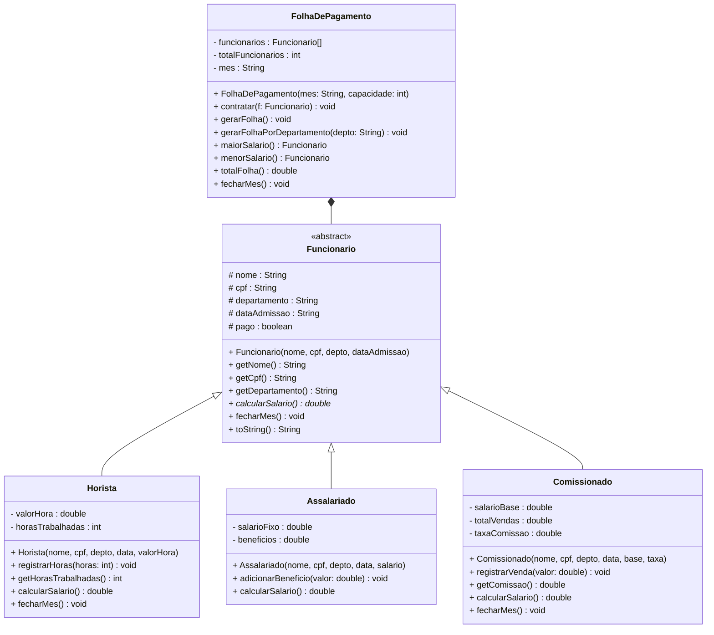

# Encontro 14 — Trabalho Prático 2: Sistema de Folha de Pagamento

> **Módulo 4 · 4 aulas · 150 XP · Avaliação**

---

## Enunciado

> *"A empresa ACME precisa de um sistema de folha de pagamento que suporte diferentes tipos de contratação. Existem funcionários Horistas (ganham por hora trabalhada), Assalariados (salário fixo mensal) e Comissionados (salário base + comissão percentual sobre vendas). Todos os funcionários têm nome, CPF, departamento e data de admissão. O sistema deve calcular o salário de cada funcionário, gerar a folha mensal por departamento e identificar o funcionário com maior e menor salário. Ao encerrar o mês, o sistema deve registrar o pagamento e zerar os contadores de horas/vendas dos tipos variáveis."*

---

## Etapa 1 — Modelagem UML

### Diagrama de Classes obrigatório



---

## Etapa 2 — Implementação de Referência

```java
// ──────────────────────────────────────────────────────
// Superclasse Abstrata
// ──────────────────────────────────────────────────────
public abstract class Funcionario {
    protected final String nome;
    protected final String cpf;
    protected String departamento;
    protected final String dataAdmissao;
    protected boolean pago;

    public Funcionario(String nome, String cpf, String departamento, String dataAdmissao) {
        if (nome == null || nome.isBlank())
            throw new IllegalArgumentException("Nome é obrigatório.");
        if (cpf == null || cpf.isBlank())
            throw new IllegalArgumentException("CPF é obrigatório.");
        this.nome          = nome;
        this.cpf           = cpf;
        this.departamento  = departamento;
        this.dataAdmissao  = dataAdmissao;
        this.pago          = false;
    }

    // Contrato: toda subclasse concreta DEVE implementar
    public abstract double calcularSalario();

    // Concreto: comportamento padrão — subclasses podem sobrescrever
    public void fecharMes() {
        pago = true;
        System.out.printf("  Pagamento registrado: %s — R$ %.2f%n", nome, calcularSalario());
    }

    // Getters
    public String getNome()         { return nome;         }
    public String getCpf()          { return cpf;          }
    public String getDepartamento() { return departamento; }
    public boolean isPago()         { return pago;         }

    @Override
    public String toString() {
        return String.format("  %-20s | CPF: %s | Depto: %-10s | Sal: R$ %8.2f",
            nome, cpf, departamento, calcularSalario());
    }
}

// ──────────────────────────────────────────────────────
// Horista
// ──────────────────────────────────────────────────────
public class Horista extends Funcionario {
    private final double valorHora;
    private int horasTrabalhadas;

    public Horista(String nome, String cpf, String depto, String data, double valorHora) {
        super(nome, cpf, depto, data);
        if (valorHora <= 0) throw new IllegalArgumentException("Valor/hora deve ser positivo.");
        this.valorHora        = valorHora;
        this.horasTrabalhadas = 0;
    }

    public void registrarHoras(int horas) {
        if (horas < 0) throw new IllegalArgumentException("Horas não podem ser negativas.");
        horasTrabalhadas += horas;
    }

    @Override
    public double calcularSalario() { return valorHora * horasTrabalhadas; }

    @Override
    public void fecharMes() {
        super.fecharMes();
        horasTrabalhadas = 0; // zera para o próximo mês
    }

    public int getHorasTrabalhadas() { return horasTrabalhadas; }

    @Override
    public String toString() {
        return super.toString() + String.format(" | Horista | %dh × R$ %.2f", horasTrabalhadas, valorHora);
    }
}

// ──────────────────────────────────────────────────────
// Assalariado
// ──────────────────────────────────────────────────────
public class Assalariado extends Funcionario {
    private final double salarioFixo;
    private double beneficios;

    public Assalariado(String nome, String cpf, String depto, String data, double salario) {
        super(nome, cpf, depto, data);
        if (salario <= 0) throw new IllegalArgumentException("Salário deve ser positivo.");
        this.salarioFixo = salario;
        this.beneficios  = 0;
    }

    public void adicionarBeneficio(double valor) {
        if (valor < 0) throw new IllegalArgumentException("Benefício não pode ser negativo.");
        beneficios += valor;
    }

    @Override
    public double calcularSalario() { return salarioFixo + beneficios; }

    @Override
    public String toString() {
        return super.toString() + String.format(" | Assalariado | Base: R$ %.2f + Ben: R$ %.2f",
            salarioFixo, beneficios);
    }
}

// ──────────────────────────────────────────────────────
// Comissionado
// ──────────────────────────────────────────────────────
public class Comissionado extends Funcionario {
    private final double salarioBase;
    private double totalVendas;
    private final double taxaComissao;

    public Comissionado(String nome, String cpf, String depto, String data,
                        double salarioBase, double taxaComissao) {
        super(nome, cpf, depto, data);
        if (taxaComissao < 0 || taxaComissao > 1)
            throw new IllegalArgumentException("Taxa deve estar entre 0 e 1.");
        this.salarioBase   = salarioBase;
        this.totalVendas   = 0;
        this.taxaComissao  = taxaComissao;
    }

    public void registrarVenda(double valor) {
        if (valor <= 0) throw new IllegalArgumentException("Venda deve ser positiva.");
        totalVendas += valor;
    }

    public double getComissao() { return totalVendas * taxaComissao; }

    @Override
    public double calcularSalario() { return salarioBase + getComissao(); }

    @Override
    public void fecharMes() {
        super.fecharMes();
        totalVendas = 0; // zera vendas do mês
    }

    @Override
    public String toString() {
        return super.toString() + String.format(
            " | Comissionado | Base: R$ %.2f + Com(%.0f%%): R$ %.2f",
            salarioBase, taxaComissao * 100, getComissao());
    }
}

// ──────────────────────────────────────────────────────
// FolhaDePagamento
// ──────────────────────────────────────────────────────
public class FolhaDePagamento {
    private Funcionario[] funcionarios;
    private int totalFuncionarios;
    private String mes;

    public FolhaDePagamento(String mes, int capacidade) {
        this.mes               = mes;
        this.funcionarios      = new Funcionario[capacidade];
        this.totalFuncionarios = 0;
    }

    public void contratar(Funcionario f) {
        if (totalFuncionarios >= funcionarios.length)
            throw new IllegalStateException("Capacidade máxima atingida.");
        funcionarios[totalFuncionarios++] = f;
    }

    public void gerarFolha() {
        System.out.println("\n╔══════════════════════════════════════════════════════════╗");
        System.out.println("║          FOLHA DE PAGAMENTO — " + mes.toUpperCase() + "           ║");
        System.out.println("╠══════════════════════════════════════════════════════════╣");
        for (int i = 0; i < totalFuncionarios; i++) {
            System.out.println(funcionarios[i]);
        }
        System.out.println("╠══════════════════════════════════════════════════════════╣");
        System.out.printf( "║  TOTAL DA FOLHA: R$ %-39.2f║%n", totalFolha());
        System.out.printf( "║  MAIOR SALÁRIO:  %s (R$ %.2f)%n",
            maiorSalario().getNome(), maiorSalario().calcularSalario());
        System.out.printf( "║  MENOR SALÁRIO:  %s (R$ %.2f)%n",
            menorSalario().getNome(), menorSalario().calcularSalario());
        System.out.println("╚══════════════════════════════════════════════════════════╝");
    }

    public void gerarFolhaPorDepartamento(String depto) {
        System.out.println("\n--- Departamento: " + depto + " ---");
        double subtotal = 0;
        for (int i = 0; i < totalFuncionarios; i++) {
            if (funcionarios[i].getDepartamento().equalsIgnoreCase(depto)) {
                System.out.println(funcionarios[i]);
                subtotal += funcionarios[i].calcularSalario();
            }
        }
        System.out.printf("Subtotal %s: R$ %.2f%n", depto, subtotal);
    }

    public double totalFolha() {
        double total = 0;
        for (int i = 0; i < totalFuncionarios; i++) total += funcionarios[i].calcularSalario();
        return total;
    }

    public Funcionario maiorSalario() {
        Funcionario maior = funcionarios[0];
        for (int i = 1; i < totalFuncionarios; i++)
            if (funcionarios[i].calcularSalario() > maior.calcularSalario()) maior = funcionarios[i];
        return maior;
    }

    public Funcionario menorSalario() {
        Funcionario menor = funcionarios[0];
        for (int i = 1; i < totalFuncionarios; i++)
            if (funcionarios[i].calcularSalario() < menor.calcularSalario()) menor = funcionarios[i];
        return menor;
    }

    public void fecharMes() {
        System.out.println("\n--- Fechando mês: " + mes + " ---");
        for (int i = 0; i < totalFuncionarios; i++) funcionarios[i].fecharMes();
    }
}

// ──────────────────────────────────────────────────────
// Main de Teste
// ──────────────────────────────────────────────────────
public class SistemaFolha {
    public static void main(String[] args) {
        FolhaDePagamento folha = new FolhaDePagamento("Julho/2025", 20);

        // Contratações
        Horista       ana   = new Horista("Ana Silva",   "111", "TI",      "01/03/2022", 45.00);
        Assalariado   bob   = new Assalariado("Bob Costa","222","RH",      "15/06/2020", 4500.0);
        Comissionado  carol = new Comissionado("Carol Melo","333","Vendas","10/01/2023", 1500.0, 0.08);
        Horista       diana = new Horista("Diana Leal",  "444", "TI",      "03/07/2024", 55.00);
        Assalariado   eli   = new Assalariado("Eli Faria","555","Financeiro","20/09/2021",6800.0);

        folha.contratar(ana);
        folha.contratar(bob);
        folha.contratar(carol);
        folha.contratar(diana);
        folha.contratar(eli);

        // Registros do mês
        ana.registrarHoras(168);
        diana.registrarHoras(144); // trabalharam menos

        carol.registrarVenda(12000.0);
        carol.registrarVenda(8500.0);

        bob.adicionarBeneficio(500.0); // vale refeição
        eli.adicionarBeneficio(800.0); // vale refeição + transporte

        // Folha geral
        folha.gerarFolha();

        // Por departamento
        folha.gerarFolhaPorDepartamento("TI");
        folha.gerarFolhaPorDepartamento("Vendas");

        // Fechamento
        folha.fecharMes();
    }
}
```

---

## Critérios de Avaliação

| Critério | Pontuação |
|----------|-----------|
| Classe abstrata correta com método abstrato | 20 pts |
| Hierarquia com `extends` e `super()` corretos | 20 pts |
| Encapsulamento rigoroso com invariantes | 15 pts |
| `FolhaDePagamento` operando via tipo `Funcionario` | 20 pts |
| Diagrama UML com itálico e `<<abstract>>` | 15 pts |
| Main cobrindo todos os tipos e cenários | 10 pts |

**Total: 100 pontos**

---

### Troubleshooting de Revisão — 25 XP
**Diagnóstico: Bugs na Folha de Pagamento**

Antes de submeter seu TP2, analise os **3 bugs** abaixo encontrados durante a revisão de código. Para cada um: descreva o erro, classifique (compilação / lógica / design) e escreva a correção.

**Bug 1 — `calcularSalario()` de Comissionado com lógica invertida:**
```java
public class Comissionado extends Funcionario {
    private double salarioBase;
    private double totalVendas;
    private double taxaComissao;

    @Override
    public double calcularSalario() {
        // BUG: multiplica salário base pela taxa, não as vendas
        return salarioBase * taxaComissao + totalVendas;
        // Correto seria: salarioBase + (totalVendas * taxaComissao)
    }
}
```

**Bug 2 — `FolhaDePagamento` expõe o array interno:**
```java
public class FolhaDePagamento {
    private Funcionario[] funcionarios;
    private int total;

    public Funcionario[] getFuncionarios() {
        return funcionarios;  // BUG: retorna referência direta — quem recebe pode modificar
    }
}
```

**Bug 3 — Horista com horas negativas sem validação:**
```java
public class Horista extends Funcionario {
    private double valorHora;
    private int horasTrabalhadas;

    public void registrarHoras(int horas) {
        horasTrabalhadas += horas;  // BUG: aceita horas negativas — saldo pode ficar negativo
    }
}
```

> **Gabarito:** (1) A fórmula correta para comissionado é `salarioBase + (totalVendas * taxaComissao)` — a comissão incide sobre as vendas. (2) Retorne uma cópia: `Arrays.copyOf(funcionarios, total)`. (3) Adicione: `if (horas < 0) throw new IllegalArgumentException("Horas não podem ser negativas")`.
