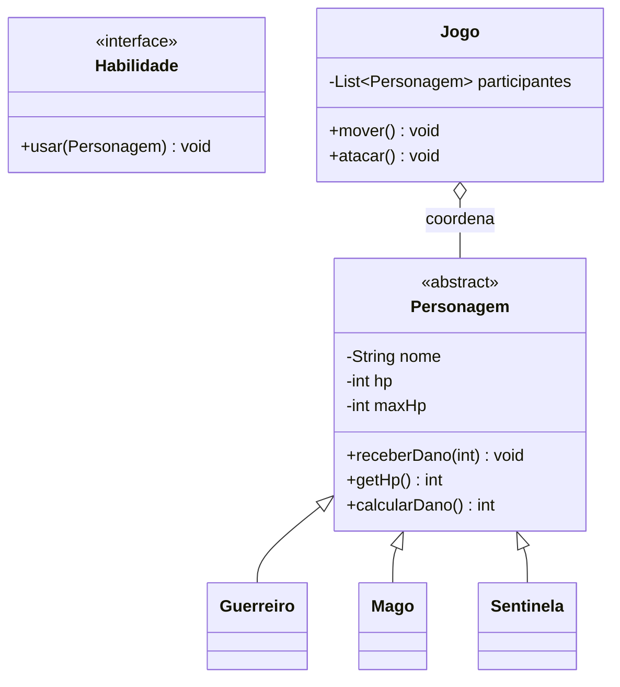
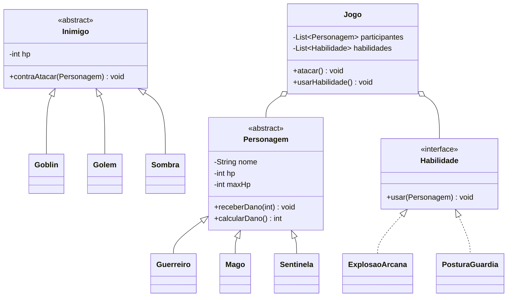

# Atividade prática — Nexus dos Heróis: O Contrato Final

> **Módulo 5 · integração das aulas 1–17 · 150 XP**

## O que mudou nesta versão

O **Nexus dos Heróis original** continua disponível no encontro do Módulo 4 e não foi alterado. Ele continua sendo a atividade de descoberta de classes, objetos, métodos, construtores, encapsulamento, invariantes, herança, exceções e classes abstratas.

Esta é uma **cópia evoluída**, criada para depois da Aula 17. Ela retoma os mesmos princípios e acrescenta os dois contratos que faltavam:

- **polimorfismo:** uma chamada feita pelo tipo geral encontra a implementação do objeto real;
- **interface:** o código cliente depende de uma capacidade/contrato, e não da classe concreta.

O jogo agora tem uma finalidade dupla: vencer o labirinto e sair com um conjunto de evidências que permita construir o diagrama de classes sem inventar relações.

```game-launch
URL: /nexus-heroes-evolution
TITLE: Nexus dos Heróis — O Contrato Final
DESCRIPTION: Explore o labirinto, leia o System Console e abra o Codex de Evidências. Cada descoberta vira uma pista para o seu diagrama de classes.
BUTTON: 🎮 Iniciar a evolução
```

---

## 1. A história: o Contrato Primordial foi quebrado

Depois da primeira aventura, o Nexus passou a funcionar com vários tipos de heróis e inimigos. O problema é que o núcleo do jogo começou a conhecer detalhes demais: perguntava a classe de cada personagem, alterava HP diretamente e criava regras diferentes para cada habilidade.

Então surgiu a entidade **Acoplamento**. Ela roubou o **Contrato Primordial** e dividiu sua energia em quatro fragmentos:

1. **Estado protegido:** ninguém pode alterar HP e Mana de qualquer jeito;
2. **Regra de substituição:** todo `Personagem` deve poder cumprir o comportamento prometido;
3. **Resposta polimórfica:** a mesma solicitação pode produzir comportamentos diferentes;
4. **Contrato de habilidade:** o usuário de uma habilidade não precisa conhecer sua classe concreta.

Os fragmentos estão escondidos no labirinto. Os guardiões também foram modelados como objetos diferentes, então não basta decorar o nome deles. Você precisa observar qual mensagem foi chamada, qual objeto respondeu e qual regra foi preservada.

> **Missão narrativa:** recupere os quatro fragmentos, alcance o portal e entregue o Codex de Evidências para a equipe que vai desenhar a próxima versão do jogo.

---

## 2. Como jogar com intenção de modelagem

Faça uma partida completa e mantenha o **Codex de Evidências** aberto. O mapa é menor e mais legível que o original, mas cada símbolo tem uma função pedagógica.

| Símbolo | Descoberta no jogo | Evidência que você deve registrar |
|---|---|---|
| 📦 | Baú de relíquia | Quem é criado? Qual classe pode representar o item? Qual método adiciona ao inventário? |
| 💎 | Cristal de Mana | Qual atributo está protegido? Qual método altera o estado? Qual invariante é preservada? |
| ⚠️ | Armadilha | Qual exceção representa o evento? O setter ou método permite HP negativo? |
| 👾 🗿 🌑 | Guardiões | Qual é a superclasse? Qual tipo concreto respondeu à chamada? Onde aparece `@Override`? |
| 🔗 | Fragmento de interface | Qual é o contrato? Quem o implementa? O cliente conhece as classes concretas? |
| 🌀 | Portal | Por que a vitória depende das evidências, e não apenas de chegar à saída? |

### Roteiro de investigação

1. Na tela inicial, escolha um **Guerreiro**, **Mago** ou **Sentinela**. Observe que os três são variações de `Personagem`, mas têm valores e comportamentos próprios.
2. Ao iniciar, localize no console o `new`, o construtor e a chamada a `super(...)`. Registre a classe concreta e os atributos que nascem com o objeto.
3. Visite um baú e responda: isso é uma classe, um objeto ou os dois em momentos diferentes? Qual método muda o inventário?
4. Visite o cristal e a armadilha. Compare o que o código cliente pede com o que o próprio objeto permite fazer com seu estado.
5. Fique ao lado de um guardião e pressione **Espaço**. A interface do jogo chama `calcularDano()` sem perguntar primeiro se você é Guerreiro, Mago ou Sentinela. Anote a chamada geral e a resposta específica.
6. Encontre o fragmento 🔗. Pressione **E** e leia a diferença entre “conhecer o contrato” e “conhecer a classe concreta”.
7. Abra o Codex antes de ir ao portal. Verifique quais evidências ainda faltam. Só depois conclua a missão.

> **Regra de ouro:** não copie apenas o texto do console. Para cada evidência, escreva: **quem solicita**, **qual contrato é conhecido**, **qual objeto responde** e **qual regra é protegida**.

---

## 3. O mapa vira um modelo de objetos

O jogo não é um diagrama pronto. Ele é uma fonte de requisitos. Transforme cada descoberta em uma ficha:

| Ficha | Perguntas para responder |
|---|---|
| Objeto | Que entidade existe no jogo? Qual é o seu nome e estado? |
| Classe | Quais objetos compartilham estrutura e comportamento? |
| Atributo | O que precisa ser guardado? Qual visibilidade faz sentido? |
| Método | Que ação esse objeto sabe executar? Quem é responsável por ela? |
| Construtor | O que precisa ser válido no instante do `new`? |
| Invariante | Que regra deve ser verdadeira antes e depois de cada operação? |
| Herança | Existe relação **é-um**? O subtipo pode substituir o tipo geral? |
| Polimorfismo | Qual chamada é feita pelo tipo geral e qual implementação responde? |
| Interface | Qual capacidade atravessa classes diferentes? Qual promessa o cliente usa? |

Preencha esta tabela durante ou logo após a partida:

```fill-table
COL1: Elemento observado
COL2: Sua evidência
LEGEND: Não escreva só o nome. Registre a relação e a responsabilidade descoberta no jogo.
Herói escolhido — classe concreta e superclasse | 
Estado protegido — atributo e método responsável | 
Invariante de HP ou Mana | 
Guardião — chamada geral e implementação concreta | 
Interface — nome do contrato e classes que podem implementá-lo | 
Item — classe, objeto e método de inventário | 
Exceção — evento e regra protegida | 
```

---

## 4. A ponte entre a ação e o Java

### 4.1 Encapsulamento não é apenas `private`

O console mostra `private mana`, mas o aprendizado importante é a responsabilidade: o código de fora pede `restaurarMana(35)`; ele não escreve `heroi.mana = 999`.

```java
public abstract class Personagem {
    private int hp;
    private final int maxHp;

    protected Personagem(int hpInicial) {
        if (hpInicial <= 0) throw new IllegalArgumentException("HP inicial inválido");
        this.hp = hpInicial;
        this.maxHp = hpInicial;
    }

    public final void receberDano(int valor) {
        if (valor < 0) throw new IllegalArgumentException("Dano não pode ser negativo");
        this.hp = Math.max(0, this.hp - valor);
    }

    public int getHp() {
        return hp;
    }
}
```

Pergunte ao grupo: o que seria quebrado se `hp` fosse público? O método `receberDano()` é apenas um setter com outro nome ou ele protege uma regra do domínio?

### 4.2 Herança cria uma família, não um comportamento único

```java
public abstract class Personagem {
    public abstract int calcularDano();
}

public final class Guerreiro extends Personagem {
    @Override
    public int calcularDano() { return 26; }
}

public final class Mago extends Personagem {
    @Override
    public int calcularDano() { return 34; }
}
```

O console deixa uma evidência real de `@Override`: a chamada é `calcularDano()`, mas a resposta muda conforme o objeto real.

### 4.3 Onde está o polimorfismo nesta atividade?

Ele está no momento em que o jogo faz uma chamada por uma referência geral:

```java
List<Personagem> grupo = List.of(
    new Guerreiro("Ayla"),
    new Mago("Nilo"),
    new Sentinela("Iara")
);

for (Personagem personagem : grupo) {
    int dano = personagem.calcularDano();
    System.out.println(dano);
}
```

O `for` não precisa de `if (personagem instanceof Guerreiro)` para calcular o dano. A chamada é a mesma; a JVM seleciona a implementação sobrescrita do objeto real. No jogo, essa evidência aparece no console como:

> `List<Personagem> grupo → personagem.calcularDano() → implementação de Guerreiro/Mago/Sentinela`

**O que ele faz aqui?** Ele permite que o combate seja ampliado com um novo tipo de personagem sem modificar o código que percorre e solicita o dano. O processamento depende de `Personagem`; a variação fica nas subclasses.

### 4.4 Onde está a interface?

O botão **Usar contrato** não precisa conhecer a classe concreta do herói. Ele trabalha com uma capacidade:

```java
public interface Habilidade {
    void usar(Personagem alvo);
}

public final class ExplosaoArcana implements Habilidade {
    @Override
    public void usar(Personagem alvo) {
        alvo.receberDano(48);
    }
}

public final class PosturaGuardia implements Habilidade {
    @Override
    public void usar(Personagem alvo) {
        // outra implementação do mesmo contrato
    }
}
```

**O que a interface faz aqui?** Ela separa “uma coisa que pode ser usada como habilidade” da hierarquia dos personagens. O botão, o processador ou uma futura classe `Inimigo` podem depender de `Habilidade` sem conhecer `ExplosaoArcana`, `PosturaGuardiã` ou suas classes irmãs.

| Pergunta | Polimorfismo por herança | Interface |
|---|---|---|
| O que varia? | A implementação de um comportamento em uma família de `Personagem`. | Uma capacidade/contrato que pode atravessar famílias diferentes. |
| Exemplo no jogo | `Personagem.calcularDano()` responde diferente. | `Habilidade.usar()` é chamado pelo botão. |
| Relação no UML | Generalização: `Guerreiro` —|> `Personagem`. | Realização: `ExplosaoArcana` ..|> `Habilidade`. |
| Pergunta de projeto | “Este objeto é um tipo de Personagem?” | “Este objeto sabe cumprir o contrato Habilidade?” |

---

## 5. Construa o diagrama de classes a partir do Codex

Agora desenhe o primeiro modelo do jogo. Comece com os nomes que você realmente encontrou; só depois acrescente atributos e métodos.

### Passo 1 — classes e interface

Liste as classes `Personagem`, `Guerreiro`, `Mago`, `Sentinela`, `Inimigo`, `Goblin`, `Golem`, `Sombra`, `Item`, `Reliquia` e a interface `Habilidade`. Não coloque tudo em uma única classe `Jogo`.

### Passo 2 — relações

- use generalização quando houver relação **é-um**;
- use realização quando uma classe **implementa** `Habilidade`;
- use associação quando `Jogo` mantém ou utiliza objetos;
- indique multiplicidade quando o jogo mostrar um ou vários objetos;
- não transforme todo uso momentâneo em herança.

### Passo 3 — responsabilidades

Para cada classe, escolha no máximo os atributos e métodos que ela realmente precisa. Uma pista útil:

- `Personagem` protege estado comum e declara `calcularDano()`;
- cada subtipo de personagem define sua própria forma de calcular dano;
- `Habilidade` declara o contrato `usar(...)`;
- `Jogo` coordena o fluxo, mas não deve conhecer a fórmula interna de cada herói;
- `Item` representa o objeto coletável; o inventário decide como armazená-lo.

### Esqueleto para completar



Complete o diagrama com as classes de inimigo, os itens e pelo menos duas implementações de `Habilidade`. Depois escreva uma justificativa curta para cada seta.

---

## 6. Entrega da atividade

Entregue um único arquivo `README.md` ou PDF contendo:

- [ ] narrativa resumida e objetivo do jogo;
- [ ] tabela de evidências preenchida a partir do console;
- [ ] identificação de classe, objeto, atributo, método e construtor;
- [ ] pelo menos duas invariantes e a visibilidade escolhida para protegê-las;
- [ ] explicação de onde ocorre herança e onde ocorre polimorfismo;
- [ ] explicação de onde está a interface e qual acoplamento ela reduz;
- [ ] diagrama de classes com `Personagem` abstrata, subclasses e `Habilidade`;
- [ ] três chamadas do console transcritas e traduzidas para Java;
- [ ] uma proposta de extensão: adicionar um novo herói ou habilidade sem alterar o processador do jogo.

### Perguntas de defesa oral

1. Se `Guerreiro` é um `Personagem`, por que uma variável `Personagem` pode apontar para um `Guerreiro`?
2. Em qual linha do exemplo existe polimorfismo? O que decide a implementação executada?
3. Por que `Habilidade` não precisa ser uma subclasse de `Personagem`?
4. Qual é a diferença entre “o objeto é um `Mago`” e “o objeto implementa `Habilidade`”?
5. Que mudança você faria para adicionar `Arqueiro` sem editar o `for` que calcula dano?
6. Qual atributo não deveria ser público? Qual operação deve preservar sua invariante?

<!-- gabarito-start -->
## Gabarito de orientação para o professor

O núcleo do modelo esperado é:



Aceite outras decomposições quando preservarem as responsabilidades e justificarem as relações. O ponto indispensável é que o polimorfismo apareça em uma coleção ou parâmetro do tipo geral e que a interface seja usada como contrato por um cliente que não depende das implementações concretas.
<!-- gabarito-end -->
