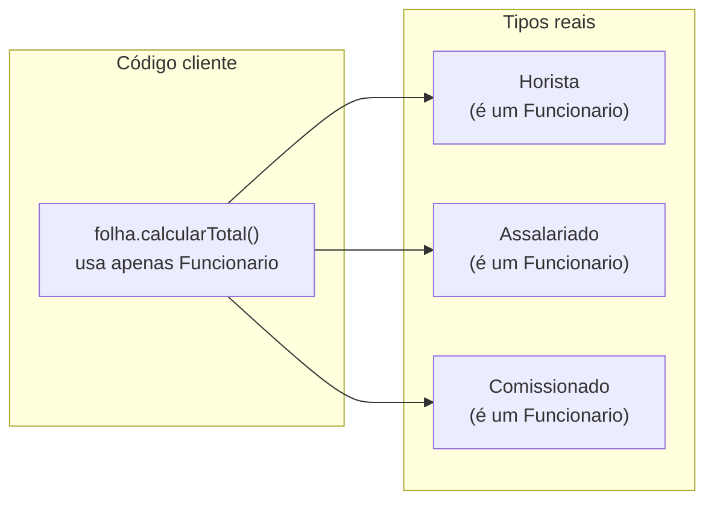
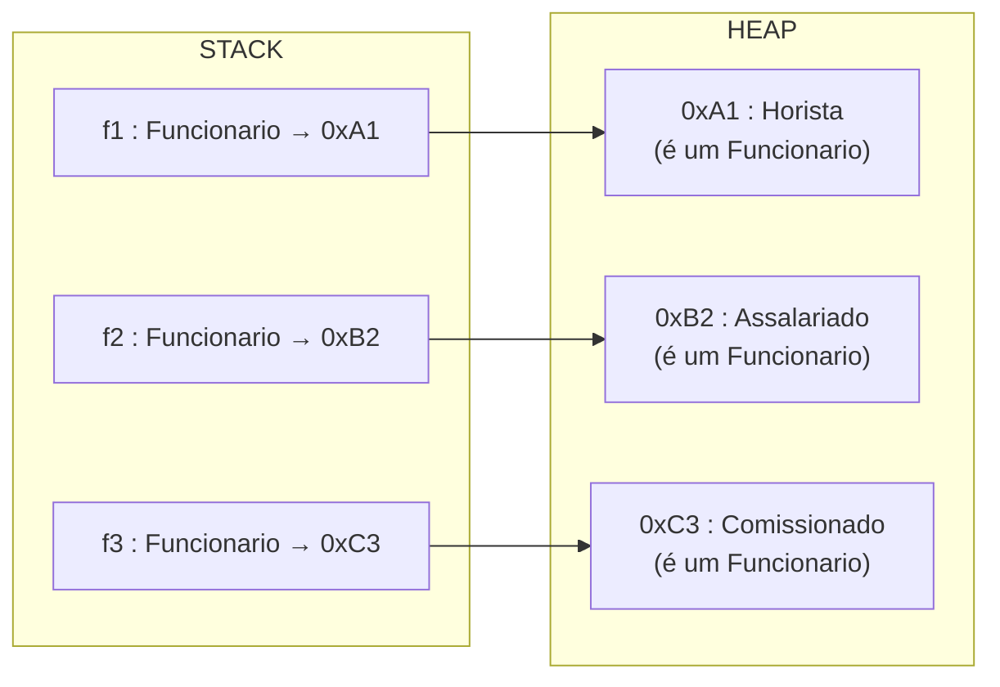
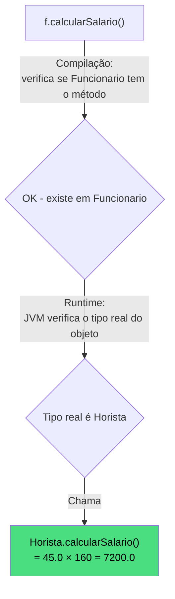

# Encontro 15 — O Princípio da Substituição: Polimorfismo I

> **Módulo 5 · 4 aulas · 50 XP**

---

## 1. O problema que o Polimorfismo resolve

Voltando à `FolhaDePagamento` do TP2: para calcular o total da folha, ainda precisamos saber o tipo exato de cada funcionário:

```java
// SEM polimorfismo — código explosivo
double totalFolha = 0;
for (int i = 0; i < total; i++) {
    if (funcionarios[i] instanceof Horista) {
        totalFolha += ((Horista) funcionarios[i]).calcularSalario();
    } else if (funcionarios[i] instanceof Assalariado) {
        totalFolha += ((Assalariado) funcionarios[i]).calcularSalario();
    } else if (funcionarios[i] instanceof Comissionado) {
        totalFolha += ((Comissionado) funcionarios[i]).calcularSalario();
    }
    // Adicionar novo tipo = modificar este código!
}
```

**Com polimorfismo:**
```java
// COM polimorfismo — elegante, extensível
double totalFolha = 0;
for (Funcionario f : funcionarios) {
    totalFolha += f.calcularSalario(); // cada objeto responde com seu próprio comportamento
}
// Adicionar novo tipo = criar nova subclasse. Este código NÃO muda!
```

---

## 2. Princípio da Substituição de Liskov (LSP)

> *"Se S é subtipo de T, então objetos do tipo T podem ser substituídos por objetos do tipo S sem alterar as propriedades desejáveis do programa."* — Barbara Liskov, 1987

**Em termos práticos:**
> Onde cabe um `Funcionario`, cabe um `Horista`, `Assalariado` ou `Comissionado` — sem que o código que usa `Funcionario` precise saber qual deles é.



---

> **Atenção:** O LSP é frequentemente violado sem que o programador perceba. O exemplo clássico é o **Quadrado herdando de Retângulo** — parece correto geometricamente, mas quebra o contrato:

```java
// Aparentemente faz sentido: todo Quadrado é um Retângulo
class Retangulo {
    protected double largura;
    protected double altura;

    public void setLargura(double l) { this.largura = l; }
    public void setAltura(double a)  { this.altura  = a; }
    public double calcularArea()     { return largura * altura; }
}

class Quadrado extends Retangulo {
    // Quadrado deve ter largura == altura SEMPRE — invariante!
    @Override
    public void setLargura(double l) { this.largura = l; this.altura = l; } // altera os dois!
    @Override
    public void setAltura(double a)  { this.altura  = a; this.largura = a; } // altera os dois!
}

// Código que funciona com Retangulo...
void testar(Retangulo r) {
    r.setLargura(5);
    r.setAltura(3);
    // Esperado: 5 * 3 = 15
    System.out.println(r.calcularArea()); // Com Quadrado: imprime 9 (3*3)! ← LSP VIOLADO
}

testar(new Retangulo()); // imprime 15 ✅
testar(new Quadrado());  // imprime 9  ❌ — comportamento inesperado!
```

**Diagnóstico:** `Quadrado` não pode ser usado no lugar de `Retângulo` sem alterar o comportamento esperado. A solução é **não usar herança**: `Quadrado` e `Retangulo` devem ser classes independentes que implementam uma interface `FormaGeometrica`.

---

## 3. Upcasting — atribuição de subclasse a referência da superclasse

```java
// Upcasting IMPLÍCITO — sempre seguro, Java faz automaticamente
Funcionario f1 = new Horista("Ana", "111", "TI", 45.0);
Funcionario f2 = new Assalariado("Bob", "222", "RH", 4500.0);
Funcionario f3 = new Comissionado("Carol", "333", "Vendas", 1500.0, 0.08);

// f1, f2, f3 são referências do tipo Funcionario
// mas os OBJETOS são Horista, Assalariado e Comissionado respectivamente
```



---

## 4. Ligação Tardia (Late Binding / Dynamic Dispatch)

Este é o mecanismo que torna o polimorfismo possível. Em tempo de compilação, o compilador só sabe que `f` é `Funcionario`. Em **tempo de execução**, a JVM descobre qual implementação de `calcularSalario()` chamar.

```java
Funcionario f = new Horista("Ana", "111", "TI", 45.0);
((Horista) f).registrarHoras(160);

// Em tempo de compilação: "f é Funcionario, tem calcularSalario()"
// Em tempo de execução: JVM vê que o objeto é Horista → chama Horista.calcularSalario()
System.out.println(f.calcularSalario()); // 7200.0 — comportamento de Horista!
```



---

## 5. Processamento em lote — o poder do polimorfismo

```java
import java.util.ArrayList;
import java.util.List;

public class GerenciadorFolha {

    // Aceita QUALQUER lista de funcionários — passado, presente ou futuro
    public static double calcularTotalFolha(List<Funcionario> funcionarios) {
        double total = 0;
        for (Funcionario f : funcionarios) {
            total += f.calcularSalario(); // late binding em ação
        }
        return total;
    }

    public static Funcionario encontrarMaiorSalario(List<Funcionario> funcionarios) {
        if (funcionarios.isEmpty())
            throw new IllegalArgumentException("Lista vazia.");
        Funcionario maior = funcionarios.get(0);
        for (Funcionario f : funcionarios) {
            if (f.calcularSalario() > maior.calcularSalario()) {
                maior = f;
            }
        }
        return maior;
    }

    public static void imprimirFolha(List<Funcionario> funcionarios) {
        System.out.println("=== FOLHA DE PAGAMENTO ===");
        for (Funcionario f : funcionarios) {
            System.out.printf("  %-20s R$ %8.2f%n", f.getNome(), f.calcularSalario());
        }
        System.out.printf("  TOTAL: R$ %.2f%n", calcularTotalFolha(funcionarios));
    }

    public static void main(String[] args) {
        // ArrayList<Funcionario> pode conter qualquer subtipo
        List<Funcionario> folha = new ArrayList<>();

        Horista ana = new Horista("Ana Silva", "111", "TI", 45.0);
        ana.registrarHoras(168);

        Assalariado bob = new Assalariado("Bob Costa", "222", "RH", 4500.0);

        Comissionado carol = new Comissionado("Carol Melo", "333", "Vendas", 1500.0, 0.08);
        carol.registrarVenda(30000.0);

        // Todos tratados uniformemente
        folha.add(ana);
        folha.add(bob);
        folha.add(carol);

        // Podemos adicionar novos tipos no futuro sem alterar o código acima:
        // folha.add(new Estagiario("Davi", "444", "TI", 800.0)); — funcionaria!

        imprimirFolha(folha);
        System.out.printf("Maior salário: %s%n", encontrarMaiorSalario(folha).getNome());
    }
}
```

---

## 6. Coleção heterogênea — formas geométricas

```java
public class DemoPolimorfismo {
    public static void main(String[] args) {
        // Array de FormaGeometrica — heterogêneo mas homogêneo na interface
        List<FormaGeometrica> formas = new ArrayList<>();
        formas.add(new Circulo("Vermelho", 5.0));
        formas.add(new Retangulo("Azul", 4.0, 6.0));
        formas.add(new Circulo("Verde", 3.0));
        formas.add(new Retangulo("Amarelo", 8.0, 2.0));

        // Processamento uniforme — cada forma responde com sua implementação
        double somaAreas = 0;
        FormaGeometrica maior = formas.get(0);

        for (FormaGeometrica f : formas) {
            f.exibir(); // comportamento polimórfico
            somaAreas += f.calcularArea();
            if (f.calcularArea() > maior.calcularArea()) maior = f;
        }

        System.out.printf("%nSoma total das áreas: %.2f%n", somaAreas);
        System.out.printf("Maior área: %s (%.2f)%n",
            maior.getClass().getSimpleName(), maior.calcularArea());
    }
}
```

---

## Exercícios Práticos

---

### Exercício 1 — Fácil · 25 XP
**Preveja a saída com polimorfismo**

```java
abstract class Forma {
    abstract String nome();
    void descrever() {
        System.out.println("Eu sou: " + nome());
    }
}
class Quadrado extends Forma {
    @Override String nome() { return "Quadrado"; }
}
class Triangulo extends Forma {
    @Override String nome() { return "Triângulo"; }
    @Override void descrever() {
        System.out.print("Forma especial! ");
        super.descrever();
    }
}

public class Main {
    public static void main(String[] args) {
        Forma[] formas = { new Quadrado(), new Triangulo(), new Quadrado() };
        for (Forma f : formas) {
            f.descrever(); // O que imprime cada iteração?
        }
    }
}
```

---

### Exercício 2 — Fácil · 25 XP
**Upcasting na prática**

Crie a hierarquia `Musica` → `MPB`, `Rock`, `Classical`. Cada tipo tem `String genero()` e `String tocar()` retornando strings diferentes. Crie um `ArrayList<Musica>` com 6 músicas de tipos variados, percorra e chame `tocar()` em cada uma sem saber o tipo exato.

---

### Exercício 3 — Médio · 25 XP
**Calculadora de impostos**

Crie a hierarquia:
```
abstract Imposto → IR, ICMS, ISS
```
- `IR.calcular(renda)` — tabela progressiva (≤2112: isento, ≤2826: 7.5%, ≤3751: 15%, ≤4664: 22.5%, acima: 27.5%)
- `ICMS.calcular(valorMercadoria)` — 18% do valor
- `ISS.calcular(valorServico)` — 5% do valor

Crie uma `NotaFiscal` com valor e tipo de imposto. Processe uma lista de 5 notas fiscais com impostos diferentes, calculando o total de impostos arrecadados.

---

### Exercício 4 — Médio · 25 XP
**Sistema de Transporte**

Crie `Transporte` → `Onibus`, `Metro`, `Taxi`. Cada um tem `calcularTarifa(distanciaKm)`:
- `Onibus`: R$ 4,40 fixa
- `Metro`: R$ 5,00 fixa
- `Taxi`: R$ 2,50 bandeirada + R$ 1,80/km

Crie uma lista de 10 viagens (tipo, distância). Calcule: custo total de todas as viagens, custo médio por tipo de transporte, transporte mais caro e mais barato.

---

### Exercício 5 — Difícil · 25 XP
**Simulação de jogo de RPG**

Crie a hierarquia `Personagem` (nome, hp, nivel) → `Guerreiro`, `Mago`, `Arqueiro`. Cada tipo implementa:
- `atacar()` → retorna int (dano causado)
- `defender(int dano)` → reduz hp com regras próprias (ex: guerreiro reduz 30% do dano)
- `habilidadeEspecial()` → comportamento único

Crie um `Arena` com dois times de 3 personagens cada. Simule rodadas de combate polimórfico até um time ser eliminado.

---

### Exercício 6 — Troubleshooting · 25 XP
**Diagnóstico: Violações do LSP e Upcasting Incorreto**

O código abaixo tem **3 erros**. Um viola o LSP ao restringir comportamento da superclasse, um tenta chamar método de subclasse via referência de superclasse sem cast, e um aplica upcasting para tipo errado. Identifique e corrija.

```java
class Ave {
    public void voar() {
        System.out.println("Voando...");
    }
    public void comer() {
        System.out.println("Comendo...");
    }
}

// Erro 1: Pinguim É-UMA Ave mas não pode voar — viola o LSP
class Pinguim extends Ave {
    @Override
    public void voar() {
        throw new UnsupportedOperationException("Pinguim não voa!");
        // Código que usa Ave.voar() vai quebrar com Pinguim
    }
}

public class Main {
    public static void main(String[] args) {
        // Erro 2: tenta chamar método específico de Pinguim via referência Ave
        Ave ave = new Pinguim();
        ave.nadar();   // não compila — 'nadar()' não existe em Ave

        // Erro 3: upcasting para tipo errado — ClassCastException garantida
        Ave outra = new Ave();
        Pinguim p = (Pinguim) outra;  // compila, mas lança ClassCastException!
        p.comer();
    }
}
```

> **Dicas:** (1) Se uma subclasse não pode implementar um método herdado sem lançar exceção, o design está errado — separe em `AveVoadora` e `AveNaoVoadora` ou use interfaces `Voavel`. (2) Para chamar `nadar()`, é preciso fazer downcasting com `instanceof` primeiro: `if (ave instanceof Pinguim p) p.nadar()`. (3) Antes de qualquer cast descendente, verifique o tipo real com `instanceof`.
