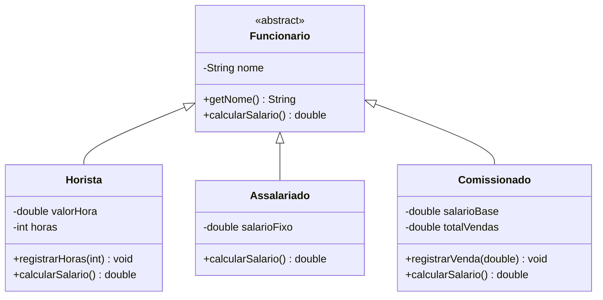
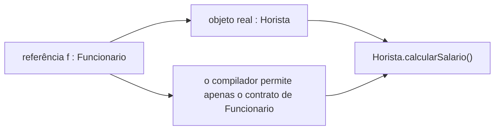
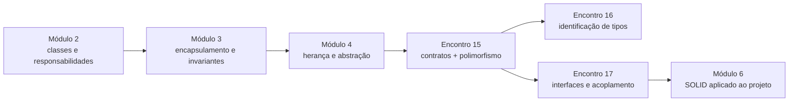
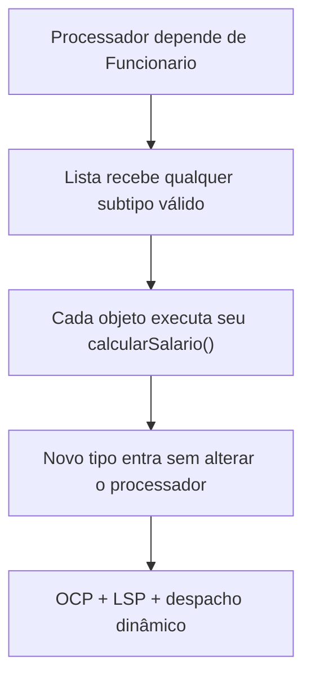

# Encontro 15 — O Princípio da Substituição: Polimorfismo I

> **Módulo 5 · 4 aulas · 50 XP**

---

## A missão da aula

Imagine que a equipe de uma plataforma de pagamentos recebeu uma nova regra: além de cartão e boleto, o sistema agora precisa calcular pagamentos por Pix. O código atual funciona, mas toda vez que surge um novo tipo alguém precisa abrir o mesmo `if/else` e alterar uma parte delicada do sistema.

Hoje você vai transformar esse código para que novos comportamentos possam entrar sem quebrar quem já usa o sistema.

> **Pare por 60 segundos:** antes de ler a solução, responda mentalmente: se uma lista é declarada como `List<Funcionario>`, ela pode guardar um `Horista`? E quem deve decidir como o salário é calculado: a lista ou o objeto?

### Ao final, você deverá conseguir

- explicar polimorfismo usando **referência do tipo geral + objeto de tipo específico**;
- prever qual implementação será executada por **ligação tardia**;
- avaliar se uma subclasse realmente pode substituir sua superclasse usando o **LSP**;
- relacionar o encontro com os cinco princípios do **SOLID**;
- adicionar um novo tipo sem alterar o código que processa a coleção.

### O ritmo recomendado

| Momento | Pergunta-guia | Evidência de aprendizagem |
|---|---|---|
| Aquecimento | O que quebra quando aparece um novo tipo? | Você localiza o ponto frágil. |
| Leitura de código | Quem sabe o tipo e quem sabe o comportamento? | Você separa referência de objeto. |
| Laboratório | O que a JVM chama em cada iteração? | Você prevê a saída antes de executar. |
| Projeto | Uma subclasse preserva o contrato? | Você detecta uma violação do LSP. |
| Prática | Consigo adicionar um tipo sem editar o processador? | Você aplica OCP + LSP. |

---

## 1. O problema: um processador que conhece todos os tipos

Começamos com uma solução comum. A folha de pagamento recebe funcionários, mas o próprio processador precisa perguntar qual é o tipo concreto de cada item.

```java
// Funciona, mas o processador conhece cada tipo concreto.
double totalFolha = 0;

for (Funcionario f : funcionarios) {
    if (f instanceof Horista) {
        totalFolha += ((Horista) f).calcularSalario();
    } else if (f instanceof Assalariado) {
        totalFolha += ((Assalariado) f).calcularSalario();
    } else if (f instanceof Comissionado) {
        totalFolha += ((Comissionado) f).calcularSalario();
    }
}
```

O cálculo parece correto. O problema está no **custo de mudança**: para criar `Estagiario`, será preciso editar `calcularTotalFolha()`. Se o sistema tiver dez relatórios, talvez seja necessário editar dez lugares.

> **Pergunta para a dupla:** o que deveria mudar quando nasce um novo tipo de funcionário: o novo tipo ou todos os processadores que já conhecem os tipos antigos?

A solução polimórfica desloca a responsabilidade para o objeto que possui a regra:

```java
double totalFolha = 0;

for (Funcionario f : funcionarios) {
    totalFolha += f.calcularSalario();
}
```

O `for` não sabe se `f` é `Horista`, `Assalariado` ou `Comissionado`. Ele só conhece o contrato `Funcionario.calcularSalario()`.

### A ideia em uma frase

**Polimorfismo permite que um código trabalhe com o tipo geral, enquanto cada objeto fornece seu comportamento específico.**

### Atividade interativa: vire o responsável pela mudança

Complete as decisões abaixo sem olhar novamente para o código. A meta é perceber onde o polimorfismo concentra a mudança quando um novo tipo aparece.

```fill-table
COL1: Pergunta sobre o design
COL2: Complete a resposta
LEGEND: Preencha de memória e clique fora do campo. Se errar, releia apenas a ideia em uma frase e tente de novo.
O loop precisa conhecer Horista, Assalariado e Comissionado separadamente? | não
Quem deve conhecer a regra de cálculo do salário? | objeto
Ao criar Estagiario, o método totalizar precisa ser editado? | não
Qual chamada genérica o processador faz em cada item? | f.calcularSalario()
```

---

## 2. O contrato e a substituição

O contrato comum fica em uma classe abstrata. Ela reúne o que todo funcionário tem e declara o comportamento que todo funcionário deve oferecer.

```java
public abstract class Funcionario {
    private final String nome;

    protected Funcionario(String nome) {
        if (nome == null || nome.isBlank()) {
            throw new IllegalArgumentException("Nome obrigatório");
        }
        this.nome = nome;
    }

    public String getNome() {
        return nome;
    }

    public abstract double calcularSalario();
}

public class Horista extends Funcionario {
    private final double valorHora;
    private int horas;

    public Horista(String nome, double valorHora) {
        super(nome);
        this.valorHora = valorHora;
    }

    public void registrarHoras(int horas) {
        if (horas < 0) throw new IllegalArgumentException("Horas inválidas");
        this.horas += horas;
    }

    @Override
    public double calcularSalario() {
        return valorHora * horas;
    }
}

public class Assalariado extends Funcionario {
    private final double salarioFixo;

    public Assalariado(String nome, double salarioFixo) {
        super(nome);
        this.salarioFixo = salarioFixo;
    }

    @Override
    public double calcularSalario() {
        return salarioFixo;
    }
}
```

O código cliente pode tratar os dois objetos da mesma maneira:

```java
List<Funcionario> folha = new ArrayList<>();

Horista ana = new Horista("Ana", 45.0);
ana.registrarHoras(160);

folha.add(ana);
folha.add(new Assalariado("Beto", 5000.0));

for (Funcionario funcionario : folha) {
    System.out.printf("%s: R$ %.2f%n",
        funcionario.getNome(), funcionario.calcularSalario());
}
```


```mermaid
classDiagram
    class Funcionario {
        <<abstract>>
        -String nome
        +getNome() String
        +calcularSalario() double
    }
    class Horista {
        -double valorHora
        -int horas
        +registrarHoras(int) void
        +calcularSalario() double
    }
    class Assalariado {
        -double salarioFixo
        +calcularSalario() double
    }
    class Comissionado {
        -double salarioBase
        -double totalVendas
        +registrarVenda(double) void
        +calcularSalario() double
    }
    Funcionario <|-- Horista
    Funcionario <|-- Assalariado
    Funcionario <|-- Comissionado
```

### O que significa “substituir”?

O Princípio da Substituição de Liskov (LSP) diz:

> **Se `S` é subtipo de `T`, qualquer código que funciona com `T` deve continuar funcionando quando receber `S`, sem surpresas que quebrem o contrato.**

Em nosso exemplo, onde cabe `Funcionario`, deve caber `Horista`, `Assalariado` ou `Comissionado`. O processador não precisa de uma exceção especial para cada um.

A definição formal de Barbara Liskov é importante, mas a pergunta operacional é ainda mais útil:

> **“Se eu trocar a superclasse por esta subclasse, o que o código cliente espera continua verdadeiro?”**

### Atividade interativa: é-um ou trabalha-com?

Classifique os relacionamentos. O objetivo é separar uma substituição válida de uma classe que apenas usa a abstração para realizar seu trabalho.

```is-a-has-a
PAIR:Horista|Funcionario:heranca:Horista é um Funcionario e pode ocupar qualquer lugar que espere esse contrato.
PAIR:Assalariado|Funcionario:heranca:Assalariado também fornece calcularSalario() sem exigir um tratamento especial.
PAIR:Estagiario|Funcionario:heranca:Estagiario é mais um subtipo válido para a coleção polimórfica.
PAIR:ProcessadorFolha|Funcionario:composicao:O processador trabalha com Funcionarios; ele não é um tipo de Funcionario.
```

---

## 3. O que acontece em tempo de execução?

Observe as duas informações diferentes:

```java
Funcionario f = new Horista("Ana", 45.0);
```

- **Tipo da referência:** `Funcionario`. É o que o compilador usa para verificar quais métodos podem ser chamados.
- **Tipo real do objeto:** `Horista`. É o que a JVM usa para escolher a implementação sobrescrita.


```mermaid
flowchart LR
    R["referência f : Funcionario"] --> O["objeto real : Horista"]
    O --> M["Horista.calcularSalario()"]
    R --> C["o compilador permite apenas o contrato de Funcionario"]
    C --> M
```

Essa escolha em tempo de execução é a **ligação tardia** (late binding) ou **despacho dinâmico**.

### Laboratório rápido: rastreie antes de executar

Preencha a tabela do rastreador. O objetivo é descobrir o tipo da referência, o tipo real do objeto e o método escolhido pela JVM.

```code-trace
KEY:encontro-15-ligacao-tardia
SCENARIO:Uma referência geral aponta para um objeto Horista. Preveja o tipo e o resultado antes de executar.
STEP:Funcionario f = new Horista("Ana", 45.0);
VAR:tipo da referência:String:Funcionario
VAR:tipo real do objeto:String:Horista
STEP:((Horista) f).registrarHoras(160);
VAR:horas acumuladas:int:160
STEP:double salario = f.calcularSalario();
VAR:método escolhido:String:Horista.calcularSalario()
VAR:salário:double:7200.0
STEP:System.out.println(salario);
VAR:saída:String:7200.0
```

> **Atenção:** o polimorfismo não significa que qualquer método de qualquer subclasse pode ser chamado pela referência geral. `f.calcularSalario()` compila porque o método está no contrato `Funcionario`. `f.registrarHoras(160)` não compila porque esse comportamento ainda é específico de `Horista`. A identificação de tipos e o downcasting serão aprofundados no Encontro 16.

---

## 4. LSP na prática: contrato, não aparência

Uma herança pode parecer correta no diagrama e ainda ser inválida no comportamento. O teste não é “as classes têm atributos parecidos?”; o teste é “a subclasse preserva o contrato?”.

Verifique quatro pontos:

| Parte do contrato | Pergunta para avaliar uma subclasse |
|---|---|
| Pré-condições | A subclasse exige algo mais difícil do que a superclasse exigia? |
| Pós-condições | Depois do método, a promessa continua verdadeira? |
| Invariantes | As regras que sempre deveriam ser verdadeiras continuam preservadas? |
| Exceções | A subclasse transforma um caso válido em erro inesperado? |

### O caso clássico: quadrado e retângulo

Geometricamente, um quadrado é um retângulo. Em um modelo com setters independentes, porém, o contrato de `Retangulo` permite mudar largura e altura separadamente:

```java
class Retangulo {
    protected double largura;
    protected double altura;

    public void setLargura(double largura) { this.largura = largura; }
    public void setAltura(double altura)   { this.altura = altura; }
    public double area()                   { return largura * altura; }
}

class Quadrado extends Retangulo {
    @Override
    public void setLargura(double lado) {
        largura = lado;
        altura = lado;
    }

    @Override
    public void setAltura(double lado) {
        altura = lado;
        largura = lado;
    }
}

void conferir(Retangulo retangulo) {
    retangulo.setLargura(5);
    retangulo.setAltura(3);
    System.out.println(retangulo.area()); // contrato esperado: 15
}
```

`conferir(new Retangulo())` imprime `15`. `conferir(new Quadrado())` imprime `9`, porque a segunda chamada alterou também a largura. O subtipo não preservou o comportamento prometido por `Retangulo`.

**Solução de design:** modelar `Quadrado` e `Retangulo` como formas independentes, ou extrair um contrato menor como `FormaGeometrica` com `area()`. Nem toda relação “é um” do mundo real deve virar herança no código.

> **Regra de bolso:** se a subclasse precisa lançar `UnsupportedOperationException`, ignorar uma promessa ou criar uma exceção especial para o código cliente, pare e revise a hierarquia.

### Atividade interativa: auditoria do contrato

Associe cada sinal de alerta à parte do contrato que está em risco. Pense como uma pessoa revisando uma API: o que o cliente podia assumir antes continua valendo?

```fill-table
COL1: Sinal observado na subclasse
COL2: Parte do contrato afetada
LEGEND: Use os quatro termos do texto: pré-condição, pós-condição, invariante e exceção.
Aceita menos entradas do que a superclasse aceitava | pré-condição
Depois do método, a promessa anunciada pela superclasse deixa de ser verdadeira | pós-condição
Uma regra que deveria permanecer sempre verdadeira é quebrada | invariante
Um caso válido para a superclasse passa a lançar erro inesperado | exceção
```

---

## 5. Onde o SOLID entra nesta história?

SOLID é um conjunto de princípios para manter responsabilidades, extensibilidade e dependências sob controle. Não é uma lista para decorar; é uma lente para fazer perguntas melhores sobre o design.

| Princípio | Pergunta de design | Como se conecta ao curso |
|---|---|---|
| **S — Responsabilidade Única** | Esta classe tem um único motivo para mudar? | Módulo 2 separou classes e responsabilidades; Módulo 3 protegeu o estado e as regras da classe. |
| **O — Aberto/Fechado** | Consigo adicionar comportamento sem editar código estável? | O polimorfismo deste encontro permite adicionar `Estagiario` sem alterar o processador da folha. |
| **L — Substituição de Liskov** | Todo subtipo preserva o contrato do tipo geral? | É o foco deste encontro: herança só é válida quando o comportamento continua substituível. |
| **I — Segregação de Interfaces** | O cliente depende de métodos que não usa? | Será aprofundado com interfaces no Encontro 17; contratos menores reduzem falsas obrigações. |
| **D — Inversão de Dependência** | O código de alto nível depende de abstrações ou de classes concretas? | A classe abstrata já é um primeiro passo; interfaces e injeção de dependência serão retomadas no projeto final. |

### O mapa de evolução


```mermaid
flowchart LR
    M2["Módulo 2\nclasses e responsabilidades"] --> M3["Módulo 3\nencapsulamento e invariantes"]
    M3 --> M4["Módulo 4\nherança e abstração"]
    M4 --> E15["Encontro 15\ncontratos + polimorfismo"]
    E15 --> E16["Encontro 16\nidentificação de tipos"]
    E15 --> E17["Encontro 17\ninterfaces e acoplamento"]
    E17 --> M6["Módulo 6\nSOLID aplicado ao projeto"]
```

### Um único exemplo, cinco perguntas

Considere o processador abaixo:

```java
public class ProcessadorFolha {
    public double totalizar(List<Funcionario> funcionarios) {
        return funcionarios.stream()
            .mapToDouble(Funcionario::calcularSalario)
            .sum();
    }
}
```

- **S:** `ProcessadorFolha` totaliza; ele não calcula a regra de cada salário.
- **O:** um novo `Estagiario` entra na lista sem editar `totalizar`.
- **L:** todo `Funcionario` precisa entregar um salário válido, sem quebrar o contrato.
- **I:** se a folha também obrigar todo funcionário a `registrarVenda()`, o contrato está grande demais; separe-o.
- **D:** o processador depende de `Funcionario`, uma abstração, e não de `Horista` ou `Assalariado`.

> **Importante:** conhecer os cinco princípios agora não significa dominar todos em profundidade. O objetivo é reconhecer o mapa. Os próximos encontros e o projeto final vão exigir que você use essas perguntas em decisões reais.

### Atividade interativa: qual lente SOLID usar?

Leia a pergunta e escreva a sigla do princípio que ajuda a respondê-la. Não decore a ordem: reconstrua a conexão com o exemplo da folha.

```fill-table
COL1: Pergunta de design
COL2: Princípio SOLID
LEGEND: Responda com uma sigla: SRP, OCP, LSP, ISP ou DIP.
Consigo adicionar Estagiario sem editar totalizar? | OCP
Todo subtipo mantém o contrato de Funcionario? | LSP
ProcessadorFolha tem apenas a responsabilidade de totalizar? | SRP
O processador depende de Funcionario em vez de Horista? | DIP
O contrato obriga o cliente a depender de métodos que ele não usa? | ISP
```

---

## 6. A decisão que prova que você entendeu

Suponha que o negócio crie este novo tipo:

```java
public class Estagiario extends Funcionario {
    private final double bolsa;

    public Estagiario(String nome, double bolsa) {
        super(nome);
        this.bolsa = bolsa;
    }

    @Override
    public double calcularSalario() {
        return bolsa;
    }
}
```

Se o processador trabalha com `List<Funcionario>` e chama apenas `calcularSalario()`, nenhuma linha do processador precisa mudar:

```java
folha.add(new Estagiario("Davi", 1200.0));
System.out.println(new ProcessadorFolha().totalizar(folha));
```

Essa é a combinação que queremos reconhecer:


```mermaid
flowchart TD
    A["Processador depende de Funcionario"] --> B["Lista recebe qualquer subtipo válido"]
    B --> C["Cada objeto executa seu calcularSalario()"]
    C --> D["Novo tipo entra sem alterar o processador"]
    D --> E["OCP + LSP + despacho dinâmico"]
```

### Atividade interativa: siga a entrada do novo tipo

Preveja o caminho completo antes de executar: a coleção continua geral, mas cada objeto entrega sua própria implementação.

```code-trace
KEY:encontro-15-novo-subtipo
SCENARIO:O processador recebe um Assalariado e um Estagiario. Descubra quais implementações a JVM chama e qual total é produzido.
STEP:List<Funcionario> folha = List.of(new Assalariado("Beto", 5000.0), new Estagiario("Davi", 1200.0));
VAR:tipo da coleção:String:List<Funcionario>
VAR:tipo real do primeiro objeto:String:Assalariado
VAR:tipo real do segundo objeto:String:Estagiario
STEP:double total = new ProcessadorFolha().totalizar(folha);
VAR:implementação da primeira chamada:String:Assalariado.calcularSalario()
VAR:implementação da segunda chamada:String:Estagiario.calcularSalario()
VAR:total:double:6200.0
STEP:System.out.println(total);
VAR:saída:String:6200.0
```

---

## Exercícios Práticos

Agora a prática é curta e intencional: um exercício para **rastrear**, um para **criar** e um para **avaliar um design**.

### Exercício 1 — Preveja antes de executar

Considere o código:

```java
abstract class Forma {
    abstract String nome();

    void descrever() {
        System.out.println("Forma: " + nome());
    }
}

class Circulo extends Forma {
    @Override String nome() { return "Círculo"; }
}

class Triangulo extends Forma {
    @Override String nome() { return "Triângulo"; }

    @Override void descrever() {
        System.out.print("Especial — ");
        super.descrever();
    }
}

Forma[] formas = { new Circulo(), new Triangulo(), new Circulo() };
for (Forma forma : formas) {
    forma.descrever();
}
```

Antes de executar:

1. escreva a saída completa, linha por linha;
2. marque qual chamada usa despacho dinâmico;
3. explique por que `super.descrever()` ainda termina chamando `Triangulo.nome()`.

Depois, execute e compare. O objetivo não é acertar por sorte: é justificar qual é o tipo da referência e qual é o tipo real em cada iteração.

### Exercício 2 — Crie uma coleção extensível

Modele um cálculo de frete sem `instanceof` no processador.

Crie a hierarquia:

```text
abstract Entrega
├── EntregaEconomica
├── EntregaExpressa
└── EntregaAgendada
```

Requisitos:

- `Entrega` deve ter destino e distância, além de `calcularFrete()`;
- `Economica`: R$ 1,20 por quilômetro;
- `Expressa`: R$ 2,50 por quilômetro + R$ 10,00;
- `Agendada`: R$ 1,80 por quilômetro + R$ 5,00;
- crie uma `List<Entrega>` com pelo menos quatro objetos;
- implemente `totalizar(List<Entrega>)` chamando apenas `calcularFrete()`;
- adicione uma nova `Entrega` depois que o totalizador estiver pronto e confirme que ele não precisou ser alterado.

**Critério de revisão:** seu código demonstra OCP? Cada subtipo pode substituir `Entrega` sem surpresa? Onde está a responsabilidade de calcular cada regra?

### Oficina de projeto — prove que o processador está protegido

Agora faça uma segunda leitura do seu próprio código, desta vez como alguém que vai receber uma mudança de requisito amanhã. A oficina tem três rodadas; não pule a primeira só porque o resultado final parece óbvio.

#### Rodada 1 — registre o contrato

Antes de criar as subclasses, escreva em uma frase o que qualquer `Entrega` promete. Uma boa resposta deve ser verificável pelo cliente:

> “Toda `Entrega` possui um destino válido e consegue informar um frete não negativo por meio de `calcularFrete()`.”

Transforme essa frase em decisões de código:

- quais dados são responsabilidade da classe abstrata;
- qual método é comum ao processador;
- quais regras ficam exclusivamente em cada subtipo;
- quais entradas devem ser rejeitadas pelo construtor.

#### Rodada 2 — simule a mudança

Depois que `totalizar(List<Entrega>)` estiver funcionando, adicione `EntregaInternacional` com uma taxa própria. Faça uma cópia do processador antes da alteração e compare os arquivos:

```java
class EntregaInternacional extends Entrega {
    private final double taxaAlfandega;

    public EntregaInternacional(String destino, double distanciaKm,
                                double taxaAlfandega) {
        super(destino, distanciaKm);
        if (taxaAlfandega < 0) {
            throw new IllegalArgumentException("Taxa inválida");
        }
        this.taxaAlfandega = taxaAlfandega;
    }

    @Override
    public double calcularFrete() {
        return getDistanciaKm() * 4.50 + taxaAlfandega;
    }
}
```

Se você precisou editar o totalizador, registre exatamente por quê. Às vezes a alteração revela que o contrato está incompleto; às vezes revela apenas que o processador conhecia detalhes demais.

#### Rodada 3 — faça o teste do cliente

Responda por escrito:

1. O cliente consegue usar `EntregaInternacional` onde esperava `Entrega`?
2. Algum subtipo exige uma pré-condição mais rígida do que `Entrega`?
3. O totalizador conhece alguma classe concreta?
4. Qual linha evidencia o despacho dinâmico?

**Definição de pronto:** a solução só está concluída quando o novo tipo funciona, o totalizador permanece igual e você consegue apontar o contrato que tornou isso possível. Essa evidência vale mais do que apenas “o programa executou sem erro”.

> **Ponte para o Encontro 16:** se todas as entregas podem ser calculadas pela mesma operação, o polimorfismo resolve. Quando uma rotina precisa de uma capacidade que não pertence a todas as entregas, será necessário identificar um tipo — ou repensar o contrato. A próxima aula ensina a fazer essa escolha com segurança.

### Exercício 3 — Auditoria de contratos: encontre as violações

O código a seguir contém três decisões de design que quebram contratos. Use o laboratório interativo para classificar cada uma e, depois, proponha uma correção em uma frase.

```bug-hunt
BUG:1:class Quadrado extends Retangulo { setLargura(l) { largura = l; altura = l; } }:A alteração de uma dimensão também altera a outra.
Q:Qual princípio é violado quando o cliente espera alterar largura e altura independentemente?:LSP — o subtipo muda uma promessa da superclasse|SRP — há dois construtores|DIP — faltou uma interface|Nenhum princípio: toda herança é válida:0
BUG:2:class Pinguim extends Ave { @Override void voar() { throw new UnsupportedOperationException(); } }:O subtipo não consegue cumprir um comportamento prometido por Ave.
Q:Qual é o sinal mais forte de que a hierarquia deve ser revista?:A subclasse tem menos atributos|A subclasse lança exceção para um comportamento que a superclasse promete|A classe usa private|O método tem @Override:1
BUG:3:class DescontoVIP extends Desconto { aplicar(valor) { if (valor < 1000) throw new IllegalArgumentException(); } }:A classe derivada aceita menos entradas do que a classe-base aceitava.
Q:O que aconteceu com o contrato?:A pré-condição ficou mais forte e a substituição deixou de ser segura|A pós-condição ficou mais forte, o que sempre é erro|O objeto foi convertido por upcasting|A coleção ficou heterogênea:0
```

Na entrega, registre também uma correção de design para cada caso. Uma boa resposta pode usar uma interface menor, composição ou classes independentes; não precisa forçar toda relação do domínio para dentro de uma hierarquia.

---

## Gabarito para revisão

<!-- gabarito-start -->

### Exercício 1

```text
Forma: Círculo
Especial — Forma: Triângulo
Forma: Círculo
```

Em `forma.descrever()`, a assinatura visível é a de `Forma`, mas a implementação de `Triangulo.descrever()` é escolhida quando o objeto real é um triângulo. Dentro de `super.descrever()`, a chamada `nome()` continua virtual e escolhe `Triangulo.nome()`.

### Exercício 2

Uma solução mínima mantém o totalizador independente dos subtipos:

```java
public static double totalizar(List<Entrega> entregas) {
    return entregas.stream()
        .mapToDouble(Entrega::calcularFrete)
        .sum();
}
```

Para avaliar, verifique se as três classes implementam o contrato, se não há `instanceof` no totalizador e se `EntregaAgendada` pode ser adicionada sem modificar `totalizar`.

### Exercício 3

1. `Quadrado` altera o significado de `setLargura` e `setAltura`; use uma abstração comum como `FormaGeometrica.area()` ou remova a herança.
2. `Pinguim` não pode cumprir o contrato de `Ave`; separe `Ave` de `AveVoadora` ou modele voar como uma capacidade opcional.
3. `DescontoVIP` fortalece uma pré-condição; uma chamada válida para `Desconto` não pode virar erro apenas porque recebeu um subtipo.

<!-- gabarito-end -->

## Fechamento: o mapa que você deve levar

1. **Referência geral:** define o que o compilador permite chamar.
2. **Objeto real:** define qual sobrescrita a JVM executa.
3. **LSP:** herança só é boa quando a subclasse preserva o contrato.
4. **SOLID:** polimorfismo ajuda principalmente OCP e LSP, mas conversa com todos os outros princípios.

No próximo encontro, você verá o limite desse processamento genérico: quando um comportamento é exclusivo de uma subclasse, como identificar o tipo real sem transformar o código em uma sequência perigosa de casts.
