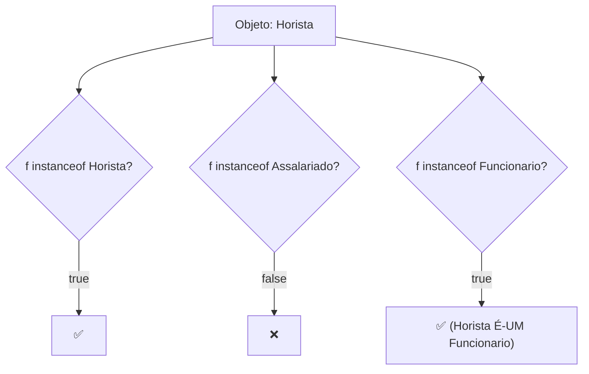
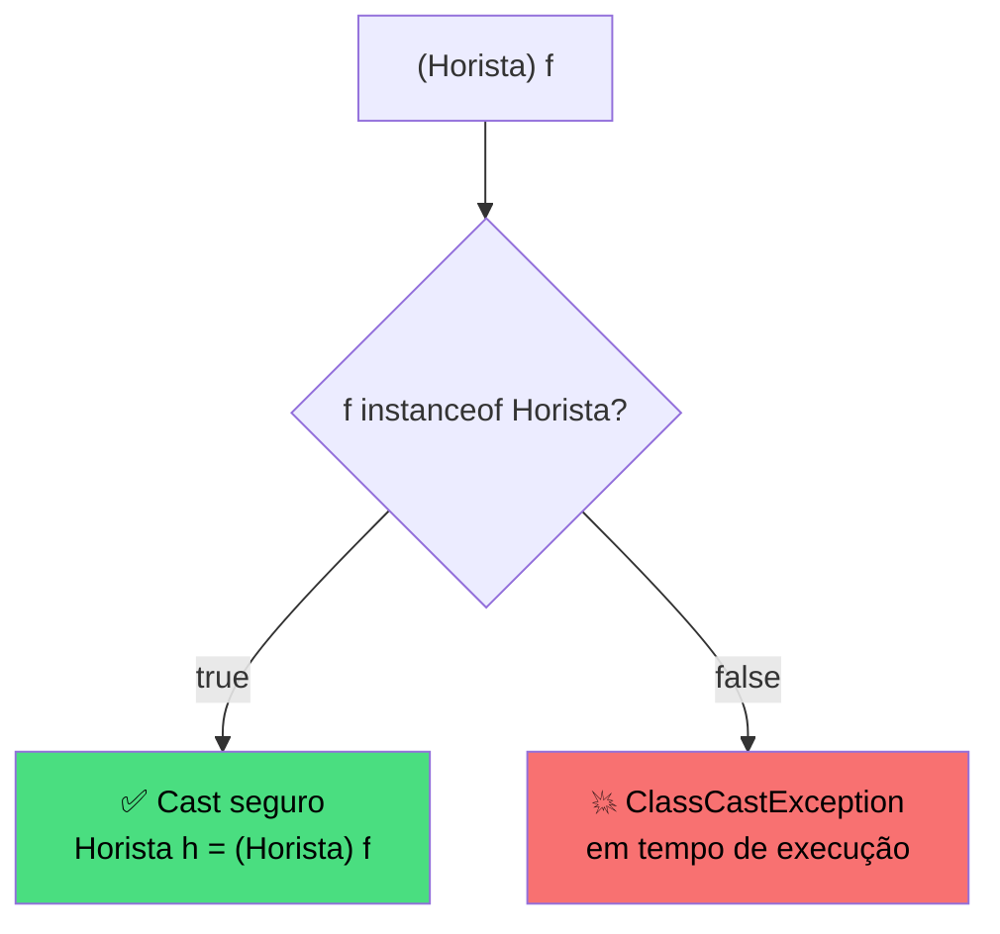

# Encontro 16 — Identificação de Tipos: Polimorfismo II

> **Módulo 5 · 4 aulas · 50 XP**

---

## 1. O limite do processamento genérico

O polimorfismo do Encontro 15 funciona perfeitamente para chamar métodos definidos na superclasse. Mas e quando precisamos de um comportamento **exclusivo** de uma subclasse?

```java
List<Funcionario> folha = new ArrayList<>();
folha.add(new Horista("Ana", "111", "TI", 45.0));
folha.add(new Assalariado("Bob", "222", "RH", 4500.0));
folha.add(new Comissionado("Carol", "333", "Vendas", 1500.0, 0.08));

for (Funcionario f : folha) {
    f.registrarHoras(160);  // ERRO de compilação! Método não existe em Funcionario
    f.registrarVenda(1000); // ERRO de compilação!
}
```

Quando precisamos acessar métodos específicos de uma subclasse a partir de uma referência da superclasse, precisamos de duas ferramentas: `instanceof` e **downcasting**.

---

## 2. `instanceof` — identificando o tipo em runtime

```java
for (Funcionario f : folha) {
    System.out.println(f.getNome() + " é do tipo: " + f.getClass().getSimpleName());

    // instanceof retorna true se o objeto for daquele tipo (ou subtipo)
    if (f instanceof Horista) {
        System.out.println("  → Funcionário horista");
    }
    if (f instanceof Assalariado) {
        System.out.println("  → Funcionário assalariado");
    }
    if (f instanceof Comissionado) {
        System.out.println("  → Funcionário comissionado");
    }

    // instanceof também funciona com a superclasse:
    System.out.println(f instanceof Funcionario); // sempre true
}
```



---

## 3. Downcasting — convertendo para o tipo específico

```java
for (Funcionario f : folha) {
    if (f instanceof Horista) {
        // Downcasting: diz ao compilador "eu sei que este objeto é Horista"
        Horista h = (Horista) f;
        h.registrarHoras(160); // agora posso chamar o método específico
        System.out.printf("%s trabalhou 160h%n", h.getNome());
    }

    if (f instanceof Comissionado) {
        Comissionado c = (Comissionado) f;
        c.registrarVenda(15000.0);
        System.out.printf("%s registrou venda de R$ 15.000%n", c.getNome());
    }
}
```

---

## 4. `ClassCastException` — o perigo do downcasting inseguro

```java
Funcionario f = new Assalariado("Bob", "222", "RH", 4500.0);

// SEM verificação — ClassCastException em runtime!
Horista h = (Horista) f; // compila! Mas lança exceção ao executar
// Exceção: java.lang.ClassCastException: Assalariado cannot be cast to Horista

// COM verificação — seguro sempre
if (f instanceof Horista) {
    Horista h = (Horista) f; // garantido seguro
    h.registrarHoras(160);
}
```



---

## 5. Pattern Matching para instanceof (Java 16+)

Java 16 introduziu uma sintaxe mais limpa que combina `instanceof` e cast em uma linha:

```java
// ANTES (Java 15-)
if (f instanceof Horista) {
    Horista h = (Horista) f; // repetição do tipo
    h.registrarHoras(160);
}

// DEPOIS (Java 16+ — Pattern Matching)
if (f instanceof Horista h) { // declara 'h' já convertida
    h.registrarHoras(160);    // 'h' disponível diretamente
}

// Switch com Pattern Matching (Java 21+)
String descricao = switch (f) {
    case Horista h      -> String.format("Horista: %dh × R$ %.2f", h.getHorasTrabalhadas(), h.calcularSalario());
    case Assalariado a  -> String.format("Assalariado: R$ %.2f fixo", a.calcularSalario());
    case Comissionado c -> String.format("Comissionado: base + R$ %.2f comissão", c.getComissao());
    default             -> "Tipo desconhecido";
};
```

---

## 6. Caso real — processamento mensal com registro de horas

```java
import java.util.ArrayList;
import java.util.List;

public class ProcessadorMensal {

    // Registra horas para todos os horistas da lista
    public static void registrarHorasMes(List<Funcionario> funcionarios, int horas) {
        for (Funcionario f : funcionarios) {
            if (f instanceof Horista h) {
                h.registrarHoras(horas);
                System.out.printf("Horas registradas para %s: %dh%n", h.getNome(), horas);
            }
        }
    }

    // Registra vendas para todos os comissionados
    public static void distribuirVendasEquipe(List<Funcionario> funcionarios, double totalVendas) {
        List<Comissionado> vendedores = new ArrayList<>();
        for (Funcionario f : funcionarios) {
            if (f instanceof Comissionado c) vendedores.add(c);
        }
        if (vendedores.isEmpty()) return;
        double vendaIndividual = totalVendas / vendedores.size();
        for (Comissionado c : vendedores) {
            c.registrarVenda(vendaIndividual);
        }
    }

    // Relatório completo com detalhes por tipo
    public static void relatorioDetalhado(List<Funcionario> funcionarios) {
        System.out.println("\n=== RELATÓRIO DETALHADO ===");
        for (Funcionario f : funcionarios) {
            System.out.printf("%-20s | R$ %8.2f", f.getNome(), f.calcularSalario());

            // Informações específicas por tipo
            if (f instanceof Horista h) {
                System.out.printf(" | %dh trabalhadas", h.getHorasTrabalhadas());
            } else if (f instanceof Comissionado c) {
                System.out.printf(" | Comissão: R$ %.2f", c.getComissao());
            } else if (f instanceof Assalariado) {
                System.out.print(" | Salário fixo");
            }
            System.out.println();
        }
        System.out.println("Total: R$ " + funcionarios.stream()
            .mapToDouble(Funcionario::calcularSalario).sum());
    }

    public static void main(String[] args) {
        List<Funcionario> equipe = new ArrayList<>();
        equipe.add(new Horista("Ana Silva", "111", "TI", 45.0));
        equipe.add(new Assalariado("Bob Costa", "222", "RH", 4500.0));
        equipe.add(new Comissionado("Carol Melo", "333", "Vendas", 1500.0, 0.08));
        equipe.add(new Horista("Diana Leal", "444", "TI", 55.0));
        equipe.add(new Comissionado("Eli Faria", "555", "Vendas", 1200.0, 0.10));

        registrarHorasMes(equipe, 168);
        distribuirVendasEquipe(equipe, 50000.0);
        relatorioDetalhado(equipe);
    }
}
```

---

## Exercícios Práticos

---

### Exercício 1 — Fácil · 25 XP
**instanceof na prática**

Dado o array abaixo, imprima o tipo real de cada elemento e uma mensagem específica para cada tipo usando `instanceof`:

```java
Object[] mistura = {
    42,
    "Olá Java",
    3.14,
    new Horista("Ana", "111", "TI", 45.0),
    new ArrayList<>(),
    true
};
// Para cada elemento, identifique: Integer, String, Double, Horista, ArrayList, Boolean
```

---

### Exercício 2 — Fácil · 25 XP
**Downcasting seguro**

Implemente o método `processarBateria(List<Funcionario> lista)` que:
- Para Horistas: registra 160h e imprime salário
- Para Comissionados: registra R$ 10.000 em vendas e imprime comissão
- Para Assalariados: imprime salário fixo
- Qualquer downcasting deve ser precedido de verificação `instanceof`

---

### Exercício 3 — Médio · 25 XP
**Sistema de Arquivos**

Crie a hierarquia: `EntradaSistema` → `Arquivo` (extensao, tamanhoKB) e `Diretorio` (entradas: List).

Implemente `listar(List<EntradaSistema> sistema)` que:
- Para Arquivos: imprime `"📄 nome.ext (123 KB)"`
- Para Diretórios: imprime `"📁 nome/ (N itens)"` e depois percorre os itens recursivamente com indentação

---

### Exercício 4 — Médio · 25 XP
**Validação de tipos em coleção heterogênea**

Crie o método `validarPagamentos(List<Object> pagamentos)` que recebe uma lista mista contendo possíveis `ContaCorrente`, `ContaPoupanca` e objetos inválidos (String, null, etc.).

Para cada elemento:
- Se for `ContaCorrente`: valida se tem saldo positivo
- Se for `ContaPoupanca`: valida se tem taxa positiva
- Se for qualquer outra coisa: imprime "Tipo inválido: `className`"

Retorna quantos pagamentos são válidos.

---

### Exercício 5 — Difícil · 25 XP
**Interpretador de comandos**

Crie uma hierarquia de comandos com `instanceof` e downcasting:

```
abstract Comando → ComandoSomar(a, b), ComandoSubtrair(a, b),
                   ComandoImprimir(texto), ComandoRepetir(n, subComando)
```

Implemente `executar(List<Comando> programa)` que processa cada comando:
- `ComandoSomar`: acumula o resultado
- `ComandoSubtrair`: subtrai do acumulador
- `ComandoImprimir`: imprime o texto
- `ComandoRepetir`: executa o subcomando N vezes (downcasting para acessar `subComando`)

Crie um programa de 8+ comandos e execute-o.

---

### Exercício 6 — Troubleshooting · 25 XP
**Diagnóstico: Downcasting e `instanceof` com Erros**

O código abaixo tem **3 erros** relacionados a downcasting. Um faz cast sem verificar, outro verifica `instanceof` mas usa a variável errada para o cast, e um terceiro usa `instanceof` de forma redundante e desnecessária. Identifique e simplifique/corrija.

```java
public class ProcessadorFolha {

    public static void processar(List<Funcionario> lista) {
        for (Funcionario f : lista) {

            // Erro 1: downcasting direto sem instanceof — ClassCastException se não for Horista
            Horista h = (Horista) f;
            h.registrarHoras(160);

            // Erro 2: verifica instanceof de 'f', mas faz cast de objeto errado
            Funcionario outro = new Assalariado("X", "000", "TI", 3000);
            if (f instanceof Comissionado) {
                Comissionado c = (Comissionado) outro;  // cast em 'outro', não em 'f'!
                c.registrarVenda(10000);
            }

            // Erro 3: instanceof duplo — redundante com Pattern Matching (Java 16+)
            if (f instanceof Assalariado) {
                Assalariado a = (Assalariado) f;  // pode ser simplificado
                System.out.println(a.calcularSalario());
            }
        }
    }
}
```

> **Gabarito:**
> - (1) Sempre preceda downcasting com `if (f instanceof Horista h)` — nunca faça cast cego.
> - (2) O cast deve ser aplicado em `f` (que foi verificado), não em `outro`. `Comissionado c = (Comissionado) f;`
> - (3) Com Pattern Matching (Java 16+): `if (f instanceof Assalariado a) { System.out.println(a.calcularSalario()); }` — elimina o cast explícito.
