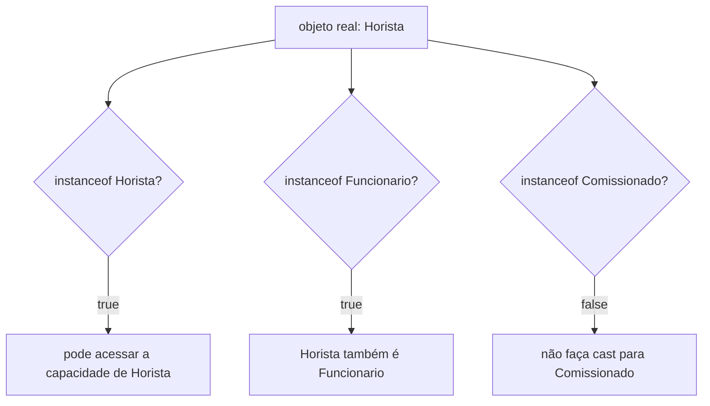
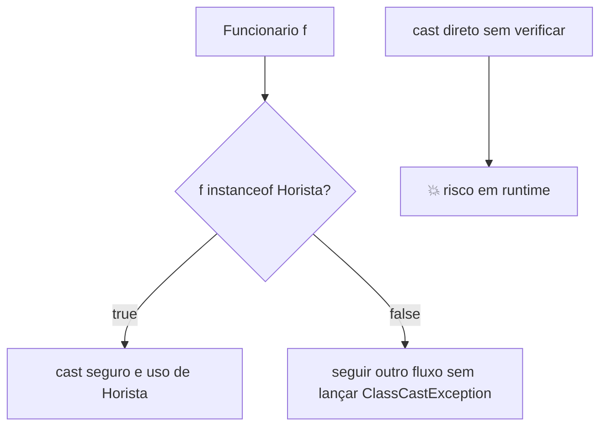

# Encontro 16 — Identificação de Tipos: Polimorfismo II

> **Módulo 5 · 4 aulas · 50 XP**

---

## A missão: quando o tipo geral não basta

No Encontro 15, o processador conseguia calcular a folha sem saber se cada objeto era `Horista`, `Assalariado` ou `Comissionado`. Esse é o melhor cenário: o código chama o contrato geral e cada objeto responde com seu comportamento.

Mas surge uma regra operacional:

> “No fechamento do mês, registre 160 horas apenas para horistas e distribua as vendas apenas entre comissionados.”

Agora o código precisa acessar comportamentos que **não existem em `Funcionario`**. A referência continua sendo geral, mas a ação é específica. Como descobrir o tipo real sem transformar o programa em uma sequência perigosa de casts?

Neste encontro, você vai aprender a fazer isso com responsabilidade — e também a reconhecer quando muitos testes de tipo são um sinal de que o design precisa de um contrato melhor.

### Ao final, você deverá conseguir

- explicar por que uma referência `Funcionario` não permite chamar métodos exclusivos de `Horista`;
- usar `instanceof` para verificar o tipo real em tempo de execução;
- fazer downcasting somente depois de uma verificação compatível;
- prever e evitar `ClassCastException`;
- usar pattern matching para `instanceof` com escopo seguro;
- decidir quando a identificação de tipos é uma necessidade local e quando revela uma abstração incompleta.

### O mapa da aula

| Etapa | Pergunta-guia | Evidência de aprendizagem |
|---|---|---|
| 1. Limite | O que a referência geral permite chamar? | Você separa compilação de execução. |
| 2. Identificação | Como saber o tipo real? | Você interpreta `instanceof`, inclusive com herança e `null`. |
| 3. Conversão | Como acessar o comportamento específico? | Você faz downcasting protegido. |
| 4. Perigo | O que pode dar errado? | Você diagnostica e corrige `ClassCastException`. |
| 5. Sintaxe moderna | Como escrever a verificação com menos repetição? | Você usa pattern matching e respeita o escopo da variável. |
| 6. Decisão | Quando esse recurso é justificável? | Você aplica a técnica sem abandonar o polimorfismo. |

> **Pare por 60 segundos:** antes de continuar, responda mentalmente: se `Funcionario f = new Horista(...)`, por que `f.calcularSalario()` compila, mas `f.registrarHoras(160)` não?

---

## 1. O limite do processamento genérico

O Encontro 15 já mostrou como uma coleção polimórfica calcula salários sem conhecer os subtipos. Aqui fazemos apenas o resgate necessário para avançar: o tipo da referência é o contrato que o compilador enxerga.

Uma coleção de `Funcionario` aceita objetos diferentes, mas só permite chamadas declaradas em `Funcionario`:

```java
List<Funcionario> folha = new ArrayList<>();
folha.add(new Horista("Ana", 45.0));
folha.add(new Assalariado("Beto", 5000.0));
folha.add(new Comissionado("Carol", 1500.0, 0.08));

for (Funcionario funcionario : folha) {
    funcionario.calcularSalario(); // compila: faz parte do contrato geral
    funcionario.registrarHoras(160); // não compila: exclusivo de Horista
    funcionario.registrarVenda(1000); // não compila: exclusivo de Comissionado
}
```

O erro ocorre antes da execução: o compilador não pode assumir que todo `Funcionario` é `Horista` ou `Comissionado`. A coleção pode conter qualquer subtipo válido.

### Resgate rápido: três tipos de informação

| Informação | Exemplo | Quem usa? |
|---|---|---|
| Tipo da referência | `Funcionario funcionario` | Compilador: decide quais chamadas são permitidas. |
| Tipo real do objeto | `new Horista(...)` | JVM: escolhe a implementação sobrescrita. |
| Comportamento exclusivo | `registrarHoras(...)` | Código específico, depois de uma verificação. |

O objetivo não é abandonar o polimorfismo. É reconhecer o limite do contrato geral quando uma regra de negócio realmente precisa de uma capacidade específica.

### Atividade interativa: quem permite cada chamada?

Complete a tabela. Recupere a regra antes de avançar: uma chamada compila quando está disponível no **tipo da referência**, não apenas no tipo real que você imagina que esteja guardado nela.

```fill-table
COL1: Situação
COL2: Resposta
LEGEND: Use exatamente os termos do texto ou o nome do método pedido.
Funcionario f = new Horista(...); tipo da referência | Funcionario
Método disponível para qualquer Funcionario | calcularSalario()
Método que exige identificar Horista antes de chamar | registrarHoras(...)
Método que exige identificar Comissionado antes de chamar | registrarVenda(...)
A verificação acontece antes ou depois da compilação? | antes
```

---

## 2. `instanceof`: identificando o tipo em tempo de execução

`instanceof` responde a uma pergunta simples: “o objeto referenciado é compatível com este tipo?”. O resultado é um `boolean`:

```java
Funcionario funcionario = new Horista("Ana", 45.0);

System.out.println(funcionario instanceof Horista);      // true
System.out.println(funcionario instanceof Funcionario);  // true
System.out.println(funcionario instanceof Comissionado); // false
```

Por causa da herança, um `Horista` também é um `Funcionario`. O inverso não é garantido: uma referência `Funcionario` pode apontar para vários subtipos.


```mermaid
flowchart TD
    OBJ["objeto real: Horista"] --> H{"instanceof Horista?"}
    H -->|true| A["pode acessar a capacidade de Horista"]
    OBJ --> F{"instanceof Funcionario?"}
    F -->|true| B["Horista também é Funcionario"]
    OBJ --> C{"instanceof Comissionado?"}
    C -->|false| D["não faça cast para Comissionado"]
```

### Duas armadilhas importantes

**1. Subtipos também respondem `true`:** se `HoristaEspecializado extends Horista`, então um objeto `HoristaEspecializado` é `instanceof Horista`.

**2. `null` responde `false`:** não existe objeto real para verificar. Isso torna `instanceof` mais seguro do que chamar um método diretamente em uma referência possivelmente nula.

```java
Funcionario funcionario = null;

if (funcionario instanceof Horista) {
    // não entra aqui; instanceof com null resulta em false
}
```

Use `else if` quando apenas uma categoria deve ser escolhida. Use `if` independentes quando você estiver fazendo verificações de capacidades compatíveis e realmente quiser avaliá-las separadamente.

### Atividade interativa: preveja os resultados

Rastreie cada verificação sem executar. O exercício mistura herança e `null` porque é nesse detalhe que muitos bugs aparecem.

```code-trace
KEY:encontro-16-instanceof
SCENARIO:Descubra o resultado de cada teste. Lembre-se: um subtipo também é uma instância do seu tipo geral, mas null não é instância de nenhum tipo.
STEP:Funcionario f = new Horista("Ana", 45.0);
VAR:f instanceof Horista:boolean:true
VAR:f instanceof Funcionario:boolean:true
VAR:f instanceof Comissionado:boolean:false
STEP:Funcionario vazio = null;
VAR:vazio instanceof Funcionario:boolean:false
VAR:vazio instanceof Horista:boolean:false
STEP:Object objeto = "POO";
VAR:objeto instanceof String:boolean:true
VAR:objeto instanceof Integer:boolean:false
```

---

## 3. Downcasting: acessando a capacidade específica

**Upcasting** acontece quando tratamos um subtipo como seu tipo geral:

```java
Horista original = new Horista("Ana", 45.0);
Funcionario geral = original; // upcasting: implícito e seguro
```

Depois do upcasting, a variável `geral` continua apontando para o mesmo objeto, mas o compilador só permite as operações de `Funcionario`. Para recuperar a visão específica, fazemos **downcasting**:

```java
if (geral instanceof Horista) {
    Horista horista = (Horista) geral;
    horista.registrarHoras(160);
}
```

O cast não cria outro objeto nem transforma um `Assalariado` em `Horista`. Ele apenas informa ao compilador: “neste ponto, a referência é tratada como `Horista`”. A afirmação só é válida porque a verificação veio antes.

### A ordem segura

```java
for (Funcionario funcionario : folha) {
    if (funcionario instanceof Horista) {        // 1. verifica
        Horista horista = (Horista) funcionario; // 2. converte a referência
        horista.registrarHoras(160);             // 3. usa a capacidade
    }
}
```

Se a condição for falsa, o bloco não é executado e nenhum cast indevido acontece.

### Atividade interativa: monte a sequência correta

Relacione cada ação com o papel que ela desempenha no downcasting. A memória muscular da sequência ajuda a evitar casts cegos quando você estiver programando.

```fill-table
COL1: Ação no código
COL2: Papel na operação
LEGEND: Complete com: verificar, converter, usar ou não entra no bloco.
if (funcionario instanceof Horista) | verificar
Horista h = (Horista) funcionario | converter
h.registrarHoras(160) | usar
Se a verificação for falsa | não entra no bloco
```

---

## 4. `ClassCastException`: o perigo do cast inseguro

Um cast pode compilar e ainda falhar em tempo de execução. O compilador aceita a possibilidade porque `Assalariado` e `Horista` são referências compatíveis com `Funcionario`; a JVM, porém, confere o objeto real:

```java
Funcionario funcionario = new Assalariado("Beto", 5000.0);

// Compila, mas falha ao executar:
Horista horista = (Horista) funcionario;
// java.lang.ClassCastException
```

O objeto real é `Assalariado`, então não existe um `Horista` escondido para ser recuperado. A correção é proteger o cast:

```java
if (funcionario instanceof Horista) {
    Horista horista = (Horista) funcionario;
    horista.registrarHoras(160);
} else {
    System.out.println("Este funcionário não registra horas.");
}
```


```mermaid
flowchart TD
    A["Funcionario f"] --> B{"f instanceof Horista?"}
    B -->|true| C["cast seguro e uso de Horista"]
    B -->|false| D["seguir outro fluxo sem lançar ClassCastException"]
    E["cast direto sem verificar"] --> F["💥 risco em runtime"]
```

### Atividade interativa: encontre o cast perigoso

Analise os três pequenos bugs. Em cada um, identifique o erro conceitual e escolha a correção. O feedback aparece assim que você acerta.

```bug-hunt
BUG:1:Horista h = (Horista) funcionario;:A referência pode apontar para Assalariado ou Comissionado.
Q:Qual é a correção mínima?:Fazer if (funcionario instanceof Horista h) antes de usar h|Trocar Horista por Object e continuar|Usar getClass() sem comparar o resultado|Fazer cast para Comissionado:0
BUG:2:if (funcionario instanceof Comissionado) { Horista h = (Horista) funcionario; }:A verificação e o tipo do cast não representam a mesma condição.
Q:Por que esse código está errado?:A variável é final|O cast deveria usar Comissionado, o tipo que foi verificado|instanceof só funciona com String|Todo cast para Horista é proibido:1
BUG:3:Funcionario f = null; f.getClass().getSimpleName();:A referência não aponta para nenhum objeto.
Q:Qual falha pode acontecer antes de qualquer identificação de tipo?:NullPointerException ao chamar getClass() em null|ClassCastException por causa de Horista|Erro de sintaxe|Nenhuma, null é um tipo válido:0
```

> **Regra de bolso:** `instanceof` protege o downcasting; ele não torna o objeto de outro tipo nem substitui um contrato bem modelado.

---

## 5. Pattern matching para `instanceof`

A partir do Java 16, podemos declarar a variável do tipo específico no próprio teste. Isso reduz repetição sem remover a verificação:

```java
// Forma tradicional
if (funcionario instanceof Horista) {
    Horista horista = (Horista) funcionario;
    horista.registrarHoras(160);
}

// Pattern matching
if (funcionario instanceof Horista horista) {
    horista.registrarHoras(160);
}
```

A variável `horista` só existe onde a condição garante que ela é segura:

```java
if (funcionario instanceof Horista horista
        && horista.getHoras() < 160) {
    horista.registrarHoras(160 - horista.getHoras());
}
```

O operador `&&` preserva essa garantia. Evite trocar por `||`: no lado direito de um “ou”, a condição pode ser avaliada quando o objeto não é `Horista`, e a variável específica não estará disponível com segurança.

Para várias categorias, um `if/else if` deixa explícito que apenas um ramo deve ser escolhido:

```java
if (funcionario instanceof Horista h) {
    System.out.println("Horas: " + h.getHoras());
} else if (funcionario instanceof Comissionado c) {
    System.out.println("Vendas: " + c.getTotalVendas());
} else {
    System.out.println("Sem informação específica.");
}
```

### Atividade interativa: a variável está no escopo?

Classifique cada afirmação. A pergunta central é: a linguagem consegue garantir que a variável específica só será usada depois de uma verificação verdadeira?

```fill-table
COL1: Trecho ou situação
COL2: Resposta
LEGEND: Responda com sim, não ou o operador pedido.
if (f instanceof Horista h) { h.registrarHoras(160); } | sim
if (f instanceof Horista h || h.getHoras() > 0) | não
Qual operador mantém a garantia de tipo no segundo teste? | &&
No else de if (f instanceof Horista h), h continua disponível? | não
```

---

## 6. Caso real: fechamento mensal da equipe

Agora vamos juntar as peças em uma situação que justifica a identificação de tipos: o fechamento mensal precisa executar **ações diferentes**, não apenas calcular o salário.

> **Nota de modelagem:** para deixar o relatório legível, o exemplo pressupõe getters de consulta como `getHoras()` e `getTotalVendas()`. Eles apenas expõem informações; as regras de alteração continuam protegidas pelos métodos de negócio.

```java
public class ProcessadorMensal {

    public static void registrarHorasMes(
            List<Funcionario> funcionarios, int horas) {
        for (Funcionario funcionario : funcionarios) {
            if (funcionario instanceof Horista h) {
                h.registrarHoras(horas);
                System.out.printf(
                    "Horas registradas para %s: %dh%n",
                    h.getNome(), horas);
            }
        }
    }

    public static void distribuirVendasEquipe(
            List<Funcionario> funcionarios, double totalVendas) {
        int quantidadeVendedores = 0;
        for (Funcionario funcionario : funcionarios) {
            if (funcionario instanceof Comissionado) {
                quantidadeVendedores++;
            }
        }

        if (quantidadeVendedores == 0) return;
        double vendaIndividual = totalVendas / quantidadeVendedores;

        for (Funcionario funcionario : funcionarios) {
            if (funcionario instanceof Comissionado c) {
                c.registrarVenda(vendaIndividual);
            }
        }
    }

    public static void relatorioDetalhado(
            List<Funcionario> funcionarios) {
        for (Funcionario funcionario : funcionarios) {
            System.out.printf("%s | R$ %.2f",
                funcionario.getNome(), funcionario.calcularSalario());

            if (funcionario instanceof Horista h) {
                System.out.printf(" | %dh trabalhadas", h.getHoras());
            } else if (funcionario instanceof Comissionado c) {
                System.out.printf(" | Vendas: R$ %.2f", c.getTotalVendas());
            } else {
                System.out.print(" | Salário fixo");
            }
            System.out.println();
        }
    }
}
```

### O limite saudável

Aqui o downcasting está concentrado em operações que são naturalmente específicas: registrar horas, distribuir vendas e mostrar detalhes. O cálculo do salário continua polimórfico e genérico.

Se todos os métodos do sistema começarem a perguntar o tipo e repetir regras, pare e faça uma pergunta de design:

> “Esse comportamento deveria fazer parte de uma abstração, de uma interface de capacidade ou de uma operação específica como esta?”

`instanceof` é uma ferramenta de escape controlado. Ele resolve uma necessidade concreta, mas uma sequência interminável de `if/else` pode indicar que o contrato geral está pequeno demais ou que a responsabilidade está no lugar errado.

### Atividade interativa: decida se o cast está no lugar certo

Leia cada situação e escolha a estratégia mais responsável. O objetivo é sair da aula sabendo tanto aplicar a técnica quanto limitar seu uso.

```fill-table
COL1: Situação
COL2: Estratégia adequada
LEGEND: Use: polimorfismo, instanceof localizado ou revisar abstração.
totalizar(List<Funcionario>) chama apenas calcularSalario() | polimorfismo
registrarHorasMes precisa agir somente sobre Horista | instanceof localizado
Um relatório tem muitos blocos instanceof espalhados | revisar abstração
Adicionar WhatsApp exige editar vários processadores por tipo | revisar abstração
```

---

## Laboratório prático

Faça os exercícios em ordem. Cada um retoma a decisão anterior e aumenta apenas uma dificuldade por vez.

### Exercício 1 — Fácil · 25 XP
**Mapa de tipos em uma coleção**

Crie uma `List<Funcionario>` com pelo menos um `Horista`, um `Assalariado` e um `Comissionado`. Para cada item:

- imprima o nome e o salário usando apenas o contrato geral;
- use `instanceof` para informar o tipo específico;
- explique em um comentário por que `funcionario.calcularSalario()` compila e `funcionario.registrarHoras(160)` não.

**Entrega mínima:** uma saída que prove que a lista é polimórfica e que a identificação acontece em runtime.

### Exercício 2 — Fácil · 25 XP
**Downcasting seguro**

Implemente `processarBateria(List<Funcionario> lista)`:

- para `Horista`, registre 160 horas e mostre as horas acumuladas;
- para `Comissionado`, registre R$ 10.000 em vendas e mostre o total;
- para `Assalariado`, mostre apenas o salário fixo;
- todo downcasting deve estar protegido por `instanceof`;
- use pattern matching se seu JDK for Java 16 ou superior.

**Critério de revisão:** nenhum cast aparece fora do bloco que comprovou o tipo correspondente.

### Exercício 3 — Médio · 25 XP
**Coleção heterogênea e valores inválidos**

Implemente `validarPagamentos(List<Object> pagamentos)` para uma lista que pode conter `ContaCorrente`, `ContaPoupanca`, `String`, `null` ou outro objeto.

Para cada item:

- se for `ContaCorrente`, valide se o saldo é positivo;
- se for `ContaPoupanca`, valide se a taxa é positiva;
- se for `null`, imprima `Pagamento ausente`;
- para qualquer outro tipo, imprima `Tipo inválido: <nome do tipo>`;
- retorne a quantidade de pagamentos válidos.

Use pattern matching quando possível. Na reflexão final, explique por que `instanceof` é adequado neste ponto, mas seria um sinal ruim se cada serviço do sistema repetisse os mesmos testes.

### Exercício 4 — Médio · 25 XP
**Sistema de arquivos heterogêneo**

Crie a hierarquia:

```text
EntradaSistema
├── Arquivo (extensao, tamanhoKB)
└── Diretorio (entradas: List<EntradaSistema>)
```

Implemente `listar(List<EntradaSistema> sistema)`:

- para `Arquivo`, imprima `📄 nome.ext (123 KB)`;
- para `Diretorio`, imprima `📁 nome/ (N itens)` e percorra seus itens recursivamente;
- use `instanceof` apenas onde o comportamento realmente depende do subtipo;
- proteja referências nulas e explique como decidiu tratá-las.

### Exercício 5 — Difícil · 25 XP
**Refatoração: quando o `instanceof` está demais?**

Analise um `ProcessadorNotificacoes` que contém vários blocos:

```java
if (notificacao instanceof Email) { ... }
else if (notificacao instanceof SMS) { ... }
else if (notificacao instanceof Push) { ... }
```

Faça duas versões:

1. uma solução com `instanceof`, tratando cada tipo com segurança;
2. uma solução polimórfica em que `Notificacao` declara `enviar()` e o processador apenas percorre `List<Notificacao>`.

Compare as versões em um parágrafo: qual delas facilita adicionar `WhatsApp`? Em que situação ainda faria sentido identificar o tipo real?

---

## Fechamento: o protocolo de segurança

1. **A referência define o que compila.** O objeto real define o que existe em runtime.
2. **`instanceof` verifica compatibilidade.** Subtipos também são instâncias do tipo geral; `null` não é instância de nenhum tipo.
3. **Downcasting não transforma objetos.** Ele só recupera uma visão específica depois de uma verificação.
4. **Cast sem proteção pode quebrar em runtime.** O erro é `ClassCastException`; acesso a `null` pode gerar `NullPointerException`.
5. **Pattern matching reduz repetição, não elimina o contrato.** A variável específica só vale onde a condição garante sua segurança.
6. **Use identificação de tipos com intenção.** Uma necessidade local pode ser válida; muitos `if/else` espalhados pedem uma revisão de design.

No próximo encontro, interfaces vão permitir expressar capacidades transversais — como “pode autenticar”, “pode exportar” ou “pode ser tributado” — sem depender de uma única árvore de herança.
