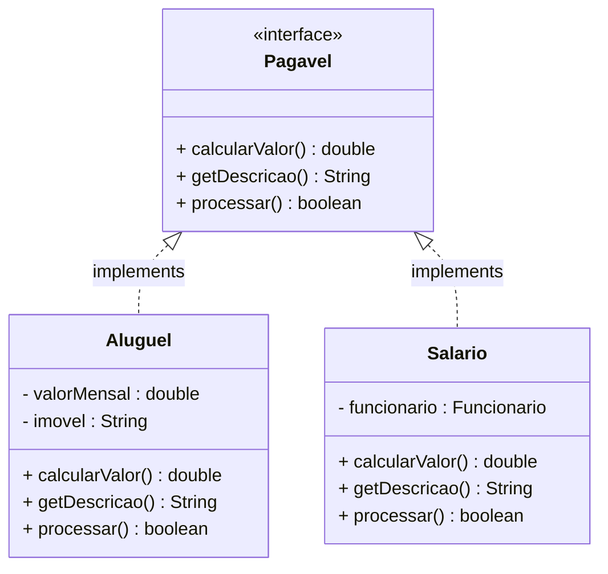

# Encontro 17 — Acoplamento e Contratos: Interfaces

> **Módulo 5 · 4 aulas · 50 XP**

---

## 1. Interface vs. Classe Abstrata — a distinção fundamental

| Aspecto | Classe Abstrata | Interface |
|---------|----------------|-----------|
| Palavra-chave | `abstract class` | `interface` |
| Herança | Única (`extends`) | Múltipla (`implements`) |
| Atributos | Podem ter estado | Apenas constantes (`static final`) |
| Construtores | Tem | Não tem |
| Métodos | Concretos + abstratos | Abstratos + `default` + `static` |
| Uso ideal | "É-UM" com código compartilhado | "PODE-FAZER" — contrato puro |

---

## 2. O conceito de Contrato

Uma interface define **o que** um objeto pode fazer, sem definir **como**.

```java
// Interface: define o CONTRATO — o que qualquer pagamento pode fazer
public interface Pagavel {
    double calcularValor();       // quanto custa?
    String getDescricao();        // o que é?
    boolean processar();          // efetiva o pagamento
}

// Classes completamente diferentes implementando o mesmo contrato
class Aluguel implements Pagavel {
    private double valorMensal;
    private String imovel;

    Aluguel(String imovel, double valor) {
        this.imovel      = imovel;
        this.valorMensal = valor;
    }

    @Override public double calcularValor()  { return valorMensal; }
    @Override public String getDescricao()   { return "Aluguel: " + imovel; }
    @Override public boolean processar() {
        System.out.println("Aluguel pago: R$ " + valorMensal);
        return true;
    }
}

class Salario implements Pagavel {
    private Funcionario funcionario;

    Salario(Funcionario f) { this.funcionario = f; }

    @Override public double calcularValor()  { return funcionario.calcularSalario(); }
    @Override public String getDescricao()   { return "Salário: " + funcionario.getNome(); }
    @Override public boolean processar() {
        System.out.printf("Salário pago para %s: R$ %.2f%n",
            funcionario.getNome(), calcularValor());
        return true;
    }
}

// Código que opera no CONTRATO, sem saber o tipo real
class ProcessadorPagamentos {
    static double processarTodos(List<Pagavel> pagamentos) {
        double total = 0;
        for (Pagavel p : pagamentos) {
            System.out.println(p.getDescricao() + " → R$ " + p.calcularValor());
            if (p.processar()) total += p.calcularValor();
        }
        return total;
    }
}
```

---

## 3. Notação UML — Interface e Realização



> **Notação:** a seta tracejada com triângulo vazado (`<|..`) representa **realização** (implementação de interface).

---

## 4. Interfaces transversais — o poder de `implements`

Interfaces podem ser implementadas por classes de hierarquias completamente diferentes. Isso é chamado de **composição de tipos**.

```java
// Interfaces transversais — cruzam hierarquias
public interface Autenticavel {
    boolean autenticar(String senha);
    void bloquear();
    boolean isBloqueado();
}

public interface Auditavel {
    String getUltimaModificacao();
    String getRegistroAuditoria();
}

public interface Exportavel {
    String exportarCSV();
    String exportarJSON();
}

// Funcionario (já tem sua hierarquia) pode implementar interfaces transversais
public class FuncionarioAdmin extends Assalariado
                              implements Autenticavel, Auditavel, Exportavel {
    private String senhaHash;
    private boolean bloqueado;
    private String ultimaModificacao;

    // Implementa todos os contratos das 3 interfaces + herda de Assalariado + Funcionario
    @Override
    public boolean autenticar(String senha) {
        if (bloqueado) return false;
        return senhaHash.equals(hash(senha));
    }

    @Override public void bloquear()            { bloqueado = true; }
    @Override public boolean isBloqueado()      { return bloqueado; }
    @Override public String getUltimaModificacao(){ return ultimaModificacao; }
    @Override public String getRegistroAuditoria(){ return "Admin " + getNome(); }
    @Override public String exportarCSV()       { return getNome() + "," + getCpf(); }
    @Override public String exportarJSON() {
        return String.format("{\"nome\":\"%s\",\"cpf\":\"%s\"}", getNome(), getCpf());
    }

    private String hash(String s) { return String.valueOf(s.hashCode()); }
}
```

---

## 5. Métodos `default` — interfaces com implementação (Java 8+)

```java
public interface Comparable<T> {
    int compareTo(T outro); // abstrato — implementado pela classe

    // default — implementação padrão, pode ser sobrescrita
    default boolean eMaiorQue(T outro) {
        return compareTo(outro) > 0;
    }

    default boolean eMenorQue(T outro) {
        return compareTo(outro) < 0;
    }
}

public class Produto implements Comparable<Produto> {
    private String nome;
    private double preco;

    Produto(String nome, double preco) {
        this.nome  = nome;
        this.preco = preco;
    }

    @Override
    public int compareTo(Produto outro) {
        return Double.compare(this.preco, outro.preco);
    }
    // eMaiorQue e eMenorQue herdados gratuitamente do default
}
```

---

## 6. Programação para interfaces — desacoplamento

```java
// ACOPLADO — difícil de mudar
class RelatorioService {
    private MySQLDatabase banco = new MySQLDatabase(); // depende do concreto!

    void salvarRelatorio(String dados) {
        banco.inserir(dados);
    }
}

// DESACOPLADO — fácil de mudar/testar
interface BancoDados {
    void inserir(String dados);
    String buscar(String id);
}

class RelatorioServiceDesacoplado {
    private BancoDados banco; // depende do contrato, não do concreto

    RelatorioServiceDesacoplado(BancoDados banco) {
        this.banco = banco;
    }

    void salvarRelatorio(String dados) {
        banco.inserir(dados);
    }
}

// Agora qualquer implementação serve:
class MySQLDatabase    implements BancoDados { ... }
class PostgresDatabase implements BancoDados { ... }
class BancoDadosMock   implements BancoDados { ... } // para testes!

// Trocar o banco = mudar apenas a instanciação, não o serviço
RelatorioServiceDesacoplado svc = new RelatorioServiceDesacoplado(new PostgresDatabase());
```

---

## Exercícios Práticos

---

### Exercício 1 — Fácil · 25 XP
**Primeira Interface**

Crie a interface `Descritivel` com o método `String descrever()`. Implemente-a em 4 classes já existentes nos exercícios anteriores (`Produto`, `Aluno`, `Funcionario` e `Quarto`). Crie uma lista `List<Descritivel>` com instâncias de todos os tipos e chame `descrever()` em cada uma.

---

### Exercício 2 — Fácil · 25 XP
**Interface vs. Classe Abstrata**

Justifique sua escolha (interface ou classe abstrata) para cada caso:
1. `Voavel` (com método `voar()`) — Passaro, Aviao, Drone
2. `AnimalDomestico` — Gato, Cachorro (compartilham nome, dono, vacinacao)
3. `Serializable` — qualquer objeto que possa ser salvo em arquivo
4. `ContaBancaria` — ContaCorrente, ContaPoupanca (compartilham saldo, titular)

---

### Exercício 3 — Médio · 25 XP
**Interfaces Transversais**

Crie as interfaces:
- `Tributavel`: `double calcularImposto()`
- `Emissivel`: `String emitirNota()`
- `Cancelavel`: `void cancelar()` + `boolean isCancelado()`

Implemente todas as 3 em `NotaFiscalServico` e `NotaFiscalProduto` (classes de hierarquias diferentes). Crie um `ProcessadorFiscal` que aceita `List<Tributavel>` e calcula o total de impostos.

---

### Exercício 4 — Médio · 25 XP
**Estratégia com Interfaces**

Implemente o padrão Strategy para ordenação:

```java
interface EstrategiaOrdenacao {
    void ordenar(int[] vetor);
}
class BubbleSort implements EstrategiaOrdenacao { ... }
class InsertionSort implements EstrategiaOrdenacao { ... }
class SelectionSort implements EstrategiaOrdenacao { ... }

class Ordenador {
    private EstrategiaOrdenacao estrategia;
    Ordenador(EstrategiaOrdenacao e) { this.estrategia = e; }
    void setEstrategia(EstrategiaOrdenacao e) { this.estrategia = e; }
    void executar(int[] vetor) { estrategia.ordenar(vetor); }
}
```

Demonstre trocando a estratégia em tempo de execução sem alterar o `Ordenador`.

---

### Exercício 5 — Difícil · 25 XP
**Sistema de Plugins**

Implemente um sistema de plugins para processamento de texto:

```java
interface Plugin {
    String getNome();
    String processar(String texto);
}

class PipelineTexto {
    private List<Plugin> plugins = new ArrayList<>();
    void adicionarPlugin(Plugin p) { plugins.add(p); }
    String executar(String textoInicial) {
        // Aplica cada plugin em sequência, passando o resultado do anterior
    }
}
```

Crie os plugins: `MaiusculasPlugin`, `RemoverEspacosPlugin`, `InverterPlugin`, `ContarPalavrasPlugin` (só imprime contagem, retorna o texto original), `SubstituirPlugin(de, para)`.

Demonstre um pipeline com 4 plugins aplicados a um parágrafo de texto.

---

### Exercício 6 — Troubleshooting · 25 XP
**Diagnóstico: Interfaces com Conflito e Implementação Incompleta**

O código abaixo tem **3 erros** relacionados a interfaces. Um implementa interface parcialmente, outro cria conflito de `default` methods, e um terceiro confunde interface com classe abstrata tentando declarar estado. Identifique e corrija.

```java
// Erro 3: interface com campo de estado — não é permitido (só constantes são permitidas)
interface Configuravel {
    String configuracao = "padrão"; // isto é static final — ok (constante)
    int contador = 0;               // BUG: parece estado mutável, mas é static final!
    // Qualquer atribuição a 'contador' fora da declaração vai falhar

    void configurar(String valor);
}

interface Logavel {
    default String log() { return "[LOG] evento"; }
}

interface Auditavel {
    default String log() { return "[AUDIT] registro"; }  // mesmo nome que Logavel!
}

// Erro 2: conflito de default methods — o compilador não sabe qual usar
class Servico implements Logavel, Auditavel {
    // BUG: precisa sobrescrever log() explicitamente para resolver o conflito
}

// Erro 1: implementação incompleta de interface
interface Exportavel {
    String exportarCSV();
    String exportarJSON();
    String exportarXML();
}

class RelatorioSimples implements Exportavel {
    @Override
    public String exportarCSV() { return "csv..."; }
    // BUG: exportarJSON() e exportarXML() não foram implementados — não compila
}
```

> **Dicas:** (1) Uma classe que `implements` uma interface **deve** implementar **todos** os métodos abstratos — ou ser declarada `abstract`. (2) Quando duas interfaces têm `default` methods com a mesma assinatura, a classe implementadora **deve** sobrescrever o método e decidir qual chamada fazer (ou escrever sua própria lógica). (3) Interfaces não têm estado mutável — campos são implicitamente `public static final`.
