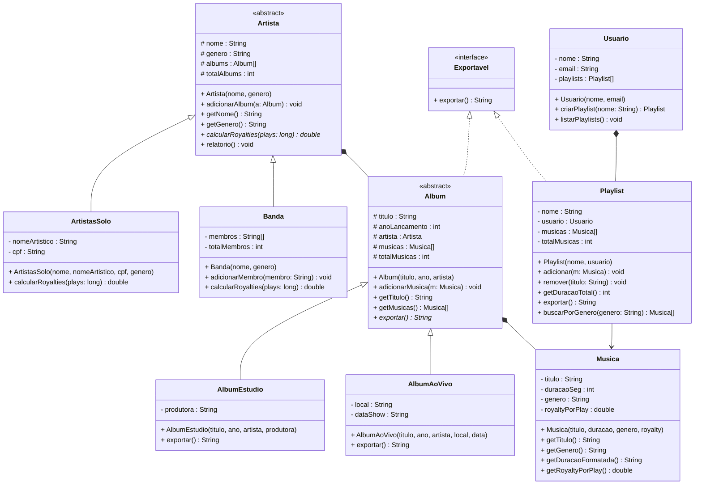

# Encontro 18 — Trabalho Prático 3: Design e Arquitetura

> **Módulo 6 · 4 aulas · 150 XP · Avaliação**

---

## Enunciado do Projeto Final

> *"Desenvolva um sistema de gestão para uma empresa de streaming de música. O sistema deve gerenciar artistas (solos e bandas), álbuns (de estúdio e ao vivo), músicas e playlists. Qualquer artista pode ter múltiplos álbuns. Um álbum contém músicas. Um usuário pode criar playlists com músicas de diferentes álbuns. O sistema deve calcular royalties (solo: 100% do valor; banda: dividido igualmente entre membros). Deve ser possível calcular a receita total de um artista, exportar uma playlist e buscar músicas por gênero."*

---

## Etapa 1 — Análise de Requisitos (2 aulas)

### Extração de candidatos

**Substantivos → Classes/Atributos:**

| Substantivo | Classe | Atributos |
|-------------|--------|-----------|
| artista | `Artista` (abstrata) | nome, genero |
| artista solo | `ArtistasSolo` | nomeArtistico |
| banda | `Banda` | membros[] |
| álbum | `Album` (abstrata) | titulo, anoLancamento, artista |
| álbum de estúdio | `AlbumEstudio` | produtora |
| álbum ao vivo | `AlbumAoVivo` | local, dataShow |
| música | `Musica` | titulo, duracaoSeg, genero, royaltyPorPlay |
| playlist | `Playlist` | nome, usuario, musicas |
| usuário | `Usuario` | nome, email |

**Verbos → Métodos:**

| Verbo | Método |
|-------|--------|
| calcular royalties | `Artista.calcularRoyalties(plays)` |
| calcular receita | `Artista.calcularReceita(plays)` |
| exportar playlist | `Playlist.exportar()` |
| buscar por gênero | `Musica.getGenero()` + busca externa |
| dividir royalties | `Banda.calcularRoyalties(plays)` |

### Interfaces identificadas

- `Exportavel` — para `Playlist` e `Album`
- `Tributavel` — para cálculo de royalties

---

## Etapa 2 — Diagrama de Classes (aprovação obrigatória)



---

## Etapa 3 — Checklist de Arquitetura

Antes de iniciar o código, valide seu diagrama:

- [ ] Há pelo menos **1 classe abstrata** com método abstrato
- [ ] Há pelo menos **1 interface** sendo implementada
- [ ] Há pelo menos **2 níveis de herança** (ex: `Object → Artista → ArtistasSolo`)
- [ ] Todo atributo é `private` ou `protected`
- [ ] Todo construtor tem validações relevantes
- [ ] Não há acesso direto a atributos de outra classe
- [ ] O método abstrato tem implementações distintas nas subclasses
- [ ] Existe ao menos uma coleção polimórfica (ex: `List<Artista>`, `List<Album>`)

---

## Etapa 4 — Esqueleto inicial para aprovação

```java
// Interface transversal
public interface Exportavel {
    String exportar();
}

// Superclasse abstrata
public abstract class Artista {
    protected final String nome;
    protected final String genero;
    protected Album[] albums;
    protected int totalAlbums;

    public Artista(String nome, String genero) {
        if (nome == null || nome.isBlank())
            throw new IllegalArgumentException("Nome do artista é obrigatório.");
        this.nome       = nome;
        this.genero     = genero;
        this.albums     = new Album[50];
        this.totalAlbums = 0;
    }

    public void adicionarAlbum(Album a) {
        if (a == null) throw new IllegalArgumentException("Álbum não pode ser nulo.");
        albums[totalAlbums++] = a;
    }

    // Contrato: cada tipo de artista calcula royalties diferente
    public abstract double calcularRoyalties(long numeroPlays);

    public void relatorio() {
        System.out.printf("%n=== %s (%s) ===%n", nome, genero);
        System.out.printf("  Álbuns: %d%n", totalAlbums);
        for (int i = 0; i < totalAlbums; i++) {
            System.out.println("  - " + albums[i].getTitulo());
        }
    }

    public String getNome()  { return nome;   }
    public String getGenero(){ return genero; }
}

// Implemente: ArtistasSolo, Banda, Album (abstrata), AlbumEstudio, AlbumAoVivo
// Musica, Playlist, Usuario

// Sistema de busca polimórfica
public class PlataformaStreaming {
    private Artista[] artistas;
    private int totalArtistas;

    public PlataformaStreaming(int capacidade) {
        artistas     = new Artista[capacidade];
        totalArtistas = 0;
    }

    public void cadastrarArtista(Artista a) {
        artistas[totalArtistas++] = a;
    }

    // Processamento polimórfico — não sabe se é Solo ou Banda
    public void calcularTotalRoyalties(long plays) {
        System.out.println("\n=== ROYALTIES TOTAIS ===");
        double total = 0;
        for (int i = 0; i < totalArtistas; i++) {
            double royalties = artistas[i].calcularRoyalties(plays);
            System.out.printf("  %-20s R$ %.2f%n", artistas[i].getNome(), royalties);
            total += royalties;
        }
        System.out.printf("  TOTAL: R$ %.2f%n", total);
    }

    public Musica[] buscarPorGenero(String genero) {
        // Percorre todos os artistas → álbuns → músicas
        // Retorna array com músicas do gênero especificado
        // SEU CÓDIGO AQUI
        return new Musica[0]; // placeholder
    }
}
```

---

## Critérios de Avaliação

| Critério | Pontuação |
|----------|-----------|
| Diagrama UML completo e correto | 25 pts |
| Classe abstrata com contrato funcionando | 20 pts |
| Interface implementada corretamente | 15 pts |
| Encapsulamento com invariantes | 15 pts |
| Coleção polimórfica processada | 15 pts |
| Código aderente ao diagrama aprovado | 10 pts |

**Total: 100 pontos**

---

### Troubleshooting de Revisão — 25 XP
**Diagnóstico: Erros de Design no Sistema de Streaming**

Antes de o professor aprovar seu diagrama, ele identificou **3 problemas de arquitetura** no esboço de um colega. Analise cada um, explique por que é um problema e proponha a correção no nível de design (não precisa de código completo, pode ser UML ou pseudo-código).

**Problema 1 — Herança onde deveria ser interface:**
```
classDiagram
    class Exportavel {
        exportar() String
    }
    class Playlist {
        ...
    }
    Exportavel <|-- Playlist   ← SETA ERRADA (herança sólida)
```
O colega usou herança (`extends`) entre `Exportavel` e `Playlist`, mas `Exportavel` é uma capacidade transversal, não uma hierarquia. Qual a seta correta? Como declarar em Java?

**Problema 2 — `Artista` com método concreto que deveria ser abstrato:**
```java
public class Artista {
    public double calcularRoyalties(long plays) {
        return plays * 0.0001; // retorna royalties genéricos para qualquer artista
    }
}
// ArtistasSolo e Banda herdam sem sobrescrever — todos calculam igual!
```
O problema: `calcularRoyalties` tem regras diferentes para solo (100%) e banda (dividido). Como garantir que cada subclasse implemente sua própria versão?

**Problema 3 — Album sem referência ao Artista (associação unidirecional perdida):**
```java
public class Album {
    private String titulo;
    private Musica[] musicas;
    // FALTOU: referência ao artista dono deste álbum
}
```
Sem a referência `artista`, não é possível calcular royalties a partir de um álbum nem gerar relatórios consolidados. Como corrigir o diagrama e o construtor?

> **Dicas:** (1) A seta `<|..` (tracejada com triângulo) representa realização de interface em UML. Em Java: `class Playlist implements Exportavel`. (2) Torne `calcularRoyalties` abstrato na superclasse: `public abstract double calcularRoyalties(long plays)`. (3) Adicione `private final Artista artista` e passe como parâmetro do construtor de `Album`.
