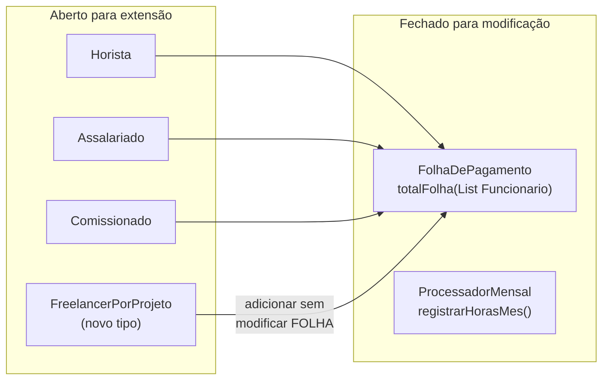
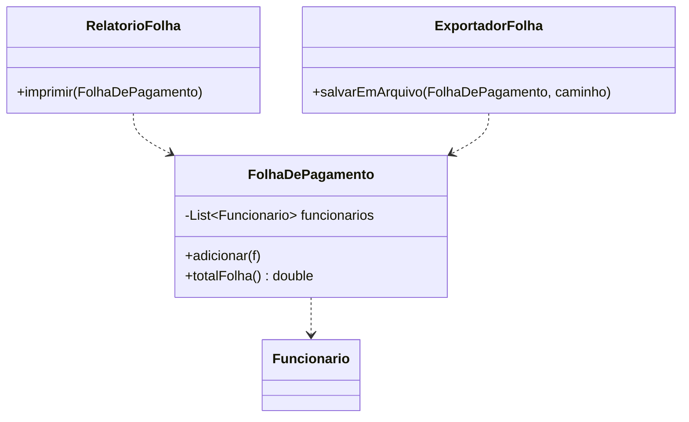
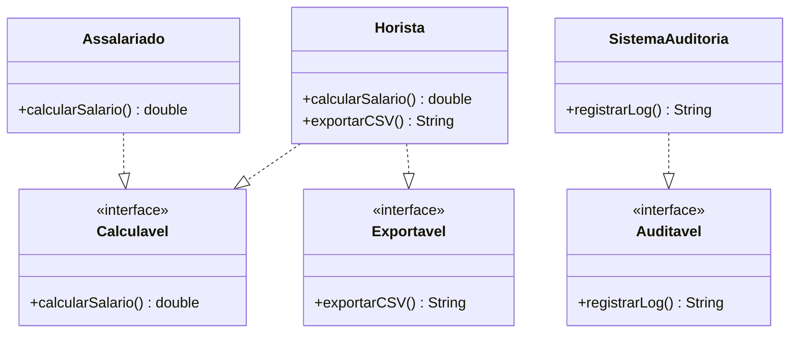
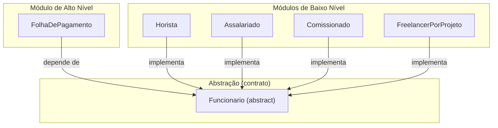
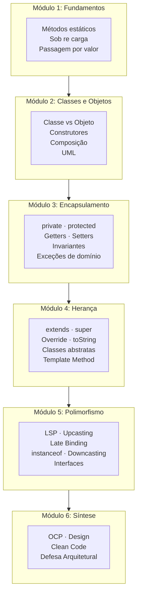

# Encontro 20 — Defesa Arquitetural e Encerramento

> **Módulo 6 · 4 aulas · 200 XP · Apresentação**

---

## O que é uma Defesa Arquitetural?

Uma defesa arquitetural não é apenas apresentar o código funcionando. É **justificar as decisões de design** — explicar por que você fez o que fez, quais alternativas considerou e como o sistema se comportaria diante de novos requisitos.

> *"Qualquer tolo pode escrever código que um computador entende. Bons programadores escrevem código que humanos entendem."* — Martin Fowler

---

## Estrutura da Apresentação (20 minutos)

### Parte 1 — Apresentação do Diagrama (5 min)

1. Mostre o Diagrama de Classes final no projetor
2. Explique a hierarquia de cima para baixo:
   - "Esta é a superclasse abstrata X — ela existe porque Y"
   - "Esta interface foi criada para desacoplar Z de W"
   - "Esta associação é composição porque..."

### Parte 2 — Demonstração do Código (8 min)

1. Execute o `main` e mostre a saída
2. Aponte no código onde o polimorfismo acontece:
   - "Aqui, `f.calcularSalario()` pode chamar 3 implementações diferentes"
   - "Este loop funciona com qualquer subtipo — não sabe qual é"
3. Mostre um teste onde você adiciona um novo tipo sem mudar o código existente

### Parte 3 — Perguntas do Professor (7 min)

Perguntas comuns:

- "Se eu precisar adicionar um novo tipo de funcionário amanhã, quais arquivos você vai mudar?"
- "Por que você usou classe abstrata aqui e não interface?"
- "O que acontece se eu passar `null` para este construtor?"
- "Como esta classe garante que o saldo nunca fique negativo?"

---

## O Princípio Aberto-Fechado (Open-Closed Principle)

O OCP — um dos princípios SOLID — é a medida de qualidade do seu projeto:

> *"Classes devem estar abertas para extensão, mas fechadas para modificação."*

**Como demonstrar durante a defesa:**

```java
// Sistema ANTES de adicionar "FreelancerPorProjeto"
abstract class Funcionario {
    public abstract double calcularSalario();
}

class FolhaDePagamento {
    public double totalFolha(List<Funcionario> lista) {
        double total = 0;
        for (Funcionario f : lista) {
            total += f.calcularSalario(); // só chama o contrato
        }
        return total;
    }
}

// ADICIONANDO NOVO TIPO — sem tocar em FolhaDePagamento!
class FreelancerPorProjeto extends Funcionario {
    private int projetos;
    private double valorPorProjeto;

    FreelancerPorProjeto(String nome, String cpf, String depto,
                         int projetos, double valorPorProjeto) {
        super(nome, cpf, depto);
        this.projetos        = projetos;
        this.valorPorProjeto = valorPorProjeto;
    }

    @Override
    public double calcularSalario() { return projetos * valorPorProjeto; }
}

// FolhaDePagamento.totalFolha() CONTINUA FUNCIONANDO sem alteração!
// Isso é o OCP em ação.
```



---

---

## Os 5 Princípios SOLID — Visão Geral

| Letra | Princípio | Pergunta-guia | Violação clássica |
|---|---|---|---|
| **S** | Single Responsibility | "Esta classe tem mais de um motivo para mudar?" | Classe que calcula, exibe e persiste ao mesmo tempo |
| **O** | Open / Closed | "Adicionar um novo tipo exige modificar código existente?" | `if instanceof` para cada novo subtipo |
| **L** | Liskov Substitution | "Toda subclasse pode substituir a superclasse sem surpresas?" | Subclasse que lança exceção em método herdado |
| **I** | Interface Segregation | "Alguma classe implementa método que não faz nada?" | Interface "gorda" que força implementação vazia |
| **D** | Dependency Inversion | "O código de alto nível depende de classes concretas?" | `FolhaDePagamento` referenciando `Horista` diretamente |

---

## S — Princípio da Responsabilidade Única (SRP)

> *"Uma classe deve ter um, e somente um, motivo para mudar."* — Robert C. Martin

**O que significa na prática:** cada classe tem uma única responsabilidade bem definida. Se você consegue descrever a classe sem usar a palavra "e", provavelmente ela respeita o SRP.

### Violação no contexto do TP3

```java
// RUIM: FolhaDePagamento faz TRÊS coisas
class FolhaDePagamento {
    private List<Funcionario> funcionarios;

    // Responsabilidade 1: calcular salários
    public double totalFolha() { ... }

    // Responsabilidade 2: formatar relatório (mudaria se mudar o formato!)
    public void imprimirRelatorioPDF() {
        System.out.println("=== RELATÓRIO MENSAL ===");
        for (Funcionario f : funcionarios) {
            System.out.printf("%-30s R$ %,.2f%n", f.getNome(), f.calcularSalario());
        }
    }

    // Responsabilidade 3: persistir dados (mudaria se mudar o banco!)
    public void salvarNoArquivo(String caminho) {
        // lógica de I/O — não é responsabilidade de folha de pagamento!
    }
}
```

```java
// BOM: cada classe tem uma única razão de existir
class FolhaDePagamento {
    private List<Funcionario> funcionarios;

    public void adicionar(Funcionario f) { funcionarios.add(f); }

    public double totalFolha() {
        return funcionarios.stream()
            .mapToDouble(Funcionario::calcularSalario)
            .sum();
    }
}

class RelatorioFolha {                              // cuida apenas da exibição
    public void imprimir(FolhaDePagamento folha) {
        System.out.println("=== RELATÓRIO MENSAL ===");
        // formata e exibe
    }
}

class ExportadorFolha {                             // cuida apenas da persistência
    public void salvarEmArquivo(FolhaDePagamento folha, String caminho) { ... }
}
```



### Q&A — SRP na defesa

> **Resposta modelo para "Sua classe `FolhaDePagamento` só calcula ou faz mais coisas?":** "Ela tem responsabilidade única: gerenciar a coleção de funcionários e calcular o total. Relatório e persistência são responsabilidades separadas — se o formato do relatório mudar, só a classe de relatório muda; `FolhaDePagamento` não é tocada. Isso é o SRP."

> **Resposta modelo para "Como você identificou que uma classe estava acumulando responsabilidades?":** "Quando percebi que precisava mudar a classe por razões completamente diferentes — uma por causa da regra de negócio, outra por causa do formato de saída — isso foi o sinal de que ela violava o SRP. Separei em classes menores, cada uma com um único eixo de mudança."

---

## L — Princípio da Substituição de Liskov (LSP)

> *"Subtipos devem ser substituíveis por seus tipos base."* — Barbara Liskov

**O que significa na prática:** se `B extends A`, qualquer código que funciona com um objeto `A` deve continuar funcionando corretamente com um objeto `B` — sem precisar saber que é `B`.

### A violação clássica — Quadrado herda Retângulo

```java
// VIOLAÇÃO: Quadrado é-um Retângulo matematicamente,
// mas NÃO é-um Retângulo no sentido comportamental do software

class Retangulo {
    protected double largura, altura;
    public void setLargura(double l)  { largura = l; }
    public void setAltura(double a)   { altura  = a; }
    public double area()              { return largura * altura; }
}

class Quadrado extends Retangulo {
    @Override
    public void setLargura(double l) {
        largura = l; altura = l;  // quebra a expectativa do Retangulo!
    }
    @Override
    public void setAltura(double a) {
        largura = a; altura = a;  // idem
    }
}

// Código que deveria funcionar com qualquer Retangulo:
void testar(Retangulo r) {
    r.setLargura(5);
    r.setAltura(3);
    // Esperado: 15. Com Quadrado: 9 — COMPORTAMENTO SURPRESA!
    System.out.println(r.area());
}
```

### LSP no contexto do TP3 — o contrato de `Funcionario`

```java
abstract class Funcionario {
    // CONTRATO IMPLÍCITO: calcularSalario() sempre retorna valor >= 0
    public abstract double calcularSalario();
}

// ✅ Horista respeita o LSP — salário >= 0 sempre
class Horista extends Funcionario {
    private double valorHora;
    private int horasTrabalhadas;
    @Override
    public double calcularSalario() {
        return valorHora * horasTrabalhadas; // nunca negativo se atributos válidos
    }
}

// ❌ Esta implementação VIOLARIA o LSP:
class FuncionarioAfastado extends Funcionario {
    @Override
    public double calcularSalario() {
        throw new UnsupportedOperationException("Afastado não recebe"); // VIOLA!
        // Código que espera Funcionario seria quebrado sem saber!
    }
}

// ✅ Solução correta: FuncionarioAfastado retorna 0 OU não herda Funcionario
class FuncionarioAfastado extends Funcionario {
    @Override
    public double calcularSalario() { return 0.0; } // contrato honrado
}
```

### Q&A — LSP na defesa

> **Resposta modelo para "Como você garante que suas subclasses não quebram o código que usa a superclasse?":** "Pensei no contrato implícito de cada método abstrato antes de criar as subclasses. Por exemplo, `calcularSalario()` deve sempre retornar um valor não-negativo. Todas as minhas implementações — `Horista`, `Assalariado`, `Comissionado` — honram esse contrato. Se eu criasse uma subclasse que lançasse exceção neste método, o `FolhaDePagamento` quebraria silenciosamente — isso viola o LSP."

> **Resposta modelo para "Quando herança viola o LSP?":** "Quando a subclasse precisa restringir ou enfraquecer o contrato da superclasse — por exemplo, lançar uma exceção que a superclasse não lança, ou retornar null quando a superclasse nunca retornaria, ou ignorar um parâmetro que a superclasse usaria. O teste prático: se eu puder trocar a superclasse pela subclasse em qualquer ponto do código sem mudar o comportamento observável, o LSP está satisfeito."

---

## I — Princípio da Segregação de Interfaces (ISP)

> *"Nenhuma classe deve ser forçada a depender de métodos que não utiliza."* — Robert C. Martin

**O que significa na prática:** interfaces "gordas" que agrupam muitos contratos diferentes forçam implementações vazias ou incorretas. Prefira interfaces pequenas e focadas.

### Violação — Interface Gorda

```java
// RUIM: interface monolítica força implementação de tudo
interface IGerenciador {
    void calcularSalario();
    void gerarRelatorio();
    void enviarEmail();
    void autenticar();
    void conectarBancoDados();
}

// Funcionario só quer calcularSalario — é obrigado a implementar o resto vazio!
class Horista implements IGerenciador {
    @Override public void calcularSalario()    { /* faz sentido */ }
    @Override public void gerarRelatorio()     { /* NÃO FAZ NADA */ }
    @Override public void enviarEmail()        { /* NÃO FAZ NADA */ }
    @Override public void autenticar()         { /* NÃO FAZ NADA */ }
    @Override public void conectarBancoDados() { /* NÃO FAZ NADA */ }
}
```

### ISP no contexto do TP3 — interfaces cirúrgicas

```java
// BOM: interfaces pequenas e coesas, cada uma com propósito único

interface Calculavel {
    double calcularSalario(); // foco total em cálculo
}

interface Exportavel {
    String exportarCSV();     // foco total em exportação
}

interface Auditavel {
    String registrarLog();    // foco total em auditoria
}

// Cada classe implementa apenas o que realmente faz
class Horista extends Funcionario implements Calculavel, Exportavel {
    @Override public double calcularSalario() { return valorHora * horasTrabalhadas; }
    @Override public String exportarCSV()     { return getNome() + "," + calcularSalario(); }
    // NÃO implementa Auditavel — não precisa, não é forçado
}

class SistemaAuditoria implements Auditavel {
    @Override public String registrarLog() { return "Auditoria: " + LocalDate.now(); }
    // NÃO implementa Calculavel nem Exportavel — não faz sentido para auditoria
}
```



### Q&A — ISP na defesa

> **Resposta modelo para "Por que você criou interfaces separadas em vez de uma interface maior?":** "O ISP me guiou: se eu colocasse `calcularSalario()` e `exportarCSV()` na mesma interface, eu obrigaria classes como `SistemaAuditoria` a implementar métodos de cálculo que não fazem sentido para ela. Interfaces pequenas permitem que cada classe assine apenas os contratos que realmente honra — e o compilador garante que não há implementações vazias por obrigação."

> **Resposta modelo para "Como você identifica quando uma interface está 'grande demais'?":** "O sinal é implementação vazia: quando uma classe que implementa a interface precisa escrever `return null` ou `throw new UnsupportedOperationException()` em algum método, a interface está impondo um contrato que não cabe naquela classe. A solução é dividir a interface em contratos menores."

---

## D — Princípio da Inversão de Dependência (DIP)

> *"Módulos de alto nível não devem depender de módulos de baixo nível. Ambos devem depender de abstrações."* — Robert C. Martin

**O que significa na prática:** o código que orquestra operações (alto nível) não deve referenciar implementações concretas (baixo nível). Deve referenciar contratos (classes abstratas ou interfaces). Isso inverte a direção tradicional da dependência.

### Violação — Alto nível depende de concreto

```java
// RUIM: FolhaDePagamento conhece cada tipo específico
class FolhaDePagamento {
    private List<Horista>       horistas      = new ArrayList<>();
    private List<Assalariado>   assalariados  = new ArrayList<>();
    private List<Comissionado>  comissionados = new ArrayList<>();

    // Para adicionar FreelancerPorProjeto: modificar esta classe inteira!
    public double totalFolha() {
        double total = 0;
        for (Horista h        : horistas)       total += h.calcularSalario();
        for (Assalariado a    : assalariados)   total += a.calcularSalario();
        for (Comissionado c   : comissionados)  total += c.calcularSalario();
        return total;
    }
}
```

### DIP no contexto do TP3 — depender da abstração

```java
// BOM: FolhaDePagamento só conhece a abstração Funcionario
class FolhaDePagamento {
    private List<Funcionario> funcionarios = new ArrayList<>();

    // Aceita QUALQUER subtipo — presente e futuro
    public void adicionar(Funcionario f) {
        if (f == null) throw new IllegalArgumentException("Funcionário não pode ser nulo");
        funcionarios.add(f);
    }

    // Zero menção a Horista, Assalariado ou Comissionado
    public double totalFolha() {
        return funcionarios.stream()
            .mapToDouble(Funcionario::calcularSalario)
            .sum();
    }

    public int quantidadeFuncionarios() { return funcionarios.size(); }
}

// O main (ponto de entrada) é quem conhece os concretos — e só ele
public class Main {
    public static void main(String[] args) {
        FolhaDePagamento folha = new FolhaDePagamento();

        // As implementações concretas só existem aqui — não dentro de FolhaDePagamento
        folha.adicionar(new Horista("Ana", "111.111.111-11", "TI", 50.0));
        folha.adicionar(new Assalariado("João", "222.222.222-22", "RH", 4500.0));
        folha.adicionar(new Comissionado("Maria", "333.333.333-33", "Vendas", 2000.0, 8500.0, 0.08));
        folha.adicionar(new FreelancerPorProjeto("Pedro", "444.444.444-44", "Dev", 3, 2500.0));

        System.out.printf("Total: R$ %,.2f%n", folha.totalFolha());
    }
}
```



### Q&A — DIP na defesa

> **Resposta modelo para "Por que `FolhaDePagamento` não tem nenhum `new Horista()` dentro dela?":** "O DIP: `FolhaDePagamento` é o módulo de alto nível — ela orquestra o cálculo da folha. `Horista`, `Assalariado` e `Comissionado` são módulos de baixo nível — são implementações concretas. Se o alto nível dependesse dos concretos, qualquer novo tipo quebraria a classe de alto nível. Ao depender apenas de `Funcionario` (abstração), `FolhaDePagamento` fica estável para sempre. Quem cria os objetos concretos é o `main` — o ponto de composição do sistema."

> **Resposta modelo para "O que é Injeção de Dependência e você usou isso?":** "Injeção de Dependência é uma técnica que aplica o DIP na prática: em vez de criar dependências dentro da classe, elas são passadas de fora. No meu projeto usei de forma simples: `folha.adicionar(new Horista(...))` — o objeto concreto é criado fora de `FolhaDePagamento` e injetado via método. Em projetos maiores frameworks como Spring fazem isso automaticamente, mas o princípio é o mesmo."

---

## Retrospectiva do Curso — os 4 Pilares



---

## Roteiro de Perguntas e Respostas de Referência

### "Por que usar classe abstrata e não interface nesta hierarquia?"

> **Resposta modelo:** "Usei classe abstrata porque `Funcionario` tem código compartilhado real — nome, CPF, construtores com validação, o método `toString()` que todas as subclasses herdam. Uma interface não pode ter estado nem construtores. A interface `Exportavel` faz sentido porque é um contrato transversal que diferentes hierarquias podem implementar — não há código a compartilhar."

---

### "O que significa 'late binding' no contexto do seu projeto?"

> **Resposta modelo:** "Quando chamo `f.calcularSalario()` com `f` do tipo `Funcionario`, o compilador só verifica que o método existe na classe. Em tempo de execução, a JVM olha o tipo real do objeto e chama a implementação correta — `Horista.calcularSalario()`, `Assalariado.calcularSalario()` etc. Sem isso, eu precisaria de `if instanceof` para cada tipo, e o sistema quebraria ao adicionar novos tipos."

---

### "Se amanhã surgir um requisito de 'Estagiário com bolsa fixa', o que você mudaria?"

> **Resposta modelo:** "Criaria a classe `Estagiario extends Funcionario` com os atributos `valorBolsa` e `cursoFaculdade`, implementaria `calcularSalario()` retornando `valorBolsa`, e adicionaria uma instância de `Estagiario` à `FolhaDePagamento`. Nenhuma outra classe seria modificada — isso demonstra que meu design segue o OCP."

---

### "Como você garantiu que nenhum objeto ficou em estado inválido?"

> **Resposta modelo:** "Coloquei validações no construtor de cada classe. Por exemplo, `Funcionario` lança `IllegalArgumentException` se o nome for nulo ou vazio. O `Horista` valida que `valorHora > 0`. Desta forma, se um objeto foi criado, ele está em estado válido — é garantido pelo próprio construtor. Métodos que poderiam gerar estados inválidos também validam seus argumentos e lançam exceções."

---

## Checklist Final de Entrega

**Requisitos funcionais:**
- [ ] Diagrama de Classes final (reflete o código entregue)
- [ ] Pelo menos 1 classe abstrata com método abstrato
- [ ] Pelo menos 1 interface implementada
- [ ] Coleção polimórfica demonstrada no `main`
- [ ] Código compila e executa sem erros
- [ ] Nomenclatura em português e coerente com o domínio

**SOLID — verificação:**
- [ ] **SRP:** cada classe tem uma única responsabilidade descritível sem "e"
- [ ] **OCP:** adicionar um novo subtipo não exige modificar `FolhaDePagamento` ou equivalente
- [ ] **LSP:** toda subclasse pode substituir a superclasse sem comportamentos surpresa
- [ ] **ISP:** nenhuma classe implementa método que não usa (sem corpo vazio por obrigação)
- [ ] **DIP:** módulos de alto nível (`FolhaDePagamento`) dependem de abstrações, não de concretos

**Encapsulamento:**
- [ ] Atributos `private` em todas as classes
- [ ] Validações no construtor (não aceita estado inválido)
- [ ] Getters sem expor referências internas mutáveis

---

## Considerações Finais

Você aprendeu neste curso que:

1. **Métodos** organizam comportamento sem estado → Módulos 1-2
2. **Classes e Objetos** encapsulam estado e comportamento juntos → Módulos 2-3
3. **Encapsulamento** protege o estado e garante invariantes → Módulo 3
4. **Herança** elimina duplicação e cria hierarquias semânticas → Módulo 4
5. **Polimorfismo** permite tratar tipos diferentes de forma homogênea → Módulo 5
6. **Interfaces** criam contratos transversais e reduzem acoplamento → Módulo 5

Mas o mais importante que você aprendeu é **como pensar**: modelar antes de codificar, identificar responsabilidades, proteger invariantes, e projetar para mudança.

---

## 🏆 Certificado de Conclusão

Ao concluir este encontro e o TP3, você terá demonstrado domínio dos fundamentos de:

- Programação Orientada a Objetos em Java
- Modelagem UML (Diagramas de Classes e Objetos)
- Design de software com os princípios SOLID básicos

*Parabéns pela jornada. O próximo passo é aprofundar em Design Patterns (GoF), SOLID completo e Arquitetura de Software.*

---

### Exercício Final — Troubleshooting SOLID Completo · 40 XP
**Diagnóstico: 5 Violações num Sistema de Pagamentos**

O sistema abaixo foi escrito por um desenvolvedor que não conhecia SOLID. Há **uma violação de cada princípio** escondida no código. Identifique todas as 5, nomeie o princípio violado em cada caso, e proponha a correção.

```java
// === CÓDIGO COM PROBLEMAS ===

// Classe 1
class ProcessadorPagamentos {

    // violação escondida aqui...
    public void processar(Object pagamento) {
        if (pagamento instanceof CartaoCredito) {
            CartaoCredito c = (CartaoCredito) pagamento;
            c.autorizarBandeira();
            c.cobrar();
        } else if (pagamento instanceof Boleto) {
            Boleto b = (Boleto) pagamento;
            b.gerarCodigo();
            b.registrar();
        } else if (pagamento instanceof PixPagamento) {
            PixPagamento p = (PixPagamento) pagamento;
            p.gerarQRCode();
            p.transferir();
        }
    }

    public double calcularTaxa(Object pagamento) {
        if (pagamento instanceof CartaoCredito) return 0.03;
        if (pagamento instanceof Boleto)        return 0.02;
        if (pagamento instanceof PixPagamento)  return 0.00;
        return 0;
    }

    // violação escondida aqui também...
    public void salvarNoHistorico(Object pagamento) {
        System.out.println("Salvando: " + pagamento);
        // faz conexão com banco, I/O, etc.
    }

    public void enviarComprovante(String email, Object pagamento) {
        System.out.println("Enviando e-mail para " + email);
        // lógica de e-mail misturada com lógica de pagamento
    }
}

// Interface 2
interface IOperacaoPagamento {
    void processar();
    double calcularTaxa();
    void enviarSMS();          // nem todo meio de pagamento envia SMS
    void autenticarBiometria();// nem todo meio de pagamento usa biometria
    void imprimirRecibo();     // nem todo meio de pagamento imprime recibo
}

// Classe 3
class CartaoCredito implements IOperacaoPagamento {
    @Override public void processar()           { autorizarBandeira(); cobrar(); }
    @Override public double calcularTaxa()      { return 0.03; }
    @Override public void enviarSMS()           { /* não implementado */ }
    @Override public void autenticarBiometria() { /* não implementado */ }
    @Override public void imprimirRecibo()      { System.out.println("Imprimindo..."); }
    private void autorizarBandeira() { System.out.println("Autorizado"); }
    private void cobrar()            { System.out.println("Cobrado"); }
}

// Classe 4
class CartaoDebitoEspecial extends CartaoCredito {
    @Override
    public double calcularTaxa() {
        throw new UnsupportedOperationException(
            "Débito especial não calcula taxa dessa forma!"
        );
    }
}

// Classe 5 — alto nível depende de concreto
class HistoricoPagamentos {
    private CartaoCredito ultimoCartao;    // ← concreto!
    private Boleto ultimoBoleto;           // ← concreto!
    private PixPagamento ultimoPix;        // ← concreto!

    public void registrar(Object pagamento) {
        if (pagamento instanceof CartaoCredito)  ultimoCartao  = (CartaoCredito) pagamento;
        else if (pagamento instanceof Boleto)    ultimoBoleto  = (Boleto) pagamento;
        else if (pagamento instanceof PixPagamento) ultimoPix  = (PixPagamento) pagamento;
    }
}
```

**Sua tarefa:**
1. Identifique qual princípio SOLID é violado em cada uma das 5 situações acima
2. Para cada violação, escreva em 1-2 frases o diagnóstico
3. Proponha a correção de pelo menos 2 das violações com código

> **Gabarito esperado:**
>
> **Violação 1 — OCP** (`processar()` com `instanceof`): Adicionar `DebitoEmConta` exige modificar `ProcessadorPagamentos`. Correção: criar interface `MeioPagamento` com `processar()` e `calcularTaxa()` e referenciar apenas a abstração.
>
> ```java
> interface MeioPagamento {
>     void processar();
>     double calcularTaxa();
> }
> class ProcessadorPagamentos {
>     public void processar(MeioPagamento m) { m.processar(); }
>     public double calcularTaxa(MeioPagamento m) { return m.calcularTaxa(); }
> }
> ```
>
> **Violação 2 — SRP** (`salvarNoHistorico` e `enviarComprovante` em `ProcessadorPagamentos`): A classe tem 3 responsabilidades — processar pagamento, persistir histórico e enviar e-mail. Cada eixo de mudança deveria ser uma classe separada: `ProcessadorPagamentos`, `HistoricoService`, `NotificacaoService`.
>
> **Violação 3 — ISP** (`IOperacaoPagamento` com 5 métodos): `CartaoCredito` não usa `enviarSMS()` nem `autenticarBiometria()`, mas é obrigado a implementá-los vazios. Correção: segregar em `IProcessavel`, `INotificavel`, `IBiometrico`, `IImprimivel`.
>
> **Violação 4 — LSP** (`CartaoDebitoEspecial` lança exceção em `calcularTaxa()`): Qualquer código que usa `IOperacaoPagamento` e chama `calcularTaxa()` vai quebrar inesperadamente com `CartaoDebitoEspecial`. Um subtipo nunca pode enfraquecer o contrato da superclasse. Correção: ou `CartaoDebitoEspecial` retorna 0 (contrato honrado), ou não herda de `CartaoCredito`.
>
> **Violação 5 — DIP** (`HistoricoPagamentos` depende de concretos): A classe de alto nível referencia `CartaoCredito`, `Boleto`, `PixPagamento` diretamente — acoplamento total. Correção: depender de `MeioPagamento` (abstração).
>
> ```java
> class HistoricoPagamentos {
>     private List<MeioPagamento> pagamentos = new ArrayList<>();
>     public void registrar(MeioPagamento m) { pagamentos.add(m); }
>     // aceita qualquer tipo presente ou futuro sem modificação
> }
> ```
